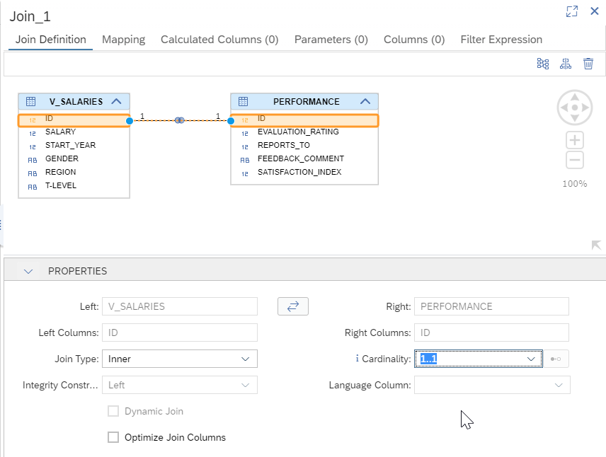

## Prerequisites
- You have created an anonymized view as explained [in this tutorial](hana-cloud-calculation-view-differential-privacy).
- You have created and loaded data in the `PERFORMANCE` table as explained [in this tutorial](hana-cloud-create-db-project).

## Details
### You will learn
- How to create a calculation view in SAP Business Application Studio
- How to join data from another calculation view

A video version of this tutorial is also available:

<iframe width="560" height="315" src="https://www.youtube.com/embed/fwwPcYZb-jQ" frameborder="0" allow="accelerometer; autoplay; clipboard-write; encrypted-media; gyroscope; picture-in-picture" allowfullscreen></iframe>

---

[ACCORDION-BEGIN [Step 1: ](Create a Calculation View)]

1. Create a new **Calculation View** via the **SAP HANA: Create SAP HANA Database Artifact** command pallet entry.

    !

2. Create a calculation view called `PERFORMANCE_SALARIES` of Data Category **CUBE**. Press **Create**

    !

[DONE]
[ACCORDION-END]

[ACCORDION-BEGIN [Step 2: ](Join the calculation view and the table)]

1. Drop a `join` node into the modeling space

    !

2. Use the  sign to add the calculation view to the node.

    !

3. Type in the name of the anonymized view from the previous tutorial - `V_SALARIES`. Select it and click **Finish**

    !

4. Click on the  sign again and add the table `PERFORMANCE`.  Click **Finish** and you should see both artifacts in the join node:

    !

[DONE]
[ACCORDION-END]

[ACCORDION-BEGIN [Step 3: ](Configure the join)]

1. Double-click on the join node. A panel will open on the right.

2. Drag and drop the `ID` field to join the entries in `V_SALARIES` with the records in `PERFORMANCE`.

    !

3. Set the cardinality to `1..1`

    !

4. In the **Mapping** tab, add all the columns as output columns. Make sure `ID` is only added once

    !

5. Connect the join node with the aggregation node using the 

    !

[DONE]
[ACCORDION-END]

[ACCORDION-BEGIN [Step 4: ](Configure semantics)]

1. Click on the **Aggregation** node and double-click on the join parent to add all the columns to the output

    !

2. Go into the **Semantics** node and change the `START_YEAR` and `ID` to attributes. Set the aggregation of the remaining measures to `AVG`

    !

[DONE]
[ACCORDION-END]

[ACCORDION-BEGIN [Step 5: ](Build and test)]

1. **Save** and **Deploy**

    !

2. Open the HDI Container in the Database Explorer

    !

3. Under **Column Views** you will find your Calculation View.  Choose **Open Data**

    !

4. Go into the **Analysis** tab. Drag the `T-LEVEL` attribute into the label axis and the `Evaluation Rating` into the values axis.

[VALIDATE_1]
[ACCORDION-END]

---
