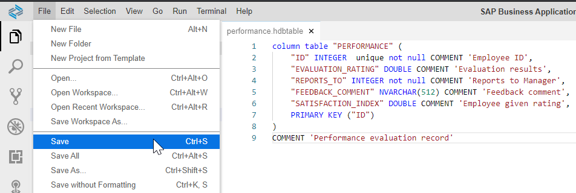

## Prerequisites
- You have created a BTP trial, SAP HANA Cloud instance -- see [Deploy SAP HANA Cloud trial](hana-cloud-deploying).
- You are logged into SAP Business Application Studio and it's configured [Configure the Development Environment](hana-cloud-configure-dev-env).

## Details
### You will learn
- How to create a multi-target application with a database module via SAP HANA database project in the SAP Business Application Studio
- How to create a columnar table using declarative SQL
- How to load data for testing into a columnar table from a CSV file
- How to access the Database Explorer to browse your tables, data and use SQL statements

A video version of this tutorial is also available:

<iframe width="560" height="315" src="https://www.youtube.com/embed/O0x7Jt6yre0" frameborder="0" allow="accelerometer; autoplay; clipboard-write; encrypted-media; gyroscope; picture-in-picture" allowfullscreen></iframe>

---

[ACCORDION-BEGIN [Step 1: ](Create a new project from template)]

1. From the SAP Business Application Studio Welcome tab, click **Start from template Create a new project**.

    !

2. Choose **SAP HANA Database Project** and click **Start**.

    !

3. Call the project **DM** and click **Next**.

    !

4. Keep the module name at the default of **db** and press **Next**.

    !

5. Clear the Namespace and Schema Name blank. Choose version **HANA Cloud** and click **Next**

    !

6. Leave all values of the **Bind to HDI Container service** at their default values and press **Finish**

    !

7. You should see a Generating SAP HANA Database Project message which will remain for a minute or two as the HDI container instance is being created.

    !

8. Upon completion of the project generation, you will see a message. Press the **Open in New  Workspace** button in this success message to open the new project in the IDE.

    !               

[DONE]
[ACCORDION-END]

[ACCORDION-BEGIN [Step 2: ](Create database artifacts)]

This project will combine artifacts from an HDI container and a classic, replicated schema.

You will first create a table to hold data from performance evaluations received by employees and the rating they give the company in terms of satisfaction.

These are sample records that will be stored in this table:
!

1. Right-click on the `src` folder, choose `New File`

    !

2. Use the following name

    ```Text
    data/performance.hdbtable
    ```

    !

3. This will create both a folder and a file. Paste the following content into the `hdbtable` file to define a new table:

    ```sql
    column table "PERFORMANCE" (
	    "ID" INTEGER  unique not null COMMENT 'Employee ID',
	    "EVALUATION_RATING" DOUBLE COMMENT 'Evaluation results',
	    "REPORTS_TO" INTEGER not null COMMENT 'Reports to Manager',
	    "FEEDBACK_COMMENT" NVARCHAR(512) COMMENT 'Feedback comment',
	    "SATISFACTION_INDEX" DOUBLE COMMENT 'Employee given rating',
	    PRIMARY KEY ("ID")
    )
    COMMENT 'Performance evaluation record'
    ```

4.  **Save** the file.

    !

> **What is going on?**
> &nbsp;
> You have created a database module and a design time artifact representing a table. When this module is deployed, SAP Business Application Studio will automatically create the runtime object (a physical table) in the schema associated to the HDI container.
> &nbsp;
> This approach allows you to modify the structure of the table without worrying about underlying adaptation operations.

[DONE]
[ACCORDION-END]


[ACCORDION-BEGIN [Step 3: ](Create a text index)]

The table you have just defined will have a large text field with comments from the employees. You want to enable an index to enhance text search.

1. Create a new database artifact under the data folder

    !

    !    

2. Use the following name

    ```Text
    comment_text
    ```

    And choose Artifact Type of `hdbindex`

    !


3. Paste the following code into it:

    ```sql
    INDEX "COMMENT_TEXT"
    on "PERFORMANCE"("FEEDBACK_COMMENT")
    ```

4. **Save** the file.

[DONE]
[ACCORDION-END]

[ACCORDION-BEGIN [Step 4: ](Deploy the database module)]

1. Expand the **SAP HANA PROJECTS** View

    !

2. Click the **Deploy** icon (which looks like a rocket).

    !

</br>
> **What is going on?**
>
>&nbsp;
> The console on the bottom will show the progress. First, an HDI container will be created and bound. Scroll up the log to see it in your screen:
>&nbsp;
>  
>&nbsp;
> The container is called `hdi_db`, which is the name you specified in the deployment configuration file, `mta.yaml`.
> If you continue to scroll down, you will see how the table and text index you have created using design-time artifacts are prepared for deployment.  A physical schema called `DM_HDI_DB_1` has been created. Finally, you will see a success message:
>
>&nbsp;
>
>  
>&nbsp;


[DONE]
[ACCORDION-END]

[ACCORDION-BEGIN [Step 5: ](Add data from a local file)]

For testing and development purposes, you can use a local file to load data into an HDI container.

1. Create the configuration for the upload first.  In the `data` folder, create a file called:

    ```Text
    loads/dataload.hdbtabledata
    ```

    !

2. Paste the following content into it:

    ```json
    {
	    "format_version": 1,
	    "imports": [{
		    "target_table": "PERFORMANCE",
		    "source_data": {
			    "data_type": "CSV",
			    "file_name": "performance.csv",
			    "has_header": true,
			    "dialect": "HANA",
			    "type_config": {
				    "delimiter": ","
			    }
		    }
		    }]
    }		
    ```

3. Download this `csv` file -- `https://github.com/SAPDocuments/Tutorials/blob/master/tutorials/hana-cloud-create-db-project/performance.csv` into your computer. Upload it into the **loads** folder using the **Upload Files** option

    !

4. **Deploy** the **loads** folder

    !


[DONE]
[ACCORDION-END]

[ACCORDION-BEGIN [Step 6: ](Check the data)]

1. Press the **Open HDI Container** icon

    !

2. The Database Explorer will open in a new browser tab with your HDI container already selected. Select **Tables**

    !

3. Right-click on the table **PERFORMANCE** and choose **Open Data**

    !

4. Open the **SQL editor** for this query

    !

5. Execute the following SQL statement to complete the validation below:

    ```sql
    SELECT ROUND(AVG("SATISFACTION_INDEX"),1)
    FROM "PERFORMANCE";
    ```

[VALIDATE_1]
[ACCORDION-END]

---
