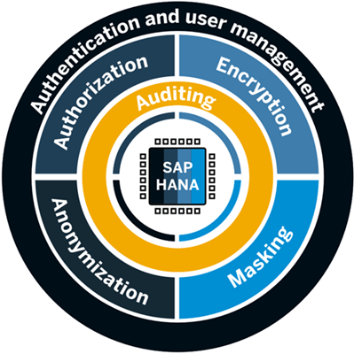

# Understand Why Data Anonymization is Important
<!-- description --> Learn how SAP HANA data anonymization can help your organization keep its data protected and private with SAP HANA Cloud, SAP HANA database.

## Prerequisites
## You will learn
- About the need for data anonymization
- About the goals of data anonymization
- About the importance of anonymized views

## Intro
> ### **Disclaimer**
>
>In most cases, compliance with data privacy laws is not a product feature. SAP software supports data privacy by providing security features and specific functions relevant to data protection, such as functions for the simplified blocking and deletion of personal data. SAP does not provide legal advice in any form. The definitions and other terms used in this guide are not taken from any given legal source.

---

### Need for data anonymization

The security of your organization's data is one of our primary concerns at SAP. Therefore, SAP HANA Cloud, SAP HANA database brings the proven comprehensive SAP HANA security framework to the cloud:

A key aspect of this security framework is data anonymization, which allows you to make data available for analysis to business users while keeping sensitive data private and protected.

Many organizations face a dilemma: On the one hand, they have vast amounts of data they would want to analyze to gain impactful business insights. On the other hand, legislations in many countries protect personal data of individuals and governments while holding companies accountable.  Ensuring the privacy of consumers data is also important to build and maintain a trustworthy relationship. These requirements could result in data not being shared with the right people for anonymization purposes nor used to its full potential.

Learn more about the approach on **Data Protection and Privacy** from the [technical documentation here](https://help.sap.com/viewer/c82f8d6a84c147f8b78bf6416dae7290/LATEST/en-US/ad9588189e844092910103f2f7b1c968.html).

SAP HANA Cloud, SAP HANA database helps solve this issue by offering not only powerful and versatile data management options but also enabling organizations to have simple access to methods of data anonymization that allow for easy and secure sharing of data with anyone in the organization so the data can be analyzed.

### Types of data in a dataset

But why bother using advanced data anonymization methods? Is it not enough to simply delete or hide those parts of a dataset that refer to the person, like names?

Unfortunately, no. Because the remaining data in a dataset can still lead to people being identified.

This becomes clear when looking at the different types of data that can be in a dataset:

-	**Identifiers**: Attributes that clearly identify individuals in a dataset, for example names, account numbers, or email-addresses.
-	**Quasi-identifiers**: Attributes that do not directly identify individuals but that may allow someone to deduce a person's identity based on their unique combination such as age, ZIP code, or education.
-	**Sensitive information**: Attributes that are highly sensitive, for example people's health status, salaries, or other confidential information.

> ### Let's look at an example
>
> A data analyst requests a table of HR data of employees in their organization from the database administrator. The database administrator sends them a table that contains age, gender, zip code and salary information of the employees, none of which can identify individual employees on their own.
>
>The data analyst happens to find only one person in that table, who is 35 years old, male, and living in a certain zip code and realizes this is one of their colleagues. Now their colleague's sensitive salary information is exposed to the data analyst.
This shows that even when identifiers were to be removed from a table, individuals could still be identified based on their quasi-identifiers.

### Goals of anonymization

Based on the different types of data that need attention, **two key goals of data anonymization** become clear:

1.	Avoid that people are identified in a dataset based on their unique combination of quasi-identifying attributes.
2.	Avoid that sensitive information can relate to individuals' identity.

With the **anonymization methods** in SAP HANA Cloud, SAP HANA database you can achieve both the goals.

### Importance of anonymized views

Data needs to be shared inside (and outside) an organization to be useful. The people monitoring and managing data receive frequent requests from data consumers for access to subsets of data. So, the process of preparing data to securely share it with others must be practical and time-efficient while keeping the integrity of the original data and delivering accurate results.

To meet these requirements, SAP HANA Cloud, SAP HANA database uses **anonymized views**, which can be easily created, shared, and monitored. They are calculated on-the-fly on top of the original data, so the source data stays untouched. You will learn more about them in this tutorial group.

> **Well done!**
>
> You have completed the first tutorial of this group! Now you know the basics about why data anonymization is important when handling personal and sensitive data and have an overview about the goals and methods of data anonymization.
>
> Learn in the next tutorial how anonymized views are being created and get to know the two key anonymization methods.

### Related topics

[SAP HANA Security Guide](https://help.sap.com/viewer/b3ee5778bc2e4a089d3299b82ec762a7/2.0.04/en-US)

### Test yourself

---
