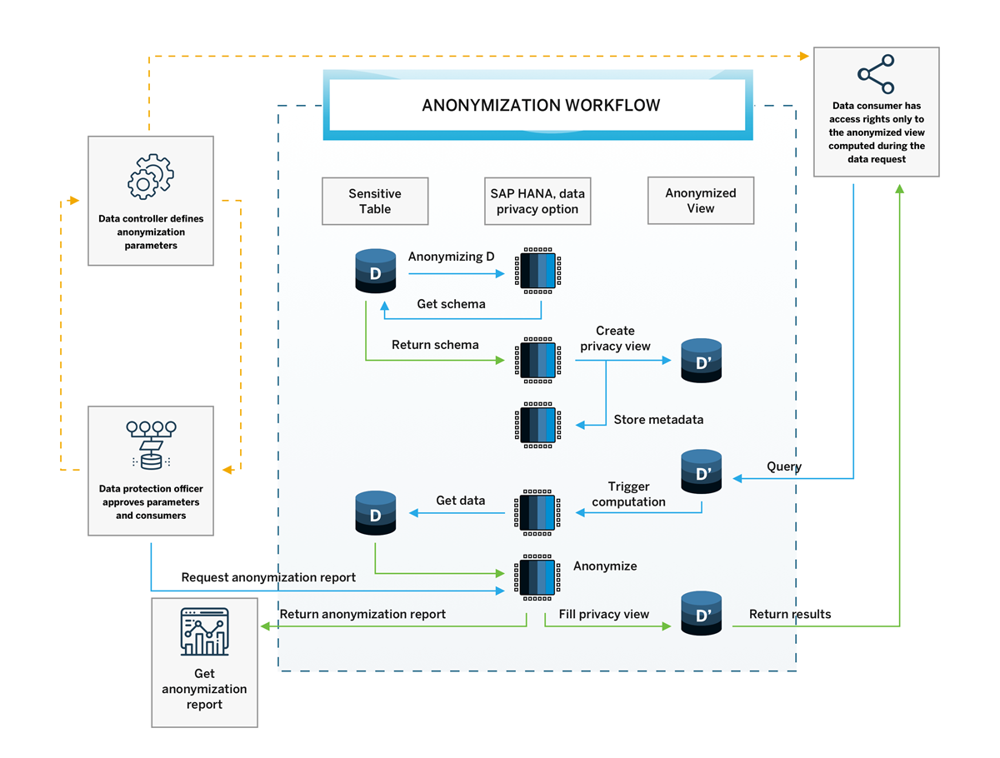
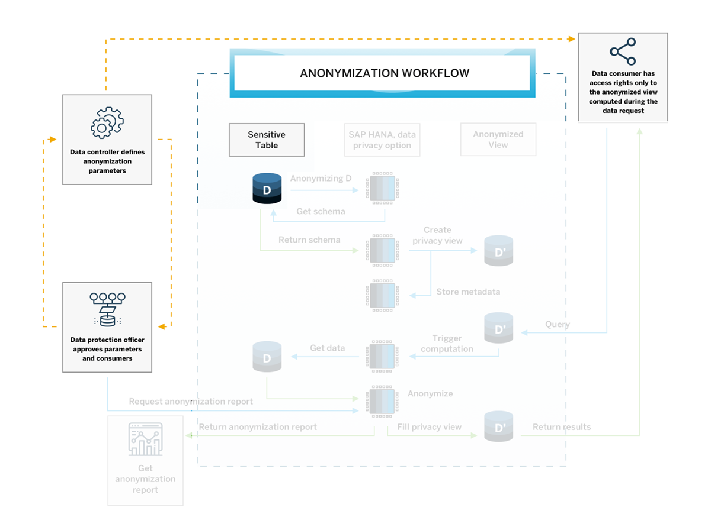
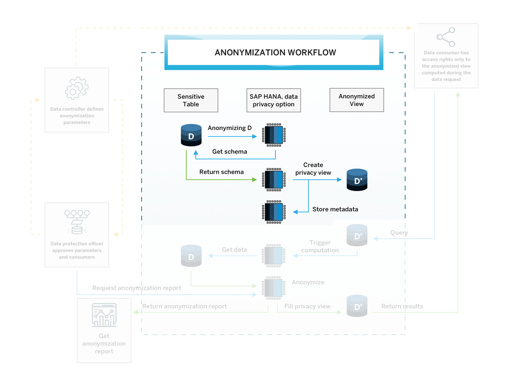
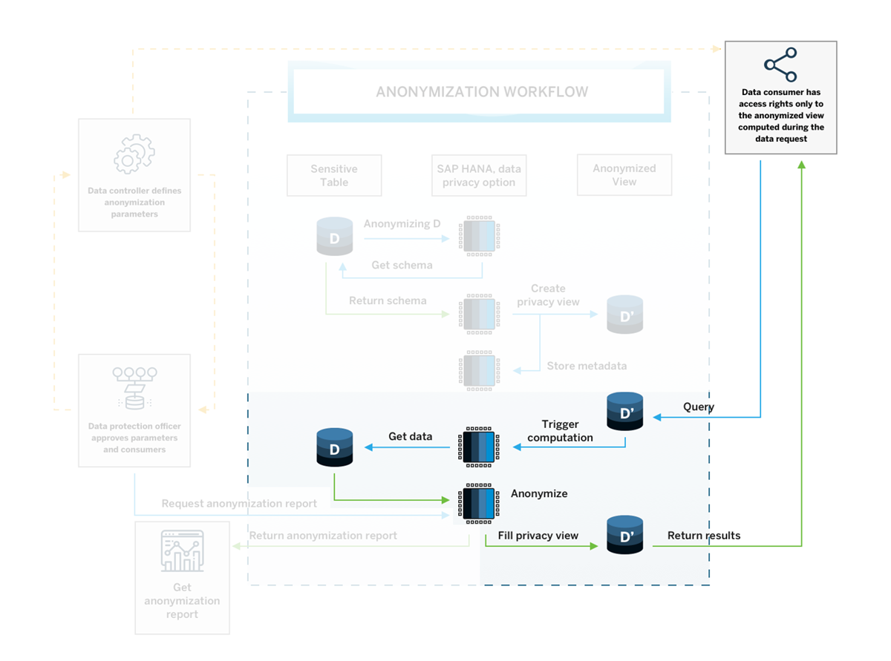
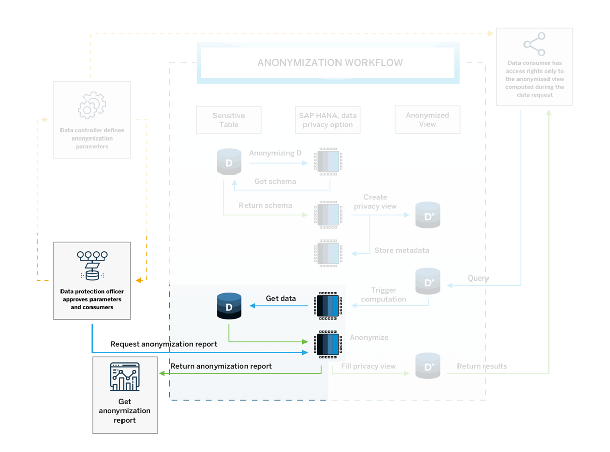
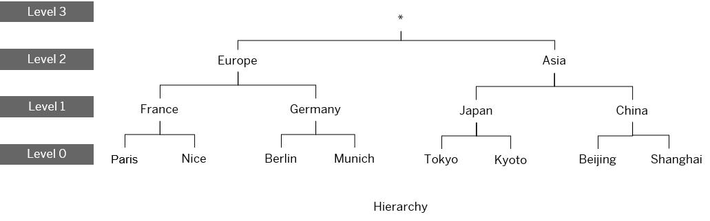

# Understand How Data Anonymization Works in SAP HANA Cloud, SAP HANA Database
<!-- description --> Learn how the anonymization workflow is designed to efficiently create and share anonymized views with data consumers and what anonymization methods are available in SAP HANA Cloud, SAP HANA database.

## Prerequisites
- Completion of the [previous tutorial](hana-cloud-data-anonymization-1) is recommended.

## You will learn
- About the anonymization workflow
- What the anonymization methods k-anonymity, l-diversity and differential privacy are used for


## Intro
> ### **Disclaimer**
>
> In most cases, compliance with data privacy laws is not a product feature. SAP software supports data privacy by providing security features and specific functions relevant to data protection, such as functions for the simplified blocking and deletion of personal data. SAP does not provide legal advice in any form. The definitions and other terms used in this guide are not taken from any given legal source.

In this article, you will learn how the anonymization workflow is designed to efficiently create and share anonymized views with data consumers. We will also have a more detailed look at the three key anonymization methods available in SAP HANA Cloud, SAP HANA database.


---

### Introduction to the anonymization workflow


As pointed out in the [previous tutorial](hana-cloud-data-anonymization-2), the process of creating anonymized views of data to securely share it with others must meet **two requirements**:

- It must be **time-efficient and practical**: Manual changes to subsets of data like deletion should be avoided. Instead, the process of anonymization should allow for the data to automatically be up to date in real time.
- It must **deliver accurate results**: Anonymization of data should not change the original data in a way that limits the analysis of data. Original data should not be changed and the results of analyzing anonymized data should be consistent with analysis of non-anonymized data.

In this diagram, you can see in detail how the SAP HANA Cloud anonymization workflow addresses both requirements by using **anonymized views** as its key component:



Let us take a closer look at the diagram in the following steps to zoom in on how certain anonymization tasks look like.


### Understand the workflow 1: create an anonymized view 


The first task we will zoom in on is that a **data consumer** requests access to data, e.g., for analysis:

1.	The data is in a **sensitive table D**.

2.	First, a **data controller** and a **data protection officer** collaborate closely on **defining the anonymization parameters**, e.g., the likelihood of people being identified in the anonymized data that the data consumer can access.

    

3.	Based on these parameters, the SAP HANA data anonymization, which is one feature of the SAP HANA Cloud, SAP HANA database privacy option, will get the schema from the table D and anonymize this data accordingly.

4.	This schema is then returned, and an **anonymized view D' is created**. For this anonymized view, metadata is being stored.

    


### Understand the workflow 2: query an anonymized view 


Now let's take a look at the steps involved to query an anonymized view so the data consumer may gain insights from the anonymized data:

1.	When the data consumer now **queries the data D'**, the query will trigger computation in the SAP HANA data anonymization, which will get the data from the original table D. That means the query directly accesses the original data.

2.	The **result of the query** is then anonymized and transformed to the anonymized view D' and returned to the data consumer.

    

3.	This way, each query will automatically run against the original data and the data consumer always gets the latest results – each time with the most feasible anonymization applied to it. Once the anonymized view is configured by the data controller, the data consumer can get the data and query it without having to involve the data controller.


### Understand the workflow 3: monitor anonymization


The anonymization workflow does not end there. To continuously monitor and improve the anonymization methods, the data protection officer can request anonymization reports that will return anonymization KPI's (Key Performance Indicators) that provide information to help monitor the effectiveness of the anonymization and adjust the parameters if needed.

You will learn more about the KPI's available to you in the [last tutorial of this tutorial group](hana-cloud-data-anonymization-6).



This process ensures that data anonymization can be implemented in a practical, time-efficient manner and will always deliver the most up-to-date results based on the original data, which always stays intact and unchanged during the anonymization.

Now you know the process for how anonymized views are computed and made accessible to data consumers. In the coming steps, you will get to know the methods of how the anonymization can be configured.


### Test the problem of quasi-identifiers


> ### **IMPORTANT**
>
> Keep in mind that whenever we speak about changes to data in this section, **all these transformations will be applied to the anonymized views, not to the original data**. Additionally, all anonymization methods described are designed to provide a solution that preserves as much information as possible based on the defined parameters.

Now that you know the basics about why anonymization is important and what the workflow looks like, let us look at a more concrete example that illustrates the 3 methods of data anonymization available in SAP HANA Cloud, SAP HANA database.

The first goal we will tackle is to **avoid identification based on quasi-identifiers using K-Anonymity.**

A key goal of data anonymization is making sure that the identification of individuals is not possible through quasi-identifiers. It must be avoided that there are individuals who have a unique combination of quasi-identifying attributes in the data that is shared with data consumers.

Usually, datasets contain a lot of attributes about individuals so that they can be used to get useful insights and find correlations between attributes. Unfortunately, the more columns containing useful additional information in the form of quasi-identifiers, the more likely it is that individuals have a unique combination of these attributes that make it easy for them to be re-identified.

You can test this easily with your own data:

Create a `SELECT` statement that includes all quasi-identifying columns of your dataset with a `GROUP BY` expression and query the database for all unique combinations `(HAVING count(*)=1)`.

```SQL
-- this is an example statement for a dataset containing different quasi-identifying columns
SELECT "start_year", "gender", "region", "zipcode", "T-Level", "education", count(*)
FROM "[table-name/view-name]"
GROUP BY "start_year","gender","region","zipcode","T-Level","education"
HAVING count(*)=1;
```

This query will likely result in many cases that would risk being re-identified. So, let's take a look how one of the anonymization methods solves this problem.


### Solve the problem of quasi-identifiers


Instead of having to remove all the quasi-identifiers from the dataset that is shared, these **attributes can be either generalized to a broader range**, for example replacing the exact age by a category containing a range of years, or the **attributes can be hidden completely if no generalization is applicable**. For example, this could be the case if data is categorical and does not have many distinct categories.



In this diagram you can see a **generalization hierarchy** for a categorical quasi-identifying column, place of birth. Whereas level 0 is the original non-anonymized data, on the levels 1-2 data will be generalized to broader categories and on level 3 replaced with **"*"**, i.e., suppressed. Numerical values can be generalized to categories in the same manner.
SAP HANA Cloud, SAP HANA database offers a method that can automatically decide, what data points need to be generalized to which hierarchy level depending on the dataset while keeping as much data quality as possible: **K-Anonymity**.

This method is based on the number of people **`=K`**, who should be indistinguishable in the dataset based on their quasi-identifying attributes. The larger `K`, the lower the probability of people being identified. By specifying `K`, e.g., `K=8`, this method will automatically select the appropriate level of generalization for each data point in an anonymized view to achieve that `K=8` people have the same combination of values. This way, no individual can be singled out when analyzing the data.

You will learn more about how to create an anonymized view using K-Anonymity in the [next tutorial](hana-cloud-data-anonymization-3).

Now, let us have a quick look at a different approach to anonymizing data that targets the sensitive data directly.


### Protect sensitive information 1: add L-Diversity


Another key goal of anonymization is to make sure that when someone who should not have access to sensitive information, cannot associate sensitive information to specific individuals when data is made available to them. The method of K-Anonymity can indirectly achieve this goal by hiding individuals in groups. But there could still be cases in which you need additional protection of sensitive information.

To provide another layer of protection, you can use **L-Diversity**, which is an addition to K-Anonymity and additionally takes sensitive data columns into consideration. Another approach is with **Differential Privacy**, which changes values in the anonymized view (not in the original data) so they can only be analyzed on a group level. Let us look at both in more detail:

**L-diversity**

The K-Anonymity algorithm applies generalization of quasi-identifiers to groups of individuals that should be indistinguishable inside these groups, because they share the same combination of (anonymized) attributes.

While K-Anonymity ensures that re-identification based on quasi-identifiers is less probable, it does not touch the sensitive data in the dataset.

It could still happen that sensitive information can be associated to individuals in case of lacking diversity in a group. Imagine an HR table that has been anonymized with K-Anonymity, `K=8`. There, in a group of people who have the same age and gender, all individuals could share the same exact salary value. This way, since all of them have the same value, the salary of all of them becomes known and the sensitive information is no longer protected.

That is why K-Anonymity can be complemented by the method of **L-Diversity**.

L-diversity will refine the groups in a way that e.g., `L=3` people have distinct values on their sensitive data attributes. By **increasing the diversity of sensitive data in a group of people with homogeneous quasi-identifiers**, the anonymization becomes much more powerful. With this method, the anonymization algorithm will form groups in a way that at least three individuals will have different salary values. This way, their sensitive information is protected.


### Protect sensitive information 2: use Differential Privacy


In the case that the **sensitive part of the data includes numerical values**, for example when tables contain salary data or data about people's financial assets, this sensitive data can be anonymized in an even stricter way.

Whenever you have numerical data in a table, you can protect it using Differential Privacy. This method provides formal statistical privacy guarantees. **It transforms data in the anonymized view by adding random noise to each value**. This way, individual values do not provide any information as values are completely changed, e.g., a salary of 50.000$ p.a. would be transformed to -237.920$ p.a.

This may seem like destroying the data and stripping it off all information, but the **algorithm computing this random noise will add it based on a specific mathematical formula that keeps the trends of the data intact**. For example, computing the mean salaries of a certain age group in a dataset anonymized this way will still result in approximately the same values as the original data.

Even complex machine learning models can still be applied to the data and deliver accurate results. You can read the community blog post [here](https://blogs.sap.com/2020/07/27/sap-hana-data-anonymization-machine-learning-on-privacy-preserving-data/).

> **Well done!**
>
> You have completed the second tutorial of this group! Now that you have an overview of the anonymization workflow and anonymization methods in SAP HANA Cloud, you can watch an example of how applying these could look like with real data:
>
> <iframe width="560" height="315" src="https://microlearning.opensap.com/embed/secure/iframe/entryId/1_6448scfq/uiConfId/43091531" frameborder="0" allowfullscreen></iframe>

> In the next tutorial, you will learn how to create an anonymized view that applies k-anonymity to avoid identification based on quasi-identifiers.


### Test yourself


---
