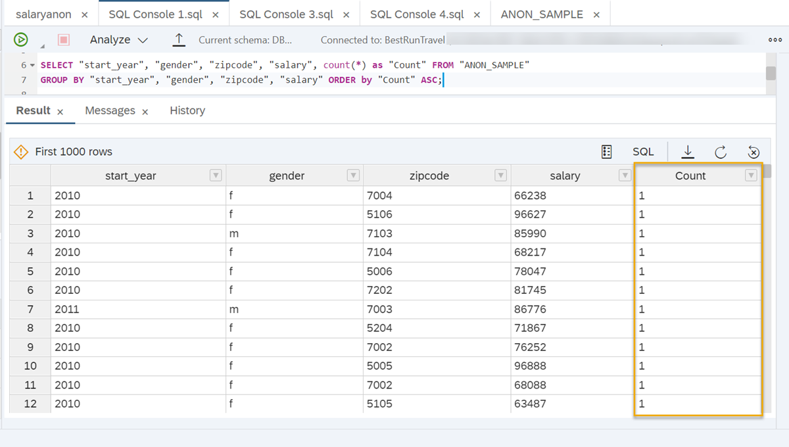

# Create an Anonymized View Using K-Anonymity
<!-- description --> Create anonymized views in SAP HANA Cloud, SAP HANA database using k-anonymity to avoid identification of individuals based on quasi-identifiers.

## Prerequisites
- It's recommended that you complete the [previous tutorial](hana-cloud-data-anonymization-2).
- You can download the [sample CSV file](https://github.com/SAP-samples/hana-cloud-learning/raw/main/Group:%20Data%20Anonymization%20in%20SAP%20HANA%20Cloud/DataAnonymization_SampleData.zip) to run the example scenario. Make sure to [upload it into your database](hana-cloud-mission-trial-5) before running the queries given in the example.
- If you would like to run the sample scenario, you need a **running** instance of SAP HANA Cloud, SAP HANA database in trial or production.

## You will learn
- How to define your anonymization strategy
- How to define generalization hierarchies for quasi-identifiers
- How to create an anonymized view using embedded hierarchies
- How to create an anonymized view using hierarchy functions
- How to verify the results of anonymization


## Intro
> ### **Disclaimer**
>
>In most cases, compliance with data privacy laws is not a product feature. SAP software supports data privacy by providing security features and specific functions relevant to data protection, such as functions for the simplified blocking and deletion of personal data. SAP does not provide legal advice in any form. The definitions and other terms used in this guide are not taken from any given legal source.

Now that you know the different approaches to data anonymization in SAP HANA Cloud, SAP HANA database you can start to implement them.
In this tutorial, we will provide you with detailed step-by-step instructions how to use the method of K-Anonymity to avoid that individuals in your dataset can be re-identified based on quasi-identifiers.


---

### Define the anonymization strategy


Before you can start creating an anonymized view with K-Anonymity, you need to define the strategy of your anonymization. This includes two key aspects: The type of data in your dataset and the generalization hierarchies you want to apply.

**Types of data**

First, you need to define which columns contain what type of data:

-	**Identifying data**: What data needs to be removed from the anonymized view because it would lead to identification? For example, names or unique identification numbers.
-	**Quasi-identifying data**: What data could lead to people being re-identified, even if identifiers are removed because of individuals' unique combination of attributes? For example, age, zip code, start year, education, marital status, location …
-	**Sensitive data**: What data should be analyzed but must not be associated with individuals? For example, salaries, health status, property…

Please note, that depending on your situation, data that is considered as quasi-identifiers in one use case could be considered sensitive data in a different use case and vice-versa, e.g. if peoples' zip codes or age values should not be exposed.


### Define generalization hierarchies


**Generalization hierarchies**

Next, you need to **define generalization hierarchies** for the quasi-identifiers. Let us have a look at different ways of defining hierarchies based on different data scales:

**Categorical** values can be grouped into broader categories if possible (e.g. grouping individual countries into regions).


For **Numerical** values (e.g. age, weight) there are more options: You can group values into ranges of values (>25, 26-35, 36-45, 46-55…) or averages, shorten them or round them.


So, for each of your quasi-identifiers, you need to know to what categories you want to generalize.

When defining the hierarchies, it is important to keep in mind that the anonymization algorithm will apply the same level of generalization to all values of a column. So, for example if the location data of individuals from 'Berlin' and 'Munich' must be generalized to 'Germany', the location data of individuals from 'Paris' and 'Nice' will also be generalized to 'France', even though for these cases this level of anonymization might not be necessary. Note that this is the default setting of the algorithm and specific recoding schemes can be defined that allow for a more granular approach.

You can read more about generalization hierarchies in the [technical documentation](https://help.sap.com/viewer/b3ee5778bc2e4a089d3299b82ec762a7/LATEST/en-US/c3c096bd431543d98d2d172c7b7ccfb5.html).

Now that you have prepared the structure of your data, we will show you in the next step how you can create an anonymized view.


### Create an anonymized view using embedded hierarchies


1.	Open the **SAP HANA Database Explorer** that is connected to your SAP HANA Cloud, SAP HANA database instance.

2.	Open a **SQL console** for your database.

3.	One way to create an anonymized view with K-Anonymity is to use **embedded hierarchies**.

When using embedded hierarchies, you can define the generalization categories for each quasi-identifier directly in the `CREATE` statement.

This is the SQL statement to create an anonymized view with K-Anonymity using embedded hierarchies (see instructions below):

```SQL
CREATE VIEW "[view_name]" ("id", "[column1]", "[column2]", "[column_n]")
AS
SELECT "id", "[column1]", "[column2]", "[column_n]"
FROM "[table_name]"
WITH ANONYMIZATION (ALGORITHM 'K-ANONYMITY' PARAMETERS '{"k": [x]}'
COLUMN "id" PARAMETERS '{"is_sequence":true}'
COLUMN "[column1]" PARAMETERS '{"is_quasi_identifier":true,"hierarchy":{"embedded":[["value_level0"],["value_level1"]],[["value_level0"],["value_level1"]]}}'
COLUMN "[column_n]" PARAMETERS '{"is_quasi_identifier":true,"hierarchy":{"embedded":[["value_level0"],["value_level1"]],[["value_level0"],["value_level1"]]}}');
```

**How to use this statement:**

-	In this statement you need to specify a name for the anonymized view followed by all columns that should be shown in the view.

    `CREATE VIEW "[view_name]" ("id", "[column1]", "[column2]", "[column_n]")`

-	The `SELECT` expression of the statement needs to be followed by these columns as well.

    `SELECT "id", "[column1]", "[column2]", "[column_n]"`

-	The `FROM` expression should contain the table name

    `FROM "[table_name]"`

-	Within the `ANONYMIZATION` expression, you must first specify `K`, i.e. the minimum number of people who should be indistinguishable. Based on this parameter, the anonymization algorithm will decide what columns need to be anonymized.

    `WITH ANONYMIZATION (ALGORITHM 'K-ANONYMITY' PARAMETERS '{"k": [x]}'...)`

-	Next, you need to add one `COLUMN` expression that defines a sequence column (`id` in our example), which is needed for the anonymized view to detect data changes like inserts or updates within the data source.

    `COLUMN "id" PARAMETERS '{"is_sequence":true}'`

-	Then you must add one `COLUMN` expression for each of your quasi-identifiers that:
 a. shows that this column is a quasi-identifier and
 b. specifies the embedded hierarchy.

    To define the embedded hierarchy, you must list each value that column can have and its according generalization on the higher level.

    `COLUMN "[column1]" PARAMETERS '{"is_quasi_identifier":true,"hierarchy":{"embedded":[["value_level0"],["value_level1"]],[["value_level0"],["value_level1"]]}}'`

    

-	For example, to create a hierarchy for the values `1`,`2`,`3` and `4` that should be generalized to the categories `1-2` and `3-4` on `level 1`, the hierarchy expression should look like this:

    `COLUMN "[column1]" PARAMETERS '{"is_quasi_identifier":true,"hierarchy":{"embedded":[["1"],["1-2"]],[["2"],["1-2"]],[["3"],["3-4"]],[["4"],["3-4"]]}}'`

-	If no values are specified for the next higher level, the algorithm will use `*` as a default if necessary:

    

Once you have filled in all information in this statement, you can run it to create the view definition in the database.


### View the results of anonymization


1.	To trigger the actual calculation of the required anonymization steps, the view then needs to be refreshed:

    ```SQL
-- refresh creates the metadata (before, it's not queryable)
REFRESH VIEW "[view_name]" ANONYMIZATION;
```

2.	To show the results of the anonymization, you can use a SELECT statement:

    ```SQL
-- shows the results
SELECT * FROM "[view_name]";
```
3.	If you want to double-check if there are no individual cases with unique combinations of quasi-identifiers left in the view, you can run this statement:

    ```SQL
-- double checks if there are any singled-out ones left --> should be empty
SELECT "column1", "column2", "column_n", count(*) FROM "[view_name]"
GROUP BY "column1", "column2", "column_n"
HAVING count(*)=1;
```

    > Make sure that you include in this `SELECT` statement only those columns which were classified as quasi-identifiers in the initial `CREATE` view statement. Avoid using `id` column and any other column that is not a quasi-identifier.

4.	To examine if your anonymization was successful, you might also check how many people are indistinguishable as specified by the parameter k. To do so, you can run this statement:

    ```SQL
-- show the actual counts
SELECT "[column1]", "[column2]", "[column_n]", count(*) as "Count" FROM "[view_name]"
GROUP BY "[column1]","[column2]","[column_n]"
ORDER by "Count" ASC;
```

    > Make sure that you include in this `SELECT` statement only those columns which were classified as quasi-identifiers in the initial `CREATE` view statement. Avoid using "id" column and any other column that is not a quasi-identifier.

If you open the **Explain Plan** of your anonymization view, you can examine the query. You will find the `ANONYMIZED_VIEW` operator and the original table your view refers to. This confirms that the anonymization happens on a database level while the original data stays untouched, and the anonymized view always contains the latest data.


### Run an example scenario with sample data


> The SQL codes used in this tutorial are available to you in a GitHub repository. You can find them [here](https://github.com/SAP-samples/hana-cloud-learning/blob/main/Group:%20Data%20Anonymization%20in%20SAP%20HANA%20Cloud/Tutorial%203_Create%20an%20Anonymized%20View%20using%20K-Anonymity.sql).

1. To run this example, you must first download the [sample data](https://github.com/SAP-samples/hana-cloud-learning/raw/main/Group:%20Data%20Anonymization%20in%20SAP%20HANA%20Cloud/DataAnonymization_SampleData.zip). Now, right-click on **Tables** from the **Catalog** of your database and choose **Import Catalog Objects** as shown below.

    <!-- border -->

2. Click the **Browse** option for Local Archive and select the downloaded sample data. Click on **Import**. Make sure to change the schema name if necessary.

    <!-- border -->

3. You can see the overview of the sample data columns by selecting the **Tables** option and choosing the appropriate schema that was used while importing the data.

    <!-- border -->

4. To understand the need for anonymization, run the SQL query on the sample data as given below:

    ```SQL
SELECT "start_year", "gender", "zipcode", "salary", count(*) as "Count" FROM "ANON_SAMPLE"
GROUP BY "start_year", "gender", "zipcode", "salary" ORDER by "Count" ASC;
```

From the result, you can see that there are many unique combinations of quasi-identifiers (where `Count` value =1) that can lead to the disclosure of sensitive information (`salary` amount) of the concerned people. Hence, data anonymization is required to share this sample data without risking data privacy.

<!-- border -->


Next, as a solution to the above requirement you will create an anonymization view using this sample data.


### Create an anonymization view with the sample data


Here is an example of how a complete statement could look like for an anonymized view that contains three quasi-identifying columns, start year, zip code and gender as well as the sensitive salary data, in which `K=8` individuals should be indistinguishable:

```SQL
CREATE VIEW "SALARYANON" ("id", "start_year", "gender", "zipcode", "salary")
AS
SELECT "id", "start_year", "gender", "zipcode", "salary"
FROM "ANON_SAMPLE"
WITH ANONYMIZATION (ALGORITHM 'K-ANONYMITY' PARAMETERS '{"k": 8}'
COLUMN "id" PARAMETERS '{"is_sequence":true}'
COLUMN "gender" PARAMETERS '{"is_quasi_identifier":true,"hierarchy":{"embedded":[["f"],["m"]]}}'
COLUMN "zipcode" PARAMETERS '{"is_quasi_identifier":true,"hierarchy":{"embedded":[["5004","50xx"],["5005","50xx"],["5006","50xx"],["5104","51xx"],["5105","51xx"],["5106","51xx"],["5204","52xx"],["5205","52xx"],["5206","52xx"],["6006","60xx"],["6007","60xx"],["6008","60xx"],["6106","61xx"],["6107","61xx"],["6108","61xx"],["6206","62xx"],["6207","62xx"],["6208","62xx"],["7002","70xx"],["7003","70xx"],["7004","70xx"],["7102","71xx"],["7103","71xx"],["7104","71xx"],["7202","72xx"],["7203","72xx"],["7204","72xx"]]}}'
COLUMN "start_year" PARAMETERS '{"is_quasi_identifier":true,"hierarchy":{"embedded":[["1987","1986-1990","1986-1995"],["1988","1986-1990","1986-1995"],["1989","1986-1990","1986-1995"],["1990","1986-1990","1986-1995"],["1991","1991-1995","1986-1995"],["1992","1991-1995","1986-1995"],["1993","1991-1995","1986-1995"],["1994","1991-1995","1986-1995"],["1995","1991-1995","1986-1995"],["1996","1996-2000","1996-2005"],["1997","1996-2000","1996-2005"],["1998","1996-2000","1996-2005"],["1999","1996-2000","1996-2005"],["2000","1996-2000","1996-2005"],["2001","2001-2005","1996-2005"],["2002","2001-2005","1996-2005"],["2003","2001-2005","1996-2005"],["2004","2001-2005","1996-2005"],["2005","2001-2005","1996-2005"],["2006","2006-2010",">2006"],["2007","2006-2010",">2006"],["2008","2006-2010",">2006"],["2009","2006-2010",">2006"],["2010","2006-2010",">2006"],["2011","2011-2015",">2006"],["2012","2011-2015",">2006"],["2013","2011-2015",">2006"],["2014","2011-2015",">2006"],["2015","2011-2015",">2006"],["2016","2016-2020",">2006"],["2017","2016-2020",">2006"]]}}');
```

Run the above code in SQL Console after setting the right schema. There are a few things to note about this example:  

-	Since the column gender only contains two different values, categories are not possible. By not specifying `level 1`, the decision was made to reflect that and not generalize gender to categories. This way, the algorithm will suppress this value in case it needs to be anonymized by replacing the values with `*`.
-	As you can see for the column `start_year`, you can add multiple generalization levels to each value by adding all generalizations to the brackets.

This anonymized view will result in this data:

<!-- border -->

> Use the help of instructions in Step 4 to examine the anonymization view. Make sure to refresh the view before trying to query it.

You can see that the algorithm only anonymized the start year column while the other columns stay untouched. To check how many people are indistinguishable this way, you can query the count of unique combinations as shown below:

<!-- border -->

As you can see, the anonymization was successful, there are much more individuals in each group than `K=8`. That means we could have included more quasi-identifiers in this anonymized view and still get accurate results with high privacy.

Now you know how to create **embedded hierarchies**. This method is simple to use but the more values, generalization levels and categories a column contains, the longer this statement becomes and the more time-consuming and prone to errors when maintaining duplicate data. To save time, you can also create hierarchy functions. You will learn more about them in the next step of this tutorial.


### Get to know hierarchy functions


Instead of manually specifying the generalization levels for each individual value, you can create hierarchy functions that can then be included in the `CREATE` statement of the anonymized view.

You can create various kinds of functions:

-	Shortening numbers from left to right
-	Shortening numbers from right to left
-	Rounding numbers
-	Grouping values to ranges

In the next steps, you will be introduced to two examples from the above list that you can adjust to your needs.


### Create a hierarchy function that shortens numbers from right to left


This function defines rules specifying how many characters the values of a column containing `zipcode` values should be generalized in the anonymized view:

```SQL
-- create a function for the column zipcode
create or replace function "ZipCodeHierarchy"(value varchar(255), level integer)
returns outValue varchar(255)
as
charsToShow integer default 0;
begin
charsToShow := length(value) - level;
outValue := rpad(substring(value, 1, charsToShow), charsToShow+level,'*');
end;
```

Based on this function, for each level of generalization, the last character of the zip code value will be replaced by `*`:


|  Hierarchy      | Zip code
|  :------------- | :-------------
|  Level 0        | 1234
|  Level 1        | 123*
|  Level 2        | 12**
|  Level 3        | 1***
|  Level 4        | ****


To use this function in an anonymized view, you need to adjust the `COLUMN` expression to include the schema, the function and the number of levels:

```SQL
COLUMN "zipcode" PARAMETERS '{"is_quasi_identifier":true,"hierarchy":{"schema":"[schema]", "function":"ZipCodeHierarchy", "levels":4}}'
```

You can try using this function with the sample data to create a view that looks like this:

<!-- border -->


### Create a hierarchy function that groups values to ranges


This function defines rules that values of a `start_year` column should be generalized to year categories of 5 years on level 1 and 10 years on level 2:

```SQL
CREATE FUNCTION "StartyearGroupHierarchy"(value nvarchar(100), level integer)
     RETURNS outValue varchar(100)
     LANGUAGE SQLSCRIPT
     SQL SECURITY INVOKER AS
BEGIN
     DECLARE start_year integer;
	start_year := TO_INTEGER(value);
	IF (level = 0) THEN
		outValue := value;
	ELSEIF (level = 1) THEN
		IF (start_year <= 1990) THEN
			outValue := '1986-1990';
		ELSEIF (start_year <= 1995) THEN
			outValue := '1991-1995';
		ELSEIF (start_year <= 2000) THEN
			outValue := '1996-2000';
		ELSEIF (start_year <= 2005) THEN
			outValue := '2001-2005';
		ELSEIF (start_year <= 2010) THEN
			outValue := '2006-2010';
		ELSEIF (start_year <= 2015) THEN
			outValue := '2011-2015';
		ELSEIF (start_year <= 2020) THEN
			outValue := '2016-2020';
		END IF;
	ELSEIF (level = 2) THEN
		IF (start_year <= 1990) THEN
			outValue := '1986-1990';
		ELSEIF (start_year <= 2000) THEN
			outValue := '1991-2000';
		ELSEIF (start_year <= 2010) THEN
			outValue := '2001-2010';
		ELSEIF (start_year <= 2020) THEN
			outValue := '>2010';
		END IF;
  ELSEIF (level = 3) THEN
		outValue := '*';
	END IF;
END
```

Using this function, the value for an individual who's start year is, for example, 1994, will be generalized like this:


|  Hierarchy      | Start year
|  :------------- | :-------------
|  Level 0        | 1994
|  Level 1        | 1991-1995
|  Level 2        | 1991-2000
|  Level 3        | *

To use this function in an anonymized view, you need to adjust the `COLUMN` expression to include the schema, the function and the number of levels:

```SQL
CREATE VIEW "SALARYANON_SYFN" ("id", "start_year", "gender", "zipcode", "salary")
AS SELECT "id", "start_year", "gender", "zipcode", "salary" FROM "ANON_SAMPLE"
WITH ANONYMIZATION (ALGORITHM 'K-ANONYMITY' PARAMETERS '{"k": 8}'
COLUMN "id" PARAMETERS '{"is_sequence":true}'
COLUMN "gender" PARAMETERS '{"is_quasi_identifier":true,"hierarchy":{"embedded": [["f"], ["m"]]}}'
COLUMN "start_year" PARAMETERS '{"is_quasi_identifier":true,"hierarchy":{"schema":"DBADMIN", "function":"StartyearGroupHierarchy", "levels":3}}'
COLUMN "zipcode" PARAMETERS '{"is_quasi_identifier":true,"hierarchy":{"embedded":[["5004"],["5005"],["5006"],["5104"],["5105"],["5106"],["5204"],["5205"],["5206"],["6006"],["6007"],["6008"],["6106"],["6107"],["6108"],["6206"],["6207"],["6208"],["7002"],["7003"],["7004"],["7102"],["7103"],["7104"],["7202"],["7203"],["7204"]]}}');
```

You can try using this function with the sample data to create a view that looks like this:

<!-- border -->


For more examples of hierarchy functions, you can read the detailed [technical documentation here](https://help.sap.com/viewer/b3ee5778bc2e4a089d3299b82ec762a7/LATEST/en-US/d1badcd2b5c84547bc470da2e08c035e.html).


### Explore other customization options for k-anonymity


There are many more specifications you can make to fit the anonymization method exactly to your needs. For example, you can specify…

-	…that a certain proportion of records might be suppressed using a **loss parameter**. Read more [here](https://help.sap.com/viewer/1d2f0ecc83b34dbf9aa5d08a48be2377/LATEST/en-US/eda4fbab04794b9fa3ee9df9a3b48cf9.html).
-	…how changes in the source data should be handled using the **data change strategy parameter**. Read more [here](https://help.sap.com/viewer/1d2f0ecc83b34dbf9aa5d08a48be2377/LATEST/en-US/068cfef6953e49de9945c16a36e67171.html).
-	…a minimum or maximum level of generalization for specific columns by **adding a min / max key to column parameters**. Read more [here](https://help.sap.com/viewer/1d2f0ecc83b34dbf9aa5d08a48be2377/LATEST/en-US/85a85f9932024a34a1509eace0185eed.html).
-	…that some quasi-identifiers are more important than others and should be generalized less likely by using **weighted quasi-identifiers**. Read more [here](https://help.sap.com/viewer/1d2f0ecc83b34dbf9aa5d08a48be2377/LATEST/en-US/534a3491bc0f4bc0992ce91cd52e29ef.html).

For more details on the parameters of K-Anonymity, you can read our [technical documentation here](https://help.sap.com/viewer/1d2f0ecc83b34dbf9aa5d08a48be2377/LATEST/en-US/8df0832bd47745328f0dcfa6e59e9f00.html).

> **Well done!**
>
> You have completed the third tutorial of this group! Now you know how you can create anonymized views using the K-Anonymity algorithm using embedded hierarchies and hierarchy functions. This approach is focused on anonymizing quasi-identifiers.
>
> Learn in the next article how to add an additional layer of protection to sensitive data in your dataset, by extending it by the method of L-Diversity.


### Test yourself


---
