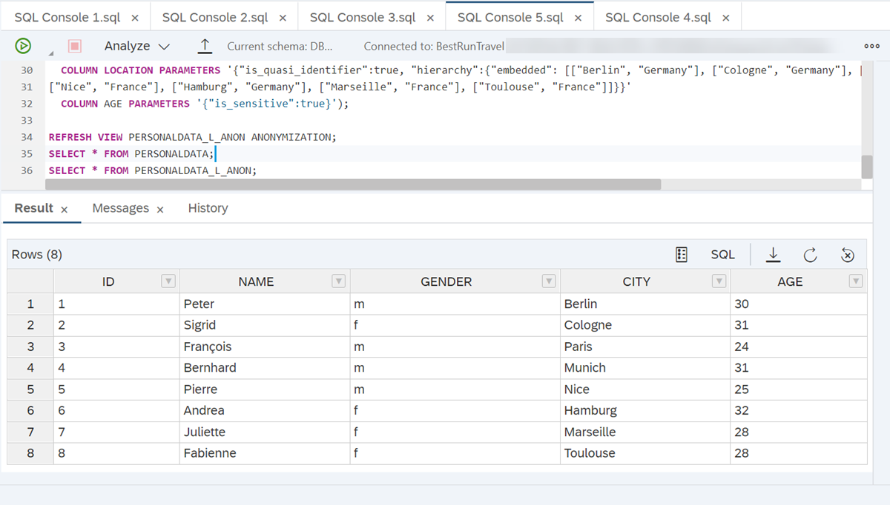
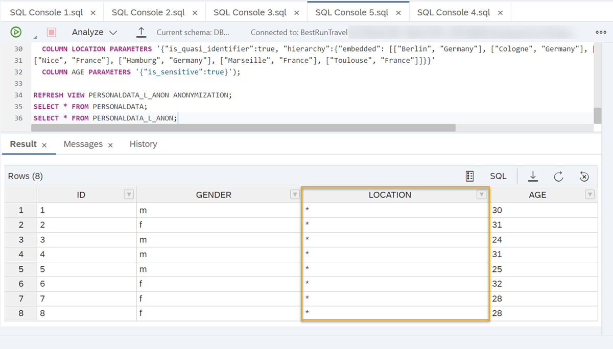
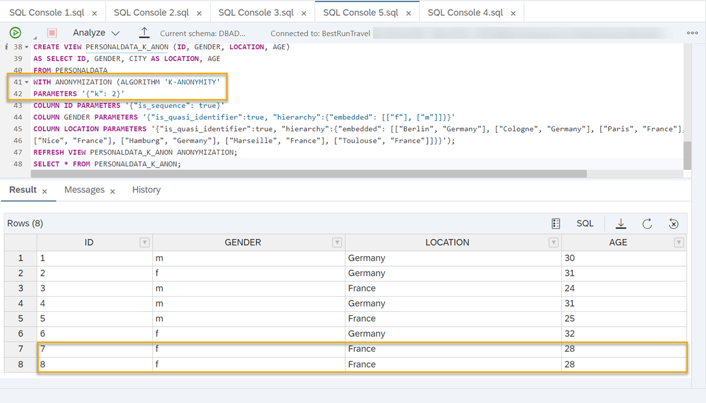

# Create an Anonymized View Using L-Diversity
<!-- description --> Add another layer of protection to k-anonymity by using l-diversity to protect sensitive data in SAP HANA Cloud, SAP HANA database.

## Prerequisites
- It's recommended that you complete the [previous tutorial](hana-cloud-data-anonymization-3).
- If you would like to run the sample scenario, you need a **running** instance of SAP HANA Cloud, SAP HANA database in trial or production.

## You will learn
- How to create an anonymized view using l-diversity
- How to run a sample scenario based on l-diversity
- About the advantage of using l-diversity in an anonymized view


## Intro
> ### **Disclaimer**
>
>In most cases, compliance with data privacy laws is not a product feature. SAP software supports data privacy by providing security features and specific functions relevant to data protection, such as functions for the simplified blocking and deletion of personal data. SAP does not provide legal advice in any form. The definitions and other terms used in this guide are not taken from any given legal source.

---

### Introduction to L-Diversity


Now that you know how to create an anonymized view using k-Anonymity, you will see in this tutorial how to add another layer of protection by complementing it with L-Diversity, which will take into account sensitive data in your dataset.

The K-Anonymity algorithm generalizes quasi-identifiers and makes groups of individuals indistinguishable because they share the same combination of (anonymized) attributes.

If you want to make sure that the sensitive data of the individuals in these groups is sufficiently diverse, you can add l-Diversity to your anonymization. The l-diversity algorithm will refine the groups in which generalization is applied to ensure that a specified number of individuals `=L` inside a group have different values. For example, if you set the `L`-parameter to `4`, at least 4 people who share the same quasi-identifying values will have different values in sensitive data columns.

As with k-anonymity, you need to prepare your data anonymization strategy to know what columns contain what types of data. If you are unsure about that, it is recommended that you try the [previous tutorial](hana-cloud-data-anonymization-3).


### Create an anonymized view using L-Diversity


To use L-Diversity, you only need to slightly change the statement for creating an anonymized view using K-Anonymity.

1.	You need to add the column(s) containing sensitive data in the view

2.	In the `ANONYMIZATION` expression, the anonymization algorithm needs to be set to `L-DIVERSITY`.

3.	The parameter for `L` must be specified.

4.	You need to add a `COLUMN PARAMETERS` expression defining the type of data in the sensitive column {`"is sensitive":true`}

    ```SQL
CREATE VIEW "[view_name]" ("id", "[column1]", "[column_n], "[column_sensitive]")
AS
SELECT "id", "[column1]", "[column_n], "[column_sensitive]"
FROM "[table_name]"
WITH ANONYMIZATION (ALGORITHM 'L-DIVERSITY' PARAMETERS '{"k": [x], "l": [x]}'
COLUMN "id" PARAMETERS '{"is_sequence":true}'
COLUMN "[column1]" PARAMETERS '{"is_quasi_identifier":true,"hierarchy":{"embedded":[["value_level0"],["value_level1"]],[["value_level0"],["value_level1"]]}}'
COLUMN "[column_n]" PARAMETERS '{"is_quasi_identifier":true,"hierarchy":{"embedded":[["value_level0"],["value_level1"]],[["value_level0"],["value_level1"]]}}')
COLUMN [column_sensitive] PARAMETERS '{"is_sensitive":true}');
```

The higher the value you specify for the L-parameter, the more people in each group formed by the algorithm have different values. For example, if you set the parameters `{"k": 10, "l":5}` you will end up with at least 10 people in one group of individuals with the same combination of quasi-identifiers while there are at least 5 different values for the sensitive data column inside this group.


### Run an example scenario


1. First, you must create a sample table `PERSONALDATA` that has sensitive information on people regarding their age. Run the following SQL codes in your SAP HANA Database Explorer.

    ```SQL
CREATE COLUMN TABLE PERSONALDATA (
  -- sequence column
ID BIGINT NOT NULL PRIMARY KEY GENERATED ALWAYS AS IDENTITY,
  -- identifier
NAME NVARCHAR(10),
  -- quasi-identifiers (QIDs) (to be generalized)
GENDER NVARCHAR(1) NOT NULL,
CITY NVARCHAR(10) NOT NULL,
  -- sensitive data
AGE NVARCHAR(3) NOT NULL);
```
    > The SQL codes used in this tutorial are available to you in a GitHub repository. You can find them [here](https://github.com/SAP-samples/hana-cloud-learning/blob/main/Group:%20Data%20Anonymization%20in%20SAP%20HANA%20Cloud/Tutorial%204_Create%20an%20Anonymized%20View%20using%20L-Diversity.sql).

2. Now, you need to insert information into each column of your table.

    ```SQL
INSERT INTO PERSONALDATA VALUES ('Peter', 'm', 'Berlin', '30');
INSERT INTO PERSONALDATA VALUES ('Sigrid', 'f', 'Cologne', '31');
INSERT INTO PERSONALDATA VALUES ('François', 'm', 'Paris', '24');
INSERT INTO PERSONALDATA VALUES ('Bernhard', 'm', 'Munich', '31');
INSERT INTO PERSONALDATA VALUES ('Pierre', 'm', 'Nice', '25');
INSERT INTO PERSONALDATA VALUES ('Andrea', 'f', 'Hamburg', '32');
INSERT INTO PERSONALDATA VALUES ('Juliette', 'f', 'Marseille', '28');
INSERT INTO PERSONALDATA VALUES ('Fabienne', 'f', 'Toulouse', '28');
```

3. Based on the table created above, here is an example of how a completed statement could look like for an anonymized view on a table that contains two quasi-identifying columns (gender and location) as well as a sensitive age column. In this view, at least `K=2` people should be indistinguishable based on their quasi-identifiers and at least `L=2` people should have different age values:

    ```SQL
CREATE VIEW PERSONALDATA_L_ANON (ID, GENDER, LOCATION, AGE)
AS SELECT ID, GENDER, CITY AS LOCATION, AGE
FROM PERSONALDATA
WITH ANONYMIZATION (ALGORITHM 'L-DIVERSITY'
PARAMETERS '{"k": 2, "l": 2}'
COLUMN ID PARAMETERS '{"is_sequence": true}'
COLUMN GENDER PARAMETERS '{"is_quasi_identifier":true, "hierarchy":{"embedded": [["f"], ["m"]]}}'
COLUMN LOCATION PARAMETERS '{"is_quasi_identifier":true, "hierarchy":{"embedded": [["Berlin", "Germany"], ["Cologne", "Germany"], ["Paris", "France"], ["Munich", "Germany"],
["Nice", "France"], ["Hamburg", "Germany"], ["Marseille", "France"], ["Toulouse", "France"]]}}'
COLUMN AGE PARAMETERS '{"is_sensitive":true}');
```

This is what the data looked like before anonymization:

<!-- border -->

The anonymized view looks like this:

<!-- border -->

Here you can see that location has been anonymized to level 2 (*) to achieve that at least 2 individuals have different age values in a group of people who share the same quasi-identifying attributes. In this case, everyone who is male or female.

**Advantage of L-Diversity**

If we would have only used k-anonymity, we would not be able to leverage privacy guarantees, because, for example, two female individuals from France share the same age (28), therefore revealing their sensitive information:

<!-- border -->

Keep in mind that if you use K-Anonymity with L-Diversity, you can still [combine both with the advanced parameters like min/max, loss, or weighted quasi-identifiers](https://help.sap.com/viewer/1d2f0ecc83b34dbf9aa5d08a48be2377/2.0.05/en-US/a6fa451ac1cb4dde96401ea504ade772.html) as well as [data change strategies](https://help.sap.com/viewer/1d2f0ecc83b34dbf9aa5d08a48be2377/2.0.05/en-US/068cfef6953e49de9945c16a36e67171.html).

For more details on the parameters of L-Diversity, you can read our [technical documentation here](https://help.sap.com/viewer/1d2f0ecc83b34dbf9aa5d08a48be2377/2.0.05/en-US/0a39b1a65b934616b775adf970245be4.html).

> **Well done!**
>
> You have completed the fourth tutorial of this group! Now you know how to complement K-Anonymity with L-Diversity to create anonymized views that consider sensitive data.
>
> Get to know a different approach to anonymizing data in the next tutorial , where you will learn how to use differential privacy in an anonymized view.


### Test yourself


---
