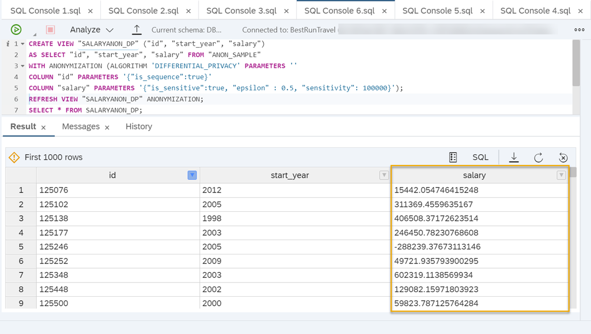
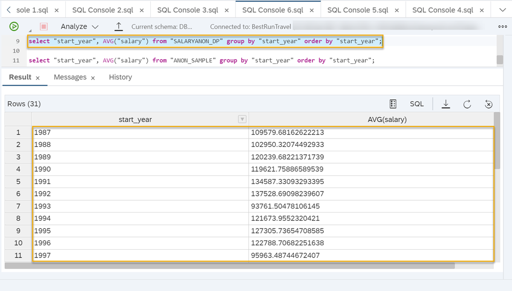
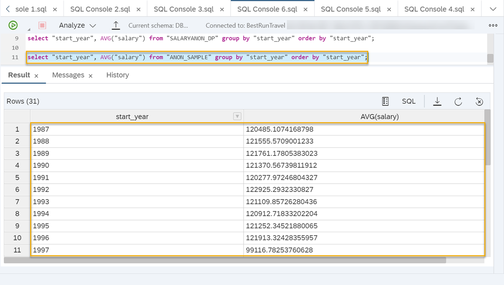

# Create Anonymized Views Using Differential Privacy
<!-- description --> Create an anonymized view in SAP HANA Cloud using Differential Privacy to protect sensitive information.

## Prerequisites
- It's recommended that you complete the [previous tutorial](hana-cloud-data-anonymization-4).
- You can download the [sample CSV file](https://github.com/SAP-samples/hana-cloud-learning/raw/main/Group:%20Data%20Anonymization%20in%20SAP%20HANA%20Cloud/DataAnonymization_SampleData.zip) to run the example scenario. Make sure to [upload it into your database](hana-cloud-mission-trial-5) before running the queries given in the example.
- If you would like to run the sample scenario, you need a **running** instance of SAP HANA Cloud, SAP HANA database in trial or production.


## You will learn
- How to create an anonymized view using differential privacy
- How to view the results of anonymization
- How to run an example scenario using differential privacy


## Intro
> ### **Disclaimer**
>
> In most cases, compliance with data privacy laws is not a product feature. SAP software supports data privacy by providing security features and specific functions relevant to data protection, such as functions for the simplified blocking and deletion of personal data. SAP does not provide legal advice in any form. The definitions and other terms used in this guide are not taken from any given legal source.

---

### Introduction to differential privacy


Now that you know the anonymization methods of K-Anonymity and L-Diversity, we will show you in this article how to apply a third method of anonymization.

**Differential privacy** will add random noise to numerical values based on a mathematical formula that keeps trends of data intact.

The idea behind differential privacy is that individual values can have a different impact on a dataset resulting in privacy breaches. For example, in a dataset containing salaries, the single highest salary value will significantly affect the result when querying the mean salary. If this person is removed from the dataset, the mean salary will change drastically. This way, the salary of that person could be inferred.

To avoid this, differential privacy uses a mathematical formula that contains two parameters:

-	**Sensitivity**: How much of an impact can one value have on query outcomes? This can be determined by the highest possible value minus the lowest possible value. For salaries ranging from `0` to `100.000`, it would be `100.000`. For rating scales from `1-7`, it would `6`. The higher the sensitivity, the more noise is applied to data. But it should not be set higher than necessary because it will otherwise reduce the quality of data.

-	**Epsilon `(ε)`**: How likely should it be to find a certain person in the dataset? Epsilon can also be referred to as the "privacy guarantee" and typically has values `0.1` or `0.01`. The lower the value of Epsilon `(ε)`, the more noise will be applied to values, resulting in higher privacy.

Since Epsilon directly reflects the likelihood of people being identified, it should not be changed. To increase the utility of specific queries, tweaks to the sensitivity can be feasible in some situations.

For more technical information on how differential privacy is computed, you can read our [technical documentation here](https://help.sap.com/viewer/1d2f0ecc83b34dbf9aa5d08a48be2377/LATEST/en-US/ace3f36bad754cc9bbfe2bf473fccf2f.html).


### Create an anonymized view using differential privacy


To use differential privacy on your data, follow these steps:

1.	Open the **SAP HANA Database Explorer** that is connected to your SAP HANA Cloud instance.

2.	Open the **SQL console** of your database.

3.	Define, which columns should be included in your anonymized view. Only columns that contain data relevant for analysis should be included in the view.

4.	This is the SQL statement to create an anonymized view with differential privacy (see instructions below):
    ```SQL
CREATE VIEW "[view_name]" ("id", "[column1]", "[column2]", "[column_sensitive]")
AS
SELECT "id", "[column1]", "[column2]", "[ column_sensitive]"
FROM "[table_name]"
WITH ANONYMIZATION (ALGORITHM 'DIFFERENTIAL_PRIVACY' PARAMETERS ''
COLUMN "id" PARAMETERS '{"is_sequence":true}'
COLUMN "[ column_sensitive ]" PARAMETERS '{"is_sensitive":true, "epsilon" : [x], "sensitivity": [x]}');
```

**How to use this statement:**

-	Specify a name for the anonymized view followed by all columns that should be shown in the view.
-	The `SELECT` expression of the statement needs to be followed by these columns as well.

    `SELECT "id","[column1]","[column2]","[column_sensitive]"`

-	The `FROM` expression should contain the table name.

    `FROM "[table_name]"`

-	Within the `ANONYMIZATION` expression, you need to set the algorithm to `'DIFFERENTIAL_PRIVACY'` followed by an empty `PARAMETERS` expression indicated by two single quotes `''`.

    `WITH ANONYMIZATION (ALGORITHM 'DIFFERENTIAL_PRIVACY' PARAMETERS ''...)`

-	Next, you need to add one `COLUMN` expression that defines a sequence column ("`id` in our example"), which is needed for the anonymized view to detect data changes like inserts or updates within the data source.

    `COLUMN "id" PARAMETERS '{"is_sequence":true}'`

-	Then you must add one `COLUMN` expression for your sensitive data that should be anonymized. This needs to include the definition of the column as sensitive [`"is_sensitive":true`] and values for the parameters epsilon and sensitivity.

    `COLUMN "[column_sensitive]" PARAMETERS '{"is_sensitive":true,"epsilon":[x],"sensitivity":[x]}';`

Once you have filled in all information in this statement, you can run it.

To create metadata that can be queried, the view then needs to be refreshed:

```SQL
REFRESH VIEW "[view_name]" ANONYMIZATION;
```


### View the results of anonymization


1.	To show the results of the anonymization, you can use a `SELECT` statement:

    ```SQL
SELECT * FROM "[view_name]";
```

2.	To check if queries of the anonymized data deliver results with the same accuracy of the data that does not contain added noise, you can run a query on both the anonymized view and the original data. For example, calculating an average grouped by a certain column using this statement:

    ```SQL
-- querying the anonymized view
select "[column1]", AVG("[sensitive_column]") from "[view-name]" group by "[column1]" order by "[column1] ";
-- querying the original data to compare
select "[column1]", AVG("[sensitive_column]") from "[table_name]" group by "[column1]" order by "[column1] ";
```


### Run an example scenario


> To run this example, you must use the [sample data](https://github.com/SAP-samples/hana-cloud-learning/raw/main/Group:%20Data%20Anonymization%20in%20SAP%20HANA%20Cloud/DataAnonymization_SampleData.zip) provided in the prerequisites. You can check the [third tutorial](hana-cloud-data-anonymization-4) for instructions on how to upload the data into your database.

Here is an example of how a completed statement could look like for an anonymized view that contains individuals' sensitive salary data, as well as start years from an HR table. Epsilon has been set to `0.5` and the sensitivity to `100.000`.

```SQL
CREATE VIEW "SALARYANON_DP" ("id", "start_year", "salary")
AS
SELECT "id", "start_year", "salary"
FROM "ANON_SAMPLE"
WITH ANONYMIZATION (ALGORITHM 'DIFFERENTIAL_PRIVACY' PARAMETERS ''
COLUMN "id" PARAMETERS '{"is_sequence":true}'
COLUMN "salary" PARAMETERS '{"is_sensitive":true, "epsilon" : 0.5, "sensitivity": 100000}');
```

> The SQL codes used in this tutorial are available to you in a GitHub repository. You can find them [here]( https://github.com/SAP-samples/hana-cloud-learning/blob/main/Group:%20Data%20Anonymization%20in%20SAP%20HANA%20Cloud/Tutorial%205_Create%20Anonymized%20Views%20using%20Differential%20Privacy.sql).

This is how the data will look like:

<!-- border -->

You can see below that comparative queries on the anonymized view `SALARYANON_DP` and the non-anonymized data (table `ANON_SAMPLE`) show similar results.

**Anonymized data**

```SQL
select "start_year", AVG("salary") from "SALARYANON_DP" group by "start_year" order by "start_year";
```

<!-- border -->

**Original data**

```SQL
select "start_year", AVG("salary") from "ANON_SAMPLE" group by "start_year" order by "start_year";
```

<!-- border -->

> **Well done!**
>
> You have completed the fifth tutorial of this group! Now you know how to create anonymized views using the different anonymization methods available in SAP HANA Cloud, SAP HANA database.
>
> Learn in the last tutorial how you can make the data available to data consumers and how you can monitor the effectiveness of your anonymization parameters.

### Related topics

[Best Practices for Anonymization Views](https://help.sap.com/viewer/1d2f0ecc83b34dbf9aa5d08a48be2377/LATEST/en-US/3d0ed0d29ebc4c76a097e14170cccaf7.html)

For more details on the parameters of differential privacy, you can read our [technical documentation here](https://help.sap.com/viewer/1d2f0ecc83b34dbf9aa5d08a48be2377/LATEST/en-US/e60292d12f9d4c38a30486b452d5ae04.html).


### Test yourself


---
