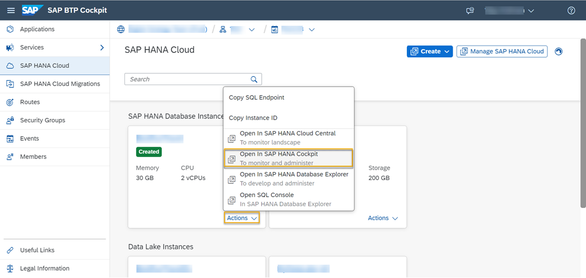
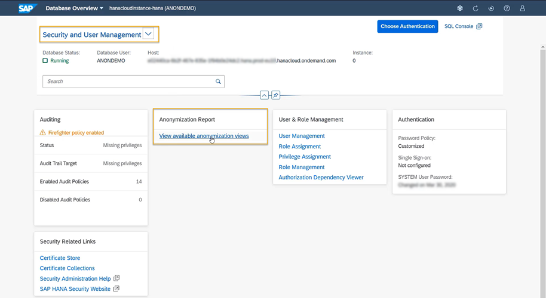
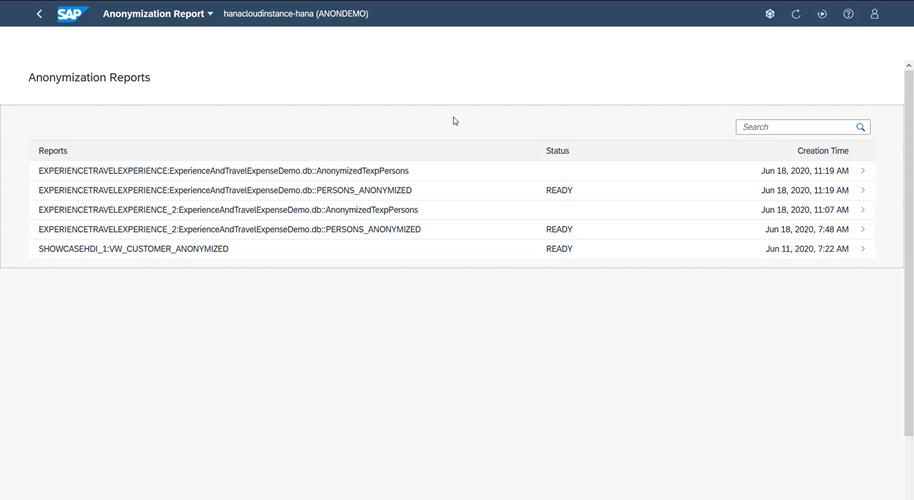
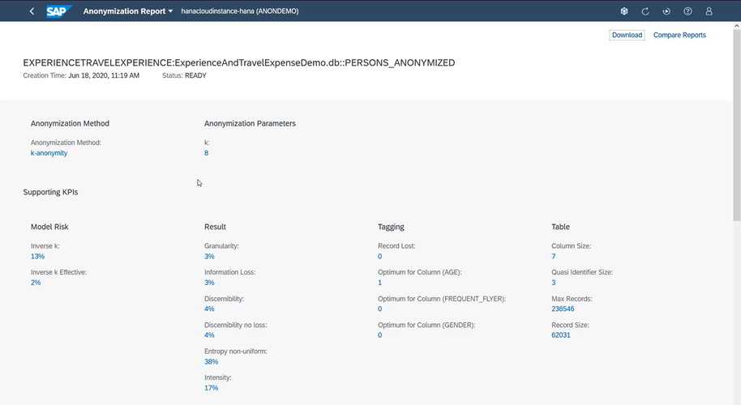
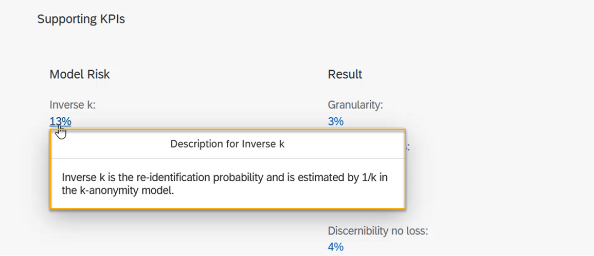
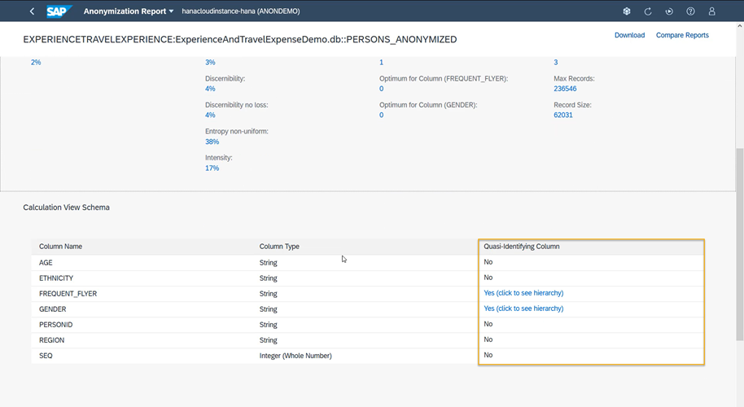
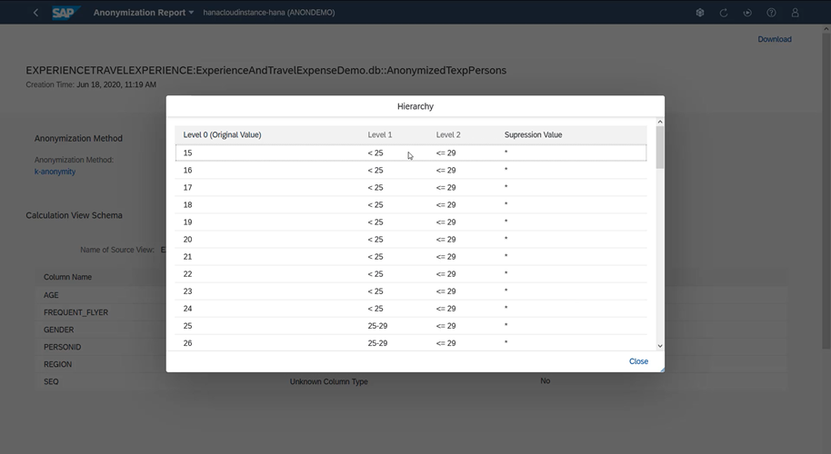
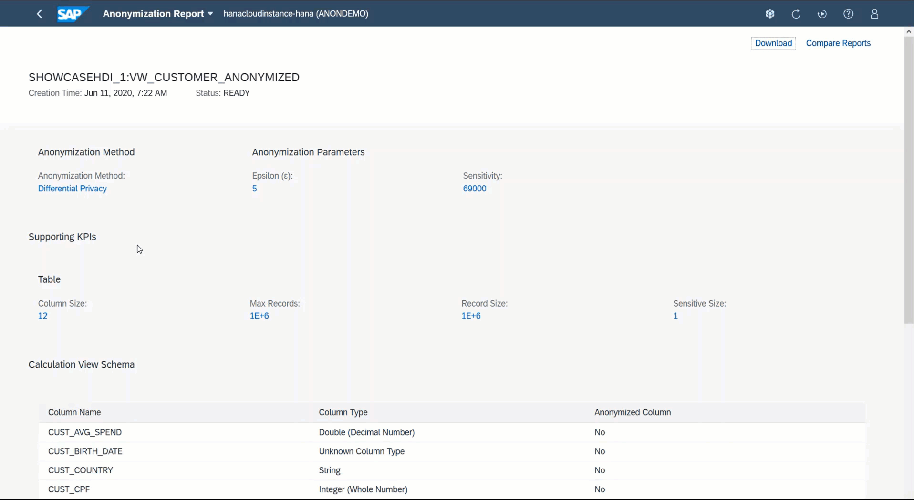
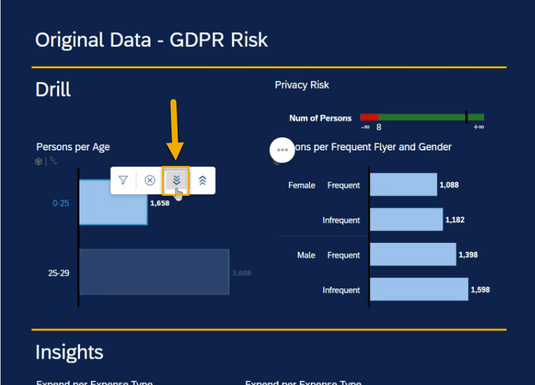
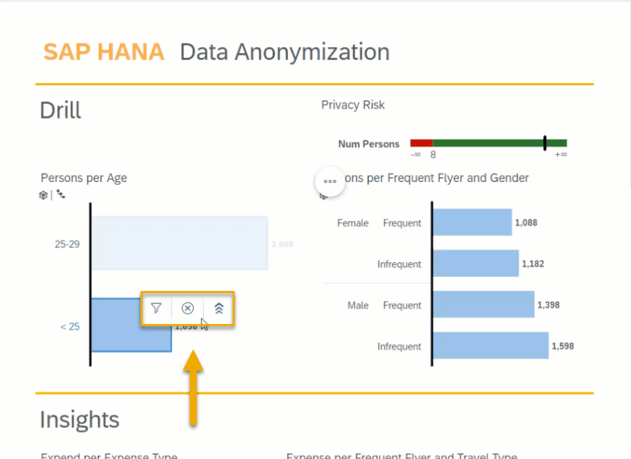

# Monitor and Share Anonymized Data
<!-- description --> Monitor anonymization of data in the SAP HANA cockpit by accessing various anonymization KPIs.

## Prerequisites
- It's recommended that you complete the [previous tutorial](hana-cloud-data-anonymization-5).
- To access the anonymization KPI's and monitoring options in SAP HANA cockpit shown in this tutorial, you need to have created at least one anonymized views using [k-anonymity](hana-cloud-data-anonymization-3), [l-diversity](hana-cloud-data-anonymization-4) or [differential privacy](hana-cloud-data-anonymization-5). If you have not done so yet, you can revisit one of the previous tutorials.

## You will learn
- How to view all available anonymization views
- How to explore various KPI's on anonymization in the SAP HANA cockpit
- How to access anonymization reports in SAP HANA Database Explorer


## Intro
> ### **Disclaimer**
>
> In most cases, compliance with data privacy laws is not a product feature. SAP software supports data privacy by providing security features and specific functions relevant to data protection, such as functions for the simplified blocking and deletion of personal data. SAP does not provide legal advice in any form. The definitions and other terms used in this guide are not taken from any given legal source.

Now that you have learned how data anonymization works in SAP HANA Cloud and how you can create anonymized views using different methods, in this tutorial you will learn how to make the data accessible and how to monitor the effectiveness of anonymized views. You will get familiar with anonymization reports and anonymization KPI's available in the SAP HANA cockpit as well as two ways of sharing anonymized data in your organization.

Watch this video to see the end-to-end process of creating anonymized views, sharing them with others and monitoring them:

<iframe width="560" height="315" src="https://microlearning.opensap.com/embed/secure/iframe/entryId/1_ht4lpx8a/uiConfId/43091531" frameborder="0" allowfullscreen></iframe>

In this tutorial, you will find a detailed step-by-step guide on how to navigate through the anonymization reports in the SAP HANA cockpit. These reports and KPI's can help data protection officers to get an idea about the anonymization used in their organization, as well as show people who modified anonymized views.

---

### View all available anonymization views in SAP HANA cockpit


Follow these steps to monitor and evaluate the anonymization used in your database:

1.	Open the **SAP BTP Cockpit**.

2.	Navigate to your global account, sub-account and space where your SAP HANA Cloud instance is located.

3.	On the bottom right corner of the tile of your SAP HANA Cloud instance, click on **Actions**.

4.	Select **Open in SAP HANA Cockpit**. The SAP HANA cockpit will open in a new tab.

    <!-- border -->

5.	In the SAP HANA cockpit, navigate to the section All or Security and User Management.

6.	Navigate to the card Anonymization report.

7.	Click on **View available anonymization views**.

    <!-- border -->


### Explore the list of reports on anonymized views


1.	There, you can see all reports available for your database. Each anonymized view has a corresponding report that is represented in one of the rows.

    <!-- border -->

2.	If you click on a report, you can see the anonymization method and parameters you have specified.

3.	For example, if you have used the anonymization method of k-anonymity, you will see this reflected at the top area. Below, in the Supporting KPI's area, you can see various KPI's that will tell you more about the effectiveness of your anonymized view.

    <!-- border -->


### Explore different elements in the report


1.	**Supporting KPI's**

    You can click on each KPI to get detailed information on what they describe.

    <!-- border -->

2.	**Column Overview**

    Scrolling down, you can also find an overview of all columns in your anonymized view and what type you determined for them in the view.

    <!-- border -->

3.	**Hierarchies defined**

    For each quasi-identifier, you can also view the hierarchies defined. This works both for embedded hierarchies, as well as hierarchy functions.

    <!-- border -->

4.	**KPI's for differential privacy**

    If you use differential privacy in your anonymized view, the KPI's compiled in your report will vary.

    <!-- border -->


### Access anonymization reports in SAP HANA Database Explorer


To access the anonymization reports directly in the SAP HANA Database Explorer, you can use this statement:

```SQL
GET_ANONYMIZATION_VIEW_STATISTICS('<action>', '[<parameters>]', '<schema_name>', '<view_name>')
```
For example, you can get the names and descriptions or values of the KPI's available in your report by using the statement like this:

```SQL
--names & descriptions
GET_ANONYMIZATION_VIEW_STATISTICS('get_names', NULL, '<schema_name>', '<view_name>')
--names & values
GET_ANONYMIZATION_VIEW_STATISTICS('get_values', NULL, '<schema_name>', '<view_name>')
```

There are four categories of KPI's you can use to evaluate your anonymization:

-	**Static source KPI's** that reflect the source data.
-	**Static anonymization KPI's** that reflect the anonymized data.
-	**Dynamic utility KPI's** that reflect source data, anonymized data and the anonymization method and its parameters.
-	**Dynamic risk KPI's** that may include more parameters

You can learn more about the Anonymization KPI's in the [technical documentation here](https://help.sap.com/viewer/b3ee5778bc2e4a089d3299b82ec762a7/LATEST/en-US/2401b013d82342f0af76c320a11d9f06.html).


### Share anonymized views


**Making anonymized data available to others**

One simple way to share an anonymized view directly in the SAP HANA Database Explorer is to give other users **SELECT privileges** to access it. You can do so using this command that needs to include the anonymized view name and the user:

```SQL
GRANT SELECT ON <view_name> TO <user>;
```
If you are unsure how to create users in SAP HANA Cloud, SAP HANA database, [read more here](hana-cloud-mission-trial-4).

Another way to share an anonymized view is to make it available in other applications and dashboards. SAP Analytics Cloud offers great ways to visualize data in convenient dashboards. Note that data needs to be in a calculation view for SAP Analytics Cloud to consume it.
Usually, in SAP Analytics Cloud, users can drill down into the data as far as they want and apply filters. This could potentially result in a breach of privacy, e.g., if a category of values contains less people than specified by k-anonymity.

The following image shows how someone can drill down into the non-anonymized data and find out the information on specific individuals:

<!-- border -->

> ### For Non-Anonymized Data
>
> - From the above image, the highlighted option "drill down", provides the functionality to narrow down the information to smaller categories.
> - By applying various filters here, the **number of persons** associated with a particular set of information can be narrowed down to a single individual.
>
> You can refer the video in the introduction of this tutorial for details.

When an anonymized view is shared via SAP Analytics Cloud, drilling down into certain categories and filtering is simply not possible. All data can still be analyzed on a group level – without the risk of a data consumer accidentally drilling down too far.

The following image shows how anonymized data can prevent someone from finding out the information on specific individuals:

<!-- border -->

> ### For Anonymized Data
>
> - From the above image, the highlighted options do not show the "drill down" option, meaning that existing information cannot be narrowed down further to smaller categories.
> - Here, the **number of persons** associated with a particular information cannot be narrowed down to a single individual even after applying all the filters.
>
> You can refer the video in the introduction of this tutorial for details.


### Recap all you have learned about data anonymization


That is all for this tutorial group. Let us recap what you have learned:

1.	Data anonymization is important so you can [analyze your data without the risk of violating data privacy regulations](hana-cloud-data-anonymization-1).
2.	Data anonymization in SAP HANA Cloud [uses anonymized views](hana-cloud-data-anonymization-2) that always contain the latest data, leave the original data untouched and can be safely shared with others.
3.	Using the method of [k-anonymity](hana-cloud-data-anonymization-3), you can avoid that individuals are identified by quasi-identifiers, even if their names are removed.
4.	To further protect sensitive data, you can either complement k-anonymity with [l-diversity](hana-cloud-data-anonymization-4) or add random noise to your data with [differential privacy](hana-cloud-data-anonymization-5).
5.	You can monitor KPI's of your anonymized view in the SAP HANA cockpit and share anonymized data by giving access rights to other users or present the data in dashboards like with SAP Analytics Cloud.

> **Well done!**
>
> You have completed the last tutorial of this group!
>
> Follow our tag in the [SAP Community](https://blogs.sap.com/tags/73554900100800002881/) to stay up-to-date on the latest updates and newest content! For more learning materials on SAP HANA Cloud, [click here](https://community.sap.com/topics/hana-cloud).


### Test yourself


---
