# Access and Query a Data Product in SAP HANA Cloud

<!-- description --> Learn how to share a data product that has been published in the SAP Business Data Cloud (SAP BDC) with SAP HANA Cloud so that its contents can be queried as virtual tables.  Data products are read-only curated data that has been produced by an SAP application such as SAP S/4HANA, SAP SuccessFactors, SAP Ariba, and Concur among others.  They provide access to SAP data without the need for complex data preparation steps.  SAP Business Data Cloud (SAP BDC) is a data platform that harmonizes all data from SAP and non-SAP sources, into a unified semantic layer of trusted data, to power advanced analytics and to build AI applications.  SAP HANA Cloud is an in-memory database that provides a multi model engine, access to both structured and unstructured data, and embedded libraries for machine learning enabling it to provide real time analytics.

For additional details on these topics see:

* [Introducing SAP Business Data Cloud](https://learning.sap.com/courses/introducing-sap-business-data-cloud)
* [Start your free trial of SAP Business Data Cloud](https://www.sap.com/products/data-cloud/trial.html)
* [SAP Business Data Cloud | SAP Community](https://pages.community.sap.com/topics/business-data-cloud)
* [Provisioning and Administering Databases in SAP HANA Cloud](https://learning.sap.com/courses/provisioning-and-administering-databases-in-sap-hana-cloud)
* [Basic Trial - Introduction to SAP HANA Cloud](https://learning.sap.com/courses/prd-hc-introduction)
* [Data Product Support in SAP HANA Cloud | SAP Help Portal](https://help.sap.com/docs/hana-cloud/sap-hana-cloud-administration-guide/data-product-support-in-sap-hana-cloud-internal?state=DRAFT&version=dev)

## Prerequisites

* Access to SAP Business Data Cloud and a productive SAP HANA Cloud instance

## You will learn

* How to configure SAP Business Data Cloud and SAP HANA Cloud in a formation so that data products can be shared from SAP BDC to a SAP HANA Cloud database
* How to share a selected data product
* How to install the shared data product into SAP HANA Cloud
* How to view the installed data product (in data products tab, see also the data sources)
* How to query data from the shared data product in SAP HANA Cloud

---

### Set up a formation

A formation is a logical grouping of SAP systems that simplify the connectivity setup and to provide a unified view of the systems.  For further details see [How Data Products Become Available in SAP HANA Cloud](https://help.sap.com/docs/hana-cloud/sap-hana-cloud-administration-guide/how-data-products-become-available-in-sap-hana-cloud?state=DRAFT&version=dev).

1. Navigate to formations in the [SAP Business Technology (SAP BTP) Cockpit](https://cockpit.btp.cloud.sap/cockpit#) and select Create Formation.

    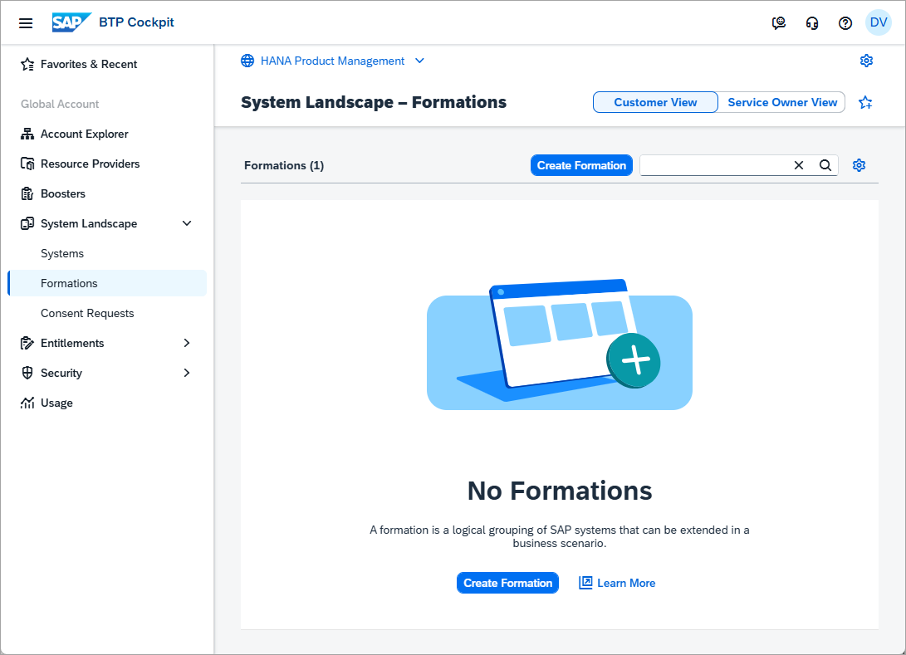

2. Create a new formation of type Business Data Cloud.

    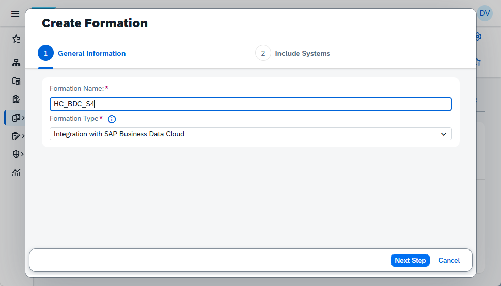

3. Select the products to be part of the formation.

    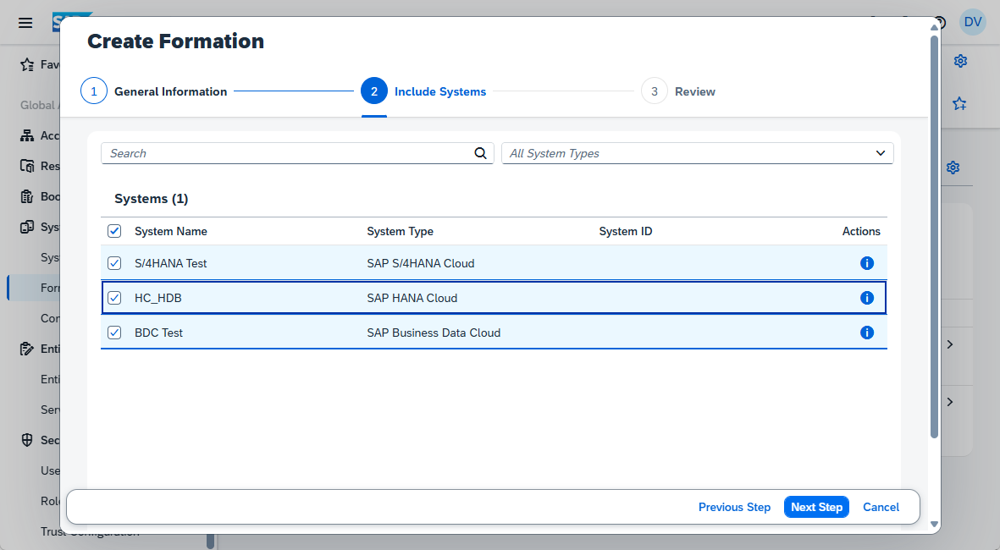

4. Complete the formation.

### Locate and examine a data product in SAP BDC

Now that trust has been established between SAP BDC and SAP HANA Cloud, a data product can be located in SAP BDC and shared to SAP HANA Cloud.

1. In the SAP BDC cockpit, select Catalog & Marketplace and search for a data product.

    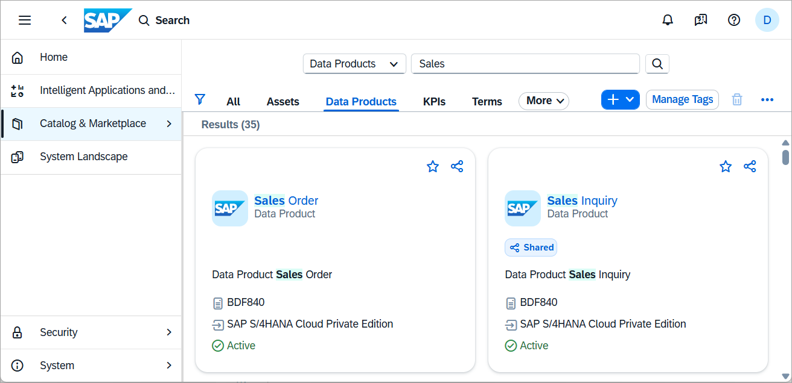

2. The details of the data product including the description and its properties can be examined.

    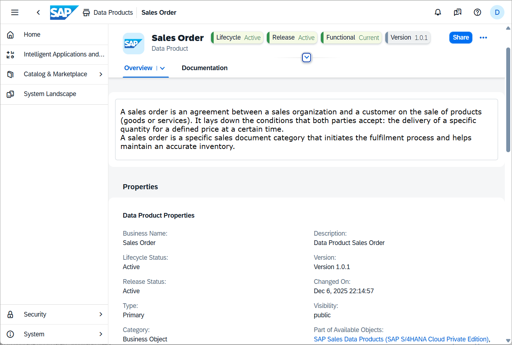

3. Details of the objects included can be displayed by examining the API.

    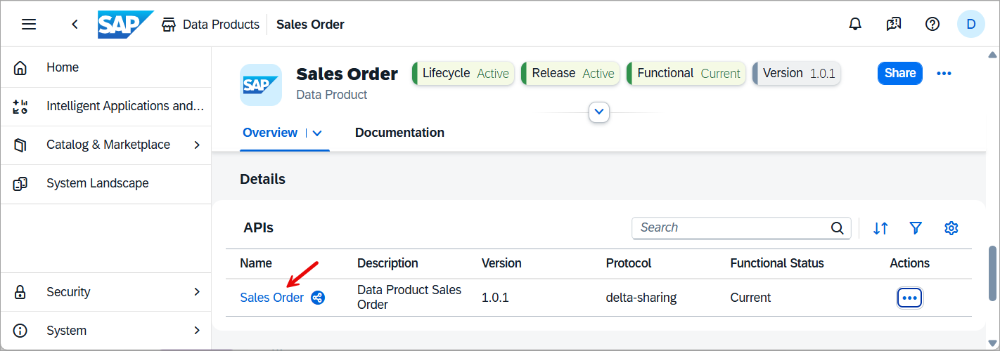

    It is also possible to examine the columns of each object by clicking View Columns.

    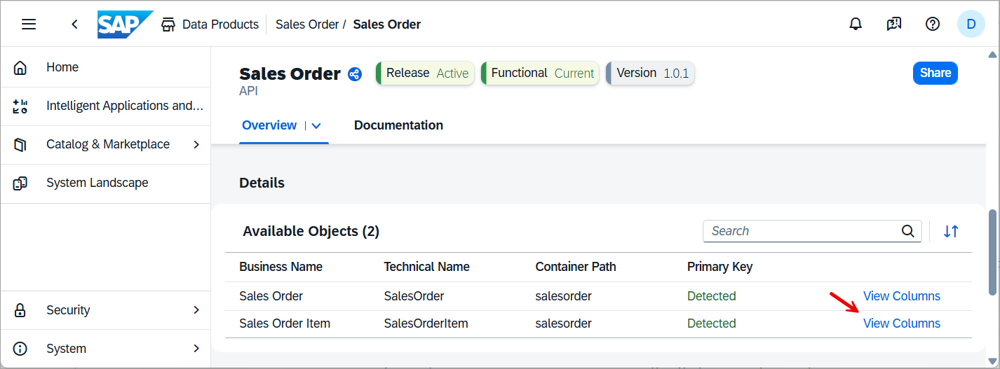

    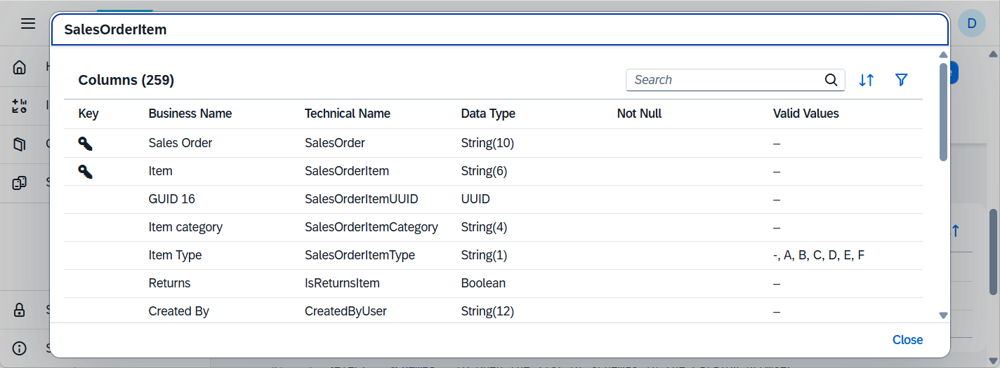

### Share a data product to SAP HANA Cloud

1. Once a data product has been identified that you wish to be able to access from SAP HANA Cloud, select the Share button in the top right of its details page.

    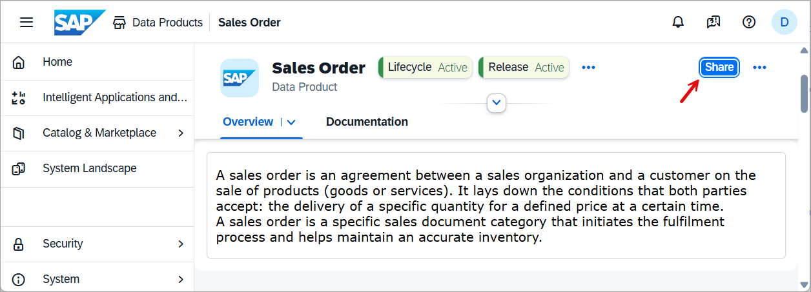

    Specify the system to share the data product with by pressing Add a Target.

    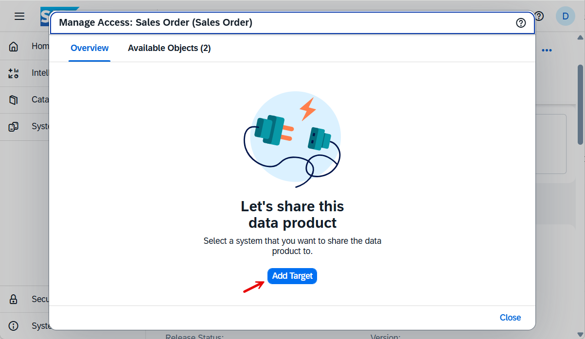

    Specify an SAP HANA Cloud system as a target.

    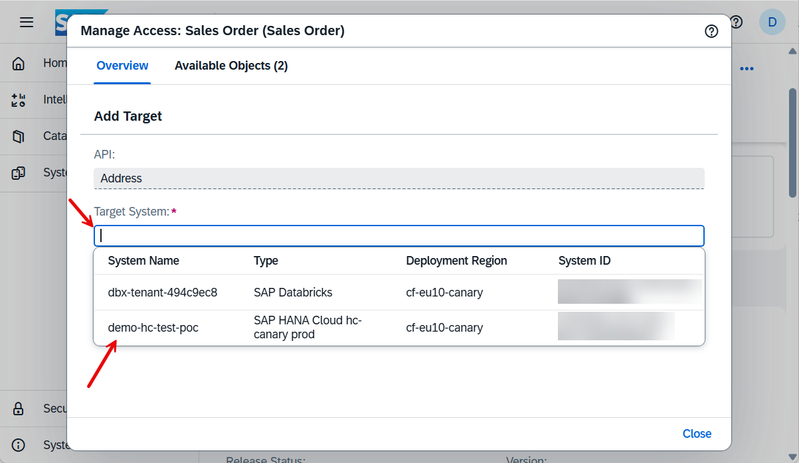

    Finally complete the process by pressing Share.

    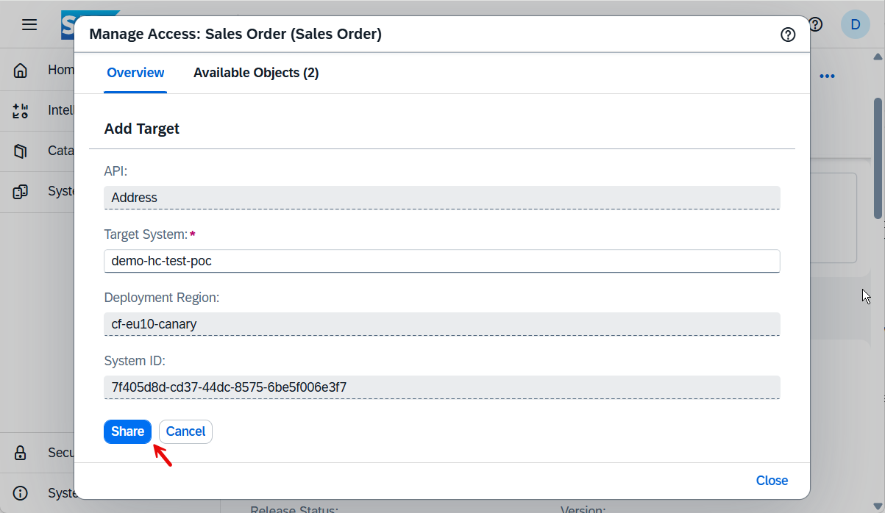

### Install a data product into SAP HANA Cloud

The data product that was previously shared can now be installed into SAP HANA Cloud which will create a remote source to the data product and create virtual tables for each object in the data product.

1. Open SAP HANA Cloud Central and select the SAP HANA Cloud instance in which you wish to install the data product.

    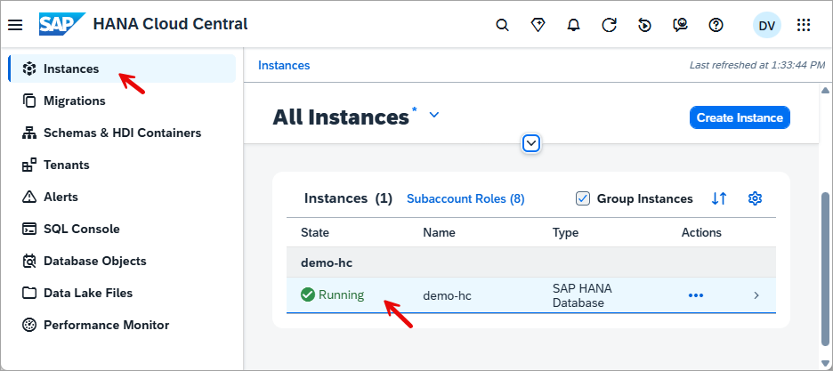

2. Select the previously shared data product and choose install.

    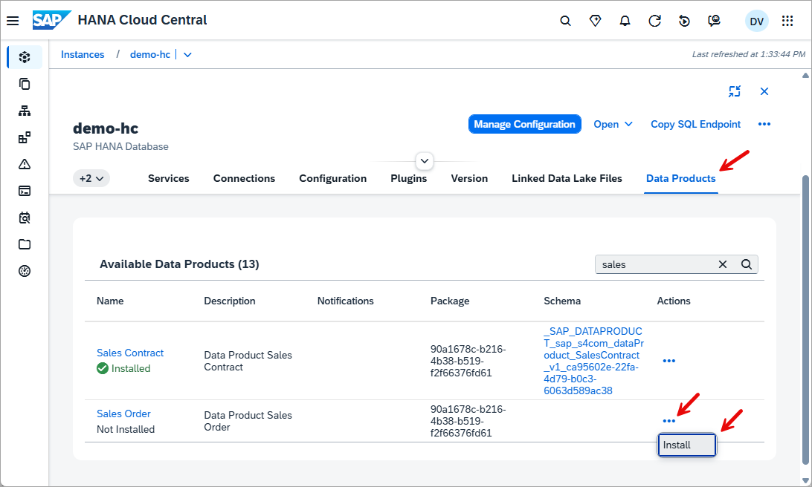

### Examine the remote source and virtual tables

1. Start by selecting the schema of the data product.

    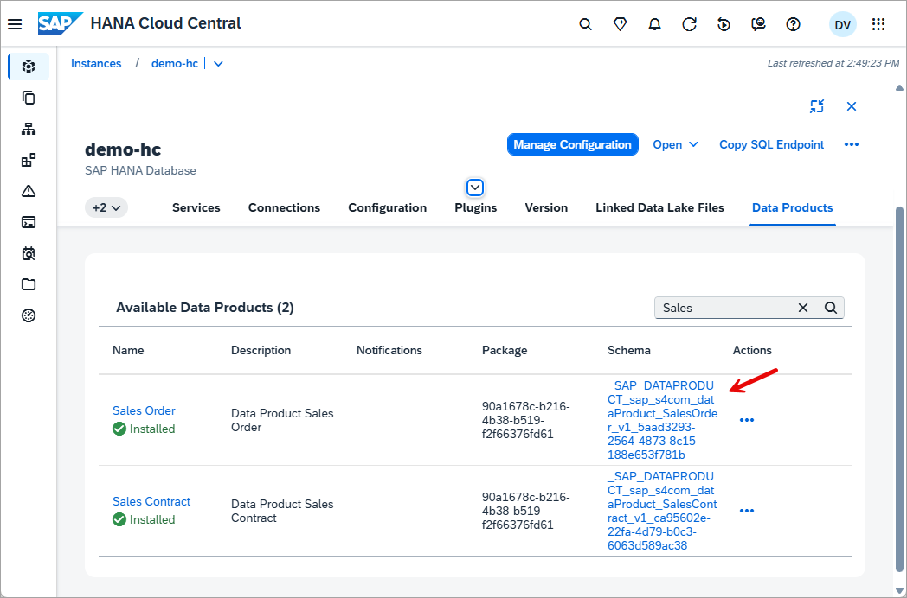

2. The database objects app will now open with a schema filter applied.

    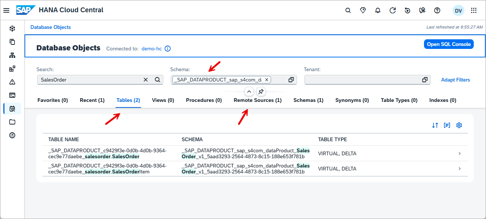

    As shown above a virtual table was created for each object in the data product.

3. A remote source was created that provides the connection to the data product.

    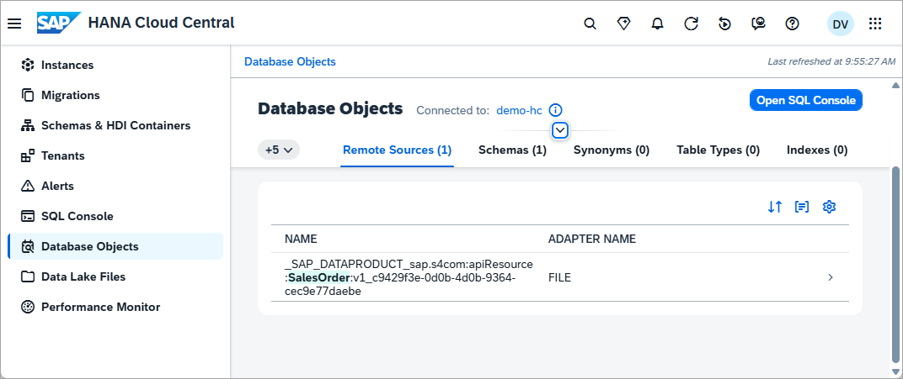

    Further details on remote sources can be found at [CREATE REMOTE SOURCE](https://help.sap.com/docs/hana-cloud-database/sap-hana-cloud-sap-hana-database-sql-reference-guide/create-remote-source-statement-access-control?locale=en-US).

### Query the data product using SAP HANA Cloud

The data in the data product can now be queried using the virtual tables.  An example is shown below.

```SQL
SET SCHEMA "_SAP_DATAPRODUCT_sap_s4com_dataProduct_SalesOrder_v1_5aad3293-2564-4873-8c15-188e653f781b";
SELECT COUNT(*) FROM "_SAP_DATAPRODUCT_c9429f3e-0d0b-4d0b-9364-cec9e77daebe_salesorder.SalesOrder" AS SALES_ORDER;
SELECT COUNT(*) FROM "_SAP_DATAPRODUCT_c9429f3e-0d0b-4d0b-9364-cec9e77daebe_salesorder.SalesOrderItem" AS SALES_ORDER_ITEM;
SELECT * FROM "_SAP_DATAPRODUCT_c9429f3e-0d0b-4d0b-9364-cec9e77daebe_salesorder.SalesOrder" AS SALES_ORDER;
SELECT * FROM "_SAP_DATAPRODUCT_c9429f3e-0d0b-4d0b-9364-cec9e77daebe_salesorder.SalesOrderItem" AS SALES_ORDER_ITEM;
SELECT "SalesOrderItemText", COUNT("SalesOrderItemText") FROM "_SAP_DATAPRODUCT_c9429f3e-0d0b-4d0b-9364-cec9e77daebe_salesorder.SalesOrderItem" 
        AS SALES_ORDER_ITEM GROUP BY "SalesOrderItemText" ORDER BY COUNT("SalesOrderItemText") DESC;
```

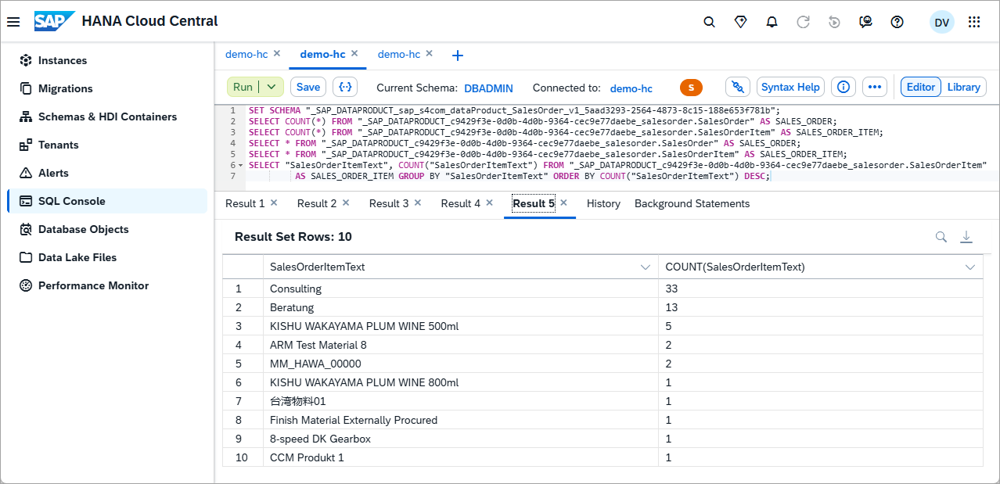

### Knowledge check

Congratulations! You have now used the SAP HANA database explorer extension for Visual Studio Code to create tables and functions within an SAP HANA database and have become familiar with some of the features it provides.
