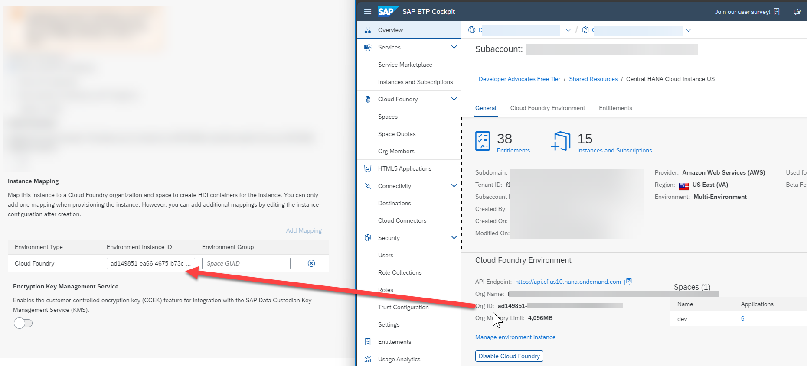
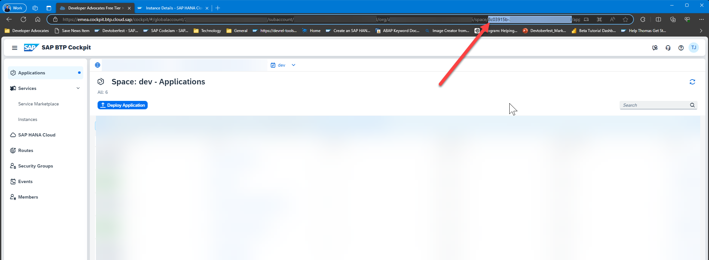
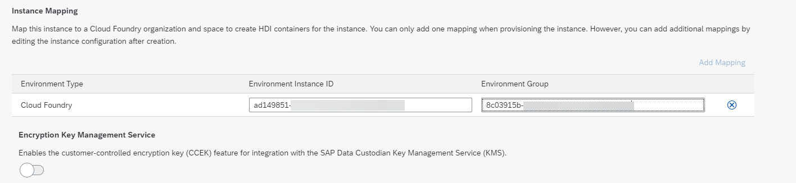
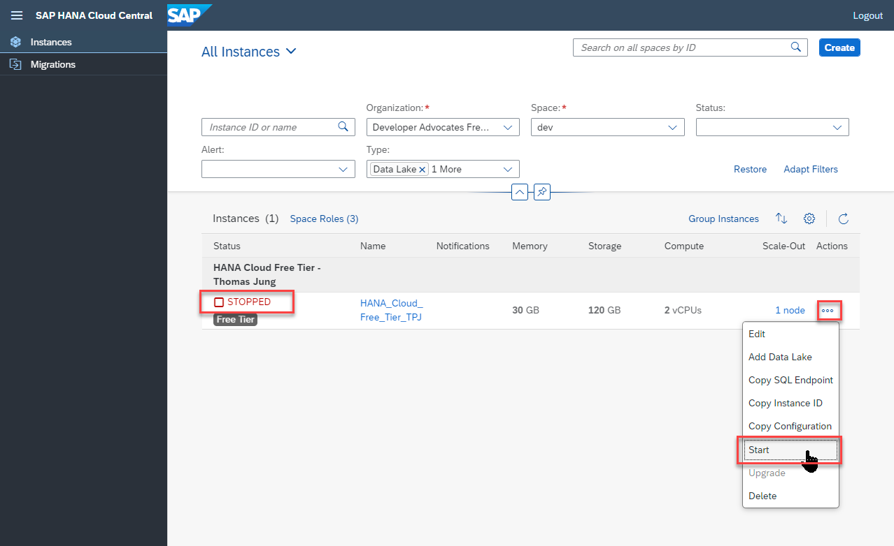

# Deploy SAP HANA Cloud

<!-- description --> Create an instance of the SAP HANA Cloud in SAP BTP trial or free tier.

## You will learn

- How to use the SAP BTP cockpit as a graphical tool to provision your free SAP HANA Cloud instance
  
## Get to know SAP HANA Cloud

[SAP HANA Cloud](https://developers.sap.com/topics/hana.html) is a complete database and application development platform. It lets you use advanced data processing capabilities — text, spatial, predictive, and more — to pull insights from all types of data.

## Intro

By combining in-memory storage with columnar store, data operations are performed faster than in a traditional database with a disk-based storage. SAP HANA is also `translytical`, which means that developers can perform both transactional and analytical operations from the same structure, in real time, and without creating additional copies of the data such as materialized views.

---

### Add SAP HANA Cloud to your account

1. Complete the tutorial steps in [Start Using SAP HANA Cloud Trial in SAP BTP Cockpit](hana-cloud-mission-trial-2). Upon completing this tutorial you will have setup or used your SAP BTP account (Trial or Free Tier) and performed the necessary updating of entitlements, subscriptions, and roles for utilizing SAP HANA Cloud.

### Create Database

1. Complete the tutorial steps in [Provision an Instance of SAP HANA Cloud, SAP HANA Database](hana-cloud-mission-trial-3), but with some additions. This wizard used in this tutorial will walk you through the process of creating an SAP HANA Cloud instance. Just one note as you go through this guided tour: Make sure that in the "Advanced Settings" part of the setup, that you select "Allow all IP addresses" in the "Connections" setting. This setting will allow you to develop against your SAP HANA Cloud instance using a variety of external development tools, including the SAP Business Application Studio.

    <!-- border -->

1. Also while in the "Advanced Settings", we want to configure the Instance Mapping. The HANA Cloud instance lives at your BTP sub account level and isn't immediately available in either the Cloud Foundry nor Kyma runtimes. In order to use HANA for HDI (HANA Deployment Infrastructure) or CAP (Cloud Application Programming Model) based development, you need to map the instance to your runtime of choice. For this Tutorial we will map to the default Cloud Foundry runtime of your trial account.  

    <!-- border -->

1. In the Environment Instance ID of the Mapping supply the Organizational ID from your Cloud Foundry Environment (which can be found in the Subaccount Overview in the SAP BTP Cockpit).

    <!-- border -->

1. In the Environment Group of the Mapping supply the Space ID from your Cloud Foundry Environment (which can be found in the URL of the BTP Cockpit after navigating to the Space details).

    <!-- border -->

    <!-- border -->

1. After completing the previous step, you should now have a new SAP HANA Cloud instance created in the SAP BTP trial or free tier.

    <!-- border -->

1. Once the SAP HANA Cloud instance is created, take note of the admin user needed to connect to the database. This will be needed in subsequent steps in this tutorial.

1. Finally it is important to take note that the SAP HANA Cloud instance in both the free tier and free trial shuts down at the end of each day automatically to save costs from unused systems. Therefore you must return to this SAP HANA Cloud administration screen each day you want to use  SAP HANA Cloud and choose to start the system from the **Action** menu.  If you forget to restart the instance, you will receive HANA connection errors whenever you try to interact with it in later steps.

    <!-- border -->

1. Once the SAP HANA Cloud instance is created, take note of the admin user (DBADMIN) and password you supplied to connect to the database. This will be useful in subsequent tutorials.

---
