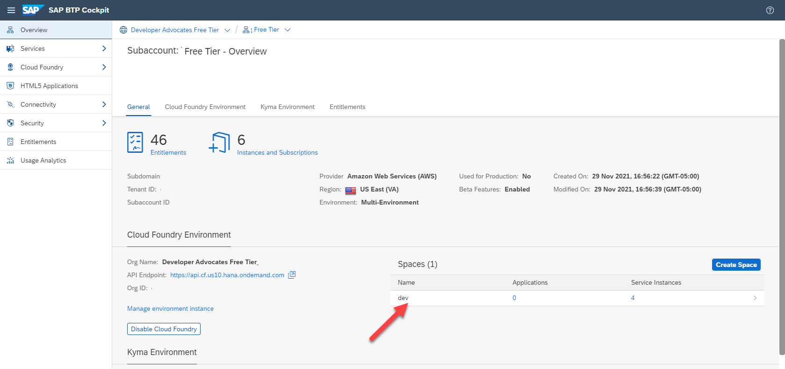

## Prerequisites
 - You have a free SAP Business Technology Platform trial account: [Get a Free Trial Account on SAP Cloud Platform](hcp-create-trial-account)

## Details
### You will learn
  - How to use the SAP BTP cockpit as a graphical tool to provision your SAP HANA Cloud instance

### Get to know SAP HANA Cloud
SAP HANA Cloud is a complete database and application development platform. It lets you use advanced data processing capabilities — text, spatial, predictive, and more — to pull insights from all types of data.

By combining in-memory storage with columnar store, data operations are performed faster than in a traditional database with a disk-based storage. SAP HANA is also `translytical`, which means that developers can perform both transactional and analytical operations from the same structure, in real time, and without creating additional copies of the data such as materialized views.

---

[ACCORDION-BEGIN [Step 1: ](Add SAP HANA Cloud to your trial account)]

1. From the SAP BTP cockpit entry page, click on the **trial** subaccount.

    !

2. In the Subaccount page, click on the **dev** space.

    !

3. Once in your **dev** space page, click on **SAP HANA Cloud** in the side menu navigation.  You will then see a page listing all your SAP HANA Cloud instances; of which you should have none.  Click on the **Create Database** button to begin the wizard to create a new instance.

    !

[DONE]
[ACCORDION-END]

[ACCORDION-BEGIN [Step 2: ](Create Database)]

1. This wizard will walk you through the process of creating a SAP HANA Cloud instance. Just one note as you go through this guided tour: Make sure that in the "Advanced Settings" part of the setup, that you select "Allow all IP addresses" in the "Allowed connections" setting. This setting will allow you to develop against your SAP HANA Cloud trial using a variety of external development tools.

    !

2. After completing the previous step, you should now have a new SAP HANA Cloud instance created in the SAP BTP trial.

    !

3. If you get stuck at any point in this process, there is also this short video you can watch and follow along:

    <iframe width="560" height="315" src="https://www.youtube.com/embed/Lv_40d1ZtsM" frameborder="0" allow="accelerometer; autoplay; clipboard-write; encrypted-media; gyroscope; picture-in-picture" allowfullscreen></iframe>

4. Once the SAP HANA Cloud instance is created, take note of the admin user (DBADMIN) and password you supplied to connect to the database. This will be needed in subsequent tutorials.

[DONE]
[ACCORDION-END]

---
