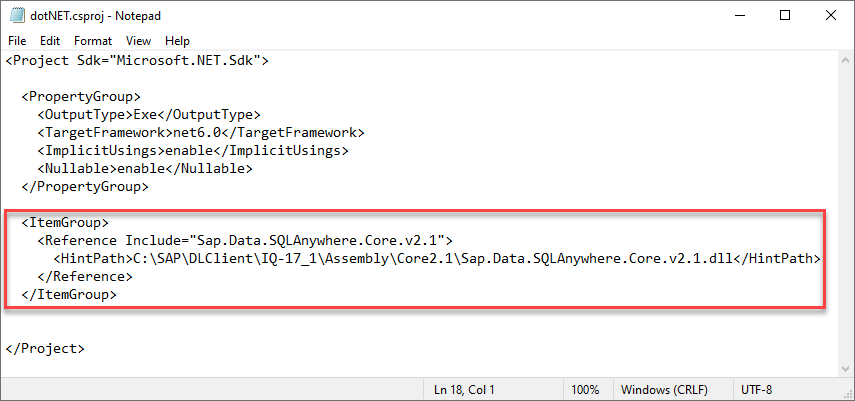

# Connect to Data Lake Relational Engine Using the .NET Driver
<!-- description --> Create and debug a .NET application that connects to a data lake Relational Engine.

## Prerequisites
 - You have completed the first tutorial in this group.

## You will learn
  - How to install the .NET SDK
  - How to create and debug a .NET application that queries a data lake Relational Engine

## Intro
[.NET](https://en.wikipedia.org/wiki/.NET_Core) is a free and open source software framework for Microsoft Windows, Linux and Mac operating systems and is the successor to the .NET Framework.  .NET was previously known as .NET Core.

---

### Install the .NET SDK


The first step is to check if you have the .NET SDK  installed and what version it is.  Enter the following command:

```Shell
dotnet --version  
```  
If the `dotnet` command is not recognized, it means that the .NET SDK has not been installed. If the SDK is installed, the command returns the currently installed version, such as 6.0.201.  

If the .NET SDK is not installed, download it from [Download .NET](https://dotnet.microsoft.com/download) and run the installer on Microsoft Windows.
> Note: Select the 'Download .NET SDK x64' option.


On Linux, follow the instructions for the appropriate Linux version such as [Install the .NET SDK or the .NET Runtime on openSUSE](https://docs.microsoft.com/en-us/dotnet/core/install/linux-opensuse).

In order for the shell to recognize that the .NET SDK is installed and for any `dotnet` commands in future steps to be recognized, a new shell window needs to be opened.


### Create a .NET application that queries a data lake Relational Engine


1.  Create a new console app with the below commands:

    ```Shell (Microsoft Windows)
    cd %HOMEPATH%/DataLakeClientsTutorial
    dotnet new console -o dotNET
    ```  

    ```Shell (Linux)
    cd $HOME/DataLakeClientsTutorial
    dotnet new console -o dotNET
    ```

2.  Open the `dotNET.csproj` file:

    ```Shell (Microsoft Windows)
    cd dotNET
    notepad dotNET.csproj
    ```

    ```Shell (Linux)
    cd dotNET
    pico dotNET.csproj
    ```

    Add the following below the `PropertyGroup` section (within the `Project` section) to indicate where to load the data lake Relational Engine Client .NET driver from.  Modify the `HintPath` section with the information about where the dll is located on your machine.

    ```Shell (Microsoft Windows)
    <ItemGroup>
      <Reference Include="Sap.Data.SQLAnywhere.Core.v2.1">
        <HintPath>C:\SAP\DLClient\IQ-17_1\Assembly\Core2.1\Sap.Data.SQLAnywhere.Core.v2.1.dll</HintPath>
      </Reference>
    </ItemGroup>
    ```

    ```Shell (Linux)
    <ItemGroup>
      <Reference Include="Sap.Data.SQLAnywhere.Core.v2.1">
        <HintPath>/home/dan/sap/dlclient/IQ-17_1/assembly/core2.1/Sap.Data.SQLAnywhere.Core.v2.1.dll</HintPath>
      </Reference>
    </ItemGroup>
    ```
    
    

    Once the `dotNet.csproj` file has been updated, save and close the file.

3.  Run the app to validate that data lake driver can be loaded:

    ```Shell
    dotnet run
    ```
    >If an error occurs, double check that the hintpath is correct and that the IQ.sh variables have been set.

    


4.  Open an editor to edit the file `Program.cs`.
    ```Shell (Windows)
    notepad Program.cs
    ```

    ```Shell (Linux)
    pico Program.cs
    ```
 
5.  Replace the entire contents of `Program.cs` with the code below. Update the host value in the connection string.

    ```C#
    using System;
    using Sap.Data.SQLAnywhere;
    namespace dotNETQuery
    {
        class Program
        {
            static void Main(string[] args)
            {
                try
                {
                    var connStr = "host=XXXX.iq.hdl.prod-XXXX.hanacloud.ondemand.com:443;UID=USER1;PWD=Password1;ENC=TLS(tls_type=rsa;direct=yes)";
                    using (var conn = new SAConnection(connStr)) {
                        conn.Open();
                        var query = "SELECT TITLE, FIRSTNAME, NAME FROM HOTEL.CUSTOMER";
                        using (var cmd = new SACommand(query, conn)) {
                            using (var reader = cmd.ExecuteReader()) {
                                Console.WriteLine("Query result:");
                                // Print column names
                                var sbCol = new System.Text.StringBuilder();
                                for (var i = 0; i < reader.FieldCount; i++) {
                                    sbCol.Append(reader.GetName(i).PadRight(20));
                                }
                                Console.WriteLine(sbCol.ToString());
                                // Print rows
                                while (reader.Read()) {
                                    var sbRow = new System.Text.StringBuilder();
                                    for (var i = 0; i < reader.FieldCount; i++) {
                                        var value = reader[i].ToString();
                                        if (value != null) {
                                            sbRow.Append(value.PadRight(20));
                                        }
                                    }
                                    Console.WriteLine(sbRow.ToString());
                                }
                                conn.Close();
                            }
                        }
                    }
                }
                catch (Exception ex) {
                    Console.WriteLine("Error - " + ex.Message);
                    Console.WriteLine(ex.ToString());
                }
            }
        }
    }
    ```

    Save and close the `Program.cs` file after replacing the code.

    >The above app makes use of some of the data lake Relational Engine .NET driver  methods, such as [SAConnection](https://help.sap.com/docs/SAP_HANA_DATA_LAKE/a894a54d84f21015b142ffe773888f8c/3c0ff5b76c5f10148352aa573b2bc242.html).  Connection details for this class can be found at [Connection Properties](https://help.sap.com/docs/SAP_HANA_DATA_LAKE/a894a54d84f21015b142ffe773888f8c/9da0c496b1cc4245bae5f9cadf98e5fc.html).  See also the [.NET Driver](https://help.sap.com/docs/SAP_HANA_DATA_LAKE/a895964984f210158925ce02750eb580/aa95e60108104aac808272f210f52e19.html) in the SAP HANA Cloud, data Lake client interfaces guide.  Further .NET API details can be found in the [.NET API browser](https://docs.microsoft.com/en-us/dotnet/api/?view=net-6.0).

6.  Run the app.

    ```Shell
    dotnet run
    ```
    


### Debug the application


1. If you have not already done so, download [Visual Studio Code](https://code.visualstudio.com/Download).

2. If you have not already done so, in Visual Studio Code, choose **File | Add Folder to Workspace**, and then add the `DataLakeClientsTutorial` folder.

    

3. Open the file `Program.cs`.

    

    Visual Studio Code will recognize the `cs` file extension and will suggest installing the C# for Visual Studio Code extension.  Click **Install**.

4. Place a breakpoint on the line sbRow.Append line.  Select **Run | Start Debugging | .NET Core**.  A configuration will be added.  Choose **Run | Start Debugging**.

    Notice that the debug view becomes active and that the RUN option is .NET Launch.

    Notice that the program stops running at the breakpoint that was set.

    Observe the variable values in the leftmost pane.  Step through code.

      

    For further information on debugging .NET apps consult [Tutorial: Debug a .NET Core console application using Visual Studio Code](https://docs.microsoft.com/en-us/dotnet/core/tutorials/debugging-with-visual-studio-code) and [Instructions for setting up the .NET Core debugger](https://github.com/OmniSharp/omnisharp-vscode/blob/master/debugger.md).

### Knowledge check

Congratulations! You have now created and debugged a .NET application that connects to and queries an SAP HANA database.  


---
