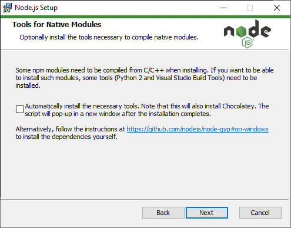
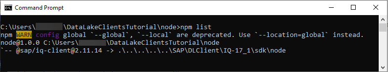
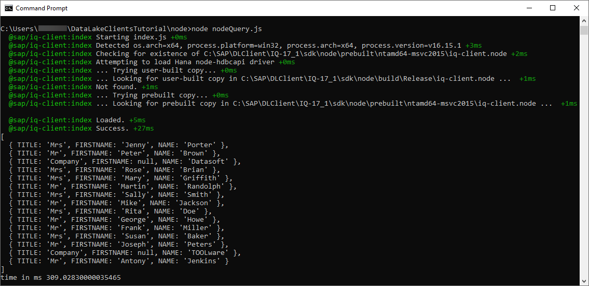
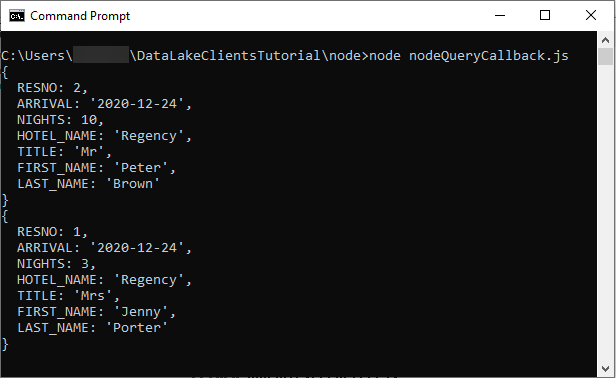
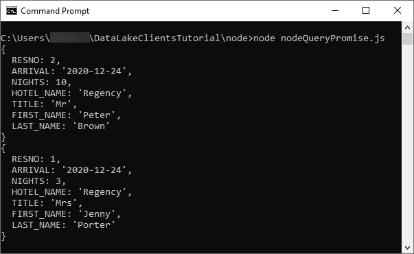

# Connect to Data Lake Relational Engine Using the Node.js Driver
<!-- description --> Create and debug a Node.js application that connects to data lake Relational Engine.

## Prerequisites
 - You have completed the first tutorial in this group.

## You will learn
  - How to install Node.js and the data lake Relational Engine Node.js driver
  - How to create and debug a Node.js application
  - How to use both the synchronous and asynchronous driver interfaces

## Intro
Node.js provides a JavaScript runtime outside of the browser and uses an asynchronous event driven programming model.  For more details, see [Introduction to Node.js](https://nodejs.dev/en/learn/).  

---

### Install Node.js


Ensure you have Node.js installed and check its version. Enter the following command:

```Shell
node -v  
```  

If Node.js is installed, the currently installed version is returned, such as v18.16.0.

If Node.js is not installed, download the long-term support (LTS) version of Node.js from [Download Node.js](https://nodejs.org/en/download/).

>If an install for Node.js is not provided on Linux, you may choose to install it via a package manager. For more details, please navigate to [this link](https://nodejs.org/en/download/package-manager/).

---

>During the installation, there is no need to install Chocolatey.  
>
>

---


### Install the data lake Relational Engine client for Node.js


In addition to the Node.js driver covered in this tutorial which is `@sap\iq-client`, there is also the [SQL Anywhere](https://github.com/sqlanywhere/node-sqlanywhere) driver.  The @sap\iq-client driver supports newer Node.js versions and includes a promise library.

1. Add the dependencies to the driver.

    ```Shell (Microsoft Windows)
    cd %IQDIR17%\sdk\node
    npm install
    ```

    ```Shell (Linux)
    cd $IQDIR17/sdk/node
    npm install
    ```

2. Create a folder named `node` and enter the newly created directory.

    ```Shell (Microsoft Windows)
    mkdir %HOMEPATH%\DataLakeClientsTutorial\node
    cd %HOMEPATH%\DataLakeClientsTutorial\node
    ```

    ```Shell (Linux)
    mkdir $HOME/DataLakeClientsTutorial/node
    cd $HOME/DataLakeClientsTutorial/node
    ```

3. Initialize the project and install the `@sap\iq-client` driver from the install folder.

    ```Shell (Microsoft Windows)
    npm init -y
    npm install %IQDIR17%\sdk\node
    ```

    ```Shell (Linux)
    npm init -y
    npm install $IQDIR17/sdk/node
    ```

4. The following command lists the Node.js modules that are now installed locally into the `DataLakeClientsTutorial\node` folder.

    ```Shell
    npm list
    ```

    


### Create a synchronous Node.js application that queries SAP data lake Relational Engine


1. Open a file named `nodeQuery.js` in an editor.

    ```Shell (Microsoft Windows)
    notepad nodeQuery.js
    ```

    Substitute `pico` below for your preferred text editor.  

    ```Shell (Linux or Mac)
    pico nodeQuery.js
    ```

2. Add the code below to `nodeQuery.js`.

    ```JavaScript
    'use strict';
    const { PerformanceObserver, performance } = require('perf_hooks');
    var t0;
    var util = require('util');
    var datalakeIQ = require('@sap/iq-client');

    var connOptions = {
        host: 'XXXXXXXX-XXXX-XXXX-XXXX-XXXXXXXXXXX.iq.hdl.trial-XXXX.hanacloud.ondemand.com:443',
        uID: 'USER1',
        pwd: 'Password1',
        enc: 'TLS{tls_type=rsa;direct=yes}',
    };

    //Synchronous example querying a table
    var connection = datalakeIQ.createConnection();
    connection.connect(connOptions);

    var sql = 'select TITLE, FIRSTNAME, NAME from HOTEL.CUSTOMER;';
    t0 = performance.now();
    var result = connection.exec(sql);
    console.log(util.inspect(result, { colors: false }));
    var t1 = performance.now();
    console.log("time in ms " +  (t1 - t0));
    connection.disconnect();
    ```  

4. Run the app.  

    ```Shell
    node nodeQuery.js
    ```

    

    Note the above app makes use of some of the data lake Relational Engine client Node.js driver methods, such as [connect](https://help.sap.com/docs/SAP_HANA_DATA_LAKE/a894a54d84f21015b142ffe773888f8c/13e47ad9748d4d4d9536a0518b8ecd67.html), [exec](https://help.sap.com/docs/SAP_HANA_DATA_LAKE/a894a54d84f21015b142ffe773888f8c/1bec2bc5259d4e9da54a2e1908f246ee.html) and [disconnect](https://help.sap.com/docs/SAP_HANA_DATA_LAKE/a894a54d84f21015b142ffe773888f8c/8dee077765f5476b8b481ab1de864f14.html).

    Two examples showing the drivers methods being used asynchronously are shown in the next two steps.

    >To enable debug logging of the SAP IQ Node.js client, enter the following command and then rerun the app.

    >```Shell (Microsoft Windows)
    >set DEBUG=*
    >node nodeQuery.js
    >```  

    Linux or Mac
    
    >```Shell
    >export DEBUG=*
    >node nodeQuery.js
    >```  

    >   

    > The value of the environment variable DEBUG can be seen and removed with the commands below.  

    >```Shell (Microsoft Windows)
    >set DEBUG
    >set DEBUG=
    >set DEBUG
    >```   

    Linux or Mac

    >```Shell (Linux)
    >printenv | grep DEBUG
    >unset DEBUG
    >printenv | grep DEBUG
    >```  

### Create an asynchronous app that uses callbacks

Asynchronous programming enables non-blocking code execution which is demonstrated in the below example.

1. Open a file named `nodeQueryCallback.js` in an editor.

    ```Shell (Microsoft Windows)
    notepad nodeQueryCallback.js
    ```

    Substitute `pico` below for your preferred text editor.  

    ```Shell (Linux)
    pico nodeQueryCallback.js
    ```

2. Add the code below to `nodeQueryCallback.js`.

    ```JavaScript
    'use strict';
    const { PerformanceObserver, performance } = require('perf_hooks');
    var t0;
    var util = require('util');
    var datalakeIQ = require('@sap/iq-client');

    var connOptions = {
        host: 'XXXXXXXX-XXXX-XXXX-XXXX-XXXXXXXXXXX.iq.hdl.trial-XXXX.hanacloud.ondemand.com:443',
        uID: 'USER1',
        pwd: 'Password1',
        enc: 'TLS{tls_type=rsa;direct=yes}',
    };

    //Asynchronous example calling a stored procedure with callbacks
    var connection = datalakeIQ.createConnection();

    connection.connect(connOptions, function(err) {
        if (err) {
            return console.error(err);
        }
        //Prepared statement example
        const statement = connection.prepare('CALL HOTEL.SHOW_RESERVATIONS(?,?)');
        const parameters = [11, '2020-12-24'];
        var results = statement.execQuery(parameters, function(err, results) {
            if (err) {
                return console.error(err);
            }
            processResults(results, function(err) {
                if (err) {
                    return console.error(err);
                }
                results.close(function(err) {
                    if (err) {
                        return console.error(err);
                    }
                    statement.drop(function(err) {
                        if (err) {
                            return console.error(err);
                        }
                        return connection.disconnect(function(err) {
                            if (err) {
                                return console.error(err);
                            }
                        });
                    });
                });
            });
        });
    });

    function processResults(results, cb) {
        results.next(function (err, hasValues) {
            if (err) {
                return console.error(err);
            }
            if (hasValues) {
                results.getValues(function (err, row) {
                    console.log(util.inspect(row, { colors: false }));
                    processResults(results, cb);
                });
            }
            else {
                return cb();
            }
        });
    }
    ```  

3. Run the app.  

    ```Shell
    node nodeQueryCallback.js
    ```
    

    Notice that asynchronous method calls use callback functions.


### Create an asynchronous app that uses promises

The Node.js driver for the data lake Relational Engine client provides support for promises.  The following example demonstrates this.  Notice that there is less nesting of code then the previous example.

1. Open a file named `nodeQueryPromise.js` in an editor.

    ```Shell (Microsoft Windows)
    notepad nodeQueryPromise.js
    ```

    Substitute `pico` below for your preferred text editor.  

    ```Shell (Linux or Mac)
    pico nodeQueryPromise.js
    ```

2. Add the code below to `nodeQueryPromise.js`.  

    ```JavaScript
    'use strict';
    const { PerformanceObserver, performance } = require('perf_hooks');
    var t0;
    var util = require('util');
    var datalakeIQ = require('@sap/iq-client');
    var PromiseModule = require('@sap/iq-client/extension/Promise.js');

    var connOptions = {
        //Specify the connection parameters
        host: 'XXXXXXXX-XXXX-XXXX-XXXX-XXXXXXXXXXX.iq.hdl.trial-XXXX.hanacloud.ondemand.com:443',
        uid: 'USER1',
        pwd: 'Password1',
        enc: 'TLS{tls_type=rsa;direct=yes}',
    };

    //Asynchronous example calling a stored procedure that uses the promise module
    var connection = datalakeIQ.createConnection();
    var statement;

    PromiseModule.connect(connection, connOptions)
        .then(() => {
             //Prepared statement example
             return PromiseModule.prepare(connection, 'CALL HOTEL.SHOW_RESERVATIONS(?,?)');
        })
        .then((stmt) => {
            statement = stmt;
            const parameters = [11, '2020-12-24'];
            return PromiseModule.executeQuery(stmt, parameters);
        })
        .then((results) => {
            return processResults(results);
        })
        .then((results) => {
            return PromiseModule.close(results);
        })
        .then(() => {
            PromiseModule.drop(statement);
        })
        .then(() => {
            PromiseModule.disconnect(connection);
        })
        .catch(err =>  {
            console.error(err);
        });

    function processResults(results) {
        return new Promise((resolve, reject) => {
        var done = false;
            PromiseModule.next(results)
                .then((hasValues) => {
                    if (hasValues) {
                        return PromiseModule.getValues(results);
                    }
                    else {
                        done = true;
                    }
                })
                .then((values) => {
                    if (done) {
                        resolve(results);
                    }
                    else {
                        console.log(util.inspect(values, { colors: false }));
                        return processResults(results);
                    }
                })
                .catch (err => {
                    reject(err);
                });
        })
    }    
    ```  

4. Run the app.  

    ```Shell
    node nodeQueryPromise.js
    ```
    

    The above code makes use of the [promise module](https://help.sap.com/docs/SAP_HANA_DATA_LAKE/a894a54d84f21015b142ffe773888f8c/5410af3b00414269988301ba78d38e43.html).  Additional details on promises can be found at [Using Promises](https://developer.mozilla.org/en-US/docs/Web/JavaScript/Guide/Using_promises).


### Debug the application


Visual Studio Code can run and debug a Node.js application.  It is a lightweight but powerful source code editor which is available on Windows, macOS and Linux.

1. If required, download [Visual Studio Code.](https://code.visualstudio.com/Download).

2. In Visual Studio Code, choose **File | Add Folder to Workspace** and then add the `DataLakeClientsTutorial` folder.

    

3. Open the file `nodeQuery.js`.

4. Place a breakpoint inside the `connection.exec` callback.  Select **Run | Start Debugging | Node.js**.  

    Notice that the debug view becomes active.  

    Notice that the program stops running at the breakpoint that was set. Observe the variable values in the leftmost pane.  Step through code.

    

### Knowledge check

Congratulations! You have created and debugged a Node.js application that connects to and queries an SAP data lake Relational Engine database.


---
