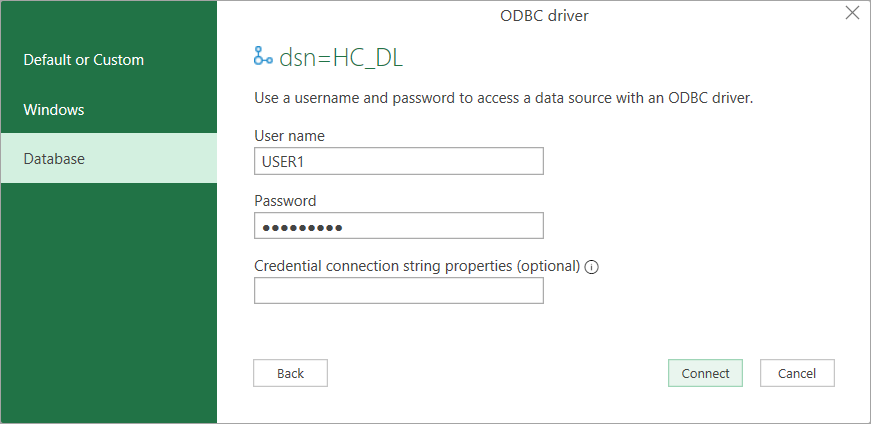
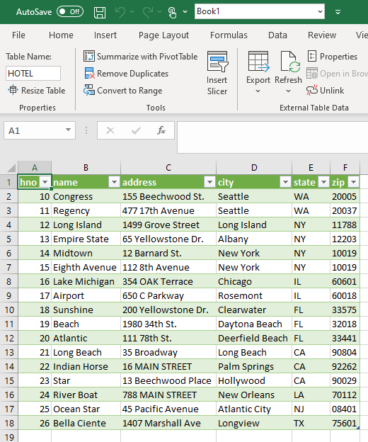
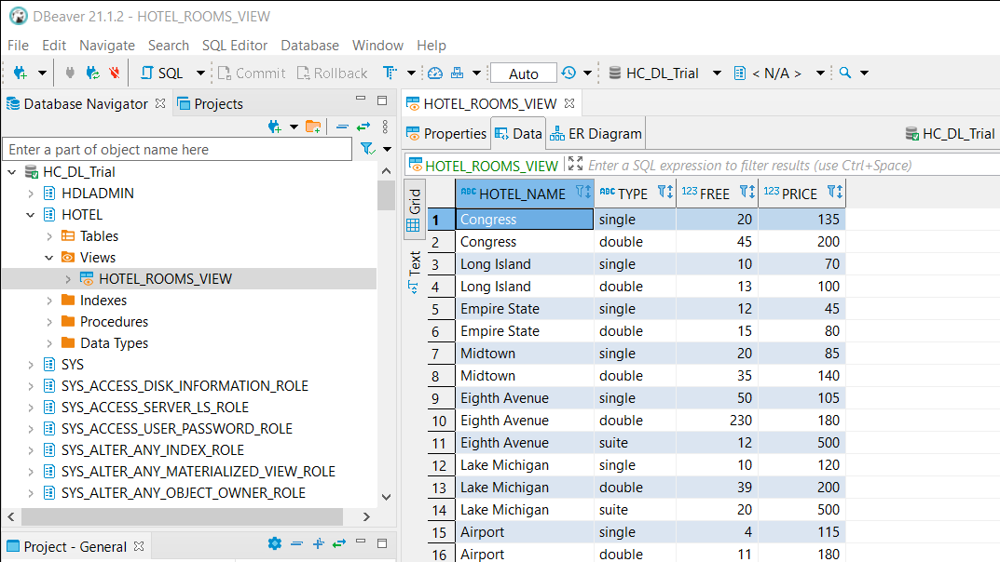

## Prerequisites
 - You have completed the first tutorial in this group.

## Details
### You will learn
  - How to create an ODBC data source for a data lake IQ connection
  - How to use the configured data source with other applications

[Open Database Connectivity](https://en.wikipedia.org/wiki/Open_Database_Connectivity) (ODBC) provides an [API](https://docs.microsoft.com/en-us/sql/odbc/reference/syntax/odbc-api-reference?view=sql-server-ver15) for accessing databases. Database vendors provide ODBC drivers for their database products. An application written to the ODBC standard can be ported to other databases that also provide an ODBC interface.  


---

[ACCORDION-BEGIN [Step 1: ](Configure data source)]

The ODBC Data Source Administrator lists the installed ODBC drivers and the configured data sources.  

1. Open the administrator by entering **ODBC** after clicking on the Microsoft Windows start icon.  

    

2. Click the **Drivers** tab and view the installed drivers.  

    

    The Sybase IQ driver is visible.  

3. Click the **User DSN** tab to view the data sources.  

4. Click **Add** to create a new data source to connect to a data lake IQ database.  

      

5. Select **Sybase IQ** and click **Finish**.

    

6. Configure an example data source for data lake IQ.

      

    Connect using the HDLADMIN user. The host and port values can be copied from the BTP Cockpit or HANA Cloud Central via the copy SQL endpoint option.

      

    On the advanced tab, enter the following parameters.

    ```Parameters
    ENC=TLS(tls_type=rsa;direct=yes)
    ```

      

7. Verify the connection by clicking on **Test Connection**.

      

    > Note that if the test fails, try pressing the OK button to save the data source, then try the test again.

8. Press OK to save the data source.  

    > Note that the saved values can also be viewed using the Microsoft Windows registry editor under the key `Computer\HKEY_CURRENT_USER\Software\ODBC\ODBC.INI`.


For additional details see [Connection Properties](https://help.sap.com/viewer/a895964984f210158925ce02750eb580/latest/en-US/a6d47d6e84f210158d4980b069eff5dd.html).


[DONE]
[ACCORDION-END]

[ACCORDION-BEGIN [Step 2: ](Use data lake data source from Microsoft Excel)]

An application that supports ODBC can now make use of the created data source. One example on Windows is Microsoft Excel.  

The following steps demonstrate how to use Microsoft Excel to query data in data lake IQ using the ODBC connector.  

1. Open Microsoft Excel.

2. In the **Data** tab, select **Get Data | From Other Sources | From ODBC**.

      

3. Select the previously created data source that contains the connection information to data lake IQ.

      

4. Select **Database**, enter the credentials, and press **Connect**.

    

5. Select a schema and table, then press **Load**.

      

6. The selected data is now imported into a Microsoft Excel spreadsheet.

    

    > Note, if an error occurs that mentions, you do not have permission to select from SYSINDEX, a newer version of the data lake IQ driver may be needed.

[DONE]
[ACCORDION-END]

[ACCORDION-BEGIN [Step 3: ](Browse data lake IQ using DBeaver with ODBC)]

`DBeaver` is a free and open source database tool and can be used with the data lake IQ ODBC driver.

The following steps demonstrate how to configure `DBeaver` to connect to data lake IQ.

1. [Download](https://dbeaver.io/download/) and install the community edition of `DBeaver`.

    

2. Create a new database connection.

    

    Search for ODBC and select the ODBC option.

    

    `DBeaver` is written in Java, so it uses a JDBC to ODBC bridge.  

3.  Specify the name of the ODBC data source previously configured for **Database/Schema**.

    

4. After finishing the wizard, the catalog of the database can be viewed, and SQL statements can be executed.

    

    `DBeaver` can also be used to create an entity relationship (ER) diagram, perform a comparison of two selected objects, execute import and export operations, view spatial data on a map, and perform data analysis with its grouping and `calc` panels.


For further information on programming an application to use the ODBC client driver, see [ODBC CLI](https://help.sap.com/viewer/a894a54d84f21015b142ffe773888f8c/latest/en-US/a3171c5084f210159caebadd9e149481.html).


[VALIDATE_1]
[ACCORDION-END]

---
