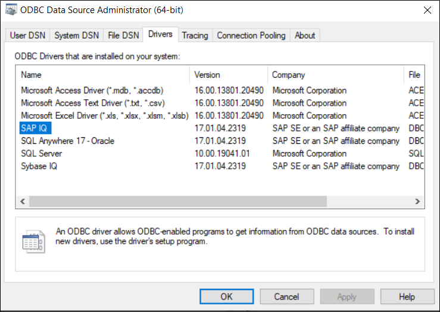
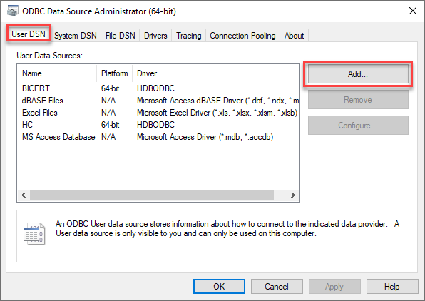
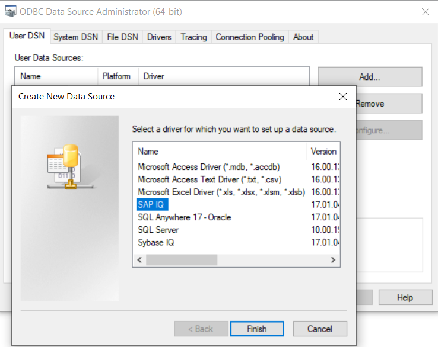
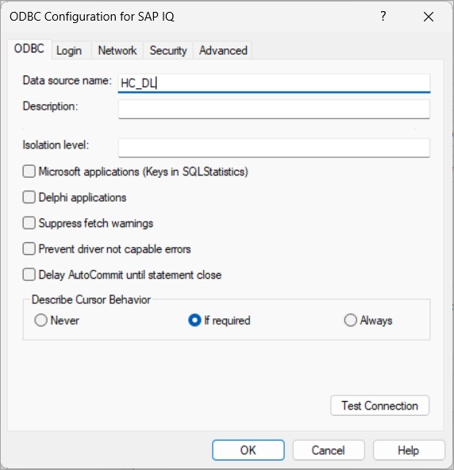
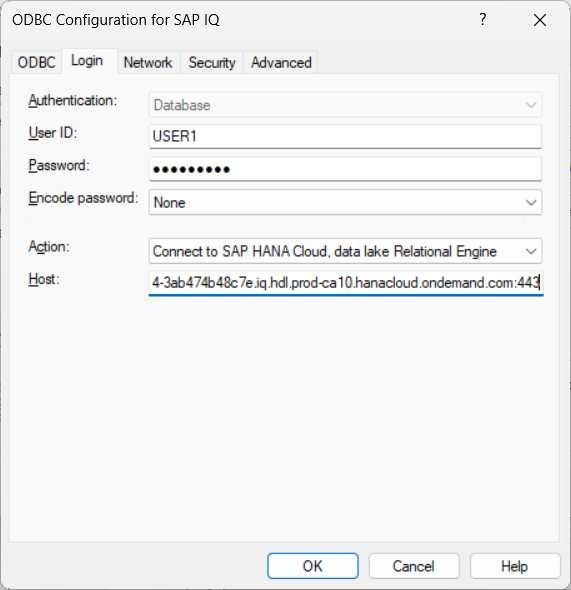
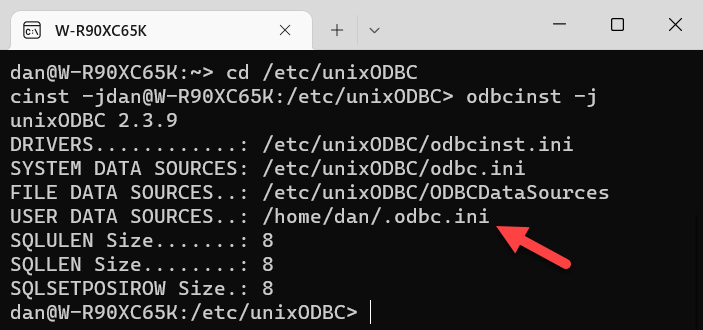
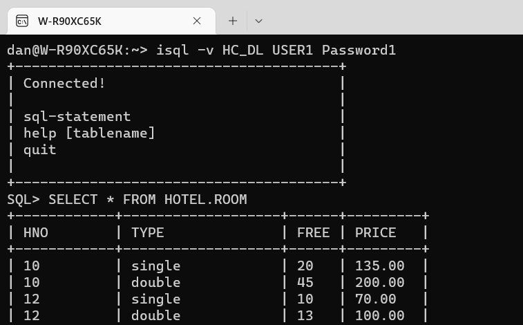
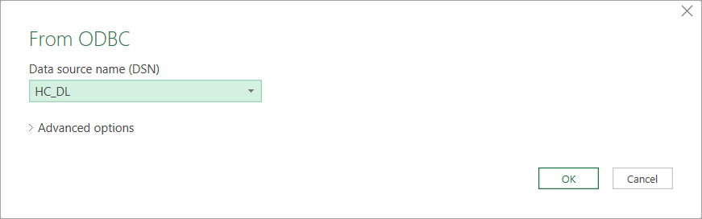
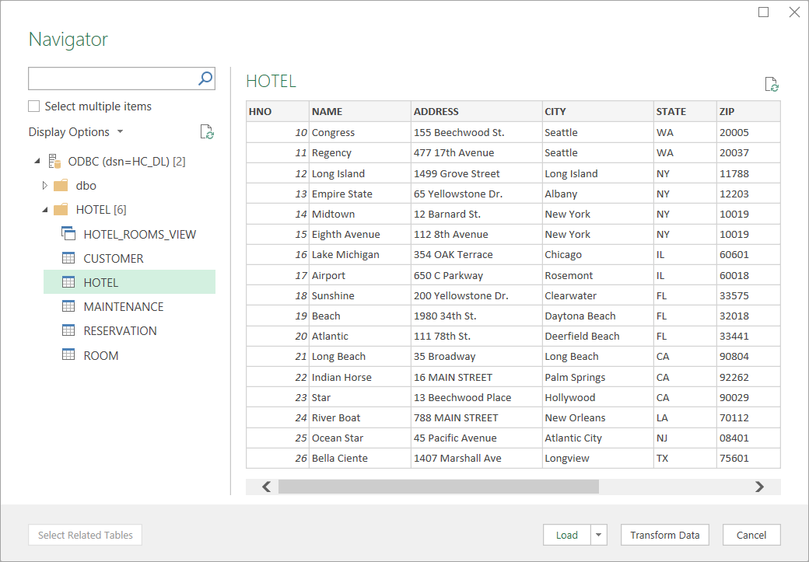
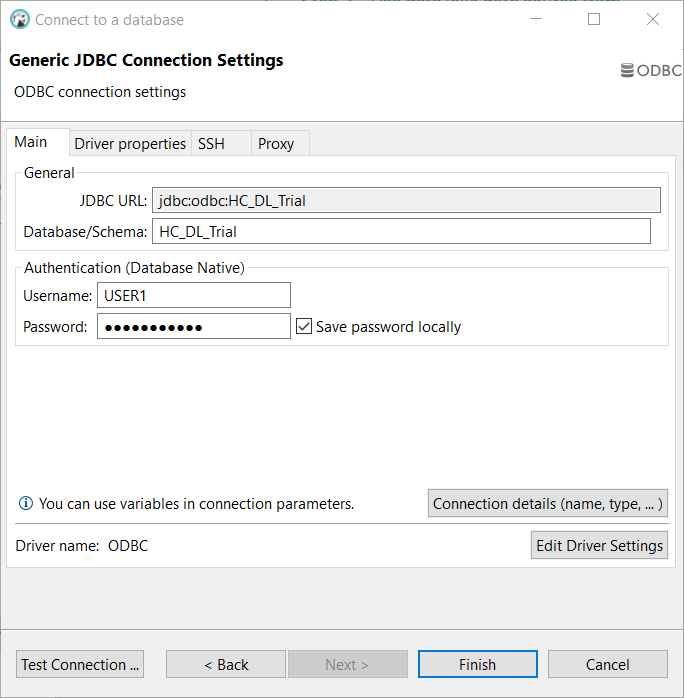

# Connect to Data Lake Relational Engine Using the ODBC Driver
<!-- description --> Configure a data source to connect to the previously created data lake Relational Engine and then use the data source in unixODBC, Microsoft Excel and DBeaver.

## Prerequisites
 - You have completed the first tutorial in this group.

## You will learn
  - How to create an ODBC data source for a data lake Relational Engine connection
  - How to use the configured data source with other applications

## Intro
[Open Database Connectivity](https://en.wikipedia.org/wiki/Open_Database_Connectivity) (ODBC) provides an [API](https://docs.microsoft.com/en-us/sql/odbc/reference/syntax/odbc-api-reference?view=sql-server-ver15) for accessing databases. Database vendors provide ODBC drivers for their database products. An application written to the ODBC standard can be ported to other databases that also provide an ODBC interface.  

---

### Configure a data source using Microsoft Windows ODBC Data Source Administrator


The ODBC Data Source Administrator can be used to view the installed ODBC drivers and to create data sources for an installed driver.  

1. Open the administrator by entering **ODBC** after clicking on the Microsoft Windows start icon.  

    

2. Click the **Drivers** tab and view the installed drivers. The SAP IQ driver is visible. 

    

    
3. Click the **User DSN** tab to view the data sources.  

4. Click **Add** to create a new data source to connect to a data lake Relational Engine database.  

      

5. Select **SAP IQ** and click **Finish**.

    

6. Configure the data source.

      

    Connect using USER1. The host and port values can be copied from the SAP BTP Cockpit or SAP HANA Cloud Central via the copy SQL endpoint option.

      

7. Verify the connection by clicking on **Test Connection**.

      

    >If the test fails, try pressing the OK button to save the data source, then try the test again.

8. Press OK to save the data source.  

    >The saved values can also be viewed using the Microsoft Windows registry editor under the key `Computer\HKEY_CURRENT_USER\Software\ODBC\ODBC.INI`.

For additional details see [Connection Properties](https://help.sap.com/viewer/a895964984f210158925ce02750eb580/latest/en-US/a6d47d6e84f210158d4980b069eff5dd.html).


### Configure a data source on Linux with unixODBC


1. On SUSE Linux, unixODBC can be installed using Zypper or YaST.

    ```Shell (Linux)
    sudo zypper install unixODBC
    ```

    

    For more details on how to accomplish this, please follow the second step of [this tutorial](hxe-ua-dbfundamentals-odbc).

2. The following commands can be used to confirm that unixODBC is installed and determine the location of the .odbc.ini file (if it exists).
    ```Shell (Linux)
    cd /etc/unixODBC
    odbcinst -j
    ```
    

3. Navigate to the directory where the `.odbc.ini` file is located, similar to the one highlighted in the screenshot above. Open or create the `.odbc.ini` file with the following command:

    ```Shell (Linux)
    pico .odbc.ini
    ```

4. Configure the values of `driver` and `host` so that they conform with your setup.

    ```.odbc.ini
    [HC_DL]
    driver=/home/XXXXX/sap/dlclient/IQ-17_1/lib64/libdbodbc17.so
    encryption=TLS(trusted_certificates=*;direct=yes)
    host=XXXXXXXX-XXXX-XXXX-XXXX-XXXXXXXXXXXX.iq.hdl.XXXX-XXXX.hanacloud.ondemand.com:443
    integrated=NO
    log=/tmp/hdlclientlog.txt
    ```

5. DBISQL or `isql`, which is a tool provided by unixODBC can be used to try out the data source. Ensure you are using the correct username and password.

    ```Shell (Linux)
    dbisql -hdl -c "uid=USER1;pwd=Password1;dsn=HC_DL" -nogui
    isql -v HC_DL USER1 Password1
    ```

    **DBISQL**
    
    Some example queries you can run are listed below.

    ```SQL
    SELECT * FROM HOTEL.CUSTOMER;
    ```

    ```SQL
    SELECT * FROM HOTEL.ROOM;
    ```

    

    **isql**

    

    > To exit dbisql or isql type `quit`.

    > ---

    > The column width when displaying results in isql can be set using the -m parameter.  
    > ```Shell (Linux)
    isql -v HC_DL USER1 Password1 -m6
    >```


### Use a data lake data source from Microsoft Excel


An application that supports ODBC can now make use of the created data source. One example on Windows is Microsoft Excel.  

The following steps demonstrate how to use Microsoft Excel to query data in data lake Relational Engine using the ODBC connector.  

1. Open Microsoft Excel.

2.  In the **Data** tab, select **Get Data | From Other Sources | From ODBC**.

    

3.  Select the previously created data source that contains the connection information to data lake Relational Engine.

      

4. Select **Database**, enter the credentials, and press **Connect**.

    

5. Select a schema and table, then press **Load**.

      

6. The selected data is now imported into a Microsoft Excel spreadsheet.

    

    > Note, if an error occurs that mentions, you do not have permission to select from SYSINDEX, a newer version of the driver may be needed.


### Browse data lake Relational Engine using DBeaver with ODBC


`DBeaver` is a free and open source database tool and can be used with the data lake Relational Engine ODBC driver.  

>ODBC connectivity option is available in `DBeaver` on Microsoft Windows only.   The version used in this tutorial is 22.1.5.  In a later version, an error "Invalid string or buffer length" was seen during connection.

The following steps demonstrate how to configure `DBeaver` to connect to data lake Relational Engine.

1. [Download](https://dbeaver.io/download/) and install the community edition of `DBeaver`.

    

2. Create a new database connection.

    

    Search for ODBC and select the ODBC option.

    

    `DBeaver` is written in Java, so it uses a JDBC to ODBC bridge.  

3.  Specify the name of the ODBC data source previously configured for **Database/Schema**.

    

4. After finishing the wizard, the catalog of the database can be viewed, and SQL statements can be executed.

    

    `DBeaver` can also be used to create an entity relationship (ER) diagram, perform a comparison of two selected objects, execute import and export operations, view spatial data on a map, and perform data analysis with its grouping and `calc` panels.

### Knowledge check

For further information on programming an application to use the ODBC client driver, see [ODBC CLI](https://help.sap.com/viewer/a894a54d84f21015b142ffe773888f8c/latest/en-US/a3171c5084f210159caebadd9e149481.html).

Congratulations! You have configured an ODBC data source to contain connection information for a SAP HANA Cloud, data lake Relational Engine database and used that data source from Microsoft Excel and `DBeaver`.


---
