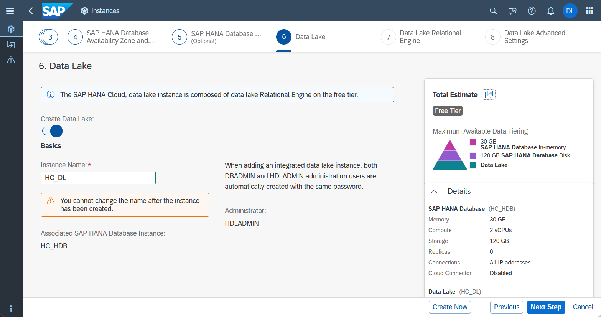
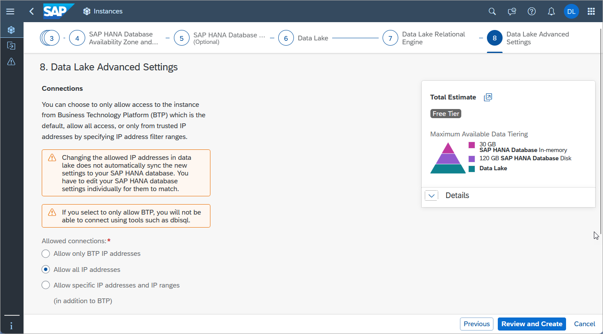
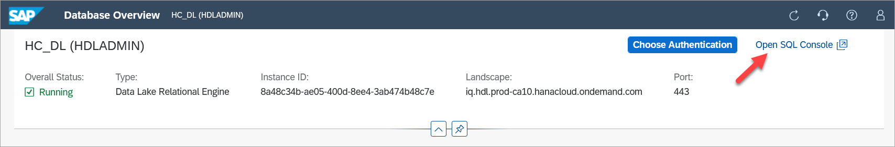
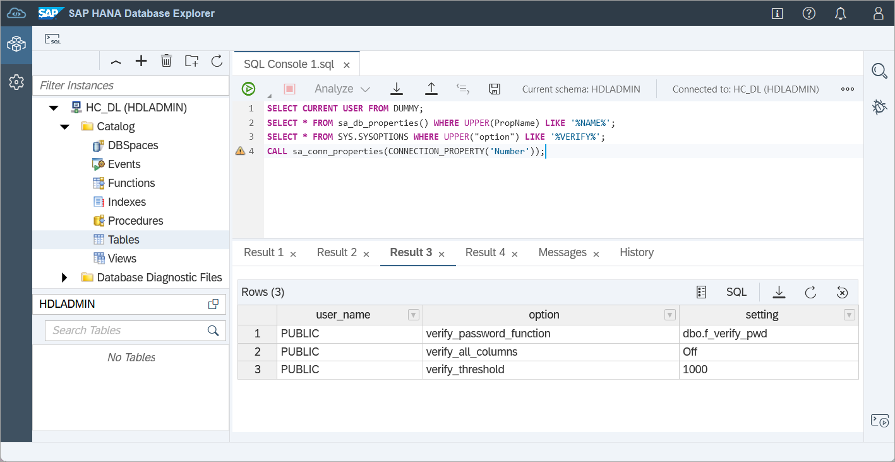
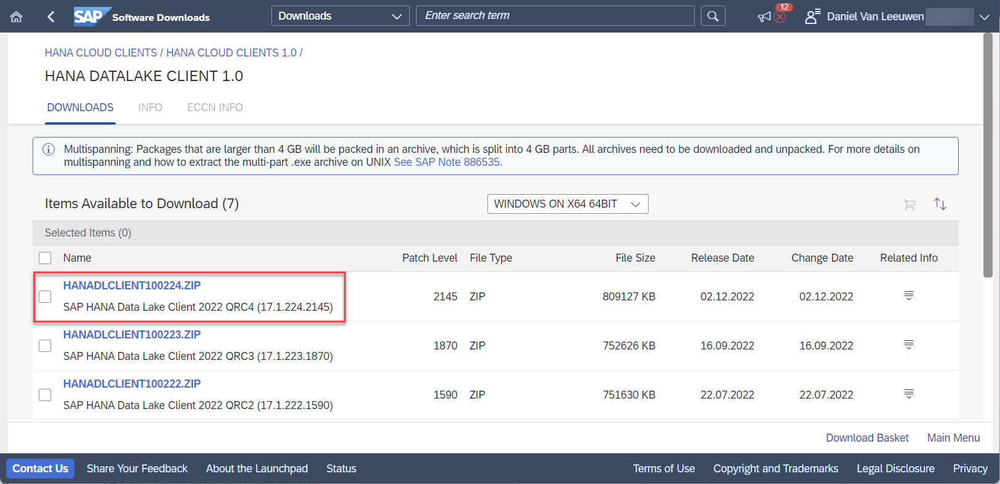
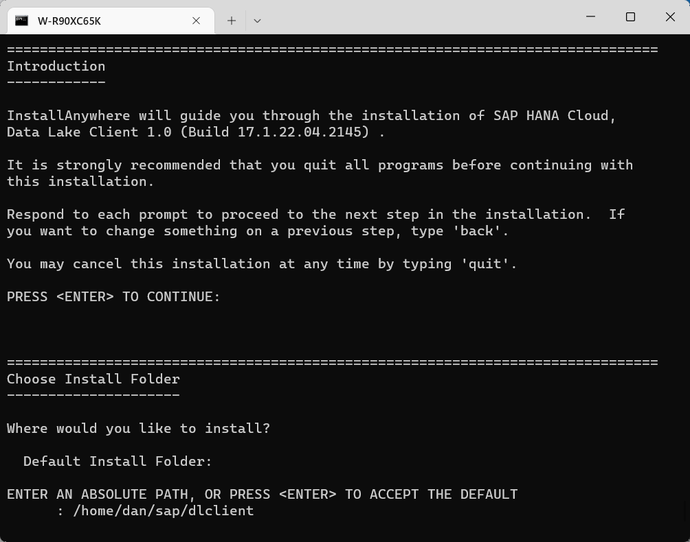
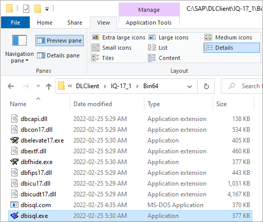
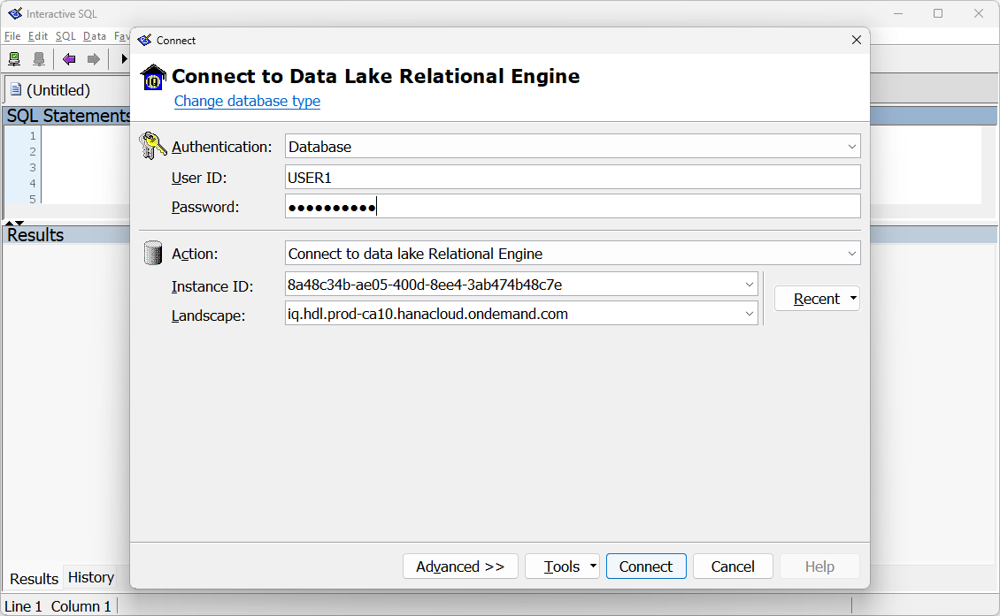
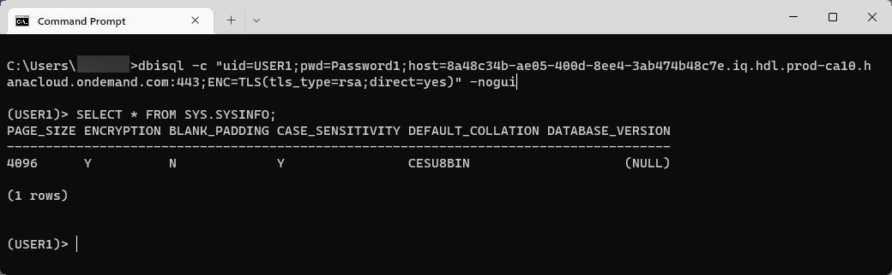
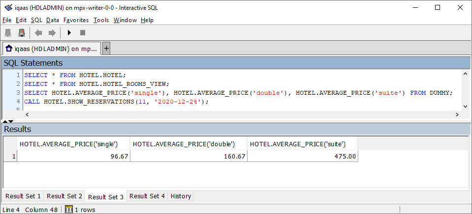

## Prerequisites
 - A Microsoft Windows or Linux computer.

## Details
### You will learn
  - Information about SAP HANA Cloud, data lake Relational Engine
  - How to install the data lake client
  - How to create sample tables, views, and procedures
  - How to connect using SAP HANA cockpit, SAP HANA database explorer and the Interactive SQL Client

This tutorial group will provide guidance on setting up a trial instance of [SAP HANA Cloud, data lake](https://help.sap.com/viewer/product/SAP_HANA_DATA_LAKE/latest/en-US) so that it can then be connected to and queried using a few of the data lake client interfaces as described in [SAP HANA Cloud, Data Lake Developer Guide for Data Lake Relational Engine](https://help.sap.com/viewer/a894a54d84f21015b142ffe773888f8c/latest/en-US).  

> Access help from the SAP community or provide feedback on this tutorial by navigating to the "Feedback" link located on the top right of this page.

---

[ACCORDION-BEGIN [Step 1: ](Overview of SAP HANA Cloud, data lake)]

SAP HANA Cloud is composed of multiple components.

  * SAP HANA is an in-memory, multi-model, column-based, relational database. For further details see [Introduction to SAP HANA Cloud](https://help.sap.com/viewer/db19c7071e5f4101837e23f06e576495/latest/en-US/7a27607b08ba46d5b253365e703b1c1a.html) and the tutorial mission [Use Clients to Query an SAP HANA Database](mission.hana-cloud-clients).

  * [SAP HANA Cloud, data lake](https://help.sap.com/viewer/a896c6a184f21015b5bcf4c7a967df07/latest/en-US/228c19ac890046ecbe8e38a540c0cb6b.html) is composed of two components:  data lake Relational Engine and data lake Files.    

    [Data Lake Relational Engine](https://help.sap.com/viewer/a896c6a184f21015b5bcf4c7a967df07/latest/en-US/bedae75d1482413d92af8ca7f43d430b.html) is a disk-based, column-oriented relational database for storing and analyzing high volumes of infrequently updated data. It was previously named Data lake IQ and descends from [SAP IQ](https://help.sap.com/viewer/product/SAP_IQ/latest/en-US), which was previously named Sybase IQ. Because of its heritage, there are commonalities with other Sybase products. Many client interface drivers are shared with [SAP SQL Anywhere](https://help.sap.com/viewer/product/SAP_SQL_Anywhere/17.0/en-US) and SAP Adaptive Server Enterprise. Details on compatibility can be found at [Compatibility with Other SAP Database Products](https://help.sap.com/viewer/19b3964099384f178ad08f2d348232a9/latest/en-US/a5d9e97d84f210158efdd7e4092eac36.html).

    [Data Lake Files](https://help.sap.com/viewer/a896c6a184f21015b5bcf4c7a967df07/latest/en-US/502642d7fd0e4a5b9b3a61c8ac4d5ce5.html) can be used to store and access unstructured data such as trace files and structured files like CSV, Parquet, or ORC. Structured files can use [SQL on Files](https://help.sap.com/viewer/a896c6a184f21015b5bcf4c7a967df07/latest/en-US/b8ed121f351a4a56a451b9ba6f10f88e.html), which enables SQL queries to be performed on them.  

    >Note, that the data lake Files component is currently not available in trial accounts.


[DONE]
[ACCORDION-END]


[ACCORDION-BEGIN [Step 2: ](Create a data lake instance and connect to it)]

>To complete the tutorials in this group, a SAP HANA Cloud, data lake instance is needed, which is created within the SAP Business Technology Platform (BTP). There are two different free options available, which are the SAP BTP free-tier and SAP BTP trial.  For instructions on registering, see [Start Using SAP HANA Cloud Free Tier Model or Trial in SAP BTP Cockpit](hana-cloud-mission-trial-1).

The following steps provide instructions on how to create a data lake instance in the SAP Business Technology Platform (BTP) trial.  Additional content on this topic is available at [Quick Start Tutorial for Data Lake](https://help.sap.com/viewer/a89a80f984f21015b2b2c84d2498d36d/latest/en-US/b62bc948ad684e3a94b9e14b68318f2a.html).

There are multiple ways to create a data lake:  

* Create a data lake in the SAP HANA Database creation wizard.  

    

* Add a data lake to an already created SAP HANA database that does not have a data lake already associated with it.  

    

    When a data lake is created in either of the previous two methods, it is configured to be maximally compatible with an SAP HANA database.  

* Create a data lake that is independent (standalone) of a SAP HANA database if it is added via the **Create | Data Lake** menu item.  

    

    An independent data lake can be configured with additional options such a collation value of UTF8BIN and blank padding set to ON to be more compatible with an on-premise SAP IQ.


1. Using the SAP BTP Cockpit within the [SAP BTP Trial](https://account.hanatrial.ondemand.com/trial/#/home/trial), navigate to subaccount, the space, and then to the **SAP HANA Cloud** section as shown below.

    

2. Click on **Manage SAP HANA Cloud** to open SAP HANA Cloud Central, which is used to create and configure SAP HANA Cloud instances.

    

3. If a data lake is not already present, add one using one of the three methods previously described.

    Take note when creating the data lake that the administration user is HDLADMIN.

    >The HDLADMIN user has a [login policy](https://help.sap.com/viewer/745778e524f74bb4af87460cca5e62c4/latest/en-US/a43f448484f21015924f9951e9b77e32.html) that enforces the [update of the password](https://help.sap.com/viewer/745778e524f74bb4af87460cca5e62c4/latest/en-US/a458edd784f2101580a1eca5042678f8.html) after 180 days.  

    >---

    >It is also possible to create and manage data lake instances using the [Cloud Foundry CLI](https://help.sap.com/viewer/9ae9104a46f74a6583ce5182e7fb20cb/hanacloud/en-US/921f3e46247947779d69b8c85c9b9985.html).

4. As this is a trial account, set allowed connections to **Allow all IP addresses** so that client applications can connect from any IP address.  

    

5. After a while, press the **Refresh** button or enable auto-refresh and the status will change from CREATING to RUNNING.

    

    >Note that the SAP HANA Cloud, HANA data lake trial or free tier instances are shut down overnight and will need to be restarted before working with them the next day.

[DONE]
[ACCORDION-END]

[ACCORDION-BEGIN [Step 3: ](Open the SAP HANA cockpit)]

1. Once the data lake has been created, use the actions menu (three dots) to open SAP HANA cockpit.  

    

    Input your credentials. These are stored by the SAP HANA cockpit and are shared with the SAP HANA database explorer in cockpit connections once entered into the following dialog.

    

    After you enter your credentials, should you wish to use a different set of credentials, the current credentials can be cleared using **Clear Credentials** and new credentials may be entered.

    

2. The SAP HANA Cockpit can also be used to examine and configure users.

[DONE]
[ACCORDION-END]

[ACCORDION-BEGIN [Step 4: ](Create tables, views, functions, and procedures with SAP HANA database explorer)]
In this step, a sample HOTEL dataset will be created comprising tables, a view, and a stored procedure.

1. In SAP HANA Cloud Central, use the actions menu to open the SAP HANA database explorer.

    

2. Execute a few queries.

    ```SQL
    SELECT CURRENT USER FROM DUMMY;
    SELECT * FROM sa_db_properties() WHERE UPPER(PropName) LIKE '%NAME%';
    SELECT * FROM SYS.SYSOPTIONS WHERE UPPER("option") LIKE '%VERIFY%';
    CALL sa_conn_properties(CONNECTION_PROPERTY('Number'));
    ```

    

    Additional details can be found at [System Functions](https://help.sap.com/viewer/19b3964099384f178ad08f2d348232a9/latest/en-US/a52da06984f21015bf279b4c69002e5e.html) and [System Procedures for Data Lake Relational Engine](https://help.sap.com/viewer/19b3964099384f178ad08f2d348232a9/latest/en-US/a598917d84f210159e1fff1a89345de9.html).


3. In the SAP HANA database explorer, execute the following SQL statements.

    ```SQL
    -- DROP VIEW HOTEL.HOTEL_ROOMS_VIEW;
    -- DROP PROCEDURE HOTEL.SHOW_RESERVATIONS;
    -- DROP TABLE HOTEL.MAINTENANCE;
    -- DROP TABLE HOTEL.RESERVATION;
    -- DROP TABLE HOTEL.CUSTOMER;
    -- DROP TABLE HOTEL.ROOM;
    -- DROP TABLE HOTEL.HOTEL;
    -- DROP USER USER1;
    -- DROP ROLE HOTEL;

    --Create a role that will own the sample hotel dataset  
    CREATE ROLE HOTEL;

    --Create the objects in the HOTEL schema
    CREATE TABLE HOTEL.HOTEL(
        HNO INTEGER PRIMARY KEY,
        NAME VARCHAR(50) NOT NULL,
        ADDRESS VARCHAR(40) NOT NULL,
        CITY VARCHAR(30) NOT NULL,
        STATE VARCHAR(2) NOT NULL,
        ZIP VARCHAR(6)
    );

    CREATE TABLE HOTEL.ROOM(
        HNO INTEGER,
        TYPE VARCHAR(6),
        FREE NUMERIC(3),
        PRICE NUMERIC(6, 2),
        PRIMARY KEY (HNO, TYPE),
        FOREIGN KEY (HNO) REFERENCES HOTEL.HOTEL
    );

    CREATE TABLE HOTEL.CUSTOMER(
        CNO INTEGER PRIMARY KEY,
        TITLE VARCHAR(7),
        FIRSTNAME VARCHAR(20),
        NAME VARCHAR(40) NOT NULL,
        ADDRESS VARCHAR(40) NOT NULL,
        ZIP VARCHAR(6)
    );

    CREATE TABLE HOTEL.RESERVATION(
        RESNO INTEGER NOT NULL default autoincrement,
        RNO INTEGER NOT NULL,
        CNO INTEGER,
        HNO INTEGER,
        TYPE VARCHAR(6),
        ARRIVAL DATE NOT NULL,
        DEPARTURE DATE NOT NULL,
        PRIMARY KEY (
            "RESNO", "ARRIVAL"
        ),
        FOREIGN KEY(CNO) REFERENCES HOTEL.CUSTOMER,
        FOREIGN KEY(HNO) REFERENCES HOTEL.HOTEL
    );

    CREATE TABLE HOTEL.MAINTENANCE(
        MNO INTEGER PRIMARY KEY,
        HNO INTEGER,
        DESCRIPTION VARCHAR(100),
        DATE_PERFORMED DATE,
        PERFORMED_BY VARCHAR(40),
        FOREIGN KEY(HNO) REFERENCES HOTEL.HOTEL
    );

    CREATE OR REPLACE VIEW HOTEL.HOTEL_ROOMS_VIEW AS
      SELECT
        H.NAME AS HOTEL_NAME,
        R.TYPE,
        R.FREE,
        R.PRICE
      FROM HOTEL.ROOM R
        LEFT JOIN HOTEL.HOTEL H ON R.HNO = H.HNO
            ORDER BY H.NAME;

    CREATE OR REPLACE FUNCTION HOTEL.AVERAGE_PRICE(room_type CHAR(6))
    RETURNS NUMERIC(6, 2)
    BEGIN
        DECLARE avg_price NUMERIC(6,2);  
        SELECT CAST(ROUND(sum(PRICE)/COUNT(*), 2) as NUMERIC(6,2)) INTO avg_price FROM HOTEL.ROOM WHERE TYPE = room_type GROUP BY TYPE;
        RETURN avg_price;
    END;

    CREATE OR REPLACE PROCEDURE HOTEL.SHOW_RESERVATIONS(
        IN IN_HNO INTEGER, IN IN_ARRIVAL DATE)
        RESULT (RESNO INTEGER, ARRIVAL DATE, NIGHTS INTEGER, HOTEL_NAME VARCHAR(50),TITLE VARCHAR(7), FIRST_NAME VARCHAR(20), LAST_NAME VARCHAR(40))
        BEGIN
            MESSAGE IN_HNO TO CLIENT;
            MESSAGE IN_ARRIVAL TO CLIENT;
          SELECT
            R.RESNO,
            R.ARRIVAL,
            DATEDIFF(DAY, R.ARRIVAL, R.DEPARTURE) as "Nights",
            H.NAME,
            CUS.TITLE,
            CUS.FIRSTNAME AS "FIRST NAME",
            CUS.NAME AS "LAST NAME"
          FROM
            HOTEL.RESERVATION AS R
            LEFT OUTER JOIN
            HOTEL.HOTEL AS H
            ON H.HNO = R.HNO
            LEFT OUTER JOIN
            HOTEL.CUSTOMER AS CUS
            ON CUS.CNO = R.CNO
            WHERE R.ARRIVAL = IN_ARRIVAL AND
            H.HNO = IN_HNO
            ORDER BY CUS.NAME ASC;
        END;

    --Specify the privileges for the role HOTEL
    GRANT SELECT, UPDATE, INSERT, DELETE ON HOTEL.HOTEL, HOTEL.ROOM, HOTEL.CUSTOMER, HOTEL.RESERVATION, HOTEL.MAINTENANCE, HOTEL.HOTEL_ROOMS_VIEW TO HOTEL;
    GRANT EXECUTE ON HOTEL.SHOW_RESERVATIONS TO HOTEL;

    --Required permission for users that are connecting in the database explorer
    GRANT SET ANY CUSTOMER PUBLIC OPTION to HOTEL;

    --Create a user
    GRANT CONNECT TO USER1 IDENTIFIED BY 'Password1';

    -- Add USER1 to the HOTEL role
    GRANT ROLE HOTEL TO USER1;
    ```

    Select **Tables**, and set the schema filter to be **HOTEL** to limit the returned tables to be those that were just created in the HOTEL schema.

    

    Additional details on the SQL used above can be found at [CREATE TABLE Statement for Data Lake Relational Engine](https://help.sap.com/viewer/19b3964099384f178ad08f2d348232a9/latest/en-US/a619764084f21015b8039a8346dc622c.html), [CREATE VIEW Statement for Data Lake Relational Engine](https://help.sap.com/viewer/19b3964099384f178ad08f2d348232a9/latest/en-US/a61a051684f210158cced2d83231bd8a.html), and [CREATE PROCEDURE Statement for Data Lake Relational Engine](https://help.sap.com/viewer/19b3964099384f178ad08f2d348232a9/latest/en-US/a6185b2184f21015b2419a5444b55609.html).

    > Note that the identifiers such as the column names in a table are [case-insensitive](https://help.sap.com/viewer/19b3964099384f178ad08f2d348232a9/latest/en-US/a5e4ad6a84f21015ab0c854d2822461a.html).

For additional details on the SAP HANA database explorer, see the tutorial [Get Started with the SAP HANA Database Explorer](group.hana-cloud-get-started), which showcases many of its features.

[DONE]
[ACCORDION-END]

[ACCORDION-BEGIN [Step 5: ](Install the data lake client)]
1.  In [SAP Software Downloads](https://support.sap.com/en/my-support/software-downloads.html), under **Support Packages & Patches**, select **H | HANA CLOUD CLIENTS | HANA CLOUD CLIENTS 1.0 | HANA DATALAKE CLIENT 1.0**. Select the platform (Windows or Linux) and download the latest version of the archive.

    

    > Note access to the client install is currently limited to S-user IDs

2.  Extract the archive and start the installer.

    * On Microsoft Windows extract the zip and run setup.exe.

        

        >If the install fails on Microsoft Windows, you may need to run the install as an administrator.  See also the following SAP Notes:
        >
        >* [3001764 - SAP IQ 16.x - `InvocationTargetException` Installer Error (WINDOWS)](https://launchpad.support.sap.com/#/notes/3001764)
        >
        >* [3001813 - SAP IQ 16.1 SP 04 Rev08 - 'Error Loading sylapij.dll' Installer Error (WINDOWS)](https://launchpad.support.sap.com/#/notes/3001813)


    * On Linux, extract the archive.

        ```Shell (Linux)
        tar -zxvf HANADLCLIENT100*.TGZ
        ```

        Run `setup.bin` which will start either the GUI installer or text based installer.

        ```Shell (Linux)
        cd ebf*
        ./setup.bin
        ```

3.  Specify an install folder and install all the features.

    

    Console mode installer

    

    Follow the remaining prompts to finish the installation.

4.  The installation location can be referenced after the installation is complete by the following environment variable.

    ```Shell (Windows)
    ECHO %IQDIR17%
    ```

    >Note that this tutorial uses notepad and `pico` as default text editors, but any text editor will do.
    >`pico` can be installed on SUSE Linux with

    >```Shell (Linux SUSE)
    sudo zypper install pico
    >```

    On Linux, this environment variable and others are set in a file named `IQ.sh`.  Configure it to be run each time the Bash shell is started by referencing it in `.bash_profile` or possibly `.bashrc`.

    Open the `.bash_profile`.

    ```Shell (Linux)
    pico ~/.bash_profile
    ```

    Add the following line to point to the location where the SAP data lake client is installed.

    ```Shell (Linux) .bash_profile
    source /path-to-data-lake-install/IQ.sh
    ```

    Test the change by running:

    ```Shell (Linux)
    source ~/.bash_profile
    ```

    The following command should display the install location of the data lake client.

    ```Shell (Linux)
    echo $IQDIR17
    ```

    > In the case that the Data Lake Client needs to be uninstalled, run the `uninstall.exe` file located in the directory `/path-to-data-lake-install/sybuninstall/IQClientSuite/`.

[DONE]
[ACCORDION-END]

[ACCORDION-BEGIN [Step 6: ](Connect with the Interactive SQL Client (DBISQL))]

The data lake client install includes [Interactive SQL Client (DBISQL)](https://help.sap.com/viewer/a895964984f210158925ce02750eb580/latest/en-US/4abee782576b4bff9f1a1274d662f74b.html), which can be used to connect and query a data lake Relational Engine. The following steps will provide instructions on how to connect to the data lake Relational Engine using DBISQL and then populate the previously created tables with sample data.

1. Start the GUI version of DBISQL from the Microsoft Windows Start menu, by browsing to it under SAP > Interactive SQL and double clicking on it, or by entering `dbisql` in a terminal.

    

    > If `dbisql` fails to run on Microsoft Windows, uninstall the client and reinstall it with administrator privilege (i.e. Run the installer in Step 5 as an administrator).

2. Specify the connection type.

    

    > Note that the Connect window may appear enlarged on the screen. This can be adjusted by lowering the Scale and layout value in the device display settings.

3. Provide the connection details. See below on how to obtain the instance ID and landscape values.

    

    >The BTP cockpit or SAP HANA Cloud Central can be used to get the instance ID and landscape values, as they are part of the SQL endpoint.

    >
    >
    > A failure to connect could be caused by the allowed connections list, which is editable in SAP HANA Cloud Central.  

    

    >DBISQL can also be started without a GUI.
    >
    >```Shell (Windows)
    dbisql -c "uid=USER1;pwd=Password1;host=XXXXXXXX-XXXX-XXXX-XXXX-XXXXXXXXXXXX.iq.hdl.trial-XXXX.hanacloud.ondemand.com:443;ENC=TLS(tls_type=rsa;direct=yes)" -nogui
    >```
    >
    > Note that in a Bash shell, strings in double quotes versus single quotes are treated [differently](https://stackoverflow.com/questions/6697753/difference-between-single-and-double-quotes-in-bash).
    >
    >```Shell (Linux)
    dbisql -c 'uid=USER1;pwd=Password1;host=XXXXXXXX-XXXX-XXXX-XXXX-XXXXXXXXXXXX.iq.hdl.trial-XXXX.hanacloud.ondemand.com:443;ENC=TLS(tls_type=rsa;direct=yes)' -nogui
    >```

    >

[DONE]
[ACCORDION-END]

[ACCORDION-BEGIN [Step 7: ](Insert data with Interactive SQL Client (DBISQL))]

1. Execute the following insert statements to provide some sample data.

    >If you do not wish to use the GUI mode, paste the insert statements into a file first and then run `dbisql -c "uid..." sql.sql`.

    ```SQL
    INSERT INTO HOTEL.HOTEL VALUES(10, 'Congress', '155 Beechwood St.', 'Seattle', 'WA', '20005');
    INSERT INTO HOTEL.HOTEL VALUES(11, 'Regency', '477 17th Avenue', 'Seattle', 'WA', '20037');
    INSERT INTO HOTEL.HOTEL VALUES(12, 'Long Island', '1499 Grove Street', 'Long Island', 'NY', '11788');
    INSERT INTO HOTEL.HOTEL VALUES(13, 'Empire State', '65 Yellowstone Dr.', 'Albany', 'NY', '12203');
    INSERT INTO HOTEL.HOTEL VALUES(14, 'Midtown', '12 Barnard St.', 'New York', 'NY', '10019');
    INSERT INTO HOTEL.HOTEL VALUES(15, 'Eighth Avenue', '112 8th Avenue', 'New York', 'NY', '10019');
    INSERT INTO HOTEL.HOTEL VALUES(16, 'Lake Michigan', '354 OAK Terrace', 'Chicago', 'IL', '60601');
    INSERT INTO HOTEL.HOTEL VALUES(17, 'Airport', '650 C Parkway', 'Rosemont', 'IL', '60018');
    INSERT INTO HOTEL.HOTEL VALUES(18, 'Sunshine', '200 Yellowstone Dr.', 'Clearwater', 'FL', '33575');
    INSERT INTO HOTEL.HOTEL VALUES(19, 'Beach', '1980 34th St.', 'Daytona Beach', 'FL', '32018');
    INSERT INTO HOTEL.HOTEL VALUES(20, 'Atlantic', '111 78th St.', 'Deerfield Beach', 'FL', '33441');
    INSERT INTO HOTEL.HOTEL VALUES(21, 'Long Beach', '35 Broadway', 'Long Beach', 'CA', '90804');
    INSERT INTO HOTEL.HOTEL VALUES(22, 'Indian Horse', '16 MAIN STREET', 'Palm Springs', 'CA', '92262');
    INSERT INTO HOTEL.HOTEL VALUES(23, 'Star', '13 Beechwood Place', 'Hollywood', 'CA', '90029');
    INSERT INTO HOTEL.HOTEL VALUES(24, 'River Boat', '788 MAIN STREET', 'New Orleans', 'LA', '70112');
    INSERT INTO HOTEL.HOTEL VALUES(25, 'Ocean Star', '45 Pacific Avenue', 'Atlantic City', 'NJ', '08401');
    INSERT INTO HOTEL.HOTEL VALUES(26, 'Bella Ciente', '1407 Marshall Ave', 'Longview', 'TX', '75601');

    INSERT INTO HOTEL.ROOM VALUES(10, 'single', 20, 135.00);
    INSERT INTO HOTEL.ROOM VALUES(10, 'double', 45, 200.00);
    INSERT INTO HOTEL.ROOM VALUES(12, 'single', 10, 70.00);
    INSERT INTO HOTEL.ROOM VALUES(12, 'double', 13, 100.00);
    INSERT INTO HOTEL.ROOM VALUES(13, 'single', 12, 45.00);
    INSERT INTO HOTEL.ROOM VALUES(13, 'double', 15, 80.00);
    INSERT INTO HOTEL.ROOM VALUES(14, 'single', 20, 85.00);
    INSERT INTO HOTEL.ROOM VALUES(14, 'double', 35, 140.00);
    INSERT INTO HOTEL.ROOM VALUES(15, 'single', 50, 105.00);
    INSERT INTO HOTEL.ROOM VALUES(15, 'double', 230, 180.00);
    INSERT INTO HOTEL.ROOM VALUES(15, 'suite', 12, 500.00);
    INSERT INTO HOTEL.ROOM VALUES(16, 'single', 10, 120.00);
    INSERT INTO HOTEL.ROOM VALUES(16, 'double', 39, 200.00);
    INSERT INTO HOTEL.ROOM VALUES(16, 'suite', 20, 500.00);
    INSERT INTO HOTEL.ROOM VALUES(17, 'single', 4, 115.00);
    INSERT INTO HOTEL.ROOM VALUES(17, 'double', 11, 180.00);
    INSERT INTO HOTEL.ROOM VALUES(18, 'single', 15, 90.00);
    INSERT INTO HOTEL.ROOM VALUES(18, 'double', 19, 150.00);
    INSERT INTO HOTEL.ROOM VALUES(18, 'suite', 5, 400.00);
    INSERT INTO HOTEL.ROOM VALUES(19, 'single', 45, 90.00);
    INSERT INTO HOTEL.ROOM VALUES(19, 'double', 145, 150.00);
    INSERT INTO HOTEL.ROOM VALUES(19, 'suite', 60, 300.00);
    INSERT INTO HOTEL.ROOM VALUES(20, 'single', 11, 60.00);
    INSERT INTO HOTEL.ROOM VALUES(20, 'double', 24, 100.00);
    INSERT INTO HOTEL.ROOM VALUES(21, 'single', 2, 70.00);
    INSERT INTO HOTEL.ROOM VALUES(21, 'double', 10, 130.00);
    INSERT INTO HOTEL.ROOM VALUES(22, 'single', 34, 80.00);
    INSERT INTO HOTEL.ROOM VALUES(22, 'double', 78, 140.00);
    INSERT INTO HOTEL.ROOM VALUES(22, 'suite', 55, 350.00);
    INSERT INTO HOTEL.ROOM VALUES(23, 'single', 89, 160.00);
    INSERT INTO HOTEL.ROOM VALUES(23, 'double', 300, 270.00);
    INSERT INTO HOTEL.ROOM VALUES(23, 'suite', 100, 700.00);
    INSERT INTO HOTEL.ROOM VALUES(24, 'single', 10, 125.00);
    INSERT INTO HOTEL.ROOM VALUES(24, 'double', 9, 200.00);
    INSERT INTO HOTEL.ROOM VALUES(24, 'suite', 78, 600.00);
    INSERT INTO HOTEL.ROOM VALUES(25, 'single', 44, 100.00);
    INSERT INTO HOTEL.ROOM VALUES(25, 'double', 115, 190.00);
    INSERT INTO HOTEL.ROOM VALUES(25, 'suite', 6, 450.00);

    INSERT INTO HOTEL.CUSTOMER VALUES(1000, 'Mrs', 'Jenny', 'Porter', '1340 N. Ash Street, #3', '10580');
    INSERT INTO HOTEL.CUSTOMER VALUES(1001, 'Mr', 'Peter', 'Brown', '1001 34th St., APT.3', '48226');
    INSERT INTO HOTEL.CUSTOMER VALUES(1002, 'Company', NULL, 'Datasoft', '486 Maple St.', '90018');
    INSERT INTO HOTEL.CUSTOMER VALUES(1003, 'Mrs', 'Rose', 'Brian', '500 Yellowstone Drive, #2', '75243');
    INSERT INTO HOTEL.CUSTOMER VALUES(1004, 'Mrs', 'Mary', 'Griffith', '3401 Elder Lane', '20005');
    INSERT INTO HOTEL.CUSTOMER VALUES(1005, 'Mr', 'Martin', 'Randolph', '340 MAIN STREET, #7', '60615');
    INSERT INTO HOTEL.CUSTOMER VALUES(1006, 'Mrs', 'Sally', 'Smith', '250 Curtis Street', '75243');
    INSERT INTO HOTEL.CUSTOMER VALUES(1007, 'Mr', 'Mike', 'Jackson', '133 BROADWAY APT. 1', '45211');
    INSERT INTO HOTEL.CUSTOMER VALUES(1008, 'Mrs', 'Rita', 'Doe', '2000 Humboldt St., #6', '97213');
    INSERT INTO HOTEL.CUSTOMER VALUES(1009, 'Mr', 'George', 'Howe', '111 B Parkway, #23', '75243');
    INSERT INTO HOTEL.CUSTOMER VALUES(1010, 'Mr', 'Frank', 'Miller', '27 5th St., 76', '95054');
    INSERT INTO HOTEL.CUSTOMER VALUES(1011, 'Mrs', 'Susan', 'Baker', '200 MAIN STREET, #94', '90018');
    INSERT INTO HOTEL.CUSTOMER VALUES(1012, 'Mr', 'Joseph', 'Peters', '700 S. Ash St., APT.12', '92714');
    INSERT INTO HOTEL.CUSTOMER VALUES(1013, 'Company', NULL, 'TOOLware', '410 Mariposa St., #10', '20019');
    INSERT INTO HOTEL.CUSTOMER VALUES(1014, 'Mr', 'Antony', 'Jenkins', '55 A Parkway, #15', '20903');

    INSERT INTO HOTEL.RESERVATION(rno, cno, hno, type, arrival, departure) VALUES(100, 1000, 11, 'single', '2020-12-24', '2020-12-27');
    INSERT INTO HOTEL.RESERVATION(rno, cno, hno, type, arrival, departure) VALUES(110, 1001, 11, 'double', '2020-12-24', '2021-01-03');
    INSERT INTO HOTEL.RESERVATION(rno, cno, hno, type, arrival, departure) VALUES(120, 1002, 15, 'suite', '2020-11-14', '2020-11-18');
    INSERT INTO HOTEL.RESERVATION(rno, cno, hno, type, arrival, departure) VALUES(130, 1009, 21, 'single', '2019-02-01', '2019-02-03');
    INSERT INTO HOTEL.RESERVATION(rno, cno, hno, type, arrival, departure) VALUES(150, 1006, 17, 'double', '2019-03-14', '2019-03-24');
    INSERT INTO HOTEL.RESERVATION(rno, cno, hno, type, arrival, departure) VALUES(140, 1013, 20, 'double', '2020-04-12', '2020-04-30');
    INSERT INTO HOTEL.RESERVATION(rno, cno, hno, type, arrival, departure) VALUES(160, 1011, 17, 'single', '2020-04-12', '2020-04-15');
    INSERT INTO HOTEL.RESERVATION(rno, cno, hno, type, arrival, departure) VALUES(170, 1014, 25, 'suite', '2020-09-01', '2020-09-03');
    INSERT INTO HOTEL.RESERVATION(rno, cno, hno, type, arrival, departure) VALUES(180, 1001, 22, 'double', '2020-12-23', '2021-01-08');
    INSERT INTO HOTEL.RESERVATION(rno, cno, hno, type, arrival, departure) VALUES(190, 1013, 24, 'double', '2020-11-14', '2020-11-17');

    INSERT INTO HOTEL.MAINTENANCE VALUES(10, 24, 'Replace pool liner and pump', '2019-03-21', 'Discount Pool Supplies');
    INSERT INTO HOTEL.MAINTENANCE VALUES(11, 25, 'Renovate the bar area.  Replace TV and speakers', '2020-11-29', 'TV and Audio Superstore');
    INSERT INTO HOTEL.MAINTENANCE VALUES(12, 26, 'Roof repair due to storm', null, null);
    ```

    Additional details on the SQL used above can be found at [INSERT Statement for Data Lake Relational Engine](https://help.sap.com/viewer/19b3964099384f178ad08f2d348232a9/latest/en-US/a61fdeff84f21015aa66b9add387d7f9.html). Moreover, the [LOAD TABLE Statement for Data Lake Relational Engine](https://help.sap.com/viewer/19b3964099384f178ad08f2d348232a9/latest/en-US/7ca3f60902f3473296cb309533d89210.html) can be used for efficient mass insertion into a database table from a file with ASCII or binary data.

    > Note that autocommit is set to on in the SQL Console of the database explorer, while in DBISQL it is set to off.  A series of insert statements will run quicker in the SQL Console if they are surrounded with begin and end or if autocommit is set to off.
    >
    ```SQL
    begin
    INSERT INTO HOTEL.ROOM VALUES(11, 'single', 13, 135.00);
    INSERT INTO HOTEL.ROOM VALUES(11, 'double', 15, 175.00);
    end;
    ```
    >
    ```SQL
    set temporary option auto_commit= 'off';
    INSERT INTO HOTEL.ROOM VALUES(11, 'triple', 7, 235.00);
    INSERT INTO HOTEL.ROOM VALUES(11, 'quad', 5, 275.00);
    set temporary option auto_commit= 'on';
    ```

2. Notice that pressing ctrl-space brings up auto complete (GUI mode only).

    

    Query a table, a view, invoke a function, and call a stored procedure.

    ```SQL
    SELECT * FROM HOTEL.HOTEL;
    SELECT * FROM HOTEL.HOTEL_ROOMS_VIEW;
    SELECT HOTEL.AVERAGE_PRICE('single'), HOTEL.AVERAGE_PRICE('double'), HOTEL.AVERAGE_PRICE('suite') FROM DUMMY;
    CALL HOTEL.SHOW_RESERVATIONS(11, '2020-12-24');

    ```

    

3. DBISQL can also execute SQL from the command line or from a provided file. A few examples are shown below.

    ```Shell
    dbisql -c "uid=USER1;pwd=Password1;host=XXXXXXXX-XXXX-XXXX-XXXX-XXXXXXXXXXXX.iq.hdl.trial-XXXX.hanacloud.ondemand.com:443;ENC=TLS(tls_type=rsa;direct=yes)" "select * from HOTEL.CUSTOMER;"
    dbisql -c "uid=USER1;pwd=Password1;host=XXXXXXXX-XXXX-XXXX-XXXX-XXXXXXXXXXXX.iq.hdl.trial-XXXX.hanacloud.ondemand.com:443;ENC=TLS(tls_type=rsa;direct=yes)" sql.sql
    ```

    

    See [Connection Parameters](https://help.sap.com/viewer/a895964984f210158925ce02750eb580/latest/en-US/a6d47d6e84f210158d4980b069eff5dd.html) for additional documentation on the parameters used to connect.

Congratulations! You have created and connected to a data lake Relational Engine. In the following tutorials, the client interfaces will be used to connect from ODBC, JDBC and Node.js.

[VALIDATE_1]
[ACCORDION-END]


---
