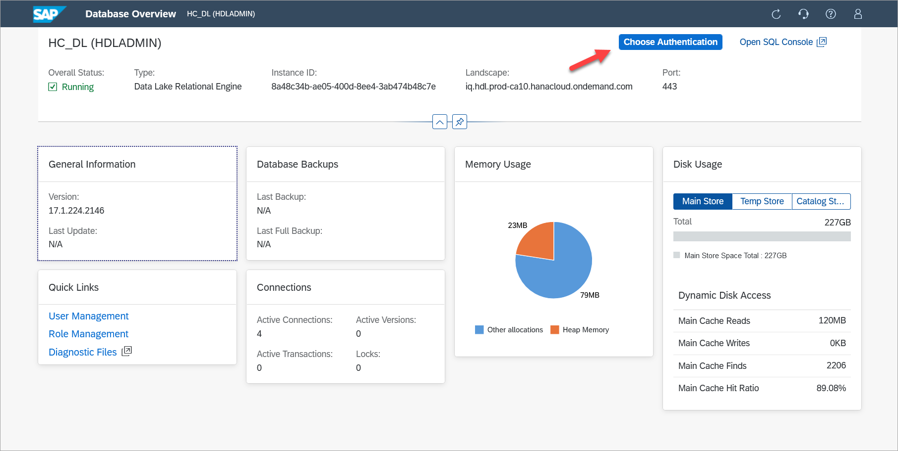
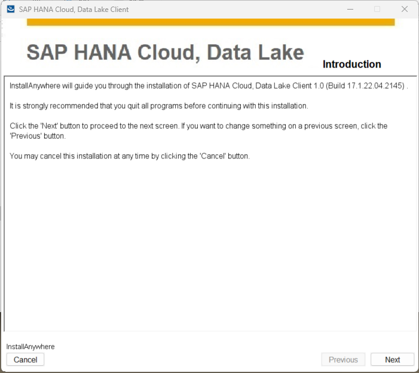
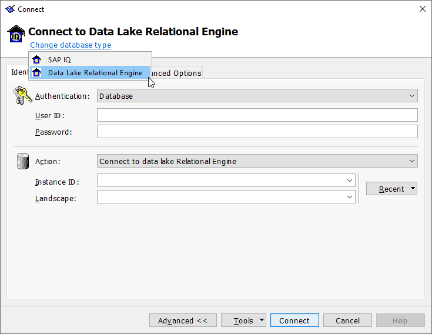

## Prerequisites
 - A Microsoft Windows computer.

## Details
### You will learn
  - Information about SAP HANA Cloud data lake IQ
  - How to install the data lake IQ client
  - How to create sample tables, views, and procedures
  - How to connect using SAP HANA cockpit, database explorer and the Interactive SQL Client

This tutorial group will provide guidance on setting up a trial instance of [SAP HANA Cloud, data lake IQ](https://help.sap.com/viewer/product/SAP_HANA_DATA_LAKE/latest/en-US) so that it can then be connected to and queried using a few of the data lake IQ client interfaces as described in [SAP HANA Cloud, Data Lake Developer Guide for Data Lake IQ](https://help.sap.com/viewer/a894a54d84f21015b142ffe773888f8c/latest/en-US).  

---

[ACCORDION-BEGIN [Step 1: ](Overview of Data Lake IQ)]

SAP HANA Cloud includes multiple technologies, including data lake IQ.

  * SAP HANA is an in-memory, multi-model, column-based, relational database. For further details see [Introduction to SAP HANA Cloud](https://help.sap.com/viewer/db19c7071e5f4101837e23f06e576495/latest/en-US/7a27607b08ba46d5b253365e703b1c1a.html) and [Use Clients to Query an SAP HANA Database](mission.hana-cloud-clients).

  * [SAP HANA Cloud, data lake](https://help.sap.com/viewer/a896c6a184f21015b5bcf4c7a967df07/latest/en-US/228c19ac890046ecbe8e38a540c0cb6b.html) is composed of two components:  data lake IQ and data lake Files.    

    [Data Lake IQ](https://help.sap.com/viewer/a896c6a184f21015b5bcf4c7a967df07/latest/en-US/bedae75d1482413d92af8ca7f43d430b.html) is a disk-based, column-oriented relational database for storing and analyzing high volumes of infrequently updated data. Data lake IQ descends from [SAP IQ](https://help.sap.com/viewer/product/SAP_IQ/latest/en-US), which was previously named Sybase IQ. Because of its heritage, there are commonalities with other Sybase products. Many client interface drivers are shared with [SAP SQL Anywhere](https://help.sap.com/viewer/product/SAP_SQL_Anywhere/17.0/en-US) and SAP Adaptive Server Enterprise. Details on compatibility can be found at [Compatibility with Other SAP Database Products](https://help.sap.com/viewer/19b3964099384f178ad08f2d348232a9/latest/en-US/a5d9e97d84f210158efdd7e4092eac36.html).

    [Data Lake Files](https://help.sap.com/viewer/a896c6a184f21015b5bcf4c7a967df07/latest/en-US/502642d7fd0e4a5b9b3a61c8ac4d5ce5.html) can be used to store and access unstructured data such as trace files and structured files like CSV, Parquet, or ORC. Structured files can use [SQL on Files](https://help.sap.com/viewer/a896c6a184f21015b5bcf4c7a967df07/latest/en-US/b8ed121f351a4a56a451b9ba6f10f88e.html), which enables SQL queries to be performed on them.

  * [SAP HANA Cloud, adaptive server enterprise](https://help.sap.com/viewer/46353c3b724f4934bb0671dd82044acd/latest/en-US/7817022aff40482abc431d20275984bb.html) is a disk based, row-oriented, relational database providing extreme online transaction processing.

For additional details see [How & When to Use the New SAP HANA Cloud Database Instances](https://saphanajourney.com/hana-cloud/resources/sap-hana-cloud-new-services-adaptive-server-enterprise-and-data-lake/).

[DONE]
[ACCORDION-END]


[ACCORDION-BEGIN [Step 2: ](Create data lake instance and connect to it)]
The following steps provide instructions on how to create a data lake instance in the SAP Business Technology Platform (BTP) trial and how to connect to it from the database explorer.  

There are multiple ways to create a data lake:  

* Create a data lake in the SAP HANA Database creation wizard.  

    

* Add a data lake to an already created SAP HANA database that does not have a data lake already associated with it.  

    

    When a data lake is created in either of the previous two methods, it is configured to be maximally compatible with an SAP HANA database.  

* Create a data lake that is independent (standalone) of a SAP HANA database if it is added via the **Create | Data Lake** menu item.  

    

    An independent data lake can be configured with additional options such a collation value of UTF8BIN and blank padding set to ON to be more compatible with an on-premise SAP IQ.


1. Using the SAP BTP Cockpit within the [SAP BTP Trial](https://account.hanatrial.ondemand.com/trial/#/home/trial), navigate to subaccount, the space, and then to the **SAP HANA Cloud** section as shown below.

    

2. Click on **Manage SAP HANA Cloud** to open SAP HANA Cloud Central, which is used to create and configure SAP HANA Cloud instances.

    

3. If a data lake is not already present, add one using one of the three methods previously described, for example **Create | SAP HANA Database**.

    

    Enable data lake.

    

    Note that the administration user HDLADMIN is created.  

4. As this is a trial account, set allowed connections to **Allow all IP addresses** so that client applications can connect from any IP address.  

    

5. Once the data lake has been created, use the actions menu (three dots) to open SAP HANA cockpit.  

    

    Input your credentials. These are stored by the SAP HANA cockpit and are shared with the database explorer in cockpit connections once entered into the following dialog.

    

    After you enter your credentials, should you wish to use a different set of credentials, the current credentials can be cleared using **Clear Credentials** and new credentials may be entered.

    

6. In SAP HANA Cloud Central, use the actions menu to open the SAP HANA database explorer.

    

7. Execute a few queries.

    ```SQL
    SELECT CURRENT USER FROM DUMMY;
    SELECT * FROM SYS.SYSINFO;
    SELECT * FROM sa_db_properties() WHERE UPPER(PropName) LIKE '%NAME%';
    SELECT * from SYS.SYSOPTIONS WHERE UPPER("option") LIKE '%VERIFY%';
    ```

    

For additional details on the database explorer, see the tutorial [Get Started with the SAP HANA Database Explorer](group.hana-cloud-get-started), which showcases many of its features.

[DONE]
[ACCORDION-END]

[ACCORDION-BEGIN [Step 3: ](Create sample tables and data)]
The following SQL will create tables, functions, views, and stored procedures that comprise a sample HOTEL dataset.

1. In the database explorer, execute the following SQL statements.

    ```SQL
    -- DROP VIEW HOTEL_ROOMS_VIEW;
    -- DROP PROCEDURE SHOW_RESERVATIONS;
    -- DROP TABLE MAINTENANCE;
    -- DROP TABLE RESERVATION;
    -- DROP TABLE CUSTOMER;
    -- DROP TABLE ROOM;
    -- DROP TABLE HOTEL;


    CREATE TABLE HOTEL(
        hno INTEGER PRIMARY KEY,
        name VARCHAR(50) NOT NULL,
        address VARCHAR(40) NOT NULL,
        city VARCHAR(30) NOT NULL,
        state VARCHAR(2) NOT NULL,
        zip VARCHAR(6)
    );

    CREATE TABLE ROOM(
        hno INTEGER,
        type VARCHAR(6),
        free NUMERIC(3),
        price NUMERIC(6, 2),
        PRIMARY KEY (hno, type),
        FOREIGN KEY (hno) REFERENCES HOTEL
    );

    CREATE TABLE CUSTOMER(
        cno INTEGER PRIMARY KEY,
        title VARCHAR(7),
        firstname VARCHAR(20),
        name VARCHAR(40) NOT NULL,
        address VARCHAR(40) NOT NULL,
        zip VARCHAR(6)
    );

    CREATE TABLE RESERVATION(
    resno INTEGER NOT NULL default autoincrement,
        rno INTEGER NOT NULL,
        cno INTEGER,
        hno INTEGER,
        type VARCHAR(6),
        arrival DATE NOT NULL,
        departure DATE NOT NULL,
        PRIMARY KEY (
            "RESNO", "ARRIVAL"
        ),
        FOREIGN KEY(hno) REFERENCES HOTEL,
        FOREIGN KEY(cno) REFERENCES CUSTOMER
    );

    CREATE TABLE MAINTENANCE(
        mno INTEGER PRIMARY KEY,
        hno INTEGER,
        description VARCHAR(100),
        date_performed DATE,
        performed_by VARCHAR(40),
        FOREIGN KEY(hno) REFERENCES HOTEL
    );

    CREATE OR REPLACE VIEW HOTEL_ROOMS_VIEW AS
      SELECT
        H.NAME AS HOTEL_NAME,
        R.TYPE,
        R.FREE,
        R.PRICE
      FROM ROOM R
        LEFT JOIN HOTEL H ON R.HNO = H.HNO
            ORDER BY H.NAME;

    CREATE OR REPLACE PROCEDURE SHOW_RESERVATIONS(
        IN IN_HNO INTEGER, IN IN_ARRIVAL DATE)
        RESULT (RESNO INTEGER, ARRIVAL DATE, NIGHTS INTEGER, HOTEL_NAME VARCHAR(50),TITLE VARCHAR(7), FIRST_NAME VARCHAR(20), LAST_NAME VARCHAR(40))
        BEGIN
            MESSAGE IN_HNO TO CLIENT;
            MESSAGE IN_ARRIVAL TO CLIENT;
          SELECT
            R.RESNO,
            R.ARRIVAL,
            DATEDIFF(DAY, R.ARRIVAL, R.DEPARTURE) as "Nights",
            H.NAME,
            CUS.TITLE,
            CUS.FIRSTNAME AS "FIRST NAME",
            CUS.NAME AS "LAST NAME"
          FROM
            RESERVATION AS R
            LEFT OUTER JOIN
            HOTEL AS H
            ON H.HNO = R.HNO
            LEFT OUTER JOIN
            CUSTOMER AS CUS
            ON CUS.CNO = R.CNO
            WHERE R.ARRIVAL = IN_ARRIVAL AND
            H.HNO = IN_HNO;
            -- ORDER BY H.NAME ASC, R.ARRIVAL DESC;  --order by ignored in views
    END;
    ```

    

    > Note that autocommit is set to on in the SQL Console while in DBISQL it is set to off.  A series of insert statements will run quicker in the SQL Console if they are surrounded with begin and end or if autocommit is set to off.
    >
    ```SQL
    begin
    INSERT INTO ROOM VALUES(10, 'single', 20, 135.00);
    INSERT INTO ROOM VALUES(10, 'double', 45, 200.00);
    end;
    ```
    >
    ```SQL
    set temporary option auto_commit= 'off';
    INSERT INTO ROOM VALUES(10, 'single', 20, 135.00);
    INSERT INTO ROOM VALUES(10, 'double', 45, 200.00);
    set temporary option auto_commit= 'on';
    ```

[DONE]
[ACCORDION-END]


[ACCORDION-BEGIN [Step 4: ](Install the data lake IQ client)]
1.  In [SAP Software Downloads](https://support.sap.com/en/my-support/software-downloads.html), under **Support Packages & Patches**, search for **HANA DATALAKE CLIENT 1.0**.  Select the platform (Windows) and download the zip file.

    

    > Note access to the client install is currently limited to S-user IDs

2.  Once downloaded, extract the zip and run setup.exe.

    

    The installation location can be referenced after the installation is complete by the following environment variable.

    ```Shell
    ECHO %IQDIR17%
    ```

[DONE]
[ACCORDION-END]


[ACCORDION-BEGIN [Step 5: ](Work with data lake IQ using Interactive SQL Client (DBISQL))]

The data lake IQ client install includes Interactive SQL (DBISQL), which can be used to connect and query a data lake IQ. The following steps will provide instructions on how to connect to the data lake IQ using DBISQL and then populate the previously created tables with sample data to perform a few queries.

1. Start DBISQL from the Windows start command, or by double-clicking on it from the location where the data lake client was installed.

    

2. Specify the connection type.

    

3. Provide the connection details.  

    

    The BTP cockpit or SAP HANA Cloud Central can be used to get the instance ID and landscape values, as they are part of the SQL endpoint.

    

    > A failure to connect could be caused by the allowed connections list, which is editable in SAP HANA Cloud Central.  

4. Execute the following insert statements to provide some sample data.

    ```SQL
    INSERT INTO HOTEL VALUES(10, 'Congress', '155 Beechwood St.', 'Seattle', 'WA', '20005');
    INSERT INTO HOTEL VALUES(11, 'Regency', '477 17th Avenue', 'Seattle', 'WA', '20037');
    INSERT INTO HOTEL VALUES(12, 'Long Island', '1499 Grove Street', 'Long Island', 'NY', '11788');
    INSERT INTO HOTEL VALUES(13, 'Empire State', '65 Yellowstone Dr.', 'Albany', 'NY', '12203');
    INSERT INTO HOTEL VALUES(14, 'Midtown', '12 Barnard St.', 'New York', 'NY', '10019');
    INSERT INTO HOTEL VALUES(15, 'Eighth Avenue', '112 8th Avenue', 'New York', 'NY', '10019');
    INSERT INTO HOTEL VALUES(16, 'Lake Michigan', '354 OAK Terrace', 'Chicago', 'IL', '60601');
    INSERT INTO HOTEL VALUES(17, 'Airport', '650 C Parkway', 'Rosemont', 'IL', '60018');
    INSERT INTO HOTEL VALUES(18, 'Sunshine', '200 Yellowstone Dr.', 'Clearwater', 'FL', '33575');
    INSERT INTO HOTEL VALUES(19, 'Beach', '1980 34th St.', 'Daytona Beach', 'FL', '32018');
    INSERT INTO HOTEL VALUES(20, 'Atlantic', '111 78th St.', 'Deerfield Beach', 'FL', '33441');
    INSERT INTO HOTEL VALUES(21, 'Long Beach', '35 Broadway', 'Long Beach', 'CA', '90804');
    INSERT INTO HOTEL VALUES(22, 'Indian Horse', '16 MAIN STREET', 'Palm Springs', 'CA', '92262');
    INSERT INTO HOTEL VALUES(23, 'Star', '13 Beechwood Place', 'Hollywood', 'CA', '90029');
    INSERT INTO HOTEL VALUES(24, 'River Boat', '788 MAIN STREET', 'New Orleans', 'LA', '70112');
    INSERT INTO HOTEL VALUES(25, 'Ocean Star', '45 Pacific Avenue', 'Atlantic City', 'NJ', '08401');
    INSERT INTO HOTEL VALUES(26, 'Bella Ciente', '1407 Marshall Ave', 'Longview', 'TX', '75601');

    INSERT INTO ROOM VALUES(10, 'single', 20, 135.00);
    INSERT INTO ROOM VALUES(10, 'double', 45, 200.00);
    INSERT INTO ROOM VALUES(12, 'single', 10, 70.00);
    INSERT INTO ROOM VALUES(12, 'double', 13, 100.00);
    INSERT INTO ROOM VALUES(13, 'single', 12, 45.00);
    INSERT INTO ROOM VALUES(13, 'double', 15, 80.00);
    INSERT INTO ROOM VALUES(14, 'single', 20, 85.00);
    INSERT INTO ROOM VALUES(14, 'double', 35, 140.00);
    INSERT INTO ROOM VALUES(15, 'single', 50, 105.00);
    INSERT INTO ROOM VALUES(15, 'double', 230, 180.00);
    INSERT INTO ROOM VALUES(15, 'suite', 12, 500.00);
    INSERT INTO ROOM VALUES(16, 'single', 10, 120.00);
    INSERT INTO ROOM VALUES(16, 'double', 39, 200.00);
    INSERT INTO ROOM VALUES(16, 'suite', 20, 500.00);
    INSERT INTO ROOM VALUES(17, 'single', 4, 115.00);
    INSERT INTO ROOM VALUES(17, 'double', 11, 180.00);
    INSERT INTO ROOM VALUES(18, 'single', 15, 90.00);
    INSERT INTO ROOM VALUES(18, 'double', 19, 150.00);
    INSERT INTO ROOM VALUES(18, 'suite', 5, 400.00);
    INSERT INTO ROOM VALUES(19, 'single', 45, 90.00);
    INSERT INTO ROOM VALUES(19, 'double', 145, 150.00);
    INSERT INTO ROOM VALUES(19, 'suite', 60, 300.00);
    INSERT INTO ROOM VALUES(20, 'single', 11, 60.00);
    INSERT INTO ROOM VALUES(20, 'double', 24, 100.00);
    INSERT INTO ROOM VALUES(21, 'single', 2, 70.00);
    INSERT INTO ROOM VALUES(21, 'double', 10, 130.00);
    INSERT INTO ROOM VALUES(22, 'single', 34, 80.00);
    INSERT INTO ROOM VALUES(22, 'double', 78, 140.00);
    INSERT INTO ROOM VALUES(22, 'suite', 55, 350.00);
    INSERT INTO ROOM VALUES(25, 'single', 44, 100.00);
    INSERT INTO ROOM VALUES(25, 'double', 115, 190.00);
    INSERT INTO ROOM VALUES(25, 'suite', 6, 450.00);
    INSERT INTO ROOM VALUES(23, 'single', 89, 160.00);
    INSERT INTO ROOM VALUES(23, 'double', 300, 270.00);
    INSERT INTO ROOM VALUES(23, 'suite', 100, 700.00);
    INSERT INTO ROOM VALUES(24, 'single', 10, 125.00);
    INSERT INTO ROOM VALUES(24, 'double', 9, 200.00);
    INSERT INTO ROOM VALUES(24, 'suite', 78, 600.00);

    INSERT INTO CUSTOMER VALUES(1000, 'Mrs', 'Jenny', 'Porter', '1340 N. Ash Street, #3', '10580');
    INSERT INTO CUSTOMER VALUES(1001, 'Mr', 'Peter', 'Brown', '1001 34th St., APT.3', '48226');
    INSERT INTO CUSTOMER VALUES(1002, 'Company', NULL, 'Datasoft', '486 Maple St.', '90018');
    INSERT INTO CUSTOMER VALUES(1003, 'Mrs', 'Rose', 'Brian', '500 Yellowstone Drive, #2', '75243');
    INSERT INTO CUSTOMER VALUES(1004, 'Mrs', 'Mary', 'Griffith', '3401 Elder Lane', '20005');
    INSERT INTO CUSTOMER VALUES(1005, 'Mr', 'Martin', 'Randolph', '340 MAIN STREET, #7', '60615');
    INSERT INTO CUSTOMER VALUES(1006, 'Mrs', 'Sally', 'Smith', '250 Curtis Street', '75243');
    INSERT INTO CUSTOMER VALUES(1007, 'Mr', 'Mike', 'Jackson', '133 BROADWAY APT. 1', '45211');
    INSERT INTO CUSTOMER VALUES(1008, 'Mrs', 'Rita', 'Doe', '2000 Humboldt St., #6', '97213');
    INSERT INTO CUSTOMER VALUES(1009, 'Mr', 'George', 'Howe', '111 B Parkway, #23', '75243');
    INSERT INTO CUSTOMER VALUES(1010, 'Mr', 'Frank', 'Miller', '27 5th St., 76', '95054');
    INSERT INTO CUSTOMER VALUES(1011, 'Mrs', 'Susan', 'Baker', '200 MAIN STREET, #94', '90018');
    INSERT INTO CUSTOMER VALUES(1012, 'Mr', 'Joseph', 'Peters', '700 S. Ash St., APT.12', '92714');
    INSERT INTO CUSTOMER VALUES(1013, 'Company', NULL, 'TOOLware', '410 Mariposa St., #10', '20019');
    INSERT INTO CUSTOMER VALUES(1014, 'Mr', 'Antony', 'Jenkins', '55 A Parkway, #15', '20903');

    INSERT INTO RESERVATION(rno, cno, hno, type, arrival, departure) VALUES(100, 1000, 11, 'single', '2020-12-24', '2020-12-27');
    INSERT INTO RESERVATION(rno, cno, hno, type, arrival, departure) VALUES(110, 1001, 11, 'double', '2020-12-24', '2021-01-03');
    INSERT INTO RESERVATION(rno, cno, hno, type, arrival, departure) VALUES(120, 1002, 15, 'suite', '2020-11-14', '2020-11-18');
    INSERT INTO RESERVATION(rno, cno, hno, type, arrival, departure) VALUES(130, 1009, 21, 'single', '2019-02-01', '2019-02-03');
    INSERT INTO RESERVATION(rno, cno, hno, type, arrival, departure) VALUES(150, 1006, 17, 'double', '2019-03-14', '2019-03-24');
    INSERT INTO RESERVATION(rno, cno, hno, type, arrival, departure) VALUES(140, 1013, 20, 'double', '2020-04-12', '2020-04-30');
    INSERT INTO RESERVATION(rno, cno, hno, type, arrival, departure) VALUES(160, 1011, 17, 'single', '2020-04-12', '2020-04-15');
    INSERT INTO RESERVATION(rno, cno, hno, type, arrival, departure) VALUES(170, 1014, 25, 'suite', '2020-09-01', '2020-09-03');
    INSERT INTO RESERVATION(rno, cno, hno, type, arrival, departure) VALUES(180, 1001, 22, 'double', '2020-12-23', '2021-01-08');
    INSERT INTO RESERVATION(rno, cno, hno, type, arrival, departure) VALUES(190, 1013, 24, 'double', '2020-11-14', '2020-11-17');

    INSERT INTO MAINTENANCE VALUES(10, 24, 'Replace pool liner and pump', '2019-03-21', 'Discount Pool Supplies');
    INSERT INTO MAINTENANCE VALUES(11, 25, 'Renovate the bar area.  Replace TV and speakers', '2020-11-29', 'TV and Audio Superstore');
    INSERT INTO MAINTENANCE VALUES(12, 26, 'Roof repair due to storm', null, null);
    ```

5. Notice that pressing ctrl-space brings up auto complete.

    

    Execute a stored procedure and query a table.

    ```SQL
    CALL SHOW_RESERVATIONS(11, '2020-12-24');
    SELECT * FROM HOTEL;
    ```

    

6. DBISQL can also run in batch mode. A few examples are shown below.

    ```Shell
    dbisql -hdl -c "uid=HDLADMIN;pwd=Hana1234;host=XXXXXXXX-XXXX-XXXX-XXXX-XXXXXXXXXXXX.hana.trial-XXXX.hanacloud.ondemand.com:443;ENC=TLS(tls_type=rsa;direct=yes)" select count(*) from RESERVATION
    dbisql -hdl -c "uid=HDLADMIN;pwd=Hana1234;host=XXXXXXXX-XXXX-XXXX-XXXX-XXXXXXXXXXXX.hana.trial-XXXX.hanacloud.ondemand.com:443;ENC=TLS(tls_type=rsa;direct=yes)" sql.sql
    ```

    

    See [Connection Parameters](https://help.sap.com/viewer/a895964984f210158925ce02750eb580/latest/en-US/a6d47d6e84f210158d4980b069eff5dd.html) for additional documentation on the parameters used to connect.

Congratulations! You have created and connected to a data lake IQ. In the following tutorials, the client interfaces will be used to connect from ODBC, JDBC and Node.js.

[VALIDATE_1]
[ACCORDION-END]


---
