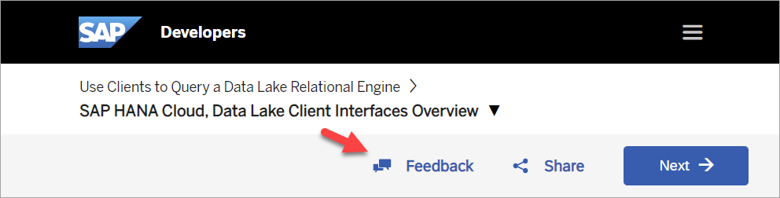
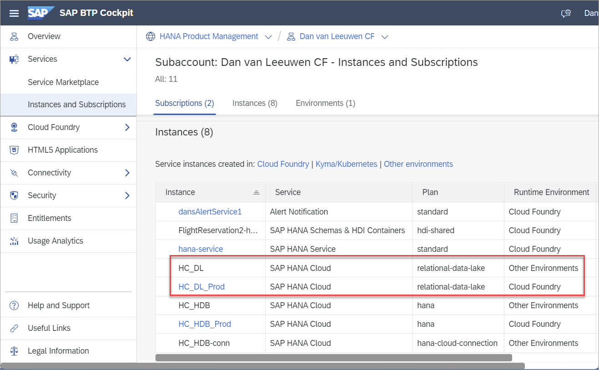
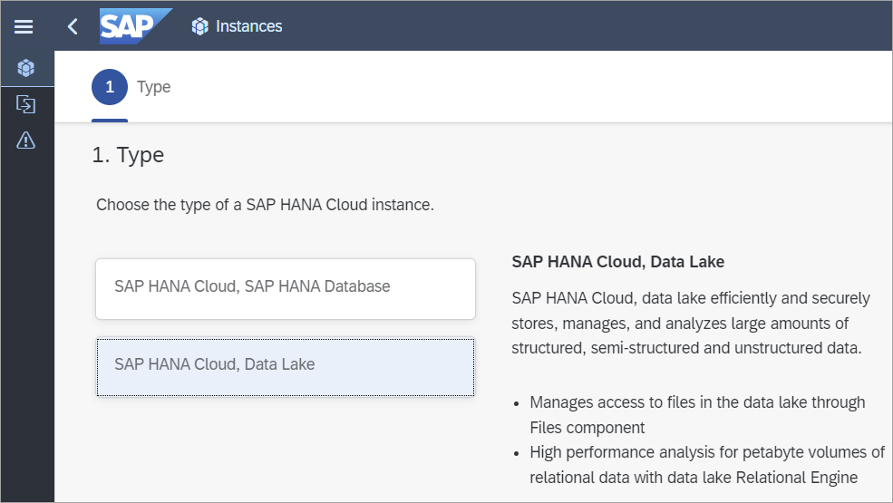
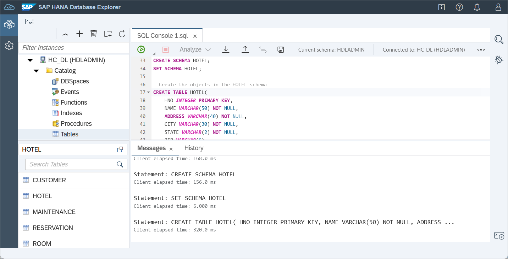
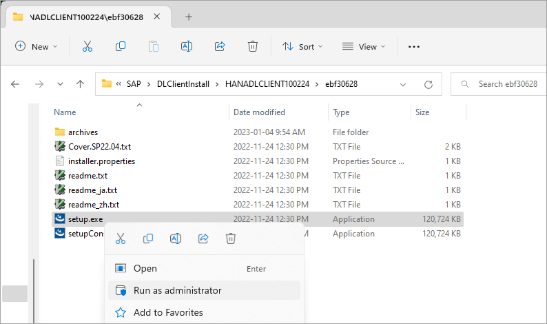
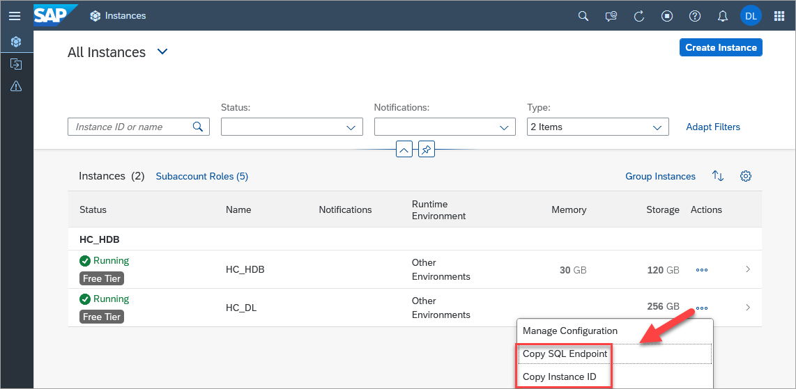
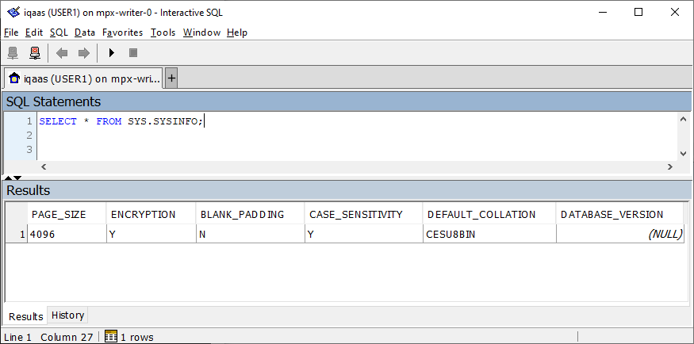
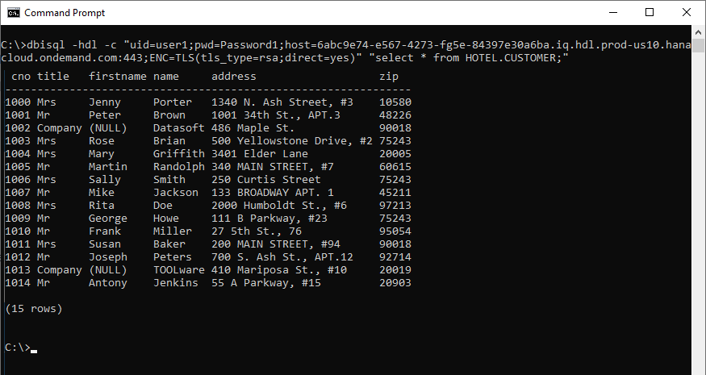

---
parser: v2
auto_validation: true
time: 15
tags: [ tutorial>beginner, software-product-function>sap-hana-cloud--data-lake, software-product>sap-hana-cloud, programming-tool>sql, software-product>sap-iq]
primary_tag: software-product-function>sap-hana-cloud--data-lake
---

# SAP HANA Cloud, Data Lake Client Interfaces Overview
<!-- description --> Learn about the SAP HANA Cloud, data lake, how to create a free tier or trial instance, how to examine the data lake Relational Engine using SAP HANA Cloud Central, how to install the data lake client, and how to query the database using the SQL Console or the Interactive SQL Client.

## Prerequisites
 - A computer running Microsoft Windows or Linux.

## You will learn
  - Information about SAP HANA Cloud, data lake Relational Engine
  - How to install the data lake client
  - How to create sample tables, views, and procedures
  - How to connect using SAP HANA cockpit, SAP HANA database explorer and the Interactive SQL Client

## Intro
This tutorial group will provide guidance on setting up an instance of [SAP HANA Cloud, data lake](https://help.sap.com/docs/hana-cloud-data-lake) so that it can then be connected to and queried using a few of the data lake client interfaces as described in [SAP HANA Cloud, Data Lake Developer Guide for Data Lake Relational Engine](https://help.sap.com/docs/hana-cloud-data-lake/developer-guide-for-data-lake-relational-engine/sap-hana-cloud-data-lake-developer-guide-for-data-lake-relational-engine).  

> Access help from the SAP community or provide feedback on this tutorial by navigating to the Feedback link shown below.
> 
>

---

### Overview of SAP HANA Cloud, data lake


SAP HANA Cloud is composed of multiple components.

  * SAP HANA is an in-memory, multi-model, column-based, relational database. For further details see [Introduction to SAP HANA Cloud](https://help.sap.com/docs/hana-cloud/sap-hana-cloud-getting-started-guide/introduction-to-sap-hana-cloud) and the tutorial mission [Use Clients to Query an SAP HANA Database](mission.hana-cloud-clients).

  * SAP HANA Cloud, data lake is composed of two components:  data lake Relational Engine and data lake Files.    

    [Data Lake Relational Engine](https://help.sap.com/docs/hana-cloud-data-lake/welcome-guide/data-lake-relational-engine) is a disk-based, column-oriented relational database for storing and analyzing high volumes of infrequently updated data. It descends from [SAP IQ](https://help.sap.com/viewer/product/SAP_IQ/latest/en-US), which was previously named Sybase IQ. Because of its heritage, there are commonalities with other Sybase products. Many client interface drivers are shared with [SAP SQL Anywhere](https://help.sap.com/docs/SAP_SQL_Anywhere) and SAP Adaptive Server Enterprise.

    [Data Lake Files](https://help.sap.com/docs/hana-cloud-data-lake/welcome-guide/data-lake-files) can be used to store and access unstructured data such as trace files and structured files like CSV, Parquet, or ORC. Structured files can use [SQL on Files](https://help.sap.com/docs/hana-cloud-data-lake/welcome-guide/sql-on-files), which enables SQL queries to be performed on them.  

    >Note, that the data lake Files component is currently not available in free tier or trial accounts.

### Choose where to deploy the database instances

The SAP BTP platform provides multiple runtime environments such as Kyma and Cloud Foundry.  When a HANA Cloud or data lake instance is created, it can be created at the BTP subaccount or in a Cloud Foundry space.  SAP HANA Cloud Central can be used to provision and manage instances in the BTP subaccount or in a Cloud Foundry space.  In the screenshot below, there is an instance of a data lake that was provisioned in the BTP subaccount (Runtime Environment = Other) and one that was provisioned into Cloud Foundry.



The multi-environment tooling (once a subscription and setup is complete) can be accessed under subscriptions.


### Create a data lake instance

>To complete the tutorials in this group, a SAP HANA Cloud, data lake instance is needed, which is created within the SAP Business Technology Platform (BTP). There are two different free options available, which are the SAP BTP free-tier and SAP BTP trial.  For instructions on registering, see [Set Up Your SAP HANA Cloud, SAP HANA Database (free tier or trial) and Understand the Basics](group.hana-cloud-get-started-1-trial).

The following steps provide instructions on how to create a data lake instance in the SAP Business Technology Platform (BTP) trial.  Additional content on this topic is available at [Quick Start Tutorial for Data Lake](https://help.sap.com/docs/hana-cloud-data-lake/quick-start-tutorial-for-standalone-data-lake/quick-start-tutorial-for-standalone-data-lake).

There are multiple ways to create a data lake:  

* A data lake can be created in step 6 of the SAP HANA Database creation wizard.  

    

* A data lake can be added to an already created SAP HANA database that does not have a data lake already associated with it.  

    

    When a data lake is created in either of the previous two methods, it is configured to be maximally compatible with an SAP HANA database.  

* A data lake can be created that is independent (standalone) of a SAP HANA database by using the **Create Instance** button and the option **SAP HANA Cloud, data lake**.  

    

    

    A standalone data lake can be configured with additional options such a collation value of UTF8BIN and blank padding set to ON to be more compatible with an on-premise SAP IQ.

1. Open SAP HANA Cloud Central.  

2. If a data lake is not already present, add one using one of the three methods previously described.

    Take note when creating the data lake that the administration user is HDLADMIN.

    >The HDLADMIN user has a [login policy](https://help.sap.com/docs/hana-cloud-data-lake/user-management-for-data-lake-relational-engine/login-policy-options) that enforces the [update of the password](https://help.sap.com/docs/hana-cloud-data-lake/user-management-for-data-lake-relational-engine/changing-password-single-control) after 180 days.  

3. As this instance is a free tier or trial account, set allowed connections to **Allow all IP addresses** so that client applications can connect from any IP address.  

    

4. After a while, press the **Refresh** button or enable auto-refresh and the status should change from CREATING to RUNNING once the instance has been created.

    

    >**Important:** SAP HANA Cloud, HANA data lake free tier or trial instances are shut down overnight and will need to be restarted before working with them the next day.

### Examine the Data Lake

1. Once the data lake has been created it's details can be examined.  

    

    Input your credentials. These are stored by SAP HANA Cloud Central.

    

    After you enter your credentials, should you wish to use a different set of credentials, the current credentials can be updated using **Sign in to the Instance**.

     


### Create tables, views, functions, and procedures with SAP HANA database explorer

In this step, a sample HOTEL dataset will be created comprising tables, a view, and a stored procedure.

1. From the action menu, select **Open SQL Console** or **Open in SAP HANA Database Explorer**.

    

2. Execute a few queries.

    ```SQL
    SELECT CURRENT USER FROM DUMMY;
    SELECT * FROM sa_db_properties() WHERE UPPER(PropName) LIKE '%NAME%';
    SELECT * FROM SYS.SYSOPTIONS WHERE UPPER("option") LIKE '%VERIFY%';
    CALL sa_conn_properties(CONNECTION_PROPERTY('Number'));
    ```

    

    Additional details can be found at [System Functions](https://help.sap.com/docs/hana-cloud-data-lake/sql-reference-for-data-lake-relational-engine/system-functions) and [Stored Procedures in Data Lake Relational Engine](https://help.sap.com/docs/hana-cloud-data-lake/sql-reference-for-data-lake-relational-engine/system-procedures-for-data-lake-relational-engine).


3. In the SAP HANA database explorer, execute the following SQL statements.

    ```SQL
    ---- drops the schema and all objects it contains
    -- SET SCHEMA HOTEL;
    -- DROP VIEW HOTEL_ROOMS_VIEW;
    -- DROP PROCEDURE SHOW_RESERVATIONS;
    -- DROP TABLE MAINTENANCE;
    -- DROP TABLE RESERVATION;
    -- DROP TABLE CUSTOMER;
    -- DROP TABLE HOTEL.ROOM;
    -- DROP TABLE HOTEL;
    -- DROP FUNCTION AVERAGE_PRICE;
    -- DROP SCHEMA HOTEL;

    -- DROP USER USER1;
    -- DROP USER USER2;
    -- DROP ROLE HOTEL_ADMIN;
    -- DROP ROLE HOTEL_READER;
    -- SET SCHEMA; --Workaround a bug where creating user fails with f_verify_pwd is no longer valid

    CREATE USER USER1 IDENTIFIED BY Password1;
    CREATE USER USER2 IDENTIFIED BY Password2;

    CREATE ROLE HOTEL_ADMIN;
    CREATE ROLE HOTEL_READER;

    --Further privileges will be granted later to the tables, views, functions, and procedures that are created below
    GRANT SET ANY CUSTOMER PUBLIC OPTION, READ FILE TO HOTEL_ADMIN, HOTEL_READER;
    GRANT EXECUTE ON sp_list_directory TO HOTEL_ADMIN, HOTEL_READER;
    GRANT EXECUTE ON sp_real_list_directory TO HOTEL_ADMIN, HOTEL_READER;

    GRANT ROLE HOTEL_ADMIN TO USER1;
    GRANT ROLE HOTEL_READER TO USER2;

    --Create a schema for the sample hotel dataset  
    CREATE SCHEMA HOTEL;

    --Specify the privileges for the roles on the schema HOTEL
    GRANT CREATE ANY, SELECT, UPDATE, INSERT, DELETE, EXECUTE PROCEDURE ON SCHEMA HOTEL TO HOTEL_ADMIN;
    GRANT SELECT ON SCHEMA HOTEL TO HOTEL_READER;
    
    SET SCHEMA HOTEL;
    SELECT CURRENT SCHEMA;
    --Create the objects in the HOTEL schema
    CREATE TABLE HOTEL(
        HNO INTEGER PRIMARY KEY,
        NAME VARCHAR(50) NOT NULL,
        ADDRESS VARCHAR(40) NOT NULL,
        CITY VARCHAR(30) NOT NULL,
        STATE VARCHAR(2) NOT NULL,
        ZIP VARCHAR(6)
    );

    CREATE TABLE ROOM(
        HNO INTEGER,
        TYPE VARCHAR(6),
        FREE NUMERIC(3),
        PRICE NUMERIC(6, 2),
        PRIMARY KEY (HNO, TYPE),
        FOREIGN KEY (HNO) REFERENCES HOTEL
    );

    CREATE TABLE CUSTOMER(
        CNO INTEGER PRIMARY KEY,
        TITLE VARCHAR(7),
        FIRSTNAME VARCHAR(20),
        NAME VARCHAR(40) NOT NULL,
        ADDRESS VARCHAR(40) NOT NULL,
        ZIP VARCHAR(6)
    );

    CREATE TABLE RESERVATION(
        RESNO INTEGER NOT NULL default autoincrement,
        RNO INTEGER NOT NULL,
        CNO INTEGER,
        HNO INTEGER,
        TYPE VARCHAR(6),
        ARRIVAL DATE NOT NULL,
        DEPARTURE DATE NOT NULL,
        PRIMARY KEY (
            "RESNO", "ARRIVAL"
        ),
        FOREIGN KEY(CNO) REFERENCES CUSTOMER,
        FOREIGN KEY(HNO) REFERENCES HOTEL
    );

    CREATE TABLE MAINTENANCE(
        MNO INTEGER PRIMARY KEY,
        HNO INTEGER,
        DESCRIPTION VARCHAR(100),
        DATE_PERFORMED DATE,
        PERFORMED_BY VARCHAR(40),
        FOREIGN KEY(HNO) REFERENCES HOTEL
    );

    --Note the use of the schema name in the FROM clause
    CREATE OR REPLACE VIEW HOTEL_ROOMS_VIEW AS
    SELECT
        H.NAME AS HOTEL_NAME,
        R.TYPE,
        R.FREE,
        R.PRICE
    FROM HOTEL.ROOM R
        LEFT JOIN HOTEL.HOTEL H ON R.HNO = H.HNO
            ORDER BY H.NAME;

    CREATE OR REPLACE FUNCTION AVERAGE_PRICE(room_type CHAR(6))
    RETURNS NUMERIC(6, 2)
    BEGIN
        DECLARE avg_price NUMERIC(6,2);  
        SELECT CAST(ROUND(sum(PRICE)/COUNT(*), 2) as NUMERIC(6,2)) INTO avg_price FROM ROOM WHERE TYPE = room_type GROUP BY TYPE;
        RETURN avg_price;
    END;

    CREATE OR REPLACE PROCEDURE SHOW_RESERVATIONS(
        IN IN_HNO INTEGER, IN IN_ARRIVAL DATE)
        RESULT (RESNO INTEGER, ARRIVAL DATE, NIGHTS INTEGER, HOTEL_NAME VARCHAR(50),TITLE VARCHAR(7), FIRST_NAME VARCHAR(20), LAST_NAME VARCHAR(40))
        BEGIN
            MESSAGE IN_HNO TO CLIENT;
            MESSAGE IN_ARRIVAL TO CLIENT;
        SELECT
            R.RESNO,
            R.ARRIVAL,
            DATEDIFF(DAY, R.ARRIVAL, R.DEPARTURE) as "Nights",
            H.NAME,
            CUS.TITLE,
            CUS.FIRSTNAME AS "FIRST NAME",
            CUS.NAME AS "LAST NAME"
        FROM
            RESERVATION AS R
            LEFT OUTER JOIN
            HOTEL AS H
            ON H.HNO = R.HNO
            LEFT OUTER JOIN
            CUSTOMER AS CUS
            ON CUS.CNO = R.CNO
            WHERE R.ARRIVAL = IN_ARRIVAL AND
            H.HNO = IN_HNO
            ORDER BY CUS.NAME ASC;
        END;
    ```

    Select **Tables**, and set the schema filter to be **HOTEL** to limit the returned tables to be those that were just created in the HOTEL schema.

    

    Additional details on the SQL used above can be found at [CREATE TABLE Statement for Data Lake Relational Engine](https://help.sap.com/docs/hana-cloud-data-lake/sql-reference-for-data-lake-relational-engine/create-table-statement-for-data-lake-relational-engine), [CREATE VIEW Statement for Data Lake Relational Engine](https://help.sap.com/docs/hana-cloud-data-lake/sql-reference-for-data-lake-relational-engine/create-view-statement-for-data-lake-relational-engine), and [CREATE PROCEDURE Statement for Data Lake Relational Engine](https://help.sap.com/docs/hana-cloud-data-lake/sql-reference-for-data-lake-relational-engine/create-procedure-statement-for-data-lake-relational-engine).

    > Identifiers such as the column names in a table are [case-insensitive](https://help.sap.com/docs/hana-cloud-data-lake/sql-reference-for-data-lake-relational-engine/sap-hana-cloud-data-lake-sql-reference-for-data-lake-relational-engine).

For additional details on the SAP HANA database explorer, see the tutorial [Get Started with the SAP HANA Database Explorer](group.hana-cloud-get-started), which showcases many of its features.


### Install the data lake client

1.  Open [SAP for me](https://me.sap.com/softwarecenter) and navigate to **Support Packages & Patches** | **By Alphabetical Index (A-Z)**.

    

 2. Navigate to **H | HANA CLOUD CLIENTS | HANA CLOUD CLIENTS 1.0 | HANA DATALAKE CLIENT 1.0**. Select the platform (Windows or Linux) and download the latest version of the archive.

    

    > Note access to the client install is currently limited to S-user IDs

2.  Extract the archive and start the installer.

    * On Microsoft Windows extract the zip and run setup.exe as an administrator.

        

        Finish the steps as instructed.
        
        

        >If the install fails on Microsoft Windows, consult the following SAP Notes:
        >
        >* [3001764 - SAP IQ 16.x - `InvocationTargetException` Installer Error (WINDOWS)](https://launchpad.support.sap.com/#/notes/3001764)
        >
        >* [3001813 - SAP IQ 16.1 SP 04 Rev08 - 'Error Loading sylapij.dll' Installer Error (WINDOWS)](https://launchpad.support.sap.com/#/notes/3001813)


    * On Linux, extract the archive.

        ```Shell (Linux)
        tar -zxvf HANADLCLIENT100*.TGZ
        ```

        Run `setup.bin` which will start either the GUI installer or text based installer.  To use the text based installer, add `-i console` to the command.

        ```Shell (Linux)
        cd ebf*
        ./setup.bin
        ```

3.  Specify an install folder such as C:\sap\DLClient (for Windows) or /home/dan/sap/dlclient (for Linux) and install all the features.

    

    Console mode installer on Linux

    

    Follow the remaining prompts to finish the installation.

4.  The installation location can be referenced through an environment variable.

  * On Microsoft Windows, open a new command prompt window and run the following to see the installation location.

    ```Shell (Windows)
    ECHO %IQDIR17%
    ```

  * On Linux, this environment variable and others are set in a file named `IQ.sh`.  Configure it to be run each time the Bash shell is started by referencing it in `.bash_profile` or possibly `.bashrc`.

    Open the `.bash_profile`.

    ```Shell (Linux)
    pico ~/.bash_profile
    ```

    >This tutorial uses notepad and `pico` as default text editors, but any text editor will do.
    >`Pico` can be installed on SUSE Linux with

    >```Shell (Linux SUSE)
    sudo zypper install pico
    >```

    Add the following line to point to the location where the SAP data lake client is installed.

    ```Shell (Linux) .bash_profile
    source /path-to-data-lake-install/IQ.sh
    ```

    Test the change by running:

    ```Shell (Linux)
    source ~/.bash_profile
    ```

    The following command should display the install location of the data lake client.

    ```Shell (Linux)
    echo $IQDIR17
    ```

    > In the case that the Data Lake Client needs to be uninstalled, run the `uninstall.exe` file located in the directory `/path-to-data-lake-install/sybuninstall/IQClientSuite/`.  


### Connect with the Interactive SQL Client (DBISQL)

The data lake client install includes [dbisql Interactive SQL Utility](https://help.sap.com/docs/hana-cloud-data-lake/client-interfaces/dbisql-interactive-sql-utility), which can be used to connect and query a data lake Relational Engine. The following steps will provide instructions on how to connect to the data lake Relational Engine using DBISQL and then populate the previously created tables with sample data.

1. Start the GUI version of DBISQL by searching from the Microsoft Windows Start menu. It can also be accessed by entering `dbisql` in the command prompt.
     

1. Specify the connection type.

    

    >The Connect window may appear enlarged on the screen. This can be adjusted by lowering the Scale and layout value in the device display settings.

2. Provide the connection details. See below on how to obtain the instance ID and landscape values.

    

    >SAP HANA Cloud Central can be used to get the instance ID and landscape value.  The landscape value can be obtained from the SQL Endpoint by removing the instance ID from the start and port number from the end.

    >
    >
    > A failure to connect could be caused by the allowed connections list, which is editable in SAP HANA Cloud Central.  

    

    >DBISQL can also be started without a GUI.
    >
    >```Shell (Windows)
    dbisql -c "uid=USER1;pwd=Password1;host=XXXXXXXX-XXXX-XXXX-XXXX-XXXXXXXXXXXX.iq.hdl.xxxx-xxxx.hanacloud.ondemand.com:443;ENC=TLS(tls_type=rsa;direct=yes)" -nogui
    >```
    >
    >In a Bash shell, strings in double quotes versus single quotes are treated [differently](https://stackoverflow.com/questions/6697753/difference-between-single-and-double-quotes-in-bash).
    >
    >```Shell (Linux)
    dbisql -c 'uid=USER1;pwd=Password1;host=XXXXXXXX-XXXX-XXXX-XXXX-XXXXXXXXXXXX.iq.hdl.trial-XXXX.hanacloud.ondemand.com:443;ENC=TLS(tls_type=rsa;direct=yes)' -nogui
    >```

    >


### Insert data with Interactive SQL Client (DBISQL)


1. Execute the following insert statements to provide some sample data.

    >If you do not wish to use the GUI mode, paste the insert statements into a file first and then run `dbisql -c "uid..." sql.sql`.

    ```SQL
    SET SCHEMA HOTEL;
    INSERT INTO HOTEL VALUES(10, 'Congress', '155 Beechwood St.', 'Seattle', 'WA', '20005');
    INSERT INTO HOTEL VALUES(11, 'Regency', '477 17th Avenue', 'Seattle', 'WA', '20037');
    INSERT INTO HOTEL VALUES(12, 'Long Island', '1499 Grove Street', 'Long Island', 'NY', '11788');
    INSERT INTO HOTEL VALUES(13, 'Empire State', '65 Yellowstone Dr.', 'Albany', 'NY', '12203');
    INSERT INTO HOTEL VALUES(14, 'Midtown', '12 Barnard St.', 'New York', 'NY', '10019');
    INSERT INTO HOTEL VALUES(15, 'Eighth Avenue', '112 8th Avenue', 'New York', 'NY', '10019');
    INSERT INTO HOTEL VALUES(16, 'Lake Michigan', '354 OAK Terrace', 'Chicago', 'IL', '60601');
    INSERT INTO HOTEL VALUES(17, 'Airport', '650 C Parkway', 'Rosemont', 'IL', '60018');
    INSERT INTO HOTEL VALUES(18, 'Sunshine', '200 Yellowstone Dr.', 'Clearwater', 'FL', '33575');
    INSERT INTO HOTEL VALUES(19, 'Beach', '1980 34th St.', 'Daytona Beach', 'FL', '32018');
    INSERT INTO HOTEL VALUES(20, 'Atlantic', '111 78th St.', 'Deerfield Beach', 'FL', '33441');
    INSERT INTO HOTEL VALUES(21, 'Long Beach', '35 Broadway', 'Long Beach', 'CA', '90804');
    INSERT INTO HOTEL VALUES(22, 'Indian Horse', '16 MAIN STREET', 'Palm Springs', 'CA', '92262');
    INSERT INTO HOTEL VALUES(23, 'Star', '13 Beechwood Place', 'Hollywood', 'CA', '90029');
    INSERT INTO HOTEL VALUES(24, 'River Boat', '788 MAIN STREET', 'New Orleans', 'LA', '70112');
    INSERT INTO HOTEL VALUES(25, 'Ocean Star', '45 Pacific Avenue', 'Atlantic City', 'NJ', '08401');
    INSERT INTO HOTEL VALUES(26, 'Bella Ciente', '1407 Marshall Ave', 'Longview', 'TX', '75601');

    INSERT INTO ROOM VALUES(10, 'single', 20, 135.00);
    INSERT INTO ROOM VALUES(10, 'double', 45, 200.00);
    INSERT INTO ROOM VALUES(12, 'single', 10, 70.00);
    INSERT INTO ROOM VALUES(12, 'double', 13, 100.00);
    INSERT INTO ROOM VALUES(13, 'single', 12, 45.00);
    INSERT INTO ROOM VALUES(13, 'double', 15, 80.00);
    INSERT INTO ROOM VALUES(14, 'single', 20, 85.00);
    INSERT INTO ROOM VALUES(14, 'double', 35, 140.00);
    INSERT INTO ROOM VALUES(15, 'single', 50, 105.00);
    INSERT INTO ROOM VALUES(15, 'double', 230, 180.00);
    INSERT INTO ROOM VALUES(15, 'suite', 12, 500.00);
    INSERT INTO ROOM VALUES(16, 'single', 10, 120.00);
    INSERT INTO ROOM VALUES(16, 'double', 39, 200.00);
    INSERT INTO ROOM VALUES(16, 'suite', 20, 500.00);
    INSERT INTO ROOM VALUES(17, 'single', 4, 115.00);
    INSERT INTO ROOM VALUES(17, 'double', 11, 180.00);
    INSERT INTO ROOM VALUES(18, 'single', 15, 90.00);
    INSERT INTO ROOM VALUES(18, 'double', 19, 150.00);
    INSERT INTO ROOM VALUES(18, 'suite', 5, 400.00);
    INSERT INTO ROOM VALUES(19, 'single', 45, 90.00);
    INSERT INTO ROOM VALUES(19, 'double', 145, 150.00);
    INSERT INTO ROOM VALUES(19, 'suite', 60, 300.00);
    INSERT INTO ROOM VALUES(20, 'single', 11, 60.00);
    INSERT INTO ROOM VALUES(20, 'double', 24, 100.00);
    INSERT INTO ROOM VALUES(21, 'single', 2, 70.00);
    INSERT INTO ROOM VALUES(21, 'double', 10, 130.00);
    INSERT INTO ROOM VALUES(22, 'single', 34, 80.00);
    INSERT INTO ROOM VALUES(22, 'double', 78, 140.00);
    INSERT INTO ROOM VALUES(22, 'suite', 55, 350.00);
    INSERT INTO ROOM VALUES(23, 'single', 89, 160.00);
    INSERT INTO ROOM VALUES(23, 'double', 300, 270.00);
    INSERT INTO ROOM VALUES(23, 'suite', 100, 700.00);
    INSERT INTO ROOM VALUES(24, 'single', 10, 125.00);
    INSERT INTO ROOM VALUES(24, 'double', 9, 200.00);
    INSERT INTO ROOM VALUES(24, 'suite', 78, 600.00);
    INSERT INTO ROOM VALUES(25, 'single', 44, 100.00);
    INSERT INTO ROOM VALUES(25, 'double', 115, 190.00);
    INSERT INTO ROOM VALUES(25, 'suite', 6, 450.00);

    INSERT INTO CUSTOMER VALUES(1000, 'Mrs', 'Jenny', 'Porter', '1340 N. Ash Street, #3', '10580');
    INSERT INTO CUSTOMER VALUES(1001, 'Mr', 'Peter', 'Brown', '1001 34th St., APT.3', '48226');
    INSERT INTO CUSTOMER VALUES(1002, 'Company', NULL, 'Datasoft', '486 Maple St.', '90018');
    INSERT INTO CUSTOMER VALUES(1003, 'Mrs', 'Rose', 'Brian', '500 Yellowstone Drive, #2', '75243');
    INSERT INTO CUSTOMER VALUES(1004, 'Mrs', 'Mary', 'Griffith', '3401 Elder Lane', '20005');
    INSERT INTO CUSTOMER VALUES(1005, 'Mr', 'Martin', 'Randolph', '340 MAIN STREET, #7', '60615');
    INSERT INTO CUSTOMER VALUES(1006, 'Mrs', 'Sally', 'Smith', '250 Curtis Street', '75243');
    INSERT INTO CUSTOMER VALUES(1007, 'Mr', 'Mike', 'Jackson', '133 BROADWAY APT. 1', '45211');
    INSERT INTO CUSTOMER VALUES(1008, 'Mrs', 'Rita', 'Doe', '2000 Humboldt St., #6', '97213');
    INSERT INTO CUSTOMER VALUES(1009, 'Mr', 'George', 'Howe', '111 B Parkway, #23', '75243');
    INSERT INTO CUSTOMER VALUES(1010, 'Mr', 'Frank', 'Miller', '27 5th St., 76', '95054');
    INSERT INTO CUSTOMER VALUES(1011, 'Mrs', 'Susan', 'Baker', '200 MAIN STREET, #94', '90018');
    INSERT INTO CUSTOMER VALUES(1012, 'Mr', 'Joseph', 'Peters', '700 S. Ash St., APT.12', '92714');
    INSERT INTO CUSTOMER VALUES(1013, 'Company', NULL, 'TOOLware', '410 Mariposa St., #10', '20019');
    INSERT INTO CUSTOMER VALUES(1014, 'Mr', 'Antony', 'Jenkins', '55 A Parkway, #15', '20903');

    INSERT INTO RESERVATION(rno, cno, hno, type, arrival, departure) VALUES(100, 1000, 11, 'single', '2020-12-24', '2020-12-27');
    INSERT INTO RESERVATION(rno, cno, hno, type, arrival, departure) VALUES(110, 1001, 11, 'double', '2020-12-24', '2021-01-03');
    INSERT INTO RESERVATION(rno, cno, hno, type, arrival, departure) VALUES(120, 1002, 15, 'suite', '2020-11-14', '2020-11-18');
    INSERT INTO RESERVATION(rno, cno, hno, type, arrival, departure) VALUES(130, 1009, 21, 'single', '2019-02-01', '2019-02-03');
    INSERT INTO RESERVATION(rno, cno, hno, type, arrival, departure) VALUES(150, 1006, 17, 'double', '2019-03-14', '2019-03-24');
    INSERT INTO RESERVATION(rno, cno, hno, type, arrival, departure) VALUES(140, 1013, 20, 'double', '2020-04-12', '2020-04-30');
    INSERT INTO RESERVATION(rno, cno, hno, type, arrival, departure) VALUES(160, 1011, 17, 'single', '2020-04-12', '2020-04-15');
    INSERT INTO RESERVATION(rno, cno, hno, type, arrival, departure) VALUES(170, 1014, 25, 'suite', '2020-09-01', '2020-09-03');
    INSERT INTO RESERVATION(rno, cno, hno, type, arrival, departure) VALUES(180, 1001, 22, 'double', '2020-12-23', '2021-01-08');
    INSERT INTO RESERVATION(rno, cno, hno, type, arrival, departure) VALUES(190, 1013, 24, 'double', '2020-11-14', '2020-11-17');

    INSERT INTO MAINTENANCE VALUES(10, 24, 'Replace pool liner and pump', '2019-03-21', 'Discount Pool Supplies');
    INSERT INTO MAINTENANCE VALUES(11, 25, 'Renovate the bar area.  Replace TV and speakers', '2020-11-29', 'TV and Audio Superstore');
    INSERT INTO MAINTENANCE VALUES(12, 26, 'Roof repair due to storm', null, null);
    COMMIT;
    ```

    Additional details on the SQL used above can be found at [INSERT Statement for Data Lake Relational Engine](https://help.sap.com/docs/hana-cloud-data-lake/sql-reference-for-data-lake-relational-engine/insert-statement-for-data-lake-relational-engine). Moreover, the [LOAD TABLE Statement for Data Lake Relational Engine](https://help.sap.com/docs/hana-cloud-data-lake/sql-reference-for-data-lake-relational-engine/load-table-statement-for-data-lake-relational-engine) can be used for efficient mass insertion into a database table from a file with ASCII or binary data.

    >Autocommit is set to on in the SQL console of the database explorer, while in DBISQL it is set to off.  A series of insert statements will run quicker in the SQL console if they are surrounded with begin and end or if autocommit is set to off.
    >
    ```SQL
    begin
    INSERT INTO HOTEL.ROOM VALUES(11, 'garden view', 13, 190.00);
    INSERT INTO HOTEL.ROOM VALUES(11, 'connecting room', 15, 175.00);
    end;
    ```

    ```SQL
    set temporary option auto_commit= 'off';
    INSERT INTO HOTEL.ROOM VALUES(11, 'triple', 7, 235.00);
    INSERT INTO HOTEL.ROOM VALUES(11, 'quad', 5, 275.00);
    set temporary option auto_commit= 'on';
    ```
    >
    >Autocommit can also be set via the connection settings dialog.
    >
    >   


2. Notice that pressing ctrl-space brings up auto complete (GUI mode only).     

    

    Query a table, a view, invoke a function, and call a stored procedure.

    ```SQL
    SET SCHEMA HOTEL;
    SELECT * FROM HOTEL;
    SELECT * FROM HOTEL_ROOMS_VIEW;
    SELECT AVERAGE_PRICE('single'), AVERAGE_PRICE('double'), AVERAGE_PRICE('suite') FROM DUMMY;
    CALL SHOW_RESERVATIONS(11, '2020-12-24');
    ```

    

3. DBISQL can also execute SQL from the command line or from a provided file. A few examples are shown below.

    ```Shell
    dbisql -c "uid=USER1;pwd=Password1;host=XXXXXXXX-XXXX-XXXX-XXXX-XXXXXXXXXXXX.iq.hdl.trial-XXXX.hanacloud.ondemand.com:443;ENC=TLS(tls_type=rsa;direct=yes)" "select * from HOTEL.CUSTOMER;"
    dbisql -c "uid=USER1;pwd=Password1;host=XXXXXXXX-XXXX-XXXX-XXXX-XXXXXXXXXXXX.iq.hdl.trial-XXXX.hanacloud.ondemand.com:443;ENC=TLS(tls_type=rsa;direct=yes)" sql.sql
    ```

    

    See [Connection Parameters](https://help.sap.com/viewer/a895964984f210158925ce02750eb580/latest/en-US/a6d47d6e84f210158d4980b069eff5dd.html) for additional documentation on the parameters used to connect.


### Knowledge check    

Congratulations! You have created and connected to a data lake Relational Engine. In the following tutorials, the client interfaces will be used to connect from ODBC, JDBC and Node.js.

---
