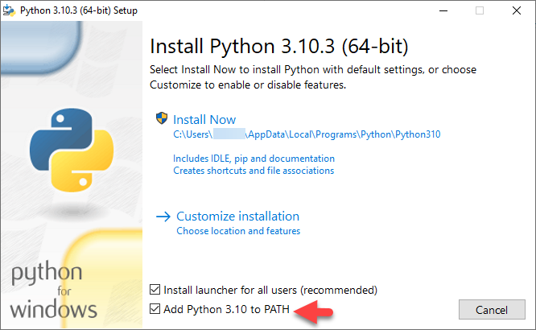
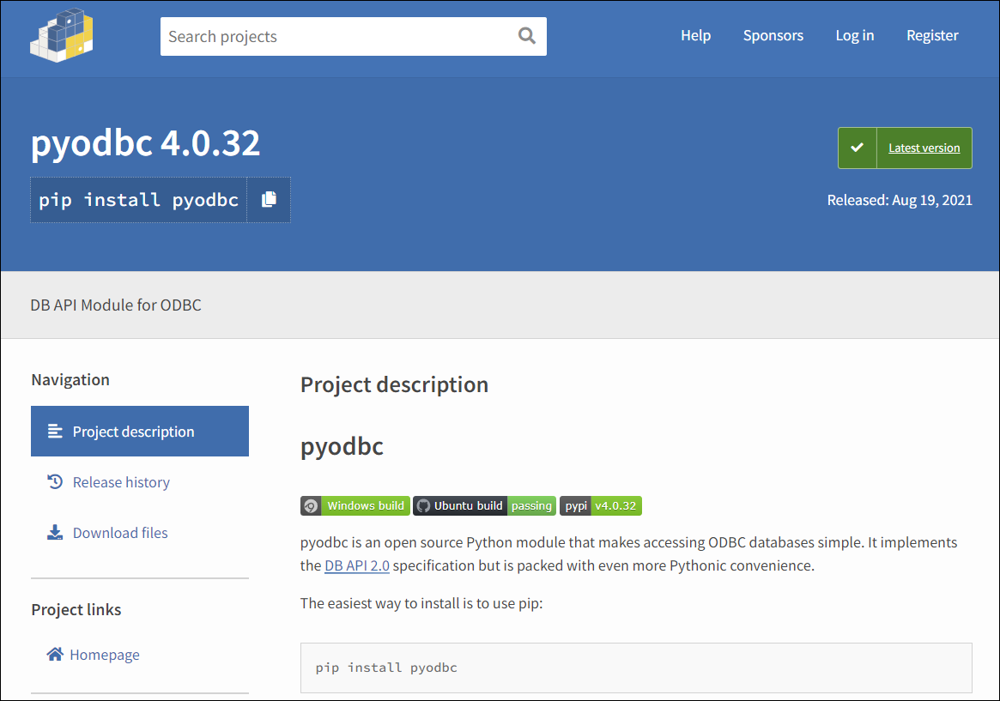
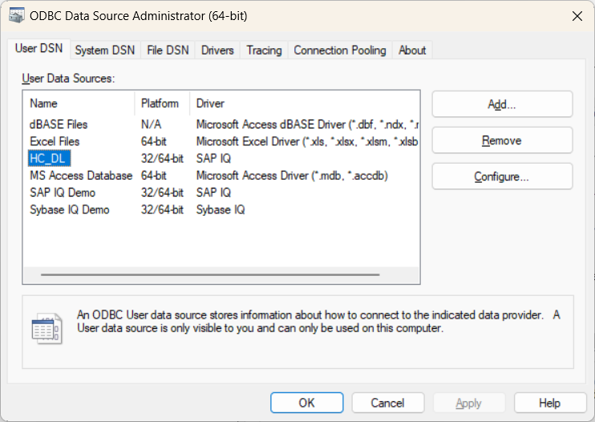
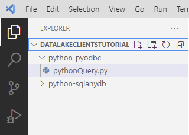
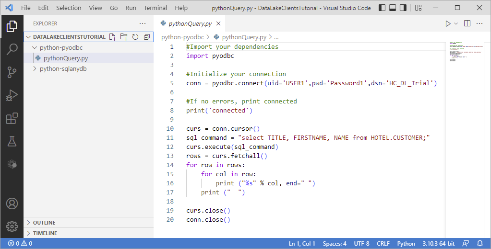
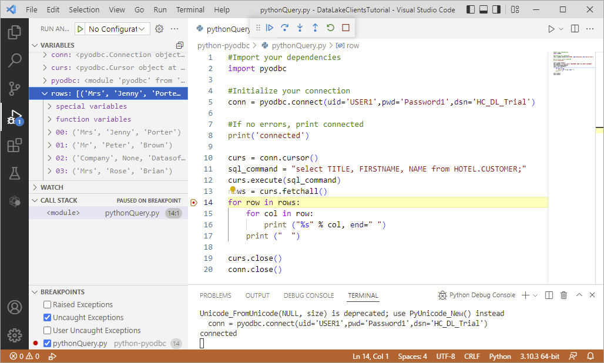

            ---
parser: v2
auto_validation: true
time: 15
tags: [ tutorial>beginner, software-product-function>sap-hana-cloud--data-lake, software-product>sap-hana-cloud, programming-tool>python]
primary_tag: software-product-function>sap-hana-cloud--data-lake
---

# Connect to Data Lake Relational Engine Using Python Drivers
<!-- description --> Create and debug a Python application that connects to a data lake Relational Engine using the sqlanydb python driver or the pyodbc bridge.

## Prerequisites
 - You have completed the first 2 tutorials in this group


## You will learn
  - How to install Python, the `sqlanydb`, and `pyodbc` Python drivers
  - How to create, run, and debug a Python application that connects to and queries a data lake Relational Engine database

---

## Intro
In the 2023 Stack Overflow’s annual developer survey, Python ranked 3rd in the [Most popular technologies](https://survey.stackoverflow.co/2023/#most-popular-technologies-language) section. For further information on Python, see [Introduction to Python 3](https://realpython.com/python-introduction/) or [The Python Tutorial](https://docs.python.org/3/tutorial/).

The following steps create a simple Python app that can connect to and query an SAP HANA data lake Relational Engine.  

### Install Python
The first step is to check if Python and pip are installed.

1. Enter the commands below.

    ```Shell
    python --version
    python3 --version
    ```
    If Python is installed, the command will return a value such as Python 3.12.1.

    >In some Linux distributions, 'python' refers to Python 2, while 'python3' refers to Python 3. However, as Python 2 is now obsolete, 'python' may refer to Python 3 instead.

    If Python is not installed, it can be downloaded from [Python downloads](https://www.python.org/downloads/).

    On Microsoft Windows, check the box that says **Add Python 3.x to PATH** as shown below to ensure that the interpreter will be placed in your path.  The Microsoft Windows command prompt or shell will need to be reopened after Python is installed to pick up the path to python.   

    

    On OpenSUSE Tumbleweed, yast can be used to install python313.  Once it has been installed its version can be seen with the below command.

    ```Shell (Linux)
    python3.13 --version
    ```


2. Enter the commands below.

    ```Shell
    pip --version
    pip3 --version
    pip install --upgrade pip
    ```
    >If you encounter issues with user permissions, run command prompt as an administrator and try again.

    The standard package installer for Python is [pip](https://pypi.org/project/pip/).  The following commands will check the version of pip and attempt to upgrade it to the latest available version.  Again, use the pip or pip3 command that returns a version 3.4 or greater of Python.

    >On Linux or Mac, if you encounter permission issues, one way to solve the issue is to use `sudo` before the command.

    >---

    >On Linux, if Python is installed but pip is not, it can be installed on openSUSE using Zypper as shown below.

    >```Shell (Linux)
    zypper install python3-pip
    >```


### Install the sqlanydb Python driver
The `sqlanydb` package is the python driver for the data lake Relational Engine and is available as part of the data lake Relational Engine install and is available at [PyPI](https://pypi.org/project/sqlanydb/).

1. Navigate to your Data Lake Client installation folder and enter the following command to install `sqlanydb`.

    ```Shell (Microsoft Windows)
    cd %IQDIR17%\SDK\Python
    python setup.py install
    ```

    This should create additional build directories in the current folder.

    >If the error 'no module named setuptools' appears, the following may be used as a workaround until this issue is resolved.

    >```Shell
    pip install setuptools
    ```


    On Linux the rest of the steps will be executed in a virtual environment.

    First make a project folder, and create a virtual environment inside it. To do so, open the terminal app, write the following command, and hit return, here pyvenv is the name of the folder that you wish to create the virtual environment in.

    ```Shell(Linux)
    mkdir $HOME/pyvenv
    ```
    Now, use the venv command to create a virtual environment inside the given folder, here python-virtualenv is the name of the virtual enviroment that is to be created.

    ```Shell(Linux)
    cd $HOME/pyvenv
    python3 -m venv pyvenv/python-virtualenv
    ```
    We now activate the virtual enviroment , which we will use to complete the rest of the steps for linux based systems.

    ```Shell(Linux)
    source pyvenv/python-virtualenv/bin/activate
    ```

    A successful activation looks like this:-

    

    Depending on which install of the data lake client was used, execute

    
    ```Shell (Linux)
    cd $IQDIR17/sdk/python
    python3 setup.py install
    ```

    or 

    ```Shell (Linux)
    cd $IQDIR17/sdk/python
    pip install sqlanydb-1.0.14.tar.gz
    ```

2. On Microsoft Windows, create a user environment variable named `SQLANY_API_DLL` and set it to `%IQDIR17%\Bin64\dbcapi.dll`.

    


### Create a Python application that uses sqlanydb to query the data lake Relational Engine
1. In a shell, create a folder named `python-sqlanydb`, enter the newly created directory, and open a file name `pythonQuery.py` in an editor.

    ```Shell (Microsoft Windows)
    mkdir %HOMEPATH%\DataLakeClientsTutorial\python-sqlanydb
    cd %HOMEPATH%\DataLakeClientsTutorial\python-sqlanydb
    notepad pythonQuery.py
    ```

    Substitute `pico` below for your preferred text editor.

    ```Shell (Linux)
    mkdir -p $HOME/DataLakeClientsTutorial/python-sqlanydb
    cd $HOME/DataLakeClientsTutorial/python-sqlanydb
    pico pythonQuery.py
    ```

2. Copy the following code into `pythonQuery.py`. Replace the host value.

    ```Python
    #Import your dependencies
    import sqlanydb

    #Initialize your connection
    conn = sqlanydb.connect(uid='USER1', pwd='Password1', host='XX.iq.hdl.trial-us10.hanacloud.ondemand.com:443',enc='TLS{tls_type=rsa;direct=yes}')

    #If no errors, print connected
    print('connected')

    curs = conn.cursor()
    sql_command = "select TITLE, FIRSTNAME, NAME from HOTELS.CUSTOMER;"
    curs.execute(sql_command)
    rows = curs.fetchall()
    for row in rows:
        for col in row:
            print ("%s" % col, end=" ")
        print ("  ")

    curs.close()
    conn.close()
    ```

3. Run the app. Make sure your data lake Relational Engine is running before executing the app.

    ```Shell
    python pythonQuery.py
    ```

    

For further information on the Python Driver, visit [Python and Database Access](https://help.sap.com/docs/hana-cloud-data-lake/developer-guide-for-data-lake-relational-engine/python-and-database-access).


### Install the Python ODBC bridge using pip and PyPI
This is an alternate method of connecting to a data lake Relation Engine from a Python app. The Python ODBC bridge is an open source Python module available on [`PyPI`](https://pypi.org/project/pyodbc/).  The performance characteristics between the two drivers may vary depending on the use case.

1. Ensure that you have created a connection to the data lake Relational Engine using ODBC as shown in step 1 or 2 of the [Connect to Data Lake Relational Engine Using the ODBC Driver](hana-cloud-dl-clients-odbc) tutorial.

2. The repository that contains Python packages is [PyPI](https://pypi.org/) and includes a package for the `pyodbc` driver.

      

3. Install `pyodbc`

    ```Shell
    pip install pyodbc
    ```


    >If this command fails on Microsoft Windows with an error "Microsoft Visual C++ 14.0 is required", additional details can be found at [Unable to install pyodbc using python 3.10 in windows 10](https://stackoverflow.com/questions/69943254/unable-to-install-pyodbc-using-python-3-10-in-windows-10) and [Release python 3.10 win wheels for pyodbc](https://github.com/mkleehammer/pyodbc/issues/981).

    >---

    >If this command fails on Linux, you may need to install gcc-c++, python3-devel, and unixodbc-dev.


### Create a Python application that uses pyodbc to query the data lake Relational Engine
1. In a shell, create a folder named `python-pyodbc`, enter the newly created directory, and open a file name `pythonQuery.py` in an editor.

    ```Shell (Microsoft Windows)
    mkdir %HOMEPATH%\DataLakeClientsTutorial\python-pyodbc
    cd %HOMEPATH%\DataLakeClientsTutorial\python-pyodbc
    notepad pythonQuery.py
    ```

    Substitute `pico` below for your preferred text editor.

    ```Shell (Linux)
    mkdir -p $HOME/DataLakeClientsTutorial/python-pyodbc
    cd $HOME/DataLakeClientsTutorial/python-pyodbc
    pico pythonQuery.py
    ```

2. Copy the following code into `pythonQuery.py`:

    ```Python
    #Import your dependencies
    import pyodbc

    #Initialize your connection
    conn = pyodbc.connect(uid='USER1',pwd='Password1',dsn='HC_DL')

    #If no errors, print connected
    print('connected')

    curs = conn.cursor()
    sql_command = "select TITLE, FIRSTNAME, NAME from HOTELS.CUSTOMER;"
    curs.execute(sql_command)
    rows = curs.fetchall()
    for row in rows:
        for col in row:
            print ("%s" % col, end= " ")
        print ("  ")

    curs.close()
    conn.close()
    ```

3. The `dsn` value refers to the data source name in the Microsoft Windows ODBC Administrator or the Linux `.odbc.ini` file.

    

    or

    

4. Run the app.

    ```Shell
    python pythonQuery.py
    ```

    >On some Linux distributions, python refers to a 2.x version of Python.  If so, replace `python` with `python3`.

    

The code in `pythonQuery.py` uses [PEP 249 -- Python Database API Specification](https://www.python.org/dev/peps/pep-0249/), which defines a set of methods that provide a consistent database interface, independent of the actual database being used.   


### Debug the application
Visual Studio Code provides plugins for Python and can be used to debug an application.  

1. If you have not already done so, download [Visual Studio Code](https://code.visualstudio.com/Download).

2. If you have not already done so, in Visual Studio Code, choose **File | Add Folder to Workspace**, and then add the `DataLakeClientsTutorial` folder.

    

3. Open the file `pythonQuery.py`.

    

    Visual Studio Code will recognize the `py` file extension and will suggest installing the Python extension. Click **Install**.

4. Place a breakpoint on line the line `for row in rows:`.

5. Select **Run | Start Debugging | Python File Debug the currently active Python file**.

    Notice that the program stops running at the breakpoint that was set.

    Observe the variable values in the leftmost pane.  Step through code.

      

### Knowledge check

Congratulations! You have now created and debugged a Python application that connects to and queries a data lake Relational Engine database.


---
