# Use an Elastic Compute Node (ECN) for Scheduled Workloads
<!-- description --> Learn about Elastic Compute Nodes (ECNs) and how they can be used to address known peaks in scheduled workloads.

## Prerequisites
- An SAP BTP account
- An SAP HANA Cloud instance

## You will learn
- How to create and delete an ECN
- How to create a workload class and map its workload to an ECN
- How to view additional details about ECNs

---

An [Elastic Compute Node](https://help.sap.com/docs/hana-cloud-database/sap-hana-cloud-sap-hana-database-administration-guide/scale-out-using-elastic-compute-node) (ECN) can be added when it is known that additional queries will be run that take significant CPU or memory resources such as at the end of the month or quarter.  Once the queries complete, the node can be removed.  ECNs incur additional [costs](https://www.sap.com/about/trust-center/agreements/cloud/cloud-services.html?search=Supplement%20HANa%20Cloud&sort=latest_desc&tag=language%3Aenglish&pdf-asset=2e80541a-f07e-0010-bca6-c68f7e60039b&page=3) while running but can improve performance or could lower the total cost of ownership if their usage can reduce the instance size by covering known peak loads.  In the screenshot below, if the timing of the darker blue peaks are known and are read only, an ECN node can be started and the workloads directed to the ECN enabling the overall size of the SAP HANA instance to be reduced.  The [SAP HANA Cloud Capacity Unit Estimator](https://hcsizingestimator.cfapps.eu10.hana.ondemand.com/) can be used to estimate the additional cost of adding ECNs.  ECNs are not available in trial or free tier.  Further details on Elastic Compute Nodes can be also found at [Harnessing Dynamic Elasticity (Elastic Compute Node) for Smarter Scaling in SAP HANA Cloud](https://community.sap.com/t5/technology-blogs-by-sap/harnessing-dynamic-elasticity-elastic-compute-node-for-smarter-scaling-in/ba-p/14016836).

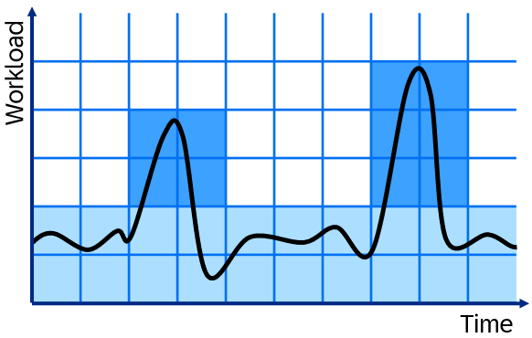

ECNs can be used to address compute intensive OLAP or read-only queries and as such, only temporary tables or replica tables can be stored on ECN instances.  Queries can be routed to ECN nodes using client-side statement routing or workload classes.

The following steps attempt to demonstrate an example of adding an ECN to cover known peaks in workload.  


### Identify tasks to be run on an Elastic Compute Node (ECN)
1. Read only CPU or memory intensive tasks that occur at a set frequency are suitable candidates to consider redirecting to an ECN.  The CPU and memory used by your instance can be viewed in the usage monitor app in SAP HANA Cloud Central as shown below.

    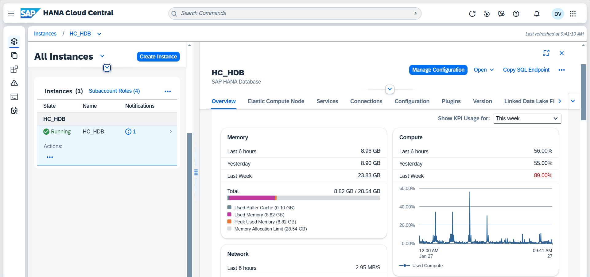

    Click on the memory, compute, network, or storage cards to open the Usage Monitor app.  Below notice that the compute is spiking at a set frequency.
    
    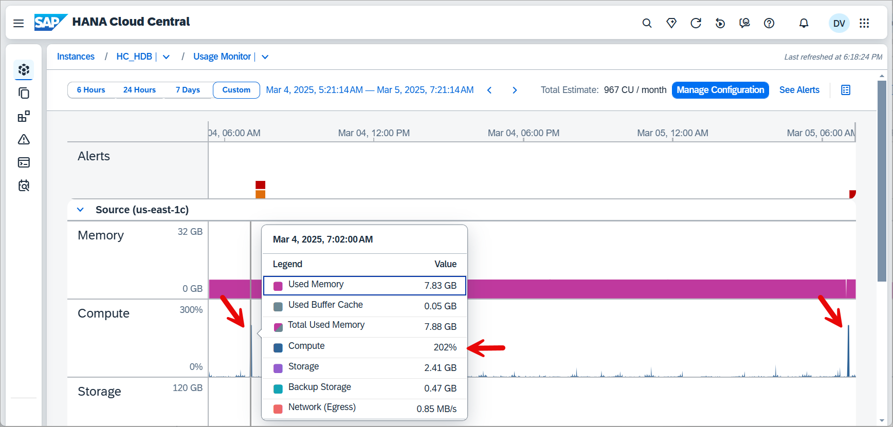

2. The following examples are used for simulation purposes and can create a memory and CPU spike that will be moved to an ECN node.  The size of the spike can be adjusted by increasing or decreasing the number of rows in the table. 

    ```SQL
    CREATE USER USER4 PASSWORD "Password4"  NO FORCE_FIRST_PASSWORD_CHANGE SET USERGROUP DEFAULT;
    GRANT CATALOG READ TO USER4; 
    GRANT WORKLOAD ADMIN TO USER4; 
    CONNECT USER4 PASSWORD Password4;
    GRANT ALL PRIVILEGES ON SCHEMA USER4 TO DBADMIN;

    CREATE TABLE MYTABLE(VAL1 DOUBLE);
    --Demonstrates how an expensive query is made using cross joins
    INSERT INTO MYTABLE VALUES(1);
    INSERT INTO MYTABLE VALUES(2);
    INSERT INTO MYTABLE VALUES(3);
    SELECT * FROM MYTABLE T1, MYTABLE T2, MYTABLE T3;

    CREATE OR REPLACE PROCEDURE POPULATE_MYTABLE(NUMOFROWS INT) LANGUAGE SQLSCRIPT AS
    BEGIN
        USING SQLSCRIPT_PRINT AS PRTLIB;
        DECLARE i INT;
        TRUNCATE TABLE USER4.MYTABLE;
        FOR i IN 1 .. :NUMOFROWS DO
            INSERT INTO MYTABLE VALUES(RAND_SECURE());
        END FOR;
    END;

    CREATE OR REPLACE PROCEDURE CPU_SPIKE() LANGUAGE SQLSCRIPT AS
    BEGIN
        USING SQLSCRIPT_PRINT AS PRTLIB;
        SELECT SUM(T1.VAL1 + T2.VAL1 + T3.VAL1) FROM USER4.MYTABLE T1, USER4.MYTABLE T2, USER4.MYTABLE T3;
    END;

    CALL POPULATE_MYTABLE(2000);
    --9 seconds and 32 seconds of CPU time each call
    CALL CPU_SPIKE();
    CALL CPU_SPIKE();
    CALL CPU_SPIKE();


    CREATE OR REPLACE PROCEDURE CPU_AND_MEMORY_SPIKE() LANGUAGE SQLSCRIPT AS
    BEGIN
        USING SQLSCRIPT_PRINT AS PRTLIB;
        WITH 
        A AS (SELECT DISTINCT VAL1 AS A1 FROM USER4.MYTABLE ORDER BY VAL1 DESC),
        B AS (SELECT DISTINCT VAL1 AS B1 FROM USER4.MYTABLE ORDER BY VAL1 ASC),
        C AS (SELECT DISTINCT VAL1 AS C1 FROM USER4.MYTABLE ORDER BY VAL1 DESC)
        SELECT TOP 1 DISTINCT A1 + B1 + C1 FROM A, B, C;
    END;

    CALL POPULATE_MYTABLE(750);
    --8 seconds, 30 sec CPU time, 9 GB of memory each call
    CALL CPU_AND_MEMORY_SPIKE();
    CALL CPU_AND_MEMORY_SPIKE();
    CALL CPU_AND_MEMORY_SPIKE();
    ```

    After calling the stored procedure CPU_SPIKE and CPU_AND_MEMORY_SPIKE, you can see that the CPU and memory usage has spiked, and you may also see an alert.

    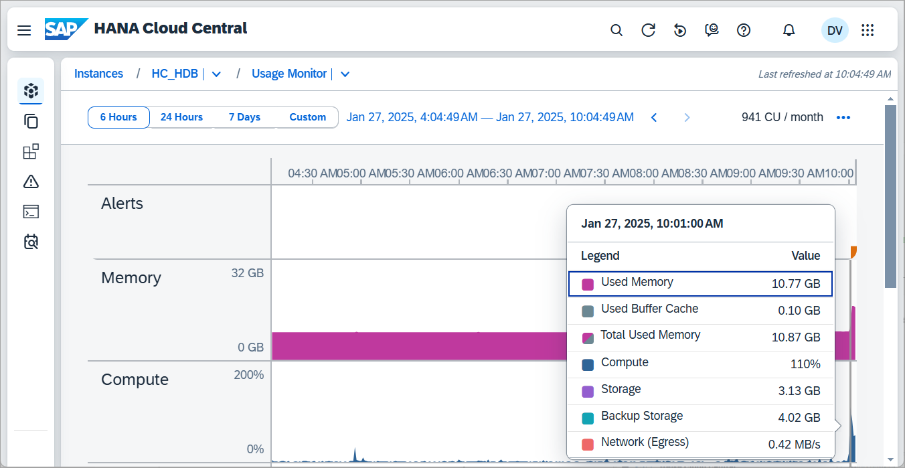

### Create an ECN
An ECN can be created in multiple ways.  Further details on the options and limitations when creating an ECN node can be found at [ECN Scope and Limitations](https://help.sap.com/docs/hana-cloud-database/sap-hana-cloud-sap-hana-database-administration-guide/ecn-scope-and-limitations).

1. Examine the options for creating an ECN.  Create an ECN using one of the methods shown below.

    * An ECN can be added using SAP HANA Cloud Central.
    
        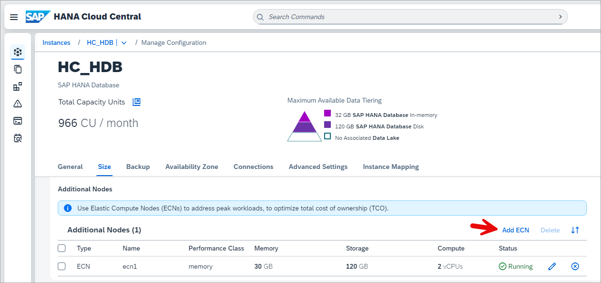

    * An ECN can be created or deleted using a CLI. The BTP CLI is shown below but the CF CLI can also be used. 
    
        * Create a file named **ecn1.json** with the contents below which can be used to create an ECN.
    
            ```JSON
            {
                "data": {
                    "elasticreadnodes": [
                        {
                            "name": "ecn1",
                            "vcpu": 2,
                            "memory": 32,
                            "storage": 120
                        }
                    ]
                }
            }
            ```

        * Create a file named **no_ecn.json** with the contents below which can be used to remove the ECN.

            ```JSON
            {
                "data": {
                    "elasticreadnodes": [
                    ]
                }
            }
            ```

        * Create the ECN using the BTP CLI.  Further details on using the BTP CLI can be found at [Executing SAP HANA Cloud Tasks from the Command Line](hana-cloud-automation-cli).

            ```Shell
            btp login --sso
            btp update services/instance --id <instance ID> --parameters ecn1.json
            btp.exe get services/instance <instance ID>
            ```

    * An ECN can be created using a REST API.  Further details are available at [REST API for the ECN](https://help.sap.com/docs/hana-cloud-database/sap-hana-cloud-sap-hana-database-administration-guide/rest-api-for-ecn) and [Business Accelerator Hub](https://api.sap.com/api/ComputeAPI/overview).
        
2. Once the ECN has been created, its details can be viewed.

    * In the instances view.
    
        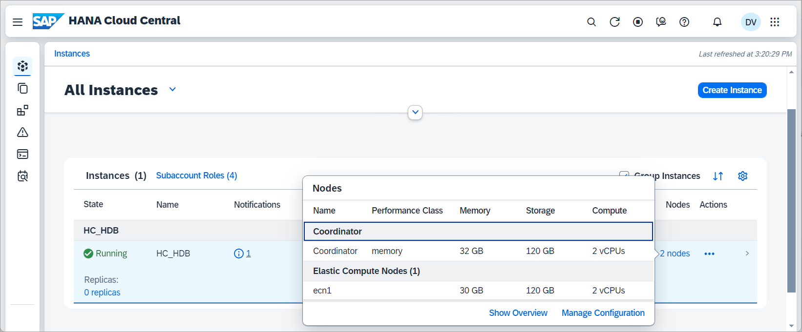
    
    * In an instances detail pane.

        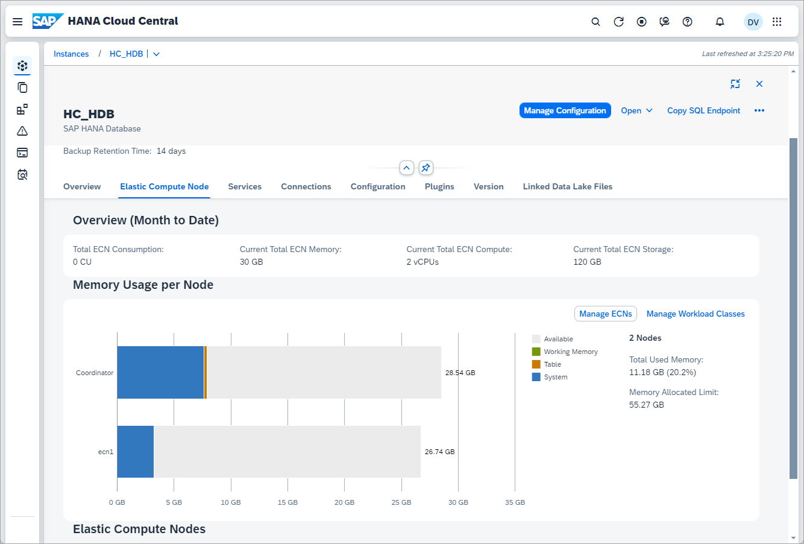

    * Through SQL

        ```SQL
        SELECT HOST, PORT FROM M_SERVICES WHERE SERVICE_NAME = 'computeserver';
        SELECT * FROM M_LANDSCAPE_HOST_CONFIGURATION;
        SELECT EVENT_TIME, HOST, SERVICE_ACTIVE FROM M_SYSTEM_AVAILABILITY ORDER BY EVENT_TIME DESC;
        ```

        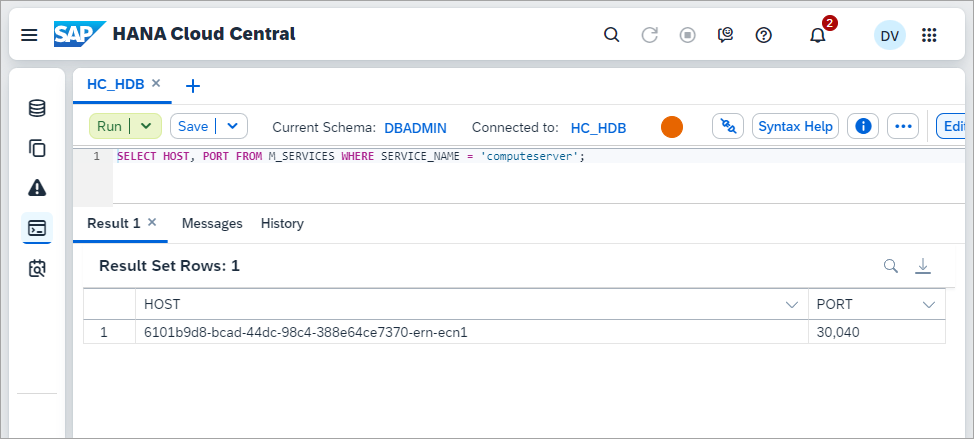

### Create a workload class
Workload classes can be used to direct a specified workload to an ECN.  Further details on workload classes can be found at [Workload Management](https://help.sap.com/docs/HANA_CLOUD_DATABASE/f9c5015e72e04fffa14d7d4f7267d897/workload-management).

1. There are multiple ways to map a workload to an ECN node.  The first step is to create a workload class.

    ```SQL    
    CREATE WORKLOAD CLASS "WLC1";
    ```

    The workload class can set a routing hint to the ECN.

    ```SQL
    ALTER WORKLOAD CLASS "WLC1" SET 'ROUTING LOCATION HINT' = 'ecn1';
    ```

    There are various ways that the workload can be mapped to the workload class.

    * A mapping to a user can be added

        ```SQL
        CREATE WORKLOAD MAPPING "WLM1" WORKLOAD CLASS "WLC1" SET 'USER NAME' = 'USER4';
        --DROP WORKLOAD MAPPING "WLM1";
        ```

    * A mapping can be made to specific objects

        ```SQL
        CREATE WORKLOAD MAPPING "WLM2" WORKLOAD CLASS "WLC1" SET 'SCHEMA NAME' = 'USER4', 'OBJECT NAME' = 'CPU_SPIKE';
        CREATE WORKLOAD MAPPING "WLM3" WORKLOAD CLASS "WLC1" SET 'SCHEMA NAME' = 'USER4', 'OBJECT NAME' = 'CPU_AND_MEMORY_SPIKE';
        ```

    * A mapping can be made to a session variable

        ```SQL
        CREATE WORKLOAD MAPPING "WLM4" WORKLOAD CLASS "WLC1" SET 'APPLICATION COMPONENT NAME' = 'ECN_APP';
        SET 'APPLICATIONCOMPONENT' = 'ECN_APP';
        SELECT * FROM M_SESSION_CONTEXT WHERE KEY = 'APPLICATIONCOMPONENT';
        --UNSET 'APPLICATIONCOMPONENT';
        ```

        Additional details for these values can be found at  [CREATE WORKLOAD MAPPING](https://help.sap.com/docs/hana-cloud-database/sap-hana-cloud-sap-hana-database-sql-reference-guide/create-workload-mapping-statement-workload-management).

    A workload class can be enabled, disabled, or deleted.

    ```SQL
    ALTER WORKLOAD CLASS "WLC1" DISABLE;
    ALTER WORKLOAD CLASS "WLC1" ENABLE;
    --DROP WORKLOAD CLASS "WLC1";
    ```

    The workload class and its mappings can be seen through SQL or in SAP HANA Cloud Central.

    ```SQL
    SELECT * FROM WORKLOAD_CLASSES;
    SELECT * FROM WORKLOAD_MAPPINGS;
    ```

    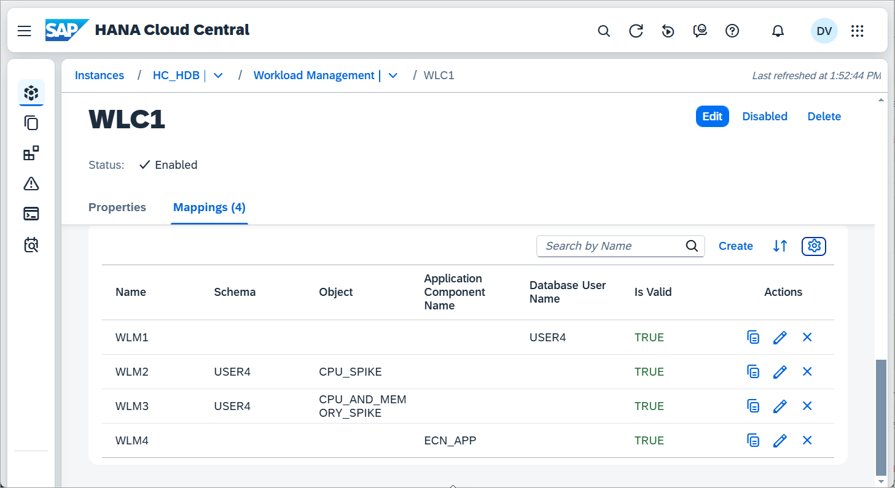

2. Run the query again using the ECN and verify that the query was run on the ECN node.


    ```SQL
    CALL CPU_AND_MEMORY_SPIKE();

    SELECT HOST, STATEMENT_STRING, ACCESSED_TABLE_NAMES, TABLE_LOCATIONS, USER_NAME, LAST_EXECUTION_TIMESTAMP 
        FROM M_SQL_PLAN_CACHE 
        WHERE STATEMENT_STRING LIKE 'CALL CPU_AND_MEMORY_SPIKE()' 
        ORDER BY LAST_EXECUTION_TIMESTAMP DESC;
    --ALTER SYSTEM CLEAR SQL PLAN CACHE;
    ```

    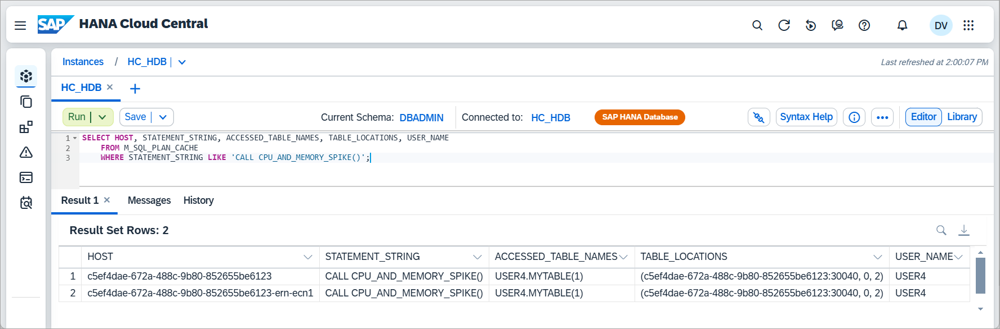

    Notice that the last time the query was run, it was executed on the ECN.  Notice also that the table location is not on the ECN.

### Route to ECN with a hint
An alternate approach without using a workload class is to use a hint.  

1. Execute the below SQL.

    ```SQL
    ALTER WORKLOAD CLASS "WLC1" DISABLE;
    SELECT * FROM M_VOLUMES;  --1024 is the VOLUME_ID for the ECN
    CALL USER4.CPU_AND_MEMORY_SPIKE() with hint (RESULT_LAG('HANA_ATR'), route_to(1024));
    SELECT HOST, STATEMENT_STRING, ACCESSED_TABLE_NAMES, TABLE_LOCATIONS, USER_NAME, LAST_EXECUTION_TIMESTAMP 
    FROM M_SQL_PLAN_CACHE 
    WHERE STATEMENT_STRING LIKE 'CALL %' 
    ORDER BY LAST_EXECUTION_TIMESTAMP DESC;
    ```

    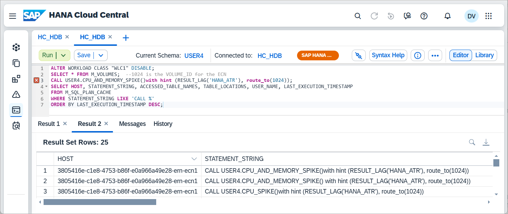

### Replicate a table to the ECN
A replica table can be stored on an ECN.  This may lead to lower resource consumption on the coordinator.  For additional details see [Advantages and Disadvantages of Table Replication](https://help.sap.com/docs/hana-cloud-database/sap-hana-cloud-sap-hana-database-administration-guide/consider).  The following steps demonstrate replicating a table to the ECN and using it in a query.  

1. Run the below in the SQL Console after replacing the host name with the value from the previous query against the M_VOLUMES table view.

    ```SQL
    ALTER WORKLOAD CLASS "WLC1" ENABLE;
    ALTER TABLE USER4.MYTABLE ADD ASYNCHRONOUS REPLICA AT '6101b9d8-bcad-44dc-98c4-388e64ce7370-ern-ecn1:30040';
    ALTER TABLE USER4.MYTABLE ENABLE ASYNCHRONOUS REPLICA;
    --ALTER TABLE USER4.MYTABLE DISABLE ASYNCHRONOUS REPLICA;
    --ALTER TABLE USER4.MYTABLE DROP REPLICA AT '6101b9d8-bcad-44dc-98c4-388e64ce7370-ern-ecn1:30040';
    SELECT * FROM M_TABLE_LOCATIONS WHERE TABLE_NAME LIKE '%MYTABLE%';
    SELECT * FROM M_TABLE_REPLICAS;
    ```

    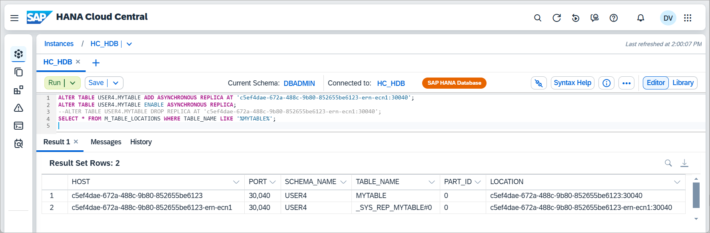

    Run the below SQL to indicate that the workload class should use async replica tables.

    ```SQL
    ALTER WORKLOAD CLASS "WLC1" SET 'RESULT LAG HINT' = 'HANA_ATR';  --use the replica
    --ALTER WORKLOAD CLASS "WLC1" UNSET 'RESULT LAG HINT';
    ```

    Further details on using hints can be found at [Using Hints with Select Statements](https://help.sap.com/docs/HANA_CLOUD_DATABASE/f9c5015e72e04fffa14d7d4f7267d897/performance-using-hints-to-query-data-snapshots).

    Run the SQL below

    ```SQL
    CALL CPU_AND_MEMORY_SPIKE();

    SELECT HOST, STATEMENT_STRING, ACCESSED_TABLE_NAMES, TABLE_LOCATIONS, USER_NAME, LAST_EXECUTION_TIMESTAMP  
    FROM M_SQL_PLAN_CACHE 
    WHERE ACCESSED_TABLE_NAMES LIKE '%MYTABLE%'
    ORDER BY LAST_EXECUTION_TIMESTAMP DESC;
    ```

    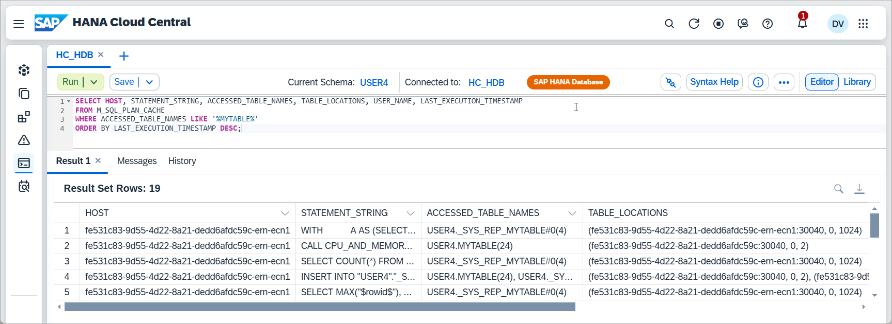

    Notice that this time the table is also located on the ECN. 

### Remove the workload class and ECN
Before removing the ECN node, disable the workload class so that new queries are no longer directed to the ECN node.

1. Execute the below SQL

    ```SQL
    ALTER WORKLOAD CLASS "WLC1" DISABLE;
    ```

    If the ECN is removed and the workload class is still enabled, workloads directed to the ECN will fail with an error message "Client failed to reroute after a server change in workload class routing: Invalid routing location".  This behavior can be changed using the [force_reroute](https://help.sap.com/docs/hana-cloud-database/sap-hana-cloud-sap-hana-database-administration-guide/wlc) setting.
    
2. Remove the ECN.  

    ```SHELL
    btp update services/instance --id <instance ID> --parameters no_ecn.json
    btp.exe get services/instance <instance ID>
    ```

### Procedure to check if the ECN is started
The following procedure can be used to check if the ECN is available and then when it is to run a workload.

1. Execute the below SQL

    ```SQL
    DROP WORKLOAD MAPPING "WLM1";
    CREATE WORKLOAD MAPPING "WLM3" WORKLOAD CLASS "WLC1" SET 'SCHEMA NAME' = 'USER4', 'OBJECT NAME' = 'CPU_AND_MEMORY_SPIKE';

    CREATE OR REPLACE PROCEDURE WAIT_FOR_ECN() LANGUAGE SQLSCRIPT AS
    BEGIN
        USING SQLSCRIPT_PRINT AS PRTLIB;
        USING SQLSCRIPT_SYNC AS SYNCLIB;
		--Check if the ECN is running, pause if not
		DECLARE state STRING := '';
		SELECT TOP 1 SERVICE_ACTIVE INTO state DEFAULT NULL FROM M_SYSTEM_AVAILABILITY WHERE HOST LIKE '%-ern-%' ORDER BY EVENT_TIME DESC;
		PRTLIB:PRINT_LINE(state);
		WHILE :state != 'YES' DO
		    CALL SYNCLIB:SLEEP_SECONDS(10);
		    SELECT TOP 1 SERVICE_ACTIVE INTO state DEFAULT NULL FROM M_SYSTEM_AVAILABILITY WHERE HOST LIKE '%-ern-%' ORDER BY EVENT_TIME DESC;
		    PRTLIB:PRINT_LINE(state);
		END WHILE;
    END;
    CALL WAIT_FOR_ECN();
    CALL CPU_AND_MEMORY_SPIKE();
    ```

### ECN sample script
The following steps demonstrate an approach to automating the creation, running a workload, and deletion of an ECN.

1. Create a file named **ecn_workload.sql**.

2. Paste the following SQL into the file.

    ```SQL
    CALL WAIT_FOR_ECN();
    ALTER WORKLOAD CLASS "WLC1" ENABLE;
    CALL CPU_AND_MEMORY_SPIKE();
    ALTER WORKLOAD CLASS "WLC1" DISABLE;
    ```

3. Run the following commands.

    ```Shell
    hdbuserstore Set USER4UserKey 3805416e-c1e8-4753-b86f-e0a966a49e28.hana.prod-ca10.hanacloud.ondemand.com:443 USER4 Password4
    btp update services/instance --id 3805416e-c1e8-4753-b86f-e0a966a49e28 --parameters ecn1.json
    hdbsql -A -o results.txt -U USER4UserKey -I ecn_workload.sql
    btp update services/instance --id 3805416e-c1e8-4753-b86f-e0a966a49e28 --parameters no_ecn.json
    ```

    Instructions on using hdbsql and setting the user key can be found at [Executing SQL Statements from a shell](hana-cloud-automation-cli).


### ECN advisor
SAP HANA Cloud Central includes an ECN advisor that provides recommendations for workloads that may be applicable to be run on an ECN.


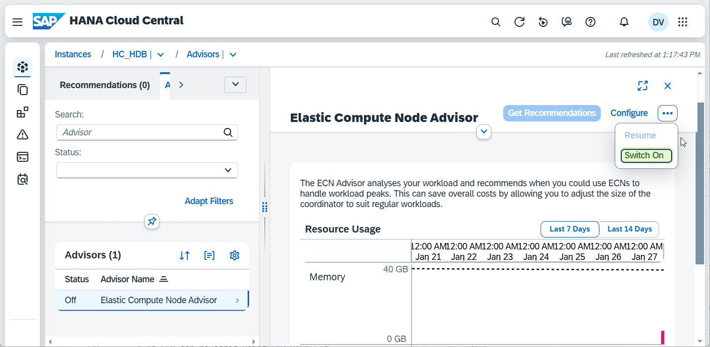

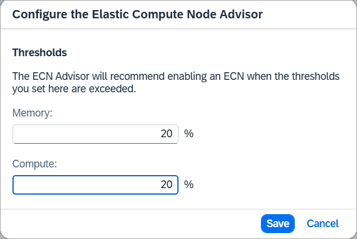

There are a few requirements with the advisor:
    
* The instance must have 5 vCPUs

* A workload class is required

* The timeframe duration must not exceed 24 hours

* The timeframe cannot be less than 30 minutes. 

* The timeframe must be within the last 14 days

* The timeframe must be 20 minutes later than the current timestamp. 


### Knowledge check
You have now explored Elastic Compute Nodes and how they can be used to address peaks in scheduled workloads.
