# Use an Elastic Compute Node (ECN) for Scheduled Workloads
<!-- description --> Learn about Elastic Compute Nodes (ECNs) and how they can be used to address known peaks in scheduled workloads.

## Prerequisites
- An SAP BTP account
- An SAP HANA Cloud instance (2024 QRC 4 or higher)

## You will learn
- How to create and delete an ECN
- How to create a workload class and map its workload to an ECN
- How to view additional details about ECNs

---

An [Elastic Compute Node](https://help.sap.com/docs/hana-cloud-database/sap-hana-cloud-sap-hana-database-administration-guide/scale-out-using-elastic-compute-node) (ECN) can be added when it is known that additional queries will be run that take significant CPU or memory resources such as at the end of the month or quarter.  Once the queries complete, the node can be removed.  ECNs incur additional [costs](https://www.sap.com/about/trust-center/agreements/cloud/cloud-services.html?search=Supplement%20HANa%20Cloud&sort=latest_desc&tag=language%3Aenglish&pdf-asset=2e80541a-f07e-0010-bca6-c68f7e60039b&page=3) while running but can improve performance or could lower the total cost of ownership if their usage can reduce the instance size by covering known peak loads.  In the screenshot below, if the timing of the darker blue peaks are known and are read only, an ECN node can be started and the workloads directed to the ECN enabling the overall size of the SAP HANA instance to be reduced.  The [SAP HANA Cloud Capacity Unit Estimator](https://hcsizingestimator.cfapps.eu10.hana.ondemand.com/) can be used to estimate the additional cost of adding ECNs.  ECNs are not available in trial or free tier.  Further details on Elastic Compute Nodes can be also found at [Harnessing Dynamic Elasticity (Elastic Compute Node) for Smarter Scaling in SAP HANA Cloud](https://community.sap.com/t5/technology-blogs-by-sap/harnessing-dynamic-elasticity-elastic-compute-node-for-smarter-scaling-in/ba-p/14016836).


ECNs can be used to address compute intensive OLAP or read-only queries and as such, only temporary tables or replica tables can be stored on ECN instances.  Queries can be routed to ECN nodes using client-side statement routing or workload classes.

The following steps attempt to demonstrate an example of adding an ECN to cover known peaks in workload.  


### Identify tasks to be run on an Elastic Compute Node (ECN)
1. Read only CPU or memory intensive tasks that occur at a set frequency are suitable candidates to consider redirecting to an ECN.  The CPU and memory used by your instance can be viewed in the usage monitor app in SAP HANA Cloud Central as shown below.

    

    Click on the memory, compute, network, or storage cards to open the Usage Monitor app.  Below, notice that the compute is spiking at a set frequency which is every morning at 7 am.
    
    

2. The following examples are used for simulation purposes and can create a memory and CPU spike that will be moved to an ECN node.  They are intended to be run on a test or trial instance and not a production instance.  The size of the spike can be adjusted by increasing or decreasing the number of rows in the table. 

    ```SQL
    CREATE USER USER4 PASSWORD "Password4"  NO FORCE_FIRST_PASSWORD_CHANGE SET USERGROUP DEFAULT;
    GRANT CATALOG READ TO USER4; 
    GRANT SELECT ON SCHEMA _SYS_STATISTICS TO USER4;  --Used by the Elastic Compute Node tab
    GRANT WORKLOAD ADMIN TO USER4; 
    CONNECT USER4 PASSWORD Password4;
    GRANT ALL PRIVILEGES ON SCHEMA USER4 TO DBADMIN;

    CREATE TABLE MYTABLE(VAL1 DOUBLE);
    --Demonstrates how an expensive query is made using cross joins
    INSERT INTO MYTABLE VALUES(1);
    INSERT INTO MYTABLE VALUES(2);
    INSERT INTO MYTABLE VALUES(3);
    SELECT * FROM MYTABLE T1, MYTABLE T2, MYTABLE T3;

    CREATE OR REPLACE PROCEDURE POPULATE_MYTABLE(NUMOFROWS INT) LANGUAGE SQLSCRIPT AS
    BEGIN
        USING SQLSCRIPT_PRINT AS PRTLIB;
        DECLARE i INT;
        TRUNCATE TABLE USER4.MYTABLE;
        FOR i IN 1 .. :NUMOFROWS DO
            INSERT INTO MYTABLE VALUES(RAND_SECURE());
        END FOR;
    END;

    CREATE OR REPLACE PROCEDURE CPU_SPIKE() LANGUAGE SQLSCRIPT AS
    BEGIN
        USING SQLSCRIPT_PRINT AS PRTLIB;
        SELECT SUM(T1.VAL1 + T2.VAL1 + T3.VAL1) FROM USER4.MYTABLE T1, USER4.MYTABLE T2, USER4.MYTABLE T3;
    END;

    CALL POPULATE_MYTABLE(2000);

    --9 seconds and 32 seconds of CPU time each call
    CALL CPU_SPIKE();
    CALL CPU_SPIKE();
    CALL CPU_SPIKE();
    CALL CPU_SPIKE();
    CALL CPU_SPIKE();
    CALL CPU_SPIKE();

    CREATE OR REPLACE PROCEDURE CPU_AND_MEMORY_SPIKE() LANGUAGE SQLSCRIPT AS
    BEGIN
        USING SQLSCRIPT_PRINT AS PRTLIB;
        WITH 
        A AS (SELECT DISTINCT VAL1 AS A1 FROM USER4.MYTABLE ORDER BY VAL1 DESC),
        B AS (SELECT DISTINCT VAL1 AS B1 FROM USER4.MYTABLE ORDER BY VAL1 ASC),
        C AS (SELECT DISTINCT VAL1 AS C1 FROM USER4.MYTABLE ORDER BY VAL1 DESC)
        SELECT TOP 1 DISTINCT A1 + B1 + C1 FROM A, B, C;
    END;

    CALL POPULATE_MYTABLE(750);

    --8 seconds, 30 sec CPU time, 9 GB of memory each call
    CALL CPU_AND_MEMORY_SPIKE();
    CALL CPU_AND_MEMORY_SPIKE();
    CALL CPU_AND_MEMORY_SPIKE();
    CALL CPU_AND_MEMORY_SPIKE();
    CALL CPU_AND_MEMORY_SPIKE();
    CALL CPU_AND_MEMORY_SPIKE();
    ```

    After calling the stored procedure CPU_SPIKE and CPU_AND_MEMORY_SPIKE, you can see that the CPU and memory usage has spiked, and you may also see an alert.  Note that the metrics shown are polled once a minute, so the procedures are run multiple times.

    

    The following SQL statement can also be used if expensive statement tracing is enabled.

    ```SQL
    SELECT START_TIME, STATEMENT_STRING, DURATION_MICROSEC, MEMORY_SIZE, CPU_TIME, DB_USER FROM M_EXPENSIVE_STATEMENTS;
    ```

### Create an ECN
An ECN can be created in multiple ways.  Further details on the options and limitations when creating an ECN node can be found at [ECN Scope and Limitations](https://help.sap.com/docs/hana-cloud-database/sap-hana-cloud-sap-hana-database-administration-guide/ecn-scope-and-limitations).

1. Examine the options for creating an ECN.  Create an ECN using one of the methods shown below.

    * An ECN can be added using the manage configuration wizard in SAP HANA Cloud Central.
    
        

    * An ECN can be created or deleted using a CLI. The BTP CLI is shown below but the CF CLI can also be used. 
    
        * Create a file named **ecn1.json** with the contents below which can be used to create an ECN.
    
            ```JSON
            {
                "data": {
                    "elasticreadnodes": [
                        {
                            "name": "ecn1",
                            "vcpu": 2,
                            "memory": 32,
                            "storage": 120
                        }
                    ]
                }
            }
            ```

        * Create a file named **no_ecn.json** with the contents below which can be used to remove the ECN.

            ```JSON
            {
                "data": {
                    "elasticreadnodes": [
                    ]
                }
            }
            ```

    * Create the ECN using the BTP CLI or CF CLI.  Further details on using the CLI's can be found at [Executing SAP HANA Cloud Tasks from the Command Line](hana-cloud-automation-cli).  An example using the BTP CLI is shown below.

            ```Shell
            btp login --sso
            btp update services/instance --id <instance ID> --parameters ecn1.json
            btp.exe get services/instance <instance ID>
            ```

    * An ECN can be created using a REST API.  Further details are available at [REST API for the ECN](https://help.sap.com/docs/hana-cloud-database/sap-hana-cloud-sap-hana-database-administration-guide/rest-api-for-ecn) and [Business Accelerator Hub](https://api.sap.com/api/ComputeAPI/overview).
        
2. Once the ECN has been created, its details can be viewed.

    * In the instances view.
    
        
    
    * In an instances detail pane.

        

        Note that the status is also shown.

    * Through SQL

        ```SQL
        SELECT HOST, PORT FROM M_SERVICES WHERE SERVICE_NAME = 'computeserver';
        SELECT * FROM M_LANDSCAPE_HOST_CONFIGURATION;
        SELECT EVENT_TIME, HOST, SERVICE_ACTIVE FROM M_SYSTEM_AVAILABILITY ORDER BY EVENT_TIME DESC;
        ```

        

### Create a workload class
Workload classes can be used to direct a specified workload to an ECN.  Further details on workload classes can be found at [Workload Management](https://help.sap.com/docs/HANA_CLOUD_DATABASE/f9c5015e72e04fffa14d7d4f7267d897/workload-management).

1. Create a workload class.

    ```SQL    
    CREATE WORKLOAD CLASS "WLC1";
    ```
2.  Route the an ECN.

    The workload class can set a routing hint to the ECN.

    ```SQL
    ALTER WORKLOAD CLASS "WLC1" SET 'ROUTING LOCATION HINT' = 'ecn1';
    ```

    * This can also be accomplished in the workload management app as shown below.

        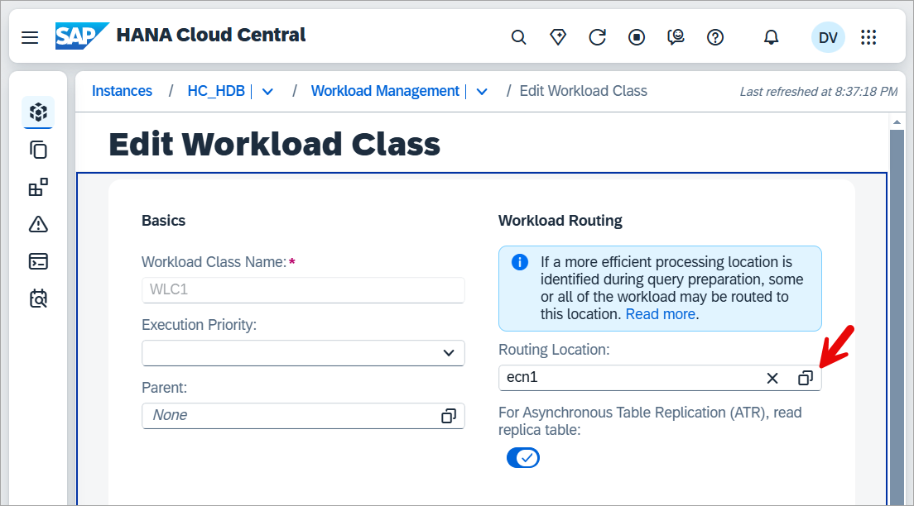

        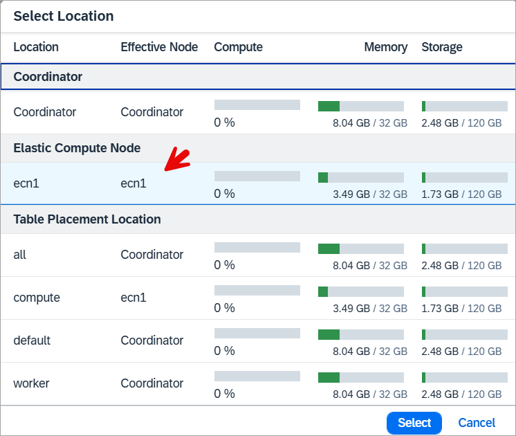

3. Map a workload to the workload class.

    * A mapping to a user can be added

        ```SQL
        CREATE WORKLOAD MAPPING "WLM1" WORKLOAD CLASS "WLC1" SET 'USER NAME' = 'USER4';
        --DROP WORKLOAD MAPPING "WLM1";
        ```

    * A mapping can be made to specific objects

        ```SQL
        CREATE WORKLOAD MAPPING "WLM2" WORKLOAD CLASS "WLC1" SET 'SCHEMA NAME' = 'USER4', 'OBJECT NAME' = 'CPU_SPIKE';
        CREATE WORKLOAD MAPPING "WLM3" WORKLOAD CLASS "WLC1" SET 'SCHEMA NAME' = 'USER4', 'OBJECT NAME' = 'CPU_AND_MEMORY_SPIKE';
        ```

    * A mapping can be made to a session variable

        ```SQL
        CREATE WORKLOAD MAPPING "WLM4" WORKLOAD CLASS "WLC1" SET 'APPLICATION COMPONENT NAME' = 'ECN_APP';
        SET 'APPLICATIONCOMPONENT' = 'ECN_APP';
        SELECT * FROM M_SESSION_CONTEXT WHERE KEY = 'APPLICATIONCOMPONENT';
        --UNSET 'APPLICATIONCOMPONENT';
        --SELECT * FROM M_CONNECTIONS where CLIENT_APPLICATION != '';
        ```

        Additional details for these values can be found at  [CREATE WORKLOAD MAPPING](https://help.sap.com/docs/hana-cloud-database/sap-hana-cloud-sap-hana-database-sql-reference-guide/create-workload-mapping-statement-workload-management).

4. Enable the workload class.

    ```SQL
    ALTER WORKLOAD CLASS "WLC1" DISABLE;
    ALTER WORKLOAD CLASS "WLC1" ENABLE;
    --DROP WORKLOAD CLASS "WLC1";
    ```

    The workload class and its mappings can be seen through SQL or in SAP HANA Cloud Central.

    ```SQL
    SELECT * FROM WORKLOAD_CLASSES;
    SELECT * FROM WORKLOAD_MAPPINGS;
    ```

    

5. Run the query again and verify that the query was run on the ECN node.

    ```SQL
    CALL CPU_AND_MEMORY_SPIKE();

    SELECT HOST, STATEMENT_STRING, ACCESSED_TABLE_NAMES, TABLE_LOCATIONS, USER_NAME, LAST_EXECUTION_TIMESTAMP 
        FROM M_SQL_PLAN_CACHE 
        WHERE STATEMENT_STRING LIKE 'CALL CPU_AND_MEMORY_SPIKE()' 
        ORDER BY LAST_EXECUTION_TIMESTAMP DESC;
    --ALTER SYSTEM CLEAR SQL PLAN CACHE;
    ```

    

    Notice that the last time the query was run, it was executed on the ECN as the HOST value ends in ecn1.  Notice also that the table location is not on the ECN.

    It is also possible to direct a query to a workload class through a hint as shown below.

    ```SQL
    CALL CPU_AND_MEMORY_SPIKE() WITH HINT(WORKLOAD_CLASS("WLC1"));
    ```

    It may also be of interest to compare the execution time between this run and after the table is replicated onto the ECN node in a subsequent step.

### Route to ECN with a hint
An alternate approach without using a workload class is to use a hint.  

1. Execute the below SQL.

    ```SQL
    ALTER WORKLOAD CLASS "WLC1" DISABLE;

    SELECT * FROM M_VOLUMES;  --1024 is the VOLUME_ID for the ECN
    
    CALL USER4.CPU_AND_MEMORY_SPIKE() with hint (RESULT_LAG('HANA_ATR'), route_to(1024));
    
    SELECT HOST, STATEMENT_STRING, ACCESSED_TABLE_NAMES, TABLE_LOCATIONS, USER_NAME, LAST_EXECUTION_TIMESTAMP 
    FROM M_SQL_PLAN_CACHE 
    WHERE STATEMENT_STRING LIKE 'CALL %' 
    ORDER BY LAST_EXECUTION_TIMESTAMP DESC;
    ```

    

### Replicate a table to the ECN
A replica table can be stored on an ECN.  This may lead to lower resource consumption on the coordinator and reduced latency.  For additional details see [Advantages and Disadvantages of Table Replication](https://help.sap.com/docs/hana-cloud-database/sap-hana-cloud-sap-hana-database-administration-guide/advantages-and-disadvantages-of-table-replication).  The following steps demonstrate replicating a table to the ECN and using it in a query.  

1. Run the below in the SQL Console after replacing the host name with the value from the previous query against the M_VOLUMES table view.

    ```SQL
    ALTER WORKLOAD CLASS "WLC1" ENABLE;

    ALTER TABLE USER4.MYTABLE ADD ASYNCHRONOUS REPLICA AT '6101b9d8-bcad-44dc-98c4-388e64ce7370-ern-ecn1:30040';

    ALTER TABLE USER4.MYTABLE ENABLE ASYNCHRONOUS REPLICA;
    --ALTER TABLE USER4.MYTABLE DISABLE ASYNCHRONOUS REPLICA;
    --ALTER TABLE USER4.MYTABLE DROP REPLICA AT '6101b9d8-bcad-44dc-98c4-388e64ce7370-ern-ecn1:30040';
    
    SELECT * FROM M_TABLE_LOCATIONS WHERE TABLE_NAME LIKE '%MYTABLE%';
    SELECT * FROM M_TABLE_REPLICAS;
    ```

    

    Run the below SQL to indicate that the workload class should use async replica tables.

    ```SQL
    ALTER WORKLOAD CLASS "WLC1" SET 'RESULT LAG HINT' = 'HANA_ATR';  --use the replica
    --ALTER WORKLOAD CLASS "WLC1" UNSET 'RESULT LAG HINT';
    ```

    Further details on using hints can be found at [Using Hints with Select Statements](https://help.sap.com/docs/HANA_CLOUD_DATABASE/f9c5015e72e04fffa14d7d4f7267d897/performance-using-hints-to-query-data-snapshots).

    Run the SQL below

    ```SQL
    CALL CPU_AND_MEMORY_SPIKE();

    SELECT HOST, STATEMENT_STRING, ACCESSED_TABLE_NAMES, TABLE_LOCATIONS, USER_NAME, LAST_EXECUTION_TIMESTAMP  
    FROM M_SQL_PLAN_CACHE 
    WHERE ACCESSED_TABLE_NAMES LIKE '%MYTABLE%'
    ORDER BY LAST_EXECUTION_TIMESTAMP DESC;
    ```

    

    Notice that this time the table is also located on the ECN. 

### Remove the workload class and ECN
Before removing the ECN node, disable the workload class so that new queries are no longer directed to the ECN node.

1. Execute the below SQL

    ```SQL
    ALTER WORKLOAD CLASS "WLC1" DISABLE;
    ```

    If the ECN is removed and the workload class is still enabled, workloads directed to the ECN will fail with an error message "Client failed to reroute after a server change in workload class routing: Invalid routing location".  This behavior can be changed using the [force_reroute](https://help.sap.com/docs/hana-cloud-database/sap-hana-cloud-sap-hana-database-administration-guide/routing-queries-to-replicas) setting.

    ```SQL
    ALTER SYSTEM ALTER CONFIGURATION ('global.ini', 'DATABASE') SET ('distribution', 'force_reroute') = 'FALSE' WITH RECONFIGURE;
    SELECT * FROM SYS.M_CONFIGURATION_PARAMETER_VALUES WHERE SECTION = 'distribution';
    ```
    
2. Remove the ECN.  

    ```SHELL
    btp update services/instance --id <instance ID> --parameters no_ecn.json
    btp.exe get services/instance <instance ID>
    ```

### Node.js app demonstrating the routedirectexecute setting
The below Node.js app is used to demonstrate that statements must be prepared first to be correctly routed as documented at [Statement Routing](https://help.sap.com/docs/SAP_HANA_CLIENT/f1b440ded6144a54ada97ff95dac7adf/077d30cc847443288d3f0574356de4e7.html).

The below code when run will not be executed on the ECN unless, the variable prepare is set to true or the routeDirectExecute option is set to true.

Further details on creating applications that connect to an SAP HANA Cloud database can be found at [Use Clients to Query an SAP HANA Database](https://developers.sap.com/mission.hana-cloud-clients.html).

1. Try running the below app and adjust the prepare and routeDirectExecute variables.

    ```JavaScript
    'use strict';
    var util = require('util');
    var hana = require('@sap/hana-client');

    //Used to specify if prepare should be called before executing a query
    var prepare = false;  

    var connOptions = {
        //default value is false.  If a statement is not prepared before executed, it is not routed to the ECN.  Setting this value to true ensures a prepare.
        //Further details at https://help.sap.com/docs/SAP_HANA_CLIENT/f1b440ded6144a54ada97ff95dac7adf/4fe9978ebac44f35b9369ef5a4a26f4c.html
        routeDirectExecute: 'false',

        //Specify the connection parameters
        serverNode: 'host:port',
        UID: 'USER4',
        PWD: 'Password4',
    };
    console.log('routeDirectExecute: ' + connOptions.routeDirectExecute);

    var connection = hana.createConnection();

    connection.connect(connOptions);

    var sql = 'SELECT SUM(VAL1) FROM MYTABLE;';
    var result;
    if (prepare) {
        //Prepare before execute
        console.log('prepare: ' + prepare);
        const statement = connection.prepare(sql);
        var results = statement.execQuery();
        if (results.next()) {
            result=results.getValues();
        } ;
    }
    else {
        //Direct execute, 
        //Unless routeDirectExecute is set to true, this is not routed to ECN
        console.log('prepare: ' + prepare);
        result = connection.exec(sql);
    }
    console.log(util.inspect(result, { colors: false }));

    //By looking at the host value, it can be determined if the previous query was run on the ECN node or not.
    sql = "SELECT HOST, STATEMENT_STRING, ACCESSED_TABLE_NAMES, TABLE_LOCATIONS, USER_NAME, LAST_EXECUTION_TIMESTAMP FROM M_SQL_PLAN_CACHE WHERE STATEMENT_STRING LIKE 'SELECT SUM(VAL1) FROM MYTABLE;' ORDER BY LAST_EXECUTION_TIMESTAMP DESC;"
    result = connection.exec(sql);
    console.log(util.inspect(result[0], { colors: false }));
    connection.disconnect();
    ```

    Output when the variable prepare is false.

    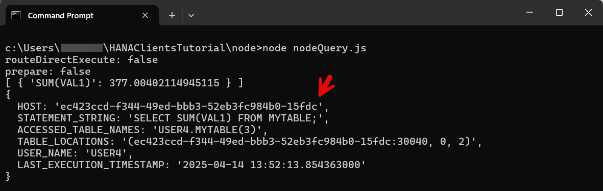
    
    Output when the variable prepare is true.

    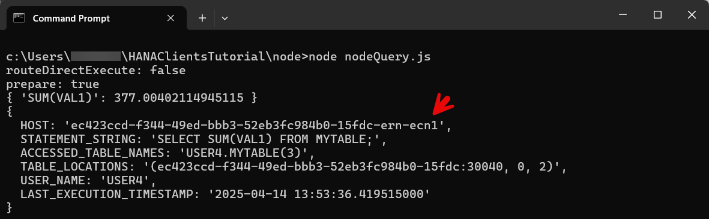

    Output when the variable prepare is false but routeDirectExecute is true.

    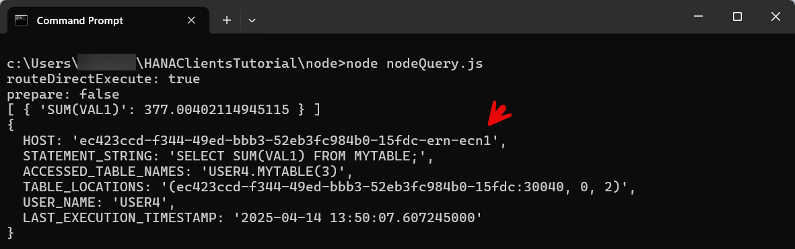

### Procedure to check if the ECN is started
The following procedure can be used to check if the ECN is available and then when it is to run a workload.

1. Execute the below SQL

    ```SQL
    DROP WORKLOAD MAPPING "WLM1";
    CREATE WORKLOAD MAPPING "WLM3" WORKLOAD CLASS "WLC1" SET 'SCHEMA NAME' = 'USER4', 'OBJECT NAME' = 'CPU_AND_MEMORY_SPIKE';

    CREATE OR REPLACE PROCEDURE WAIT_FOR_ECN() LANGUAGE SQLSCRIPT AS
    BEGIN
        USING SQLSCRIPT_PRINT AS PRTLIB;
        USING SQLSCRIPT_SYNC AS SYNCLIB;
		--Check if the ECN is running, pause if not
		DECLARE state STRING := '';
		SELECT TOP 1 SERVICE_ACTIVE INTO state DEFAULT NULL FROM M_SYSTEM_AVAILABILITY WHERE HOST LIKE '%-ern-%' ORDER BY EVENT_TIME DESC;
		PRTLIB:PRINT_LINE(state);
		WHILE :state != 'YES' DO
		    CALL SYNCLIB:SLEEP_SECONDS(10);
		    SELECT TOP 1 SERVICE_ACTIVE INTO state DEFAULT NULL FROM M_SYSTEM_AVAILABILITY WHERE HOST LIKE '%-ern-%' ORDER BY EVENT_TIME DESC;
		    PRTLIB:PRINT_LINE(state);
		END WHILE;
    END;
    CALL WAIT_FOR_ECN();
    CALL CPU_AND_MEMORY_SPIKE();
    ```

### ECN sample script
The following steps demonstrate an approach to automating the creation, running a workload, and deletion of an ECN.

1. Create a file named **ecn_workload.sql**.

2. Paste the following SQL into the file.

    ```SQL
    CALL WAIT_FOR_ECN();
    ALTER WORKLOAD CLASS "WLC1" ENABLE;
    CALL CPU_AND_MEMORY_SPIKE();
    ALTER WORKLOAD CLASS "WLC1" DISABLE;
    ```

3. Run the following commands.

    ```Shell
    hdbuserstore Set USER4UserKey 3805416e-c1e8-4753-b86f-e0a966a49e28.hana.prod-ca10.hanacloud.ondemand.com:443 USER4 Password4
    btp update services/instance --id 3805416e-c1e8-4753-b86f-e0a966a49e28 --parameters ecn1.json
    hdbsql -A -o results.txt -U USER4UserKey -I ecn_workload.sql
    btp update services/instance --id 3805416e-c1e8-4753-b86f-e0a966a49e28 --parameters no_ecn.json
    ```

    Instructions on using hdbsql and setting the user key can be found at [Executing SQL Statements from a shell](hana-cloud-automation-cli).

### Use SAP Automation Pilot with an ECN
The SAP Automation Pilot can be used to perform and schedule operations on services running in the SAP BTP.  The tutorial [Automating SAP HANA Cloud Tasks with the SAP Automation Pilot Service](https://developers.sap.com/tutorials/hana-cloud-automation-pilot.html) can be used to started with the SAP Automation Pilot.  The following step demonstrates how commands can be scheduled which will start and stop an ECN node and also execute SQL to enable or disable a workload class. 

1. Import the catalog below into the SAP Automation Pilot.

    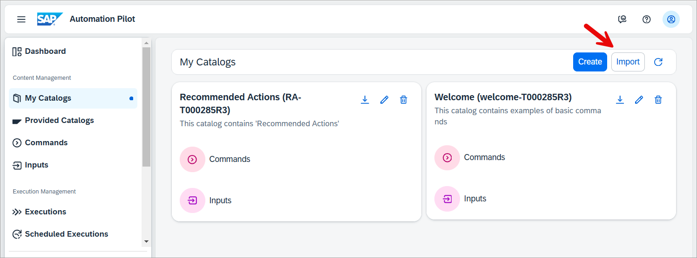

    ```JSON
    {
        "id": "CFECN-<<<TENANT_ID>>>",
        "technicalName": "CFECN",
        "name": "CF ECN",
        "description": "Example commands for creating and deleting an SAP HANA Cloud Elastic Compute Node (ECN)",
        "owner": "<<<TENANT_ID>>>",
        "inputs": [
            {
            "id": "CFECN-<<<TENANT_ID>>>:HCInstance:1",
            "name": "HCInstance",
            "description": "Required parameters to connect to an SAP HANA Cloud database instance in the Cloud Foundry runtime environment.",
            "catalog": "CFECN-<<<TENANT_ID>>>",
            "owner": null,
            "version": 1,
            "keys": {
                "db-user": {
                "type": "string",
                "sensitive": false,
                "description": null
                },
                "cf-org-id": {
                "type": "string",
                "sensitive": false,
                "description": "CF Org name or Org ID from subaccount overview page"
                },
                "param-delete": {
                "type": "object",
                "sensitive": false,
                "description": "JSON string removing all ECN nodes"
                },
                "enable-workload-class": {
                "type": "string",
                "sensitive": false,
                "description": null
                },
                "db-password": {
                "type": "string",
                "sensitive": true,
                "description": null
                },
                "cf-region": {
                "type": "string",
                "sensitive": false,
                "description": "Examine CF API Endpoint in the subaccount overview page.  Example values: cf-us10, cf-us10-001"
                },
                "password": {
                "type": "string",
                "sensitive": true,
                "description": "BTP password for a user without 2 factor authentication"
                },
                "port": {
                "type": "string",
                "sensitive": false,
                "description": null
                },
                "instance-name": {
                "type": "string",
                "sensitive": false,
                "description": "Instance name of the SAP HANA Cloud database."
                },
                "disable-workload-class": {
                "type": "string",
                "sensitive": false,
                "description": null
                },
                "host": {
                "type": "string",
                "sensitive": false,
                "description": "HANA database host value.  Example value: 8cb535f6-dca6-4075-a110-afa10f2823f1.hana.prod-ca10.hanacloud.ondemand.com"
                },
                "param-create": {
                "type": "object",
                "sensitive": false,
                "description": "JSON string describing the ECN node to create"
                },
                "user": {
                "type": "string",
                "sensitive": false,
                "description": "BTP user"
                },
                "cf-space": {
                "type": "string",
                "sensitive": false,
                "description": "Cloud Foundry space.  Value can be seen in the cloud foundry spaces page.  Example value: dev"
                }
            },
            "values": {
                "cf-region": "cf-ca10",
                "db-user": "DBADMIN",
                "port": "443",
                "instance-name": "HC_HDB",
                "disable-workload-class": "ALTER WORKLOAD CLASS \"WLC1\" DISABLE;",
                "host": "8cb535f6-dca6-4075-a110-afa10f2823f1.hana.prod-ca10.hanacloud.ondemand.com",
                "cf-org-id": "HANA Product Management_dan-van-leeuwen",
                "param-delete": "{\"data\":{\"elasticreadnodes\":[]}}",
                "enable-workload-class": "ALTER WORKLOAD CLASS \"WLC1\" ENABLE;",
                "param-create": "{\"data\":{\"elasticreadnodes\":[{\"name\":\"ecn1\",\"vcpu\":2,\"memory\":32,\"storage\":120}]}}",
                "user": "dan@hotmail.com",
                "cf-space": "dev",
                "db-password": "",
                "password": ""
            },
            "tags": {}
            }
        ],
        "commands": [
            {
            "configuration": {
                "values": [
                {
                    "alias": "InstanceAlias",
                    "valueFrom": {
                    "inputReference": "CFECN-<<<TENANT_ID>>>:HCInstance:1",
                    "inputKey": null
                    }
                }
                ],
                "output": {},
                "executors": [
                {
                    "execute": "cf-sapcp:UpdateCfServiceInstance:1",
                    "input": {
                    "password": "$(.InstanceAlias.password)",
                    "org": "$(.InstanceAlias.cf-org-id)",
                    "serviceInstance": "$(.InstanceAlias.instance-name)",
                    "region": "$(.InstanceAlias.cf-region)",
                    "user": "$(.InstanceAlias.user)",
                    "parameters": "$(.InstanceAlias.param-create)",
                    "space": "$(.InstanceAlias.cf-space)"
                    },
                    "alias": "addECN",
                    "description": null,
                    "progressMessage": null,
                    "initialDelay": null,
                    "pause": null,
                    "when": null,
                    "validate": null,
                    "autoRetry": null,
                    "repeat": null,
                    "errorMessages": [],
                    "dryRun": null
                },
                {
                    "execute": "sql-sapcp:ExecuteHanaCloudSqlStatement:1",
                    "input": {
                    "password": "$(.InstanceAlias.db-password)",
                    "statement": "$(.InstanceAlias.enable-workload-class)",
                    "connectionUrl": "jdbc:sap://$(.InstanceAlias.host):$(.InstanceAlias.port)",
                    "user": "$(.InstanceAlias.db-user)"
                    },
                    "alias": "enableWorkloadClass",
                    "description": null,
                    "progressMessage": null,
                    "initialDelay": null,
                    "pause": null,
                    "when": null,
                    "validate": null,
                    "autoRetry": null,
                    "repeat": null,
                    "errorMessages": [],
                    "dryRun": null
                }
                ],
                "listeners": []
            },
            "id": "CFECN-<<<TENANT_ID>>>:AddECN:1",
            "name": "AddECN",
            "description": null,
            "catalog": "CFECN-<<<TENANT_ID>>>",
            "version": 1,
            "inputKeys": {},
            "outputKeys": {},
            "tags": {},
            "issues": []
            },
            {
            "configuration": {
                "values": [
                {
                    "alias": "InstanceAlias",
                    "valueFrom": {
                    "inputReference": "CFECN-<<<TENANT_ID>>>:HCInstance:1",
                    "inputKey": null
                    }
                }
                ],
                "output": {},
                "executors": [
                {
                    "execute": "sql-sapcp:ExecuteHanaCloudSqlStatement:1",
                    "input": {
                    "password": "$(.InstanceAlias.db-password)",
                    "statement": "$(.InstanceAlias.disable-workload-class)",
                    "connectionUrl": "jdbc:sap://$(.InstanceAlias.host):$(.InstanceAlias.port)",
                    "user": "$(.InstanceAlias.db-user)"
                    },
                    "alias": "disableWorkloadClass",
                    "description": null,
                    "progressMessage": null,
                    "initialDelay": null,
                    "pause": null,
                    "when": null,
                    "validate": null,
                    "autoRetry": null,
                    "repeat": null,
                    "errorMessages": [],
                    "dryRun": null
                },
                {
                    "execute": "cf-sapcp:UpdateCfServiceInstance:1",
                    "input": {
                    "password": "$(.InstanceAlias.password)",
                    "org": "$(.InstanceAlias.cf-org-id)",
                    "serviceInstance": "$(.InstanceAlias.instance-name)",
                    "region": "$(.InstanceAlias.cf-region)",
                    "user": "$(.InstanceAlias.user)",
                    "parameters": "$(.InstanceAlias.param-delete)",
                    "space": "$(.InstanceAlias.cf-space)"
                    },
                    "alias": "deleteECN",
                    "description": null,
                    "progressMessage": null,
                    "initialDelay": {
                    "interval": "3m",
                    "when": null
                    },
                    "pause": null,
                    "when": null,
                    "validate": null,
                    "autoRetry": null,
                    "repeat": null,
                    "errorMessages": [],
                    "dryRun": null
                }
                ],
                "listeners": []
            },
            "id": "CFECN-<<<TENANT_ID>>>:DeleteECN:1",
            "name": "DeleteECN",
            "description": null,
            "catalog": "CFECN-<<<TENANT_ID>>>",
            "version": 1,
            "inputKeys": {},
            "outputKeys": {},
            "tags": {},
            "issues": []
            }
        ]
    }
    ```

2. The catalog will appear under My Catalogs and is named CF ECN

    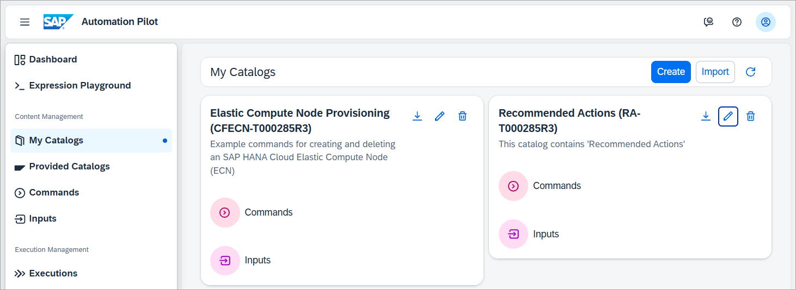

3. Examine the imported commands and inputs. The list of commands are shown below.

    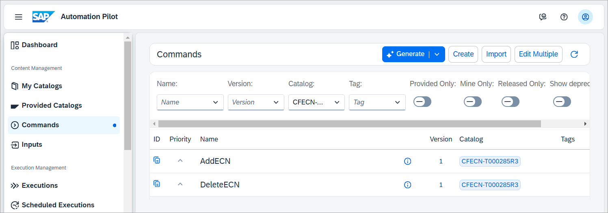

    The input is shown below. It provides a location where the details of the SAP HANA Cloud database and BTP credentials can be provided.

    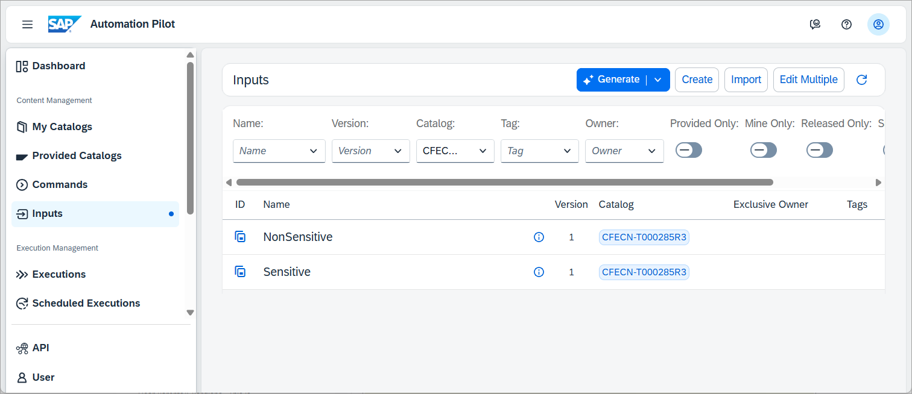

4. Open the input named HCInstance and edit its values to match the SAP HANA Cloud instance that you wish to work with.

    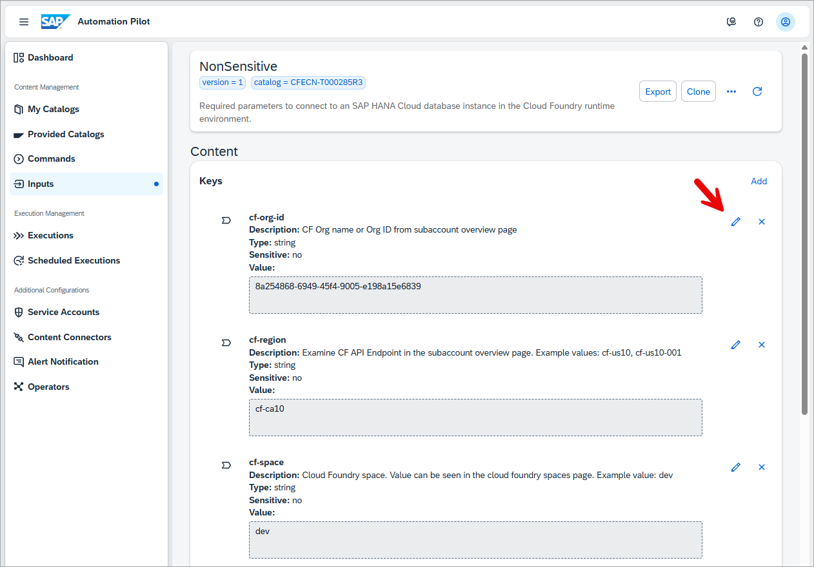

5. Open the AddECN command.  Notice that it takes HCInstance as an additional value to the input and is referenced by the alias InstanceAlias.

    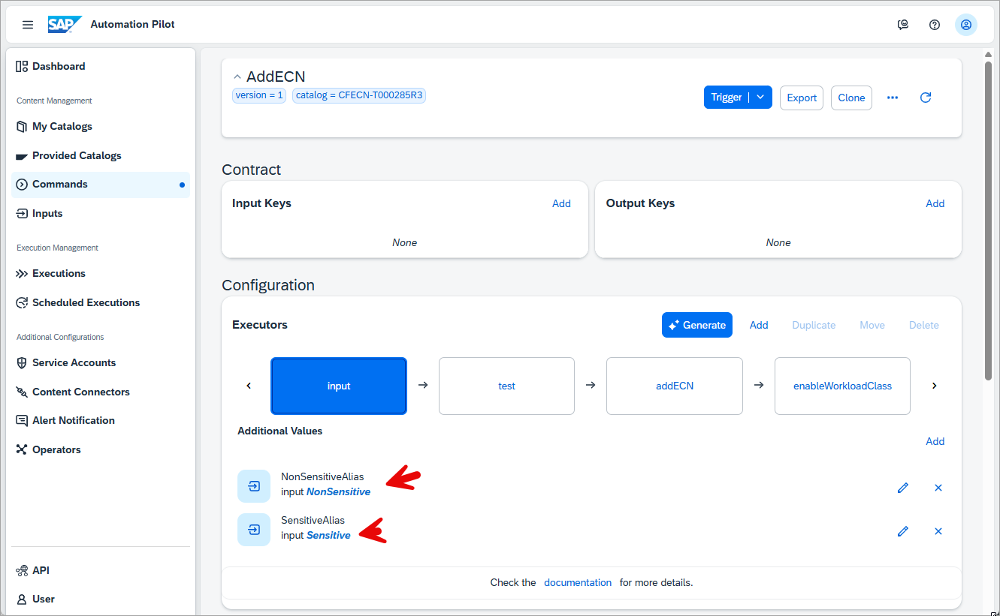

    It contains an addECN executor which uses the built in command cf-sapcp:UpdateCfServiceInstance that will request the ECN node to be created.  Notice also that the parameter values are being set using the InstanceAlias.

    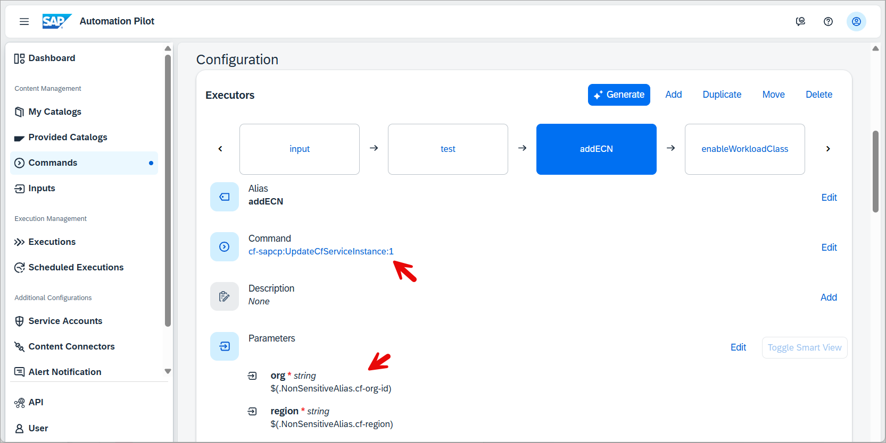
    
    It also contains the enableWorkloadClass executor which executes a SQL statement to enable a workload class which should be used to direct a workload to the just started ECN node.

    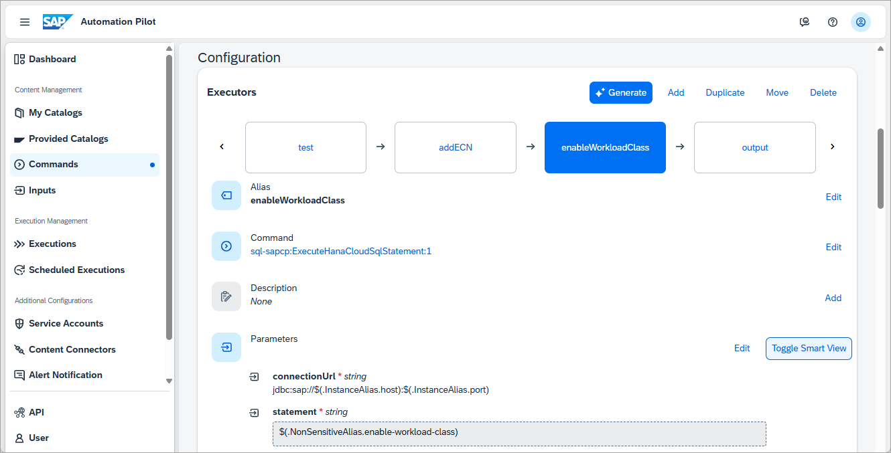

6. Open the DeleteECN command.  Notice that a delay has been added before the ECN is deleted.  Depending on your workloads, you may wish to increase this delay or add a more involved check.

    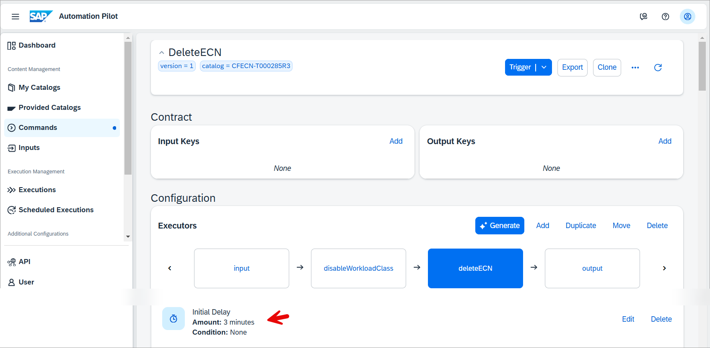

7. Try out the commands by pressing the Trigger button and assigning the input.

    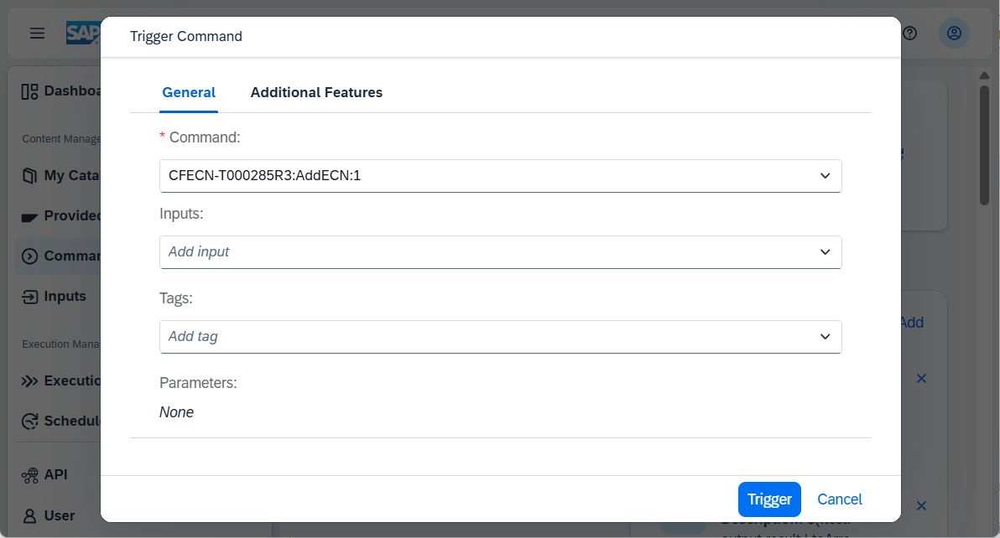

    The status of the execution can be seen in the Executions section.

    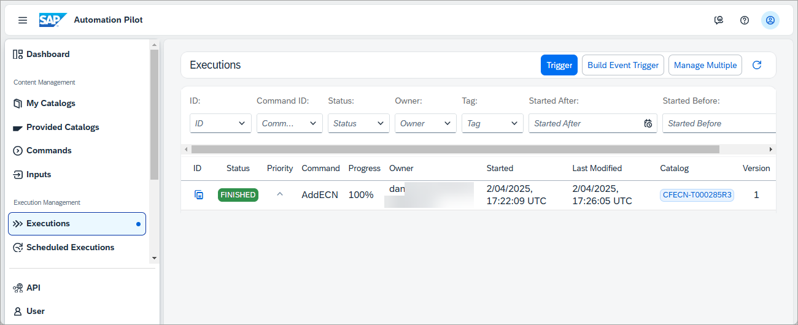

    If your SAP HANA Cloud instance has an allow list configured, add the IP from [IPs for requests from SAP Automation Pilot](https://help.sap.com/docs/automation-pilot/automation-pilot/what-is-sap-automation-pilot?version=Cloud).

    If an error is shown authenticating with the BTP user, ensure that it is a technical user and does not have two factor authentication enabled.  The SAP Note [3085908](https://me.sap.com/notes/3085908) may also help with authentication issues.

8. Schedule the AddECN and DeleteECN commands.

    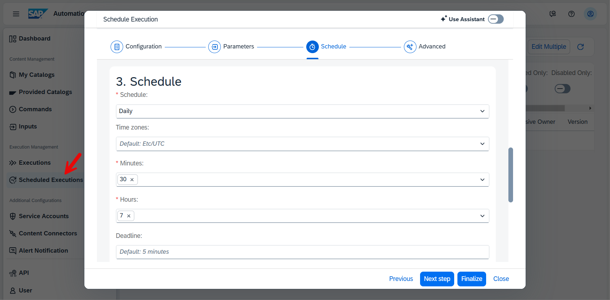

### ECN advisor
SAP HANA Cloud Central includes an ECN advisor that provides recommendations for workloads that may be applicable to be run on an ECN.


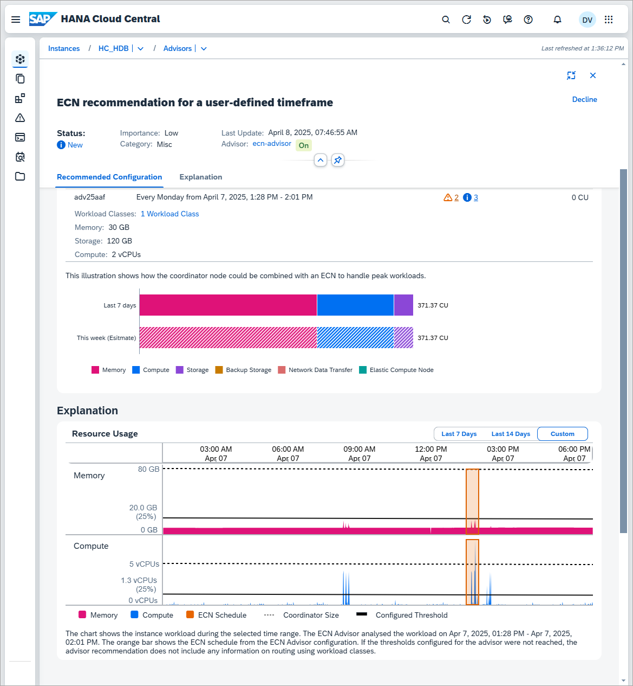

There are a few requirements with the advisor:
    
* The instance must have 5 vCPUs

* A workload class is required

* The timeframe duration must not exceed 24 hours

* The timeframe cannot be less than 30 minutes. 

* The timeframe must be within the last 14 days

* The timeframe must be 20 minutes later than the current timestamp. 


### Knowledge check
You have now explored Elastic Compute Nodes and how they can be used to address peaks in scheduled workloads.
