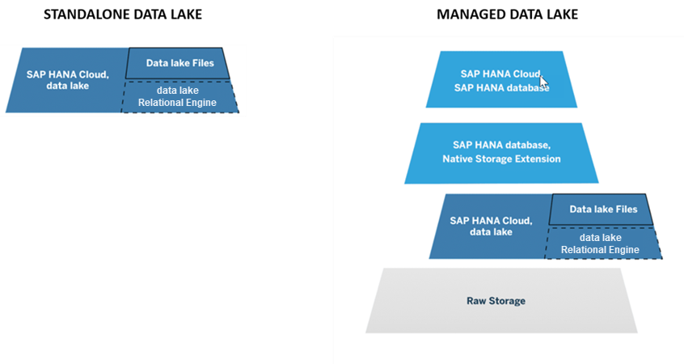
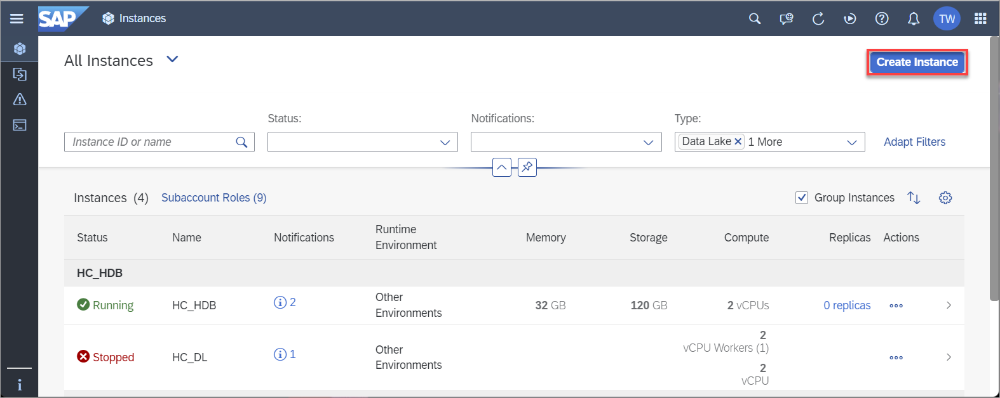
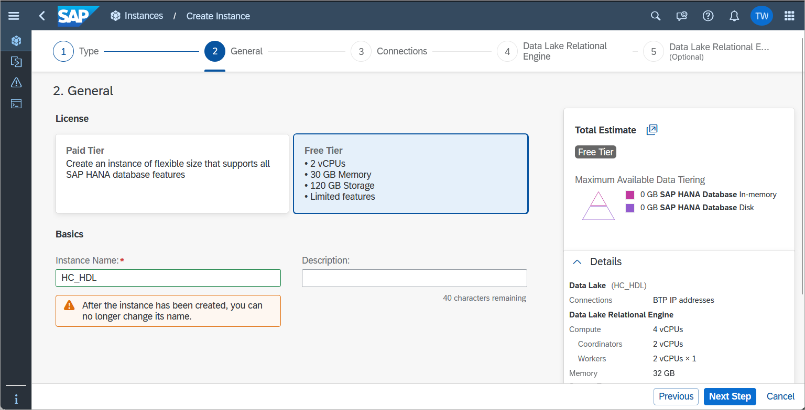
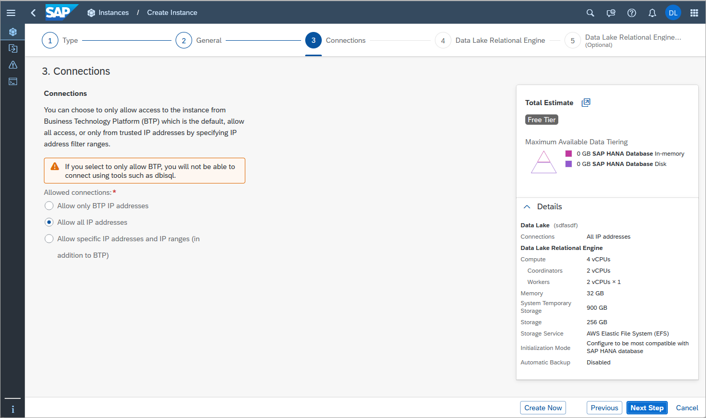
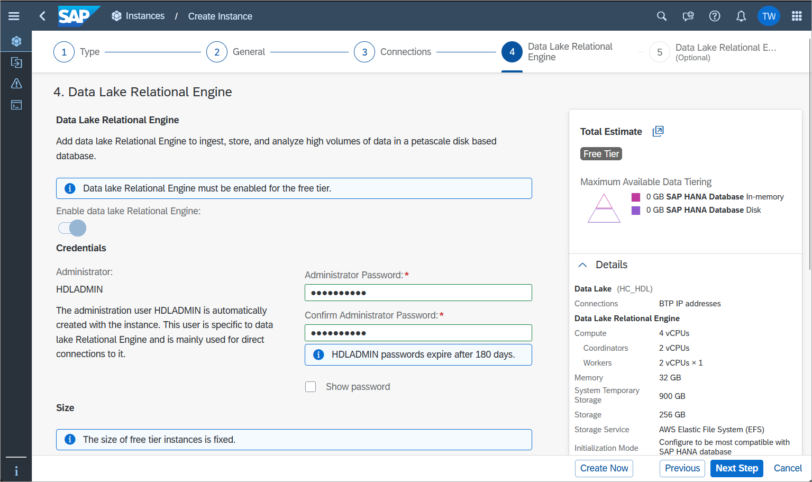
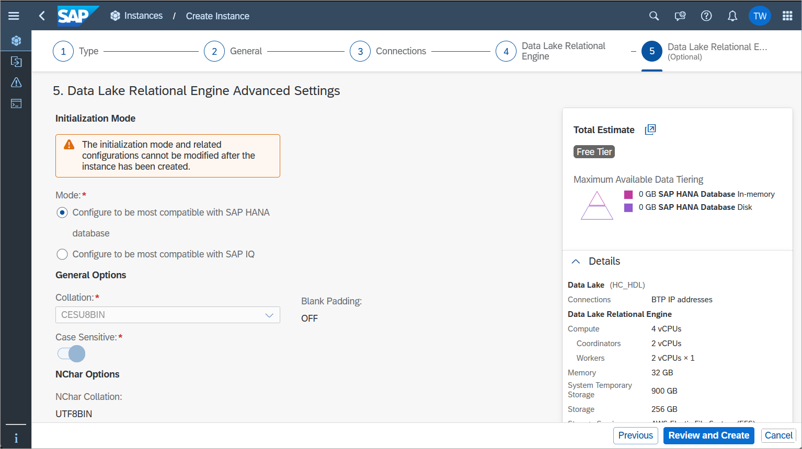
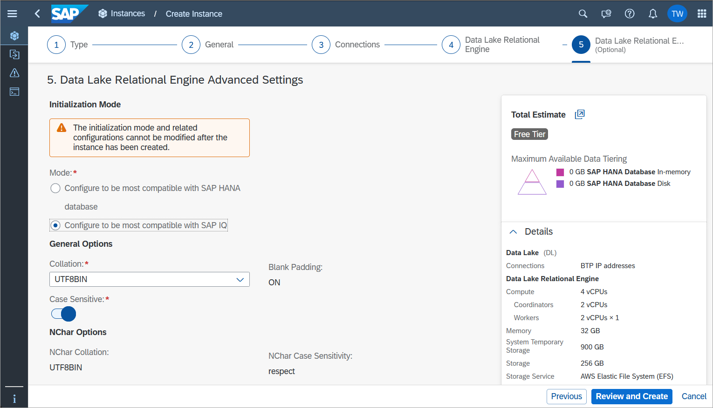
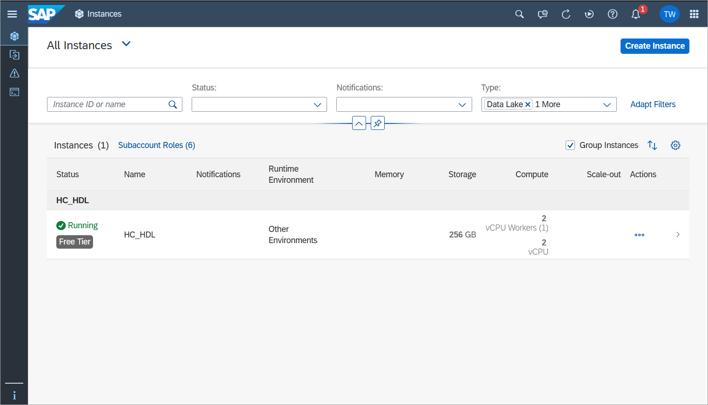
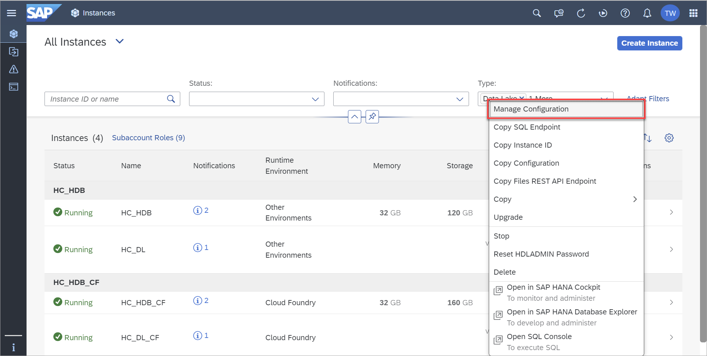
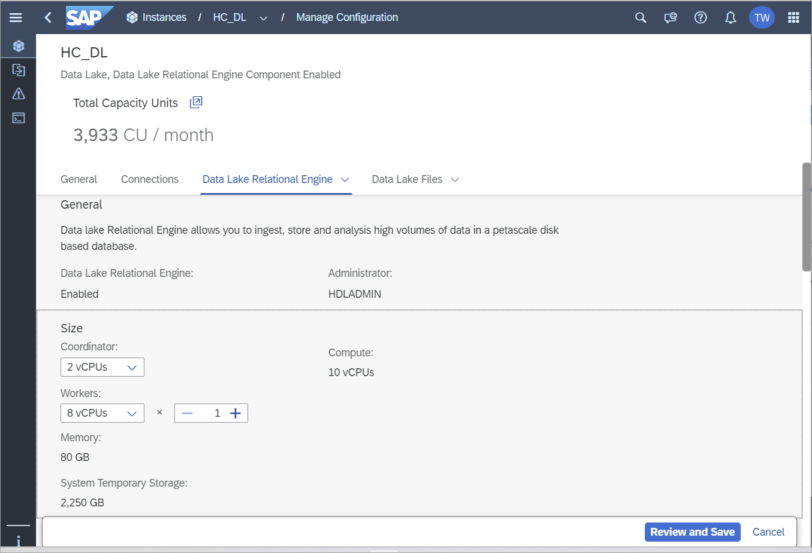

# Provision a Standalone Data Lake in SAP HANA Cloud
<!-- description --> Learn to provision a standalone data lake in SAP HANA Cloud.

## Prerequisites
 - Access to SAP HANA Cloud, either with a free tier, trial account, or with a production account.
 - If you do not have a trial account yet, sign up [here](https://www.sap.com/cmp/td/sap-hana-cloud-trial.html).

## You will learn
  - About the two main components of SAP HANA Cloud, data lake; data lake Relational Engine and data lake Files
  - How to differentiate between managed and standalone data lakes
  - How to provision a standalone data lake
  - How to change the storage capacity of data lake instances
---

>**IMPORTANT**: Before proceeding with this tutorial, be sure you have access to the new multi-environment SAP HANA Cloud tools. For **trial** users, see [Start Using SAP HANA Cloud Trial in SAP BTP Cockpit](hana-cloud-mission-trial-2). For **free tier** users, see [Start Using SAP HANA Cloud Free Tier in SAP BTP Cockpit](hana-cloud-mission-trial-2-ft). You can learn more about the runtime independence for SAP HANA Cloud in this [blog post](https://blogs.sap.com/2022/09/21/sap-hana-cloud-goes-multi-environment-part-1-feature-overview/).

### Introduction to SAP HANA Cloud, data lake

SAP HANA Cloud, data lake is one of the components that make up SAP HANA Cloud. It's composed of two different components, the **data lake Relational Engine** and **Data Lake Files**. 

With SAP HANA Cloud, data lake, you can ingest data from multiple sources, as well as non-SAP cloud storage providers, at high speed. It's an integrated part of SAP HANA Cloud, providing common security mechanisms, tenancy models, and tools operating within SAP HANA Cloud.

SAP HANA Cloud, data lake was built to be scalable and accommodate increases in data volume, in user count, and the complexity of workloads. This tutorial will focus on using SAP HANA Cloud, data lake as a standalone component of SAP HANA Cloud.  

### Data Lake, data lake Relational Engine and Data Lake Files

The two main components of SAP HANA Cloud, data lake are:

1.  **data lake Relational Engine**: data lake Relational Engine enables efficient storage of structured data and high-performance analytics of relational data at petabyte scale. It's enabled by default when you provision a data lake instance, whether it's standalone or managed by an SAP HANA database instance within SAP HANA Cloud.

2.  **Data Lake Files**: Data Lake Files service provides a secure, managed object storage to host structured, semi-structured and unstructured data files. You can query files in a relational format stored in data lake files by using the data lake's **SQL on Files** feature. This allows you to analyze the data with a low-cost strategy, given that this data has an unknown value. It is also easy to share this data with other processing tools. It's enabled by default when you provision a data lake instance, whether it's a standalone or managed by an SAP HANA database instance.

The Data Lake Files component is currently not available in free tier or trial versions of SAP HANA Cloud.

### How to use a data lake

SAP HANA Cloud, data lake can be provisioned and used in two different ways:

-	**Managed data lake**: The data lake is provisioned as part of the SAP HANA Cloud, SAP HANA database provisioning. A remote connection between the SAP HANA database and the data lake Relational Engine is then automatically created. The easiest way to access the data in a managed data lake is to use SAP HANA virtual tables using the SAP HANA database explorer. You can, however, also access the data lake independently.

-	**Standalone data lake**: The data lake is provisioned independently of any other SAP HANA Cloud services, and therefore it is not automatically connected to any other SAP HANA Cloud instances you might have. You can access your data within the data lake with SAP HANA database explorer, dbisql, isql, or any of the supported data lake client interfaces.

To learn more about the basics of SAP HANA Cloud, data lake, please check out the [SAP HANA Cloud Onboarding Guide](https://saphanajourney.com/hana-cloud/onboarding-guide/).

To provision standalone data lake instances, you can either use the **SAP HANA Cloud Central** wizard or the **Command-Line Interface (CLI)** tool.

In this tutorial, we will show you the instructions to provision a standalone data lake in the SAP HANA Cloud Central.

    

### Open the provisioning wizard

To create a standalone data lake instance in SAP HANA Cloud,

1.  Go to the SAP BTP cockpit and log in.

2.	Navigate to the **Instances and Subscriptions** page and click on **SAP HANA Cloud**. This will take you to SAP HANA Cloud Central.

    

3.	In the top-right corner, click on **Create Instance**.

    

4. You will be taken to **Step 1** of the provisioning wizard. In this step you must choose the **Type** of instance. Click on **SAP HANA Cloud, Data Lake**, then on **Next Step** to continue through the wizard.

    

### Describe the instance

Here you will be configuring the general preferences.

1.	Start by entering the name of your instance on the **Instance Name** field. Please note that you should not use any spaces in the name.

2.	You can insert a description of this instance on the **Description** field. For free tier users, select the **Free Tier** license before proceeding to the next step. 

    

3. Next, choose which connections are allowed to access your data lake instance. That means choosing if you allow access to your instance from outside of the SAP Business Technology Platform (BTP).  It is also possible to specify which IP addresses can connect.  For this tutorial, select **Allow all IP addresses**.

    

4.	Click on **Next Step** when finished.

### Define storage settings

In this step, you may enable the data lake Relational Engine component. Once you enable the option, you will see more options to customize the data lake.

1.	Click on the toggle button to **Enable** the data lake Relational Engine component.

2.	Insert a password in the **Administrator Password** field. Please make sure to use a strong password. This password will be associated with the automatically generated HDLADMIN user, which has full powers within your data lake, so make sure not to forget it.

    

3.	Confirm it by typing it again on the **Confirm Administrator Password** field.

4.	If you want to double-check your password, you can click on the **Show Password** checkbox.

5.	For free tier or trial accounts, the number of coordinators and workers is **fixed**.  For production accounts, you can select the number of coordinators and workers for your data lake. The combination of these choices will result in the compute value, which you can see right under these fields.

6.	For production accounts, you can also select the amount of storage you wish to allocate to this instance. Additional details can be found at [Memory and Storage Sizes Supported by Data Lake Relational Engine](https://help.sap.com/docs/hana-cloud/sap-hana-cloud-administration-guide/data-lake-relational-engine-size#memory-and-storage-sizes-supported-by-data-lake-relational-engine).

7.	Click on **Next Step** to continue.

### Define advanced data lake Relational Engine settings

1.	Now you need to choose the initialization mode, which is whether your standalone data lake will be more compatible with SAP HANA or with SAP IQ.

    

    >
    >The right choice of compatibility depends on how you wish to use your data lake. If most of your use will be associated with SAP HANA, then choose that option. On the other hand, if you wish to move data from SAP IQ, then you should choose that option.

    

2.	If you choose compatibility with SAP IQ, you can also choose the **Collation**.

3.	Next, select if you want your data lake to be case sensitive by clicking on the switch.

4.	Finally, you can choose the **`NChar` Collation** and the **`NChar` Case Sensitivity** for your data lake.

5.	Click on **Review and Create** in the bottom-right corner to review your instance details. Once you click **Create Instance**, you are done! Your first standalone data lake will be created, and you can monitor its status to see when it will be ready to be used. This process usually takes a few minutes.

    
                

### Edit storage size

If you are using a free tier or trial account, you are **not** able to change the size of your data lake instance. If you are using a production account, however, then you can also scale your data lake up or down even after it is provisioned. Keep in mind that you cannot have a data lake that is smaller than the minimum size.

>Once your data lake instance is provisioned, you can scale your compute settings up or down as you wish, and as often as you wish.

To resize your data lake, follow these steps:

1.	In SAP HANA Cloud Central, locate your existing data lake.

2.	Click on the **three dots** under the **Actions** column to open the menu. Then click on the **Manage Configuration** option.

    

3.	Navigate to the **Data Lake Relational Engine** tab to manage your data lake sizing.

    

>In this tutorial, you have learned how to provision a standalone data lake in SAP HANA Cloud. In the next tutorial, you will see the different ways to access your standalone data lake.

### Knowledge Check

---
