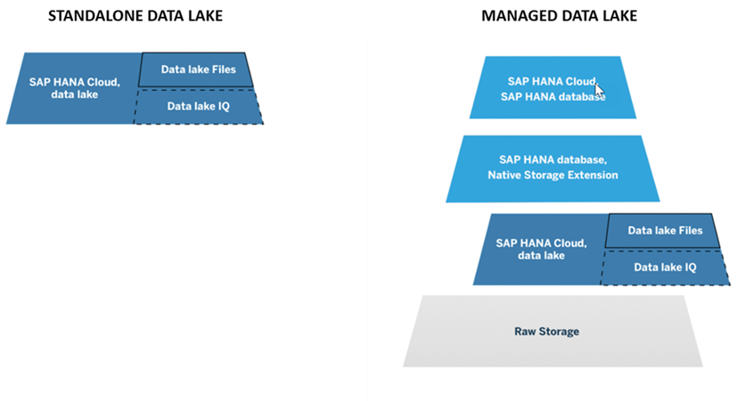
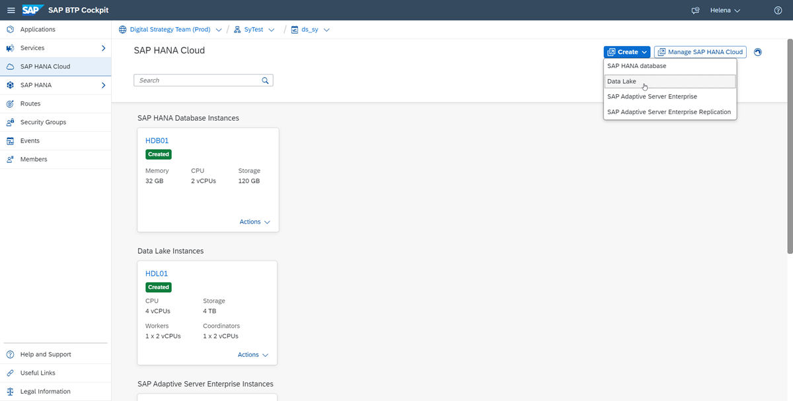
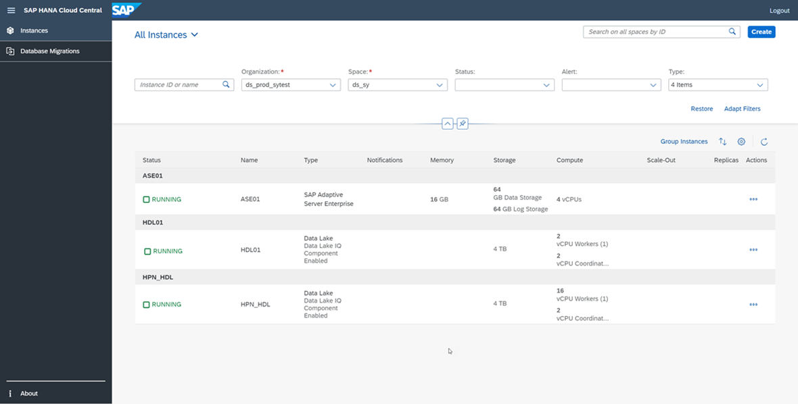

## Prerequisites
 - Access to SAP HANA Cloud, either with a free trial account or with a production account.
 - If you don't have a free trial account yet, sign up [here](https://www.sap.com/cmp/td/sap-hana-cloud-trial.html).

## Details
### You will learn
  - What the components Data Lake, IQ and Data Lake Files are
  - How to differentiate between managed and standalone data lakes
  - How to provision a standalone data lake
  - How to change the storage capacity of data lake instances
---

[ACCORDION-BEGIN [Step 1: ](Introduction to SAP HANA Cloud, data lake)]
SAP HANA Cloud, data lake is one of the components that make up SAP HANA Cloud. It's composed of two different components, the **Data Lake, IQ** and **Data Lake Files**. The Data Lake, IQ enables efficient storage and high-performance analytics of relational data at petabyte scale. It leverages the technology of SAP IQ, which many customers already know from the on-premise world.

With SAP HANA Cloud, data lake, you can ingest data from multiple sources, as well as non-SAP cloud storage providers, at high speed. It's an integrated part of SAP HANA Cloud, providing common security mechanisms, tenancy models, and tools operating within SAP HANA Cloud.

SAP HANA Cloud, data lake was built to be scalable and accommodate increases in data volume, in user count, and the complexity of workloads. This tutorial will focus on using SAP HANA Cloud, data lake as a standalone component of SAP HANA Cloud.  

!

[DONE]
[ACCORDION-END]

[ACCORDION-BEGIN [Step 2: ](Data Lake, IQ and Data Lake Files)]
The two main components of SAP HANA Cloud, data lake are:

1.  **Data Lake, IQ**: Data Lake, IQ is an efficient disk-optimized relational store, based on SAP IQ on-premise. It's enabled by default when you provision data lake instance, whether it's a standalone or managed by an SAP HANA database instance within SAP HANA Cloud.

2.  **Data Lake Files**: Data Lake Files service provides a secure, managed object storage to host structured, semi-structured and unstructured data files. You can query files in a relational format stored in data lake files by using Data Lake, IQ. This allows you to analyze the data with a low-cost strategy, given that this data has an unknown value. It is also easy to share this data with other processing tools. It's enabled by default when you provision a data lake instance, whether it's a standalone or managed by an SAP HANA database instance.

The Data Lake Files component is currently not available in trial.

[DONE]
[ACCORDION-END]

[ACCORDION-BEGIN [Step 3: ](How to use a data lake)]
SAP HANA Cloud, data lake can be provisioned and used in two different ways:

-	**Managed data lake**: the data lake is provisioned as part of the SAP HANA Cloud, SAP HANA database provisioning. A remote connection between the SAP HANA database and the Data Lake, IQ is then automatically created. The easiest way to access the data in a managed data lake is to use SAP HANA virtual tables using the SAP HANA Database Explorer. You can, however, also access the data lake independently.

-	**Standalone data lake**: the data lake is provisioned independently of any other SAP HANA Cloud services, and therefore it is not automatically connected to any other SAP HANA Cloud instances you might have. You can access your data within the data lake with SAP HANA Database Explorer, dbisql, isql, or any of the supported data lake client interfaces.

To learn more about the basics of SAP HANA Cloud, data lake, please check out the [SAP HANA Cloud Onboarding Guide](https://saphanajourney.com/hana-cloud/onboarding-guide/).

To provision standalone data lake instances, you can either use the **SAP HANA Cloud Central** wizard or the **Command-Line Interface (CLI)** tool.

In this tutorial, we will show you the instructions to provision a standalone data lake in the SAP HANA Cloud Central.

[DONE]
[ACCORDION-END]

[ACCORDION-BEGIN [Step 4: ](Open the provisioning wizard)]
To create a standalone data lake instance in SAP HANA Cloud, you can see the video below or follow these steps:

 <iframe width="560" height="315" src="https://www.youtube.com/embed/7iCAYvRESUQ" frameborder="0" allowfullscreen></iframe>

1.  Go to the SAP BTP cockpit and log in.

2.	Navigate to the subaccount and space where you want your data lake to live.

3.	On the space level, click on **SAP HANA Cloud** on the menu on the left side of the screen.

4.	Click on **Create**, then on **Data Lake**.

5. A new tab will open after finishing the last step - the **SAP HANA Cloud Central** provisioning wizard.

!

[DONE]
[ACCORDION-END]

[ACCORDION-BEGIN [Step 5: ](Describe the instance)]

1. Follow the steps in the wizard by first entering a username on the **Instance Name** field. Please note that you should not use any spaces in the name.

2.  You can insert a description of this instance on the **Description** field.

    !

3. Now the **Step 2** button will appear on the left-hand side of the wizard. Click on it to continue.

[DONE]
[ACCORDION-END]

[ACCORDION-BEGIN [Step 6: ](Define access)]
In this step, you can choose which connections are allowed to access your data lake instance. That means choosing if you allow access to your instance from outside of the SAP Business Technology Platform.
>You can either limit it to SAP Business Technology Platform by denying all IP addresses, or allow specific applications to access it by inserting one or more specific IP addresses. Finally, you can allow all connections from all IP addresses.

Click on **Step 3** to continue.

!

[DONE]
[ACCORDION-END]

[ACCORDION-BEGIN [Step 7: ](Define storage settings)]
In this step, you can choose to activate the Data Lake, IQ component. Once you enable the option, you will see more options to customize the data lake.

1. **Enable** the Data Lake, IQ component.

1.	Insert a password in the **Administrator Password** field. Please make sure to use a strong password. This password will be associated with the automatically generated HDLADMIN user, which has full powers within your data lake, so make sure not to forget it.

2.	Confirm it by typing it again on the **Confirm Administrator Password** field.

3.	Next, select the number of coordinators and workers for your data lake. The combination of these choices will result in the compute value, which you can see right under these fields.

4.	Then, select the amount of storage you wish to allocate to this instance. The minimum in Microsoft Azure is 4TB, and in AWS is 1TB, the maximum is 90 TB.

5.	Click on **Step 4** to continue.

!

[DONE]
[ACCORDION-END]

[ACCORDION-BEGIN [Step 8: ](Define advanced data lake IQ settings)]
The right choice of compatibility depends on how you wish to use your data lake. If most of your use will be associated with SAP HANA, then choose that option. On the other hand, if you wish to move data from SAP IQ, then you should choose that particular option.

!

1.  If you choose compatibility with SAP IQ, then you can also choose the **Collation**.

2.  Next, select if you want your data lake to be case sensitive by clicking on the switch.

3.  Finally, you can choose the **`NChar` Collation** and the **`NChar` Case Sensitivity** for your data lake.

    !

    Click on **Create Instance** and you are done! Your first standalone data lake will be created, and you can monitor its status to see when it will be ready to be used. This process usually takes a few minutes.

    !

[DONE]
[ACCORDION-END]                 

[ACCORDION-BEGIN [Step 9: ](Edit storage size)]
If you are using a trial account, you are not able to change the size of your data lake instance. But if you are using a production account, then you can also scale your data lake up or down even after it is provisioned. Keep in mind, however, that you cannot have a data lake that is smaller than the minimum size.

>Once your data lake instance is provisioned, you can scale your compute settings up or down as you wish, and as often as you wish. **Although at present, you can only scale up the storage size settings, but not scale down.**

To resize your data lake, follow these steps:

1.	In the SAP HANA Cloud Central, locate your existing data lake.

2.	Click on the three dots button on the right side of the same line to open the menu.

3.	Click on **Edit**.

4.	The editing wizard will open and show you the options currently available.

    !

    By changing storage capacity, the instance will be forced to restart if it was previously running. When changing compute size, single-worker-node systems will require a restart. Multi-worker-node systems will require a restart when the worker-node's size changes, but do not require a restart when the number of workers changes if the size per worker-node is held constant.

    >**Storage service level and the additional settings found under the initialization section cannot be modified after provisioning and must be configured appropriately at the time when the data lake is created.**

>In this tutorial, you have learned how to provision a standalone data lake in SAP HANA Cloud. In the next tutorial, you will see the different ways to access your standalone data lake.

[DONE]
[ACCORDION-END]

[ACCORDION-BEGIN [Step 10: ](Test yourself)]

[VALIDATE_7]
[ACCORDION-END]

---
