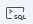
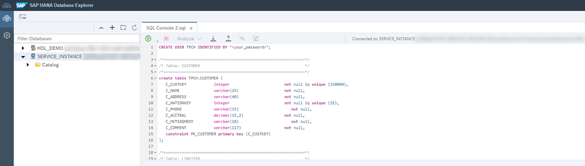
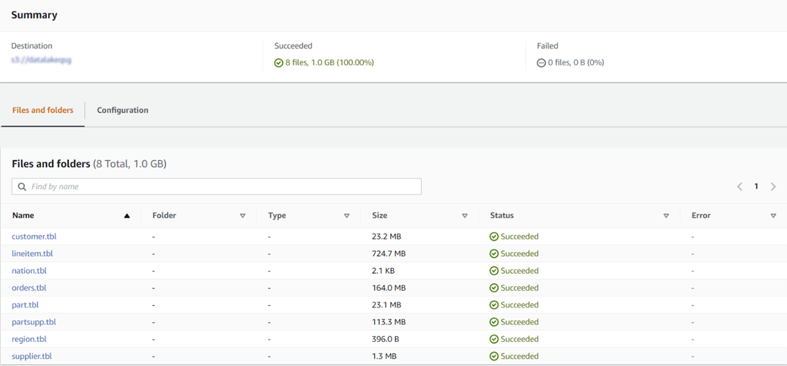
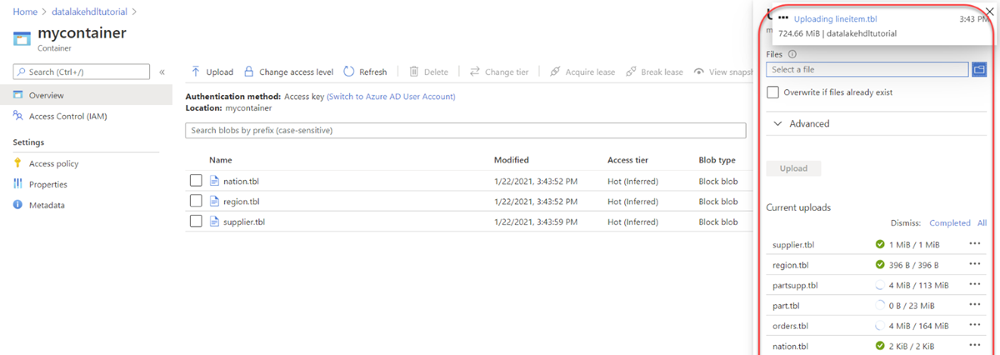
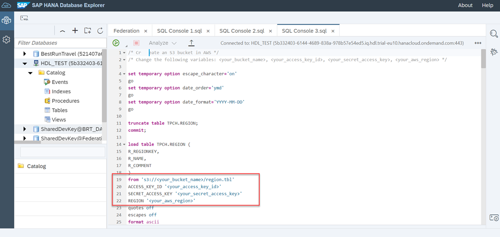
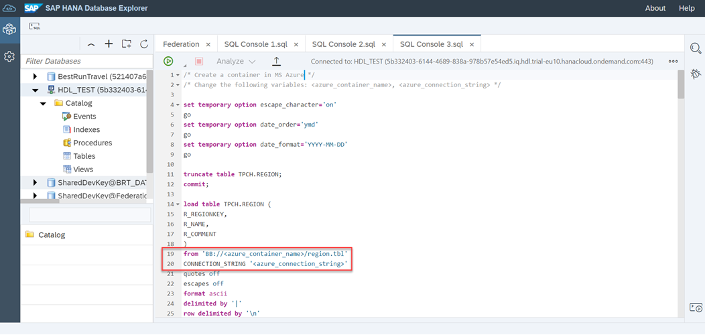

## Prerequisites
 - You have completed the [provisioning of a standalone data lake in SAP HANA Cloud](hana-cloud-hdl-getting-started-1) using a trial account.
 - Make sure your data lake instance is running before you start.
 - Download the **supporting files** to gain access to sample data required for loading tables.

## Details
### You will learn
  - How to create tables in a standalone data lake
  - How to load data hosted in an Amazon Web Services (AWS) S3 bucket into a standalone data lake
  - How to load data hosted in a Microsoft Azure container into a standalone data lake

You can download these supporting `csv` files that will be used throughout this tutorial.


  -	[Customer](https://raw.githubusercontent.com/SAPDocuments/Tutorials/master/tutorials/hana-cloud-hdl-getting-started-3/customer.tbl?token=AUDXVMKBFVFSJ65COMHYJQTAYOOTQ)

  -	[Nation](https://raw.githubusercontent.com/SAPDocuments/Tutorials/master/tutorials/hana-cloud-hdl-getting-started-3/nation.tbl?token=AUDXVMNYPET4FMW2UT4WAZLAYOOXO)

  -	 [Region](https://raw.githubusercontent.com/SAPDocuments/Tutorials/master/tutorials/hana-cloud-hdl-getting-started-3/region.tbl?token=AUDXVMKXKRPCMGNFKQKONTLAYOOZU)

  - [Supplier](https://raw.githubusercontent.com/SAPDocuments/Tutorials/master/tutorials/hana-cloud-hdl-getting-started-3/supplier.tbl?token=AUDXVMPJAOWQHEQ6ZC4AN7DAYOO3M)

If you decide to use Interactive SQL instead of SAP HANA Database Explorer, please copy the `SQL Scripts` used in this tutorial onto the machine where you installed the Interactive SQL.

[ACCORDION-BEGIN [Step 1: ](Create a new user)]
Before you create tables, it is recommended that you also create a new user, so that your new tables are not owned by `HDLADMIN`. With a new user, your new tables will be created under a particular schema.

>This helps you keep your data organized in the simplest level and keeps the tables separate from other tables that might already exist under the `HDLADMIN` user. Creating a new user also allows you to control the permissions as a group and assign whatever roles you require.

To add a new user, follow these steps:

1. Login to **SAP HANA Database Explorer**.

2. Select your SAP HANA Cloud, data lake in the list of databases, then open the SQL Console by clicking on the  **icon**.

3. Create a new user with the statement given below. Provide your new username and password in the appropriate fields.
```SQL
CREATE USER <username> IDENTIFIED BY <password>
```


For more in-depth information about creating users in SAP HANA Cloud, data lake, please see our [technical documentation](https://help.sap.com/viewer/19b3964099384f178ad08f2d348232a9/LATEST/en-US/a619a5f184f210158155ea1a4fe03da8.html).


[DONE]
[ACCORDION-END]

[ACCORDION-BEGIN [Step 2: ](Create tables in data lake)]
Now it's time to create tables. In this example, you will create the following tables:

>* customer
* nation
* region
* supplier

[OPTION BEGIN [SAP HANA Database Explorer]]

Let's get started. Follow these steps:

1.	In SAP HANA Database Explorer, make sure your SQL Console is open.

2.	Copy the code given below into the SQL Console and execute the script after entering your password in the appropriate field.

```SQL
     /*==============================================================*/                       */
     /* Created on:     11/21/2008 2:40:41 PM                        */
     /*==============================================================*/
     /*==============================================================*/

     /*==============================================================*/
     /* User: TPCH                                                   */
     /*==============================================================*/
     CREATE USER TPCH IDENTIFIED BY "<your_password>";

     /*==============================================================*/
     /* Table: CUSTOMER                                              */
     /*==============================================================*/
     create table TPCH.CUSTOMER (
       C_CUSTKEY            integer                        not null iq unique (150000),
       C_NAME               varchar(25)                    not null,
       C_ADDRESS            varchar(40)                    not null,
       C_NATIONKEY          integer                        not null iq unique (25),
       C_PHONE              char(15)                       not null,
       C_ACCTBAL            decimal(15,2)                  not null,
       C_MKTSEGMENT         char(10)                       not null,
       C_COMMENT            varchar(117)                   not null,
       constraint PK_CUSTOMER primary key (C_CUSTKEY)
     );

     /*==============================================================*/
     /* Table: NATION                                                */
     /*==============================================================*/
     create table TPCH.NATION (
       N_NATIONKEY          integer                        not null iq unique (25),
       N_NAME               char(25)                       not null,
       N_REGIONKEY          integer                        not null iq unique (5),
       N_COMMENT            varchar(152)                   not null,
       constraint PK_NATION primary key (N_NATIONKEY)
     );

     /*==============================================================*/
     /* Table: REGION                                                */
     /*==============================================================*/
     create table TPCH.REGION (
       R_REGIONKEY          integer                        not null iq unique (5),
       R_NAME               char(25)                       not null,
       R_COMMENT            varchar(152)                   not null,
       constraint PK_REGION primary key (R_REGIONKEY)
     );

     /*==============================================================*/
     /* Table: SUPPLIER                                              */
     /*==============================================================*/
     create table TPCH.SUPPLIER (
       S_SUPPKEY            integer                        not null iq unique (10000),
       S_NAME               char(25)                       not null,
       S_ADDRESS            varchar(40)                    not null,
       S_NATIONKEY          integer                        not null iq unique (25),
       S_PHONE              char(15)                       not null,
       S_ACCTBAL            decimal(15,2)                  not null,
       S_COMMENT            varchar(101)                   not null,
       constraint PK_SUPPLIER primary key (S_SUPPKEY)
     );

     alter table TPCH.CUSTOMER
       add foreign key FK_CUSTOMER_REFERENCE_NATION (C_NATIONKEY)
          references TPCH.NATION (N_NATIONKEY)
          on delete restrict on update restrict;

     alter table TPCH.NATION
       add foreign key FK_NATION_REFERENCE_REGION (N_REGIONKEY)
          references TPCH.REGION (R_REGIONKEY)
          on delete restrict on update restrict;

     alter table TPCH.SUPPLIER
       add foreign key FK_SUPPLIER_REFERENCE_NATION (S_NATIONKEY)
          references TPCH.NATION (N_NATIONKEY)
          on delete restrict on update restrict;


```


>**Attention**: You should make a slight adjustment in the  above query if you have provisioned the Data Lake, IQ instance in maximum compatibility mode with SAP HANA Cloud, SAP HANA database. This mode does not support **CHAR** data type. Instead, you can alter the query by using **VARCHAR** data type.
>
>For more information on database compatibility modes, please see our [technical documentation](https://help.sap.com/viewer/a896c6a184f21015b5bcf4c7a967df07/LATEST/en-US/82cdda1398644f4a95ec402f3144bcea.html).

!


[OPTION END]

[OPTION BEGIN [Interactive SQL]]
You can create tables using Interactive SQL connected to your data lake instance.

Let's get started. Follow these steps:

1.  Within an Interactive SQL window, copy and paste the SQL script given below.

    ```SQL
    /*==============================================================*/                       */
    /* Created on:     11/21/2008 2:40:41 PM                        */
    /*==============================================================*/
    /*==============================================================*/
    /*==============================================================*/
    /* User: TPCH                                                   */
    /*==============================================================*/
    CREATE USER TPCH IDENTIFIED BY "<your_password>";

    /*==============================================================*/
    /* Table: CUSTOMER                                              */
    /*==============================================================*/
    create table TPCH.CUSTOMER (
    C_CUSTKEY            integer                        not null iq unique (150000),
    C_NAME               varchar(25)                    not null,
    C_ADDRESS            varchar(40)                    not null,
    C_NATIONKEY          integer                        not null iq unique (25),
    C_PHONE              char(15)                       not null,
    C_ACCTBAL            decimal(15,2)                  not null,
    C_MKTSEGMENT         char(10)                       not null,
    C_COMMENT            varchar(117)                   not null,
    constraint PK_CUSTOMER primary key (C_CUSTKEY)
    );

    /*==============================================================*/
    /* Table: NATION                                                */
    /*==============================================================*/
    create table TPCH.NATION (
    N_NATIONKEY          integer                        not null iq unique (25),
    N_NAME               char(25)                       not null,
    N_REGIONKEY          integer                        not null iq unique (5),
    N_COMMENT            varchar(152)                   not null,
    constraint PK_NATION primary key (N_NATIONKEY)
    );

    /*==============================================================*/
    /* Table: REGION                                                */
    /*==============================================================*/
    create table TPCH.REGION (
    R_REGIONKEY          integer                        not null iq unique (5),
    R_NAME               char(25)                       not null,
    R_COMMENT            varchar(152)                   not null,
    constraint PK_REGION primary key (R_REGIONKEY)
    );

    /*==============================================================*/
    /* Table: SUPPLIER                                              */
    /*==============================================================*/
    create table TPCH.SUPPLIER (
    S_SUPPKEY            integer                        not null iq unique (10000),
    S_NAME               char(25)                       not null,
    S_ADDRESS            varchar(40)                    not null,
    S_NATIONKEY          integer                        not null iq unique (25),
    S_PHONE              char(15)                       not null,
    S_ACCTBAL            decimal(15,2)                  not null,
    S_COMMENT            varchar(101)                   not null,
    constraint PK_SUPPLIER primary key (S_SUPPKEY)
    );

    alter table TPCH.CUSTOMER
       add foreign key FK_CUSTOMER_REFERENCE_NATION (C_NATIONKEY)
         references TPCH.NATION (N_NATIONKEY)
         on delete restrict on update restrict;

    alter table TPCH.NATION
      add foreign key FK_NATION_REFERENCE_REGION (N_REGIONKEY)
         references TPCH.REGION (R_REGIONKEY)
         on delete restrict on update restrict;

    alter table TPCH.SUPPLIER
      add foreign key FK_SUPPLIER_REFERENCE_NATION (S_NATIONKEY)
         references TPCH.NATION (N_NATIONKEY)
         on delete restrict on update restrict;

    ```

    >**Attention**: You should make a slight adjustment in the  above query if you have provisioned the Data Lake, IQ instance in maximum compatibility mode with SAP HANA Cloud, SAP HANA database. This mode does not support **CHAR** data type. Instead, you can alter the query by using **VARCHAR** data type.
    >
    >For more information on database compatibility modes, please see our [technical documentation](https://help.sap.com/viewer/a896c6a184f21015b5bcf4c7a967df07/LATEST/en-US/82cdda1398644f4a95ec402f3144bcea.html).

2. The Query tab will now contain the file name as seen below, and then the script can be executed.

    !

>**Attention**: If you are familiar with SAP IQ on-premise, you will notice some differences between SAP IQ and SAP HANA Cloud, data lake.
>
>The data lake takes responsibility of managing administrative tasks such as storage allocation, and you don't need to specify `dbspace` usage, as was required while using SAP IQ. One of the impacts of this change is that the syntax for creating a table no longer supports a **USING** clause, as this specification is handled automatically by the data lake.

[OPTION END]

[DONE]
[ACCORDION-END]

[ACCORDION-BEGIN [Step 3: ](Upload sample data)]
[OPTION BEGIN [AWS S3 bucket]]
If you wish to work with an S3 bucket on Amazon Web Services (AWS), then you will need the following details about your S3 bucket to load the data into the data lake:

>* Account ID
*	IAM username
*	AWS Password
*	AWS access key ID
*	Secret access key ID
*	AWS region identifier

You can find this information in your **Amazon Management Console**.


>In a real-world data lake scenario, your data upload would likely exceed the Amazon Management Console upload limit of 160 GB, meaning you would have to upload using the AWS CLI, AWS SDK, or Amazon S3 REST API. However, for this tutorial you are using only a sample data that is less than 160 GB, you can use the Amazon Management Console to upload the sample data files to the S3 bucket.

The sample data files mentioned at the beginning of this tutorial are used here. Upload the following files to the S3 bucket:

>*	customer.tbl
*	nation.tbl
*	region.tbl
*	supplier.tbl

For instructions on using Amazon Management Console to upload objects to the Amazon S3 bucket, see their [documentation](https://docs.aws.amazon.com/AmazonS3/latest/userguide/upload-objects.html).

After all the mentioned files are uploaded completely, exit from the Amazon Management Console.

!

[OPTION END]

[OPTION BEGIN [Microsoft Azure container]]
If you wish to work with a Microsoft Azure container, then you will need the following details about your Azure container to load the data into the data lake:

>* Container name
* Connection string of the Azure container

If you do not yet have a storage account and container, please follow the instructions in Microsoft Azure to do so. Subsequently, select the Storage account and then select the container to upload the data files.

!

The sample data files mentioned at the beginning of this tutorial are used here. Upload the following files to the Azure container:

>* customer.tbl
*	nation.tbl
*	region.tbl
*	supplier.tbl

!

After all the mentioned files are uploaded completely, you can exit the Azure portal.

[OPTION END]

[DONE]
[ACCORDION-END]

[ACCORDION-BEGIN [Step 4: ](Load data into data lake tables)]
[OPTION BEGIN [AWS S3 bucket]]
Now it's time to load the data from the S3 bucket into your data lake.

Copy the SQL script given below into the SQL Console in the SAP HANA Database Explorer. **But before you execute it, make the following changes in the script**.

```SQL
/* Create an S3 bucket in AWS */
/* Change the following variables: <your_bucket_name>, <your_access_key_id>, <your_secret_access_key>, <your_aws_region> */

set temporary option escape_character='on'
go
set temporary option date_order='ymd'
go
set temporary option date_format='YYYY-MM-DD'
go

truncate table TPCH.REGION;
commit;

load table TPCH.REGION (
R_REGIONKEY,
R_NAME,
R_COMMENT
)
from 's3://<your_bucket_name>/region.tbl'
ACCESS_KEY_ID '<your_access_key_id>'
SECRET_ACCESS_KEY '<your_secret_access_key>'
REGION '<your_aws_region>'
quotes off
escapes off
format ascii
delimited by '|'
row delimited by '\n'
;
commit
;
rollback
;

truncate table TPCH.NATION;
commit;

load table TPCH.NATION (
   N_NATIONKEY,
   N_NAME,
   N_REGIONKEY,
   N_COMMENT
)
from 's3://<your_bucket_name>/nation.tbl'
ACCESS_KEY_ID '<your_access_key_id>'
SECRET_ACCESS_KEY '<your_secret_access_key>'
REGION '<your_aws_region>'
quotes off
escapes off
format ascii
delimited by '|'
row delimited by '\n'
;
commit
;
rollback
;

truncate table TPCH.SUPPLIER;
commit;

load table TPCH.SUPPLIER (
   S_SUPPKEY,
   S_NAME,
   S_ADDRESS,
   S_NATIONKEY,
   S_PHONE,
   S_ACCTBAL,
   S_COMMENT
)
from 's3://<your_bucket_name>/supplier.tbl'
ACCESS_KEY_ID '<your_access_key_id>'
SECRET_ACCESS_KEY '<your_secret_access_key>'
REGION '<your_aws_region>'
quotes off
escapes off
format ascii
delimited by '|'
row delimited by '\n'
;
commit
;
rollback
;

truncate table TPCH.CUSTOMER;
commit;

load table TPCH.CUSTOMER (
   C_CUSTKEY,
   C_NAME,
   C_ADDRESS,
   C_NATIONKEY,
   C_PHONE,
   C_ACCTBAL,
   C_MKTSEGMENT,
   C_COMMENT            
)
from 's3://<your_bucket_name>/customer.tbl'
ACCESS_KEY_ID '<your_access_key_id>'
SECRET_ACCESS_KEY '<your_secret_access_key>'
REGION '<your_aws_region>'
quotes off
escapes off
format ascii
delimited by '|'
row delimited by '\n'
;
commit
;
rollback
;


```


!

At the end of each of the 'LOAD TABLE' statements in the code, replace these variables with your AWS S3 bucket credentials:

 * **``<your_bucket_name>``** : For example, if the path to the uploaded files in the Amazon S3 bucket is ''s3://hdl-sample-data/customer.tbl'', then **``<your_bucket_name>``** is: hdl-sample-data
*	**``<your_access_key_id>``** : Example: EXAMPLEMOCNLUCMIJPJK
*	**``<your_secret_access_key>``** : Example: r2Jt4Exa/MplE8Lqv0ZA2SYdIXLdgTBsExample
*	**``<your_aws_region>``** : Example: us-east-2

Run the script after making the changes. For the data to be loaded, please make sure that the script runs without any errors.

[OPTION END]

[OPTION BEGIN [Microsoft Azure container]]

Now it's time to load the data from the Azure container into your data lake.

Copy the SQL script given below into the SQL Console in the SAP HANA Database Explorer. **But before you execute it, make the following changes in the script**.

```SQL
/* Create an S3 bucket in AWS */
/* Change the following variables: <azure_container_name>, <azure_connection_string> */

set temporary option escape_character='on'
go
set temporary option date_order='ymd'
go
set temporary option date_format='YYYY-MM-DD'
go

truncate table TPCH.REGION;
commit;

load table TPCH.REGION (
R_REGIONKEY,
R_NAME,
R_COMMENT
)
from 'BB://<azure_container_name>/region.tbl'
CONNECTION_STRING '<azure_connection_string>'
quotes off
escapes off
format ascii
delimited by '|'
row delimited by '\n'
;
commit
;
rollback
;

truncate table TPCH.NATION;
commit;

load table TPCH.NATION (
   N_NATIONKEY,
   N_NAME,
   N_REGIONKEY,
   N_COMMENT
)
from 'BB://<azure_container_name>/nation.tbl'
CONNECTION_STRING '<azure_connection_string>'
quotes off
escapes off
format ascii
delimited by '|'
row delimited by '\n'
;
commit
;
rollback
;

truncate table TPCH.SUPPLIER;
commit;

load table TPCH.SUPPLIER (
   S_SUPPKEY,
   S_NAME,
   S_ADDRESS,
   S_NATIONKEY,
   S_PHONE,
   S_ACCTBAL,
   S_COMMENT
)
from 'BB://<azure_container_name>/supplier.tbl'
CONNECTION_STRING '<azure_connection_string>'
quotes off
escapes off
format ascii
delimited by '|'
row delimited by '\n'
;
commit
;
rollback
;

truncate table TPCH.CUSTOMER;
commit;

load table TPCH.CUSTOMER (
   C_CUSTKEY,
   C_NAME,
   C_ADDRESS,
   C_NATIONKEY,
   C_PHONE,
   C_ACCTBAL,
   C_MKTSEGMENT,
   C_COMMENT            
)
from 'BB://<azure_container_name>/customer.tbl'
CONNECTION_STRING '<azure_connection_string>'
quotes off
escapes off
format ascii
delimited by '|'
row delimited by '\n'
;
commit
;
rollback
;

```


!

At the end of each of these 'LOAD TABLE' statements in the code provided, replace these variables with your Azure credentials:

*	**``<azure_container_name>``** : For example, if the path to the uploaded file in the Azure storage container is BB://mycontainer76543/customer.tbl, then **``<azure_container_name>``** is: mycontainer76543
    >
    >**Attention** : If you are loading from Azure Data Lake Storage Gen2 using hierarchical namespaces: The **``<azure_container_name>``** is container/directory/subdirectory.
    >
    >Example: `BB://mycontainer76543/mydirectory/mysubdirectory/customer.tbl`

*	**``<azure_connection_string>``** : You can find azure connection string in the Azure portal. From your storage account, navigate towards Access Keys details under Security features. Locate the Connection string section and copy the connection string to the clipboard.
>
    Example: `DefaultEndpointsProtocol=https;AccountName=datalake54321;AccountKey=EXamPLe/eXAmPlE==;EndpointSuffix=core.windows.net.`

Run the script after making the changes. For the data to be loaded, please make sure that the script runs without any errors.

>**Attention**: The 'LOAD TABLE' statement is case-sensitive.


[OPTION END]

>In this tutorial, you have learned how to load data into the tables in the SAP HANA Cloud, data lake. In the next tutorial, you will see how to monitor your standalone data lake.

[DONE]
[ACCORDION-END]
[ACCORDION-BEGIN [Step 5: ](Test yourself)]

[VALIDATE_7]
[ACCORDION-END]

---
