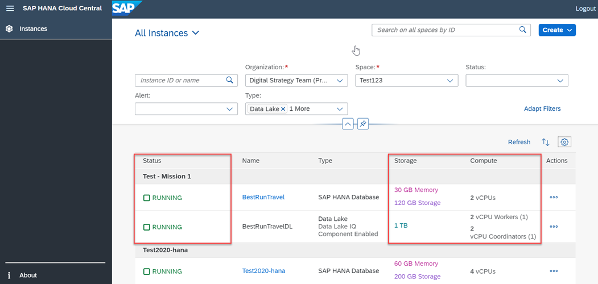

## Prerequisites
- You have completed the [provisioning of a standalone data lake in SAP HANA Cloud](hana-cloud-hdl-getting-started-1) using a trial account.
- Make sure your data lake instance is running before you start.

## Details
### You will learn
  - How to use the monitoring views to monitor the health of your data lake instances
  - How monitoring views help to troubleshoot performance issues.

---

[ACCORDION-BEGIN [Step 1: ](Introduction to monitoring views)]
On the **SAP HANA Cloud Central** wizard, you can see all data lake instances you've provisioned, as well as their respective status. This is your most basic monitoring tool, since you can see some basic information about each instance, as well as their storage size and compute capabilities here. This is also where you can scale your data lake instances from SAP HANA Cloud Central.

!

If you need more detailed information about your data lake, you can use monitoring views. **Monitoring views** are predefined queries and stored procedures that consolidate system health and performance metrics into a standard SQL interface. These views can be used to monitor system health before problems develop, and to identify the root causes if performance problems occur.

Monitoring views can be used to view performance metrics in areas like CPU utilization, memory cache use usage, memory usage per connection, status of locks in the database, status of currently executing statements, and server thread usage.

Learn more about monitoring views in our [technical documentation](https://help.sap.com/viewer/028be133f34c4d2d998c6fbc258659c5/LATEST/en-US/2c7b688118a34baeb7edab96f5b24f69.html).

By default, the **HDLADMIN** user has the **MONITOR** system privilege. You can grant the **MONITOR** system privilege (without administrative rights) to other users by running the statement:
```SQL
GRANT MONITOR TO <grantee [,...]> WITH NO ADMIN OPTION
```
This will allow the specified user to access monitoring views.

Let's see in detail the procedures to access different monitoring views.

[DONE]
[ACCORDION-END]

[ACCORDION-BEGIN [Step 2: ](Explore workload monitoring using SAP HANA Database Explorer)]
Using **SAP HANA Database Explorer** connected to your data lake, you can display a menu with list of all available Data Lake, IQ monitoring views. This can be done by running the command in the SQL Console:

```SQL
SELECT * FROM IQMONVIEWS
```


!

Among this list procedures, **`iqmonSystemOverview`** can help you see different metrics and get an overview of the system. The metrics include **`ActiveConnections`** and **`UserCPUTime`**. Additionally, you can monitor the changes in the metrics over time. This procedure can be run by using the command:

```SQL
SELECT * FROM iqmonSystemOverview
```

!

The data lake offers tools for collecting and analyzing statistics about a defined workload. You can quickly determine which database objects are being referenced by queries and should be kept. Unused tables, columns or indexes can be dropped to reduce usage of space, improve DML   performance, and decrease backup time.

[DONE]
[ACCORDION-END]


[ACCORDION-BEGIN [Step 3: ](Determine space consumption of data lake instance)]
Space consumption can be monitored and assessed to determine the ideal storage size for your instance. The **`TotalSize`** metric can be used to view the allocation of storage space for every individual space. Run the following command in the SQL Console using Database Explorer to display information on each space within your instance:

```SQL
SELECT DBSpaceName, DBSpaceType, Writable, Online, Usage, TotalSize, Reserve, NumFiles, NumRWFiles FROM dbo.sp_iqdbspace() ORDER BY DBSpaceName

```

!

Run the following command to view the temporary space in use:

```SQL
SELECT * FROM sp_iqwho()

```

!

[DONE]
[ACCORDION-END]

[ACCORDION-BEGIN [Step 4: ](Manage insufficient memory issue)]
If you see an issue of insufficient memory during your monitoring of the system, you can increase the available memory. The memory is allocated as a fixed ratio to `vCPUs`, which is set up when instances are created. By increasing the `vCPU` size, you can increase the available memory. To do so, go to the SAP HANA Cloud Central and edit the existing instance.

Similarly, you can go to the SAP HANA Cloud Central when the remaining storage space is no longer enough. Edit the existing instance to increase the storage capacity. **However, keep in mind that the storage capacity of the system can only be increased; it cannot be decreased.**

!


[DONE]
[ACCORDION-END]

[ACCORDION-BEGIN [Step 5: ](Differentiate between sp_iqsysmon and monitoring views )]
The monitoring views and **`sp_iqsysmon`** are intended for very different reporting timescales. The **`sp_iqsysmon`** is a system stored procedure that allows you to define the time interval for monitoring using **Start** and **Stop** parameters. Data lake, IQ continuously monitors performance and displays the latest performance data on the monitoring views. Rather than monitoring over a defined period, monitoring views start gathering performance metrics at server startup and reports the current state of the system.
>For example, you can monitor your system at a 30-second time interval for two hours using **`sp_iqsysmon`**. On the other hand, monitoring views provide a current snapshot of system heath and performance metrics.

It is beneficial to monitor changes in performance over time and this can be achieved by regularly checking the monitoring views at regular intervals. Any metrics moving out of their normal ranges should be evaluated.
>For example, you may notice CPU usage trending upward, or cache sizes increasing abnormally. Continuous monitoring lets you proactively address such issues before errors occur. Escalation of issues such as these can be prevented through continuous monitoring.

Monitoring views contain over a hundred reporting metrics, which means you can use them to answer a vast number of system health and performance questions. Some common diagnostic use-case scenarios can be found on our [technical documentation](https://help.sap.com/viewer/028be133f34c4d2d998c6fbc258659c5/LATEST/en-US/a7100d141b674c1095e9ec9ddc6b95eb.html).

Use these examples as a starting point for your own diagnostic use cases.

>In this tutorial, you have learned about monitoring your data lake. There are a wide variety of options to view historical and current data. You are now equipped with the procedures to monitor and diagnose basic problems you may encounter within your system. In the next tutorial, you will see how to back up and recover the data in your standalone data lake.

[DONE]
[ACCORDION-END]

[ACCORDION-BEGIN [Step 6: ](Test yourself)]

[VALIDATE_4]
[ACCORDION-END]
---
