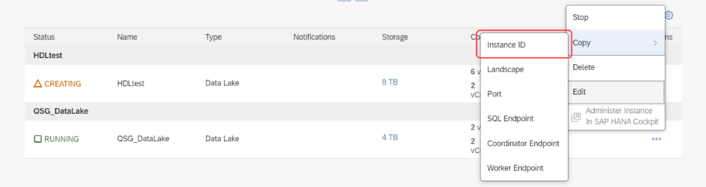

## Details
### You will learn
  - The backup schedule for the database
  - What happens when there is a failure of a data lake instance
  - How is an instance recovered after failure
  - How to make a service request for recovery

The backup and recovery process of SAP HANA Cloud, data lake is managed by SAP itself, unlike what customers of SAP IQ are familiar with on premise. Let's look at how this works.

---

[ACCORDION-BEGIN [Step 1: ](Introduction to Database backups)]
Data lake instances are automatically backed up at regular intervals to safeguard your database and ensure that it can be recovered fast.

Backups of data lake instances are stored in the object store of the corresponding infrastructure as-a-service (IaaS) provider. That means that instances on AWS are stored in Amazon S3 buckets, and those on Microsoft Azure are stored in the Azure blob store, for example.

All backups are encrypted using the capabilities of the IaaS provider and are replicated in additional availability zones in the same region. **The retention time for backups is 15 days.**

[DONE]
[ACCORDION-END]

[ACCORDION-BEGIN [Step 2: ](What is the Database backup schedule?)]
The backup schedule can be categorized into three types:

-	Full backups occur daily **at 12:00 AM UTC**

-	Incremental backups occur **every 3 hours** following the full backup. This is independent of the region the database was configured in.

-	Incremental since full backups occur **at 12 PM UTC of each day**

!

[DONE]
[ACCORDION-END]

[ACCORDION-BEGIN [Step 3: ](What happens if there is a failure?)]
Incremental backups save the changes that happen within the last 3 hours. 'Incremental since full backups' save all the changes made since the most recent full backup was completed. Finally, full backups save all the changes that were made since the last full backup.

If there is a **failure** at an instance, this is what happens:

!

[DONE]
[ACCORDION-END]

[ACCORDION-BEGIN [Step 4: ](How to make a recovery?)]
Recovery is done by the **SAP HANA Cloud team** upon request from customers. Every recovery is made based on automatic database backups and the recovery point objective is 3 hours.

To initiate a recovery, open a service request with **SAP Support**.
For details, see [Data Lake Service Requests](https://help.sap.com/viewer/9220e7fec0fe4503b5c5a6e21d584e63/LATEST/en-US/120a364f420944f2b9193176d48c9226.html) in the technical documentation.

[DONE]
[ACCORDION-END]

[ACCORDION-BEGIN [Step 5: ](How to make a service request?)]
When creating a service request for data lake recovery, be sure to complete the description section using the following structure:

1.	**Service ID** of the respective SAP HANA Data lake instance

2.	**Timestamp in UTC (ISO format)** (as received from procedure) to which the instance is to be recovered (must be within the last 14 days)

    !

    >The **Service ID** is the same as the **Instance ID** for your data lake. This can be found from the SAP HANA Cloud Central.

    !

>In this tutorial, you have learned about the backup and recovery process of your database using SAP HANA Cloud, data lake. Make sure to take note of the frequency of the backups, their time of occurrence and the process for recovery.

[DONE]
[ACCORDION-END]

[ACCORDION-BEGIN [Step 6: ](Test yourself)]

[VALIDATE_7]
[ACCORDION-END]

---
