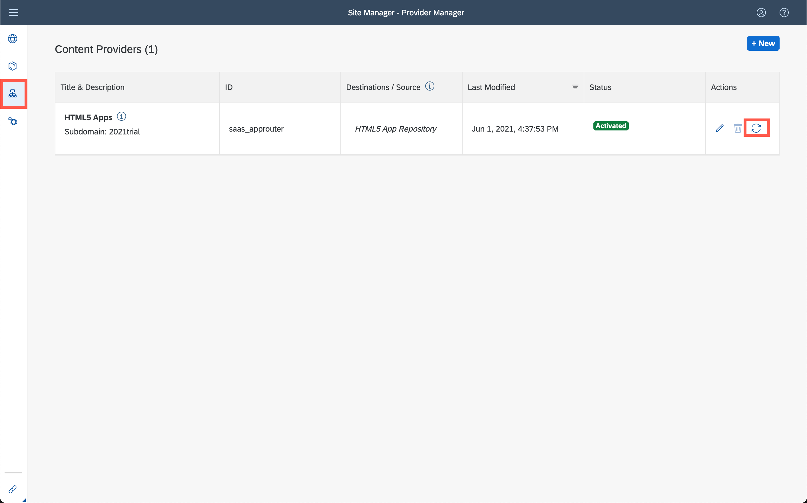

## Prerequisites
 - You've deployed your SAP Fiori elements app (including the navigation properties) to SAP BTP, Cloud Foundry environment.

## Details
### You will learn
  - How to create a new launchpad site
  - How to add a deployed SAP Fiori elements app to your launchpad site

---
Once you've deployed your SAPUI5 app to SAP BTP, it becomes available to add to your launchpad site.

[ACCORDION-BEGIN [Step 1: ](Create a site)]

1. Open the [SAP BTP Cockpit](https://account.hanatrial.ondemand.com/cockpit#/home/trialhome).

2. In the side navigation panel of your subaccount, click **Instances and Subscriptions**, and then from the **Subscriptions** tab, click the **Go to Application** icon.

    The Site Manager opens with the Site Directory in focus. From here, you'll create your new site.

    > Note: In the side panel of the SAP Launchpad service, you'll see four tools. You can see all existing sites in the **Site Directory**. This is also where you can create new sites. The **Content Manager**  is where you'll manage cross-site content such as business apps. And the **Provider Manager** helps you to manage content providers. Content providers expose business content that you can integrate into your launchpad sites. The fourth icon opens **Settings** to configure various settings related to the SAP Launchpad service.

3. Click **Create Site**.

    !

4. Enter `hana-cloud-apps` as the site name and click **Create**.

    !

[DONE]
[ACCORDION-END]
[ACCORDION-BEGIN [Step 2: ](Navigate to the Site Directory)]

When you create a site, you are directed to the **Site Settings** screen, where you can edit the site settings and assign a site to a specific user role.

Navigate back to the **Site Directory** to view the site tile.

!

Your site is empty for now. In the following steps, you're going to add business apps to your launchpad site.

[DONE]
[ACCORDION-END]
[ACCORDION-BEGIN [Step 1: ](Fetch updated content using the Provider Manager)]

1. Click the **Provider Manager** icon to view any available content providers. In there, click the **Fetch updated content** icon the **HTML5 Apps** content provider.

    >The **HTML5 Apps** content provider is created automatically. Any app that you deploy to SAP BTP is automatically added as content to this provider.

    !

2. Note that you'll see a "Content is being updated" message. **Wait until this message disappears** again before you continue with the next step.

    !

The **HTML5 Apps** content provider should now expose any newly deployed app for integration.

[DONE]
[ACCORDION-END]

[ACCORDION-BEGIN [Step : ](Add your deployed SAPUI5 app to your content)]

1. Click the Content Manager icon in the side panel to open the **Content Manager**. Click the **Content Explorer** tab to explore content from the available content providers and select the **HTML5 Apps** provider.

    >The **Content Manager** has two tabs: You can manually configure content items and view any other available content items in **My Content**. And the **Content Explorer** is where you can explore exposed content from available content providers, select the content, and add it to your own content.

    !

4. You'll see that your `List Report` app that you've just created in SAP Business Application Studio already exists in this provider. Select it and click **+ Add to My Content**.

    !

5. Click the **My Content** tab.

    !

    Note that your `List Report` app is in the list of content items.

[DONE]
[ACCORDION-END]

[ACCORDION-BEGIN [Step : ](Create a group and assign the app to it)]

In this step, you'll create a new group and assign the `List Report` app to it.

> A group is a set of one or more apps displayed together on a launchpad site. Assigning apps to groups makes them visible to the user.

1. Click **+ New** in the **Content Manager** and select **Group** to create a new group.

    !

2. Enter `Default` as the **Title** and in the **Assignments** panel on the right, click in the search box to see a list of apps.

    >If you have many apps, you can type some letters of your app name in the search field (for example, `List`) to search for the app.

4. Next to the `List Report` app, click the **+** icon to assign your app to this group.

    You'll see that the icon changes.

4. Click **Save**.

    !

4. You now see that the app has been added to the group. **Go back** to the start page of the content manager.

    !

[DONE]
[ACCORDION-END]

[ACCORDION-BEGIN [Step : ](Assign app to Everyone role)]

In this step, you'll assign the `List Report` app to the `Everyone` role. This is a default role - content assigned to the `Everyone` role is visible to all users.

1. Click the `Everyone` role to open the role editor.

    !

3. Click **Edit**.

4. Click the search box in the **Assignments** panel on the right. Any available apps are shown in the list below. Click the **+** icon next to the `List Report` app, and confirm with **Save**.

    !

6. Similar to in the last step, you should see that the app has been added to the role.

[DONE]
[ACCORDION-END]

[ACCORDION-BEGIN [Step : ](Test your site)]

1. Click the **Site Directory** icon to open the Site Directory and click **Go to site** on the site tile.

    !

    You'll see all the apps that you have added to your launchpad. In the `Default` group, you'll see the `Show Items` app that we've just created. This looks similar to what you've seen in the previous tutorial, but this time the app runs in a production-ready SAP Fiori Launchpad. You can see the difference when you look at the top-right corner; you can find the initials of your user there.

    !

3. Click the app to launch it and to display all columns.

    !

[DONE]
[ACCORDION-END]
[ACCORDION-BEGIN [Step : ](Save a user-specific filter view)]

1. Display all available data items.

    !

    > Note that your might see no records if you didn't explicitly fill the HDI container that is used for this deployment.

2. Apply a new filter to display only items with the German language code `DE`

    !

2. Click on the **˅** button and click **Save As** to save the current filter settings.

    !

2. You can use any name (for example, **`GermanItem`**) for this view. Make sure to **check both boxes** before you confirm with **Save**.

    !

2. Open the page in an incognito tab and log in with the same user. You'll notice that you see the same view, which means that it has been successfully persisted in the backend.

    !

Congratulations! You have successfully embedded and tested the SAP Fiori elements app in a production level SAP Fiori Launchpad. On top of that, you've used a [SAPUI5 Flexibility](https://sapui5.hana.ondemand.com/#/topic/a8e55aa2f8bc4127923b20685a6d1621) feature to persist custom filter views in the backend.

[VALIDATE_3]
[ACCORDION-END]
