# Migrate to SAP HANA Cloud from SAP HANA Platform
<!-- description -->This tutorial demonstrates a migration from an on-premise SAP HANA database to an SAP HANA Cloud database.

## Prerequisites
 - Access to, and administrative rights on, an on-premise SAP HANA database that you wish to migrate to SAP HANA Cloud such as an SAP HANA, express edition database
 - Access to, and administrative rights on, an SAP HANA Cloud instance such as a free-tier instance

## You will learn
  - About resources available to help prepare and plan for a migration
  - How the Self-Service Migration tool can be used to perform a compatibility check
  - Examples of how to identify and migrate schema objects, data, and HDI projects

## Overview
SAP HANA Cloud is a database-as-a service and it is one of the many services of the [SAP Business Technology Platform](https://help.sap.com/docs/btp).  "Database-as-a-service" means that SAP manages updates, hardware, backups, etc.  One of the benefits of SAP HANA Cloud is that it that it can be easily resized, as described at [Managing SAP HANA Database Instances](https://help.sap.com/docs/HANA_CLOUD/9ae9104a46f74a6583ce5182e7fb20cb/649092e9d9be41c59930179ce4f3d59e.html).  New features are released quarterly.  For further details, see [What Is SAP HANA Cloud](https://help.sap.com/docs/HANA_CLOUD/f4997718ff9d45f49f90f5d01d16d5a0/2f0c5e3dc11d4eb8a1d6cb878a311f43.html).


This tutorial will illustrate steps taken to migrate a small sample dataset from an [on-premise SAP HANA database](https://help.sap.com/docs/SAP_HANA_PLATFORM) to [SAP HANA Cloud](https://help.sap.com/docs/HANA_CLOUD).  It does not cover the migration of content from XS Classic, which was deprecated in July 2017 with the release of SAP HANA 2.0 SPS02.  If you need to migrate XS Classic applications, please see [SAP HANA XS Advanced Migration Guide](https://help.sap.com/docs/SAP_HANA_PLATFORM/58d81eb4c9bc4899ba972c9fe7a1a115/2aa5aa246a704e199cd06ca5c84d1155.html).

---

### Planning and preparation
Planning and preparation are key to a successful migration.  Migration can be an iterative process done initially in a test environment.  A migration should be run during a planned downtime for production databases.  SAP HANA Cloud provides an [SAP HANA Cloud, data lake Relational Engine](https://help.sap.com/docs/SAP_HANA_DATA_LAKE/a896c6a184f21015b5bcf4c7a967df07/228c19ac890046ecbe8e38a540c0cb6b.html) that is a columnar disk-based store that can be used to store less-frequently accessed data.  This may be a good time to evaluate if some of your data that is not accessed as frequently may be well suited to be stored in SAP HANA Cloud data lake, Relational Engine or SAP HANA Cloud, data lake Files.  

The following topics may be of help when planning a migration to SAP HANA Cloud:

* [SAP HANA Cloud Migration Guide (product documentation)](https://help.sap.com/docs/HANA_CLOUD/3c53bc7b58934a9795b6dd8c7e28cf05/3101cb652bb74739a3e39593ea969bc5.html)

* [Transition SAP HANA to SAP HANA Cloud (sap.com)](https://www.sap.com/products/technology-platform/hana/cloud-migration.html)

* [Migrating your SAP HANA on-premise to SAP HANA Cloud (video)](https://www.sap.com/assetdetail/2023/01/8a0f1b28-597e-0010-bca6-c68f7e60039b.html)

* [Migrate your SAP HANA Services for BTP (on Cloud Foundry) to SAP HANA Cloud using Self-Service Migration Tool (blog post)](https://blogs.sap.com/2022/12/23/migrate-your-sap-hana-services-for-btp-on-cloud-foundry-to-sap-hana-cloud-using-self-service-migration-tool/)

* [SAP HANA Database Upgrades and Patches (product documentation)](https://help.sap.com/docs/HANA_CLOUD/9ae9104a46f74a6583ce5182e7fb20cb/6ced4d164e234b74aa9bea82435ce9a8.html)

* [SAP HANA Database Size (product documentation)](https://help.sap.com/docs/HANA_CLOUD/9ae9104a46f74a6583ce5182e7fb20cb/19a526792d5044609ed947a589047d4c.html)

* [System Limitations (product documentation)](https://help.sap.com/docs/HANA_CLOUD_DATABASE/c1d3f60099654ecfb3fe36ac93c121bb/20a760537519101497e3cfe07b348f3c.html)

* [SAP HANA Cloud: A Customer Perspective on Migration Success - SAP TechEd DA104 (video)](https://www.youtube.com/watch?v=ReJ_8lG98zs)

* [All-New Webinar: NHL shares a success story of migration to SAP HANA Cloud (webinar)](https://blogs.sap.com/2022/11/16/all-new-webinar-nhl-shares-a-success-story-of-migration-to-sap-hana-cloud/)


### Select an on-premise database to migrate
This tutorial uses an [SAP HANA, express edition](https://help.sap.com/docs/SAP_HANA,_EXPRESS_EDITION) instance that has been populated with the HOTEL sample schema.  The steps to create the objects in the HOTEL sample schema are described in the tutorial group [Get Started with the SAP HANA Database Explorer](group.hana-cloud-get-started) and include steps to create tables, views, functions, procedures, a scheduled job, a graph workspace, a JSON document store, remote sources, as well as steps to create an HDI container.  A few of the tables are shown below.

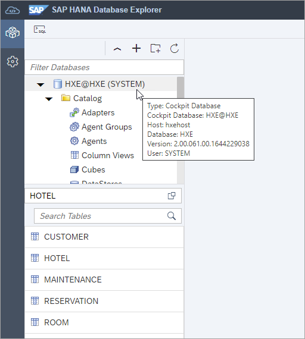

An SAP HANA 2.0 database is part of a multi-tenant database where there is one system database and one or more tenant databases.  Details can be seen when connected to the system database as shown below.

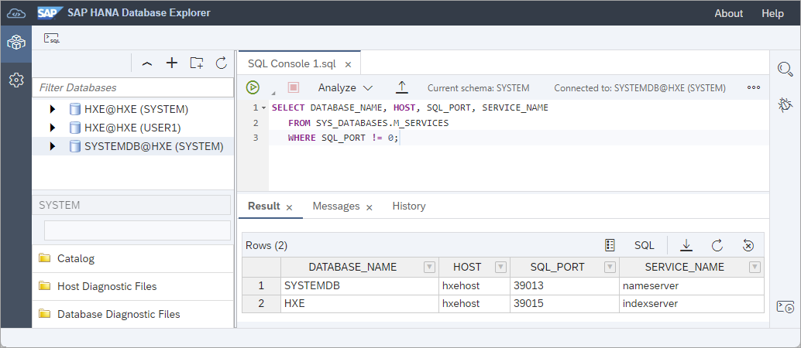

```SQL
SELECT DATABASE_NAME, HOST, SQL_PORT, SERVICE_NAME
   FROM SYS_DATABASES.M_SERVICES
   WHERE SQL_PORT != 0;
```

In this tutorial, the content from a tenant database (HXE), will migrated.  When migrating from a multi-tenant database, each tenant database is migrated to a dedicated SAP HANA Cloud database instance.

### Select an SAP HANA Cloud database
This tutorial uses an SAP HANA Cloud free tier instance as the migration target.  The following tutorials cover how to sign up for and create a free-tier SAP HANA Cloud instance.

  * [Help Thomas Get Started with SAP HANA](hana-trial-advanced-analytics) (Only the first 3 steps of this tutorial are needed for basic setup of SAP HANA Cloud.)

  * [Set Up Your SAP HANA Cloud, SAP HANA Database (free tier or trial) and Understand the Basics](group.hana-cloud-get-started-1-trial)

  * [SAP Learning Journey - Provisioning and Administration with SAP HANA Cloud](https://learning.sap.com/learning-journey/provisioning-and-administration-with-sap-hana-cloud)

  * [SAP Discovery Center - SAP HANA Cloud, SAP HANA Database Fundamentals](https://discovery-center.cloud.sap/protected/index.html#/missiondetail/3643/)

  * [SAP HANA Cloud Getting Started Guide](https://help.sap.com/docs/HANA_CLOUD/db19c7071e5f4101837e23f06e576495/d0aa0ec935c1401e8deb3be35d49730b.html)

Before proceeding, ensure that you have access to a running SAP HANA Cloud instance in either the Other or Cloud Foundry environment, as shown below.

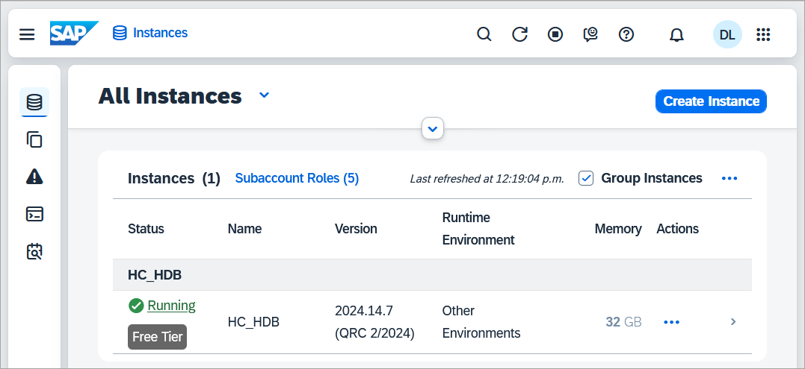

or

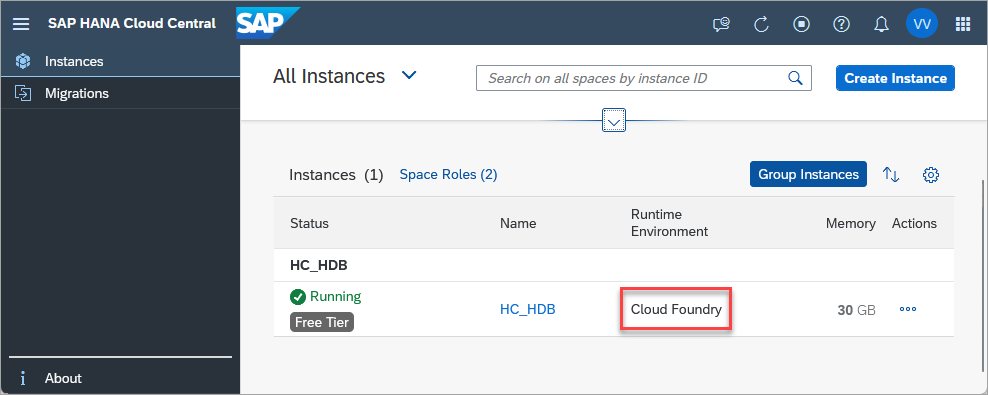

Additional details can be found at [Multi-Environment SAP HANA Cloud Tools](https://github.com/SAP-samples/teched2022-DA261/tree/main/exercises/multi-environment/ex1).

### SAP HANA compatibility
The version of an SAP HANA database can be found in the Database Information card in SAP HANA cockpit, or through a SQL query against the `M_DATABASE` view.  The version of both the source and target database should be checked.  The Self-Service Migration tool requires the source database to be 2.00.053 or higher while certain features such as the ability of the [EXPORT INTO](https://help.sap.com/docs/SAP_HANA_PLATFORM/4fe29514fd584807ac9f2a04f6754767/6a6f59bbfbb64ade84d83d7f87789753.html) statement that supports cloud storage providers requires a 2.0 SPS 06 database.

SAP HANA, express edition 2.0 SPS06.

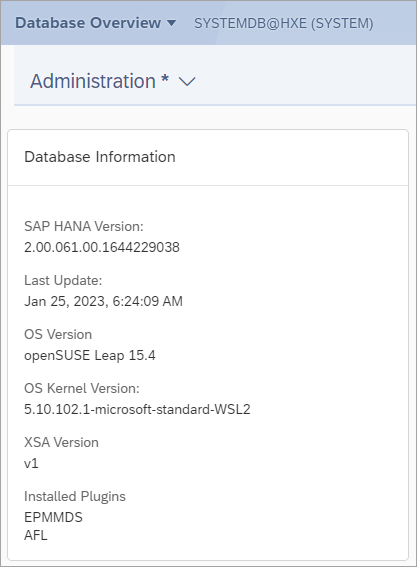

SAP HANA Cloud


Different versions of SAP HANA databases will have slightly different features.  This topic is covered in detail at [Compatibility with Other SAP HANA Versions](https://help.sap.com/docs/HANA_CLOUD/3c53bc7b58934a9795b6dd8c7e28cf05/11cc86c44d0b4dd3bf70e16870d9d4df.html).


### Self-Service Migration tool
The Self-Service Migration tool can be used when performing a migration. It automates the migration process and can reduce the cost and effort of a migration.  It is a free service and SAP manages the temporary storage used during the migration.  This tool is accessed from SAP HANA Cloud Central, the main tool for creating and configuring SAP HANA Cloud instances. For more information about SAP HANA Cloud Central, see [SAP HANA Cloud Administration Guide](https://help.sap.com/docs/HANA_CLOUD/9ae9104a46f74a6583ce5182e7fb20cb/48e1b509c9494d61a6f90e7eaa6f225b.html).

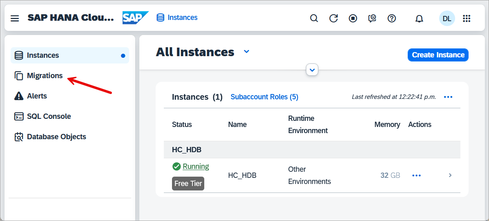

>The Self-Service Migration tool is supported in free tier but not in trial.

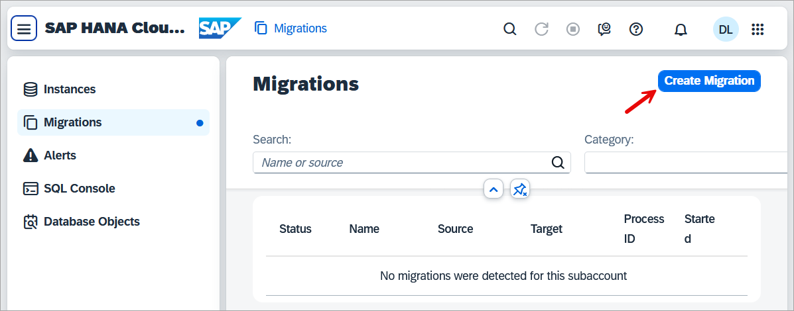

The Self-Service Migration tool supports migration to SAP HANA Cloud from SAP HANA 2.0 databases, as shown below.

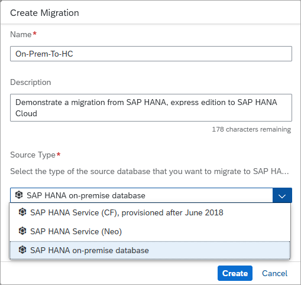

In order to connect from the Self-Service Migration tool running in the public internet to an on-premise SAP HANA database, you need to install and configure the [SAP Cloud Connector](https://help.sap.com/docs/CP_CONNECTIVITY/cca91383641e40ffbe03bdc78f00f681/e54cc8fbbb571014beb5caaf6aa31280.html).  

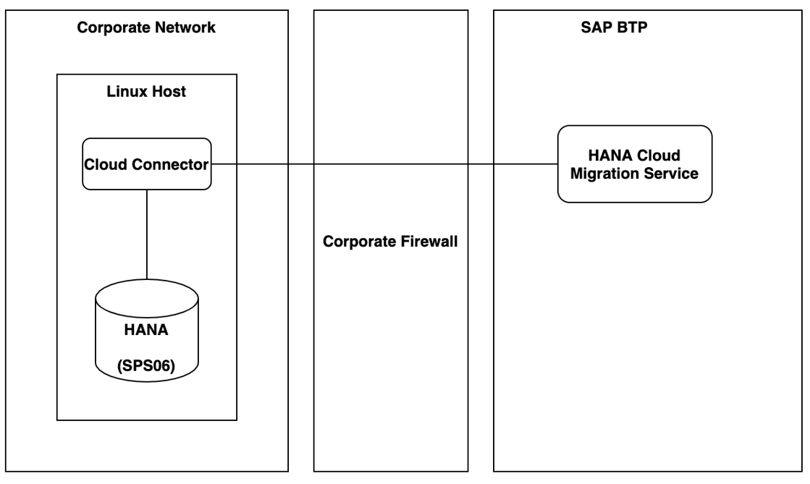

The cloud connector provides connectivity from a public internet where SAP HANA Cloud is running to an on-premise SAP HANA database.  Step-by-step instructions are provided at [Connect from SAP HANA Cloud to SAP HANA, express edition via the Cloud Connector](hana-dbx-remote-sources).

Once the cloud connector has been installed and configured to connect to a BTP subaccount, it will appear as shown below.
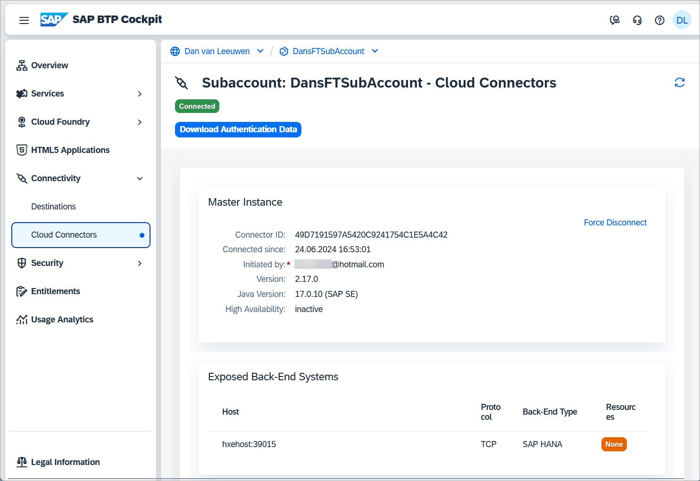

The Self-Service Migration tool can then be used to assist with a migration such as an SAP HANA on-premise migration to SAP HANA Cloud.

The first step on the Plan tab in the tool is a compatibility check.

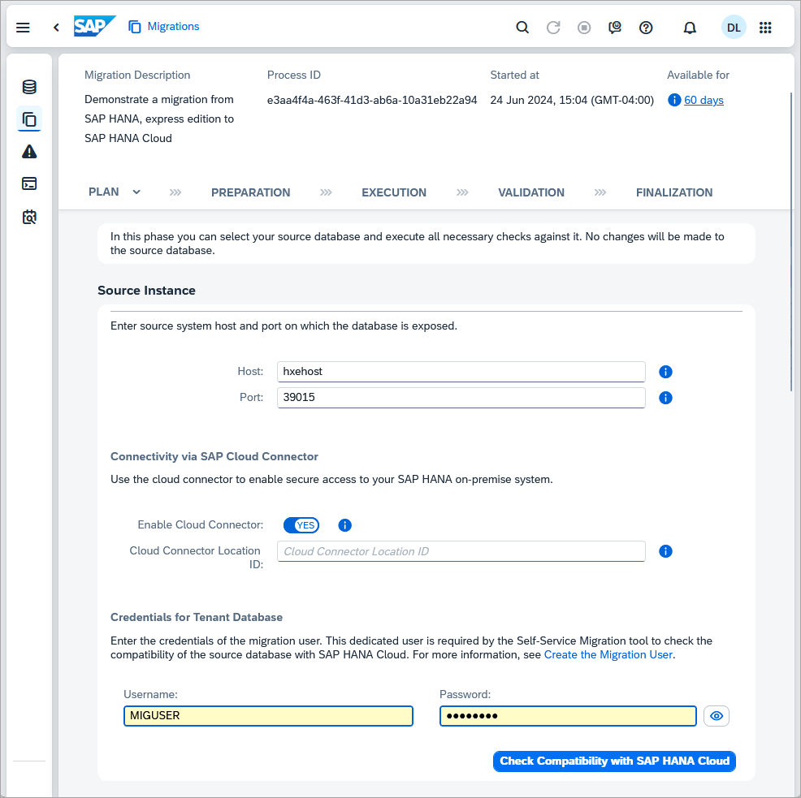

To illustrate one of the checks performed during the compatibility check, a table was previously created in the SYSTEM schema.  The presence of this table is flagged during compatibility check because the SYSTEM user is not accessible in SAP HANA Cloud.

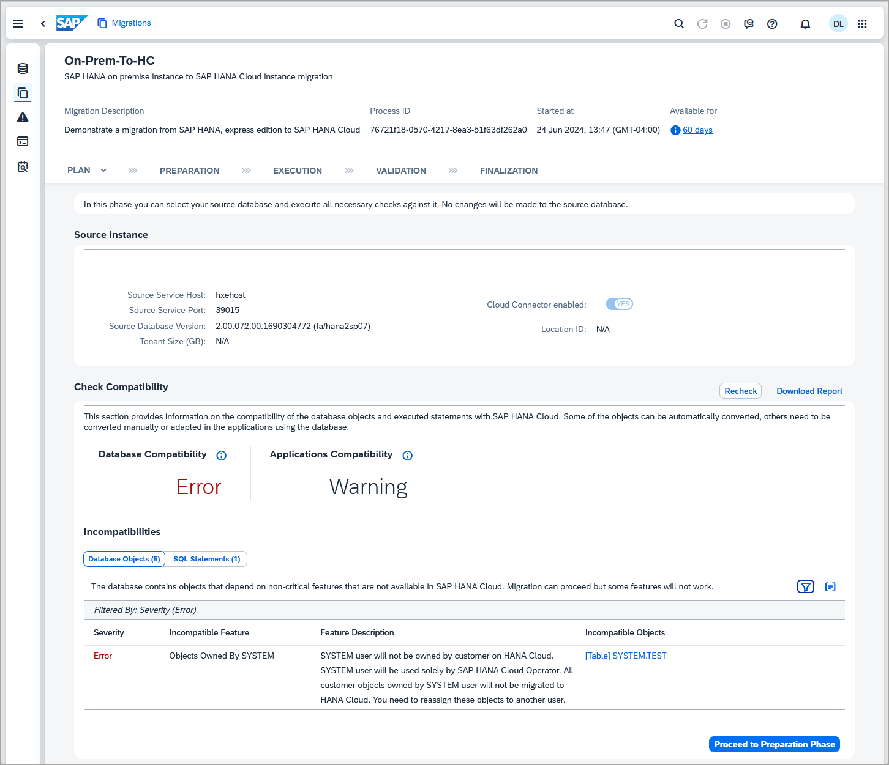

```SQL
CREATE TABLE TEST(
  myValue VARCHAR(50)
);
```

The Self-Service Migration tool provides additional steps to select the target database, to execute the migration, and to validate the migration.

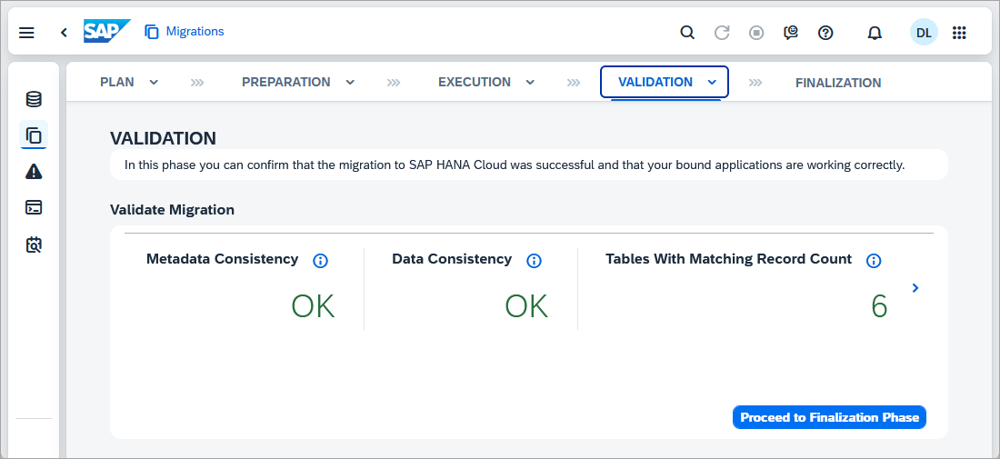

For further details see:

  * [Migration Scenarios Supported by the Self-Service Migration for SAP HANA Cloud Tool](https://help.sap.com/docs/HANA_CLOUD/3c53bc7b58934a9795b6dd8c7e28cf05/1fce86a12738443d9bf1b38e330cba6e.html)

  * [Checks Performed by the Migration Tool](https://help.sap.com/docs/HANA_CLOUD/3c53bc7b58934a9795b6dd8c7e28cf05/db3a47d288e24822b23e9130a34ee877.html)

  * [SAP HANA Cloud Migration: Setup your on-premise HANA system for the Self-Service Migration tool](https://blogs.sap.com/2023/02/17/sap-hana-cloud-migration-setup-your-on-premise-hana-system-for-the-self-service-migration-tool/)

If you wish to perform all or part of a migration manually rather than using the Self-Service Migration tool, the following are some steps to consider.

### Database configuration
SAP HANA databases enable configuration through a set of `ini` files.  These files can be modified through multiple methods including the SAP HANA cockpit database configuration app and ALTER SQL statements.  

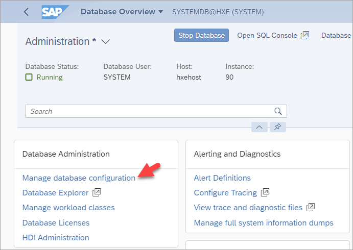

One example of an `ini` file setting is the `usage` parameter, found  under the `system_information` section. This setting is used to specify how a database is used.  If the value is set to production, this provides indications in the SAP HANA cockpit and SAP HANA database explorer that it is a production system.  

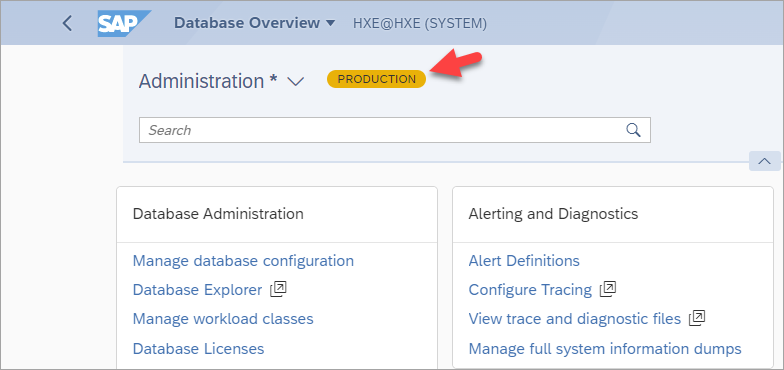

The value can be set as shown below in database configuration app.


With an on-premise SAP HANA database, values can be set at the system layer which would then apply to all databases of that system or to a specific database.  Below the value is set for the HXE database only.

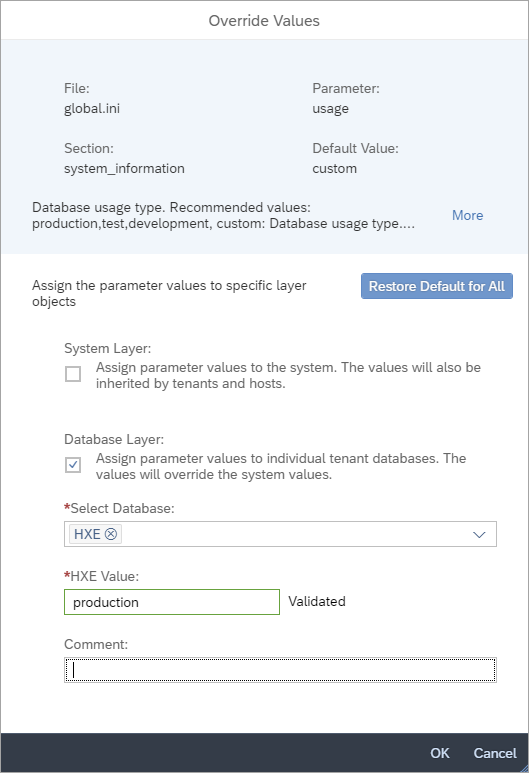

The SQL statement [ALTER SYSTEM ALTER CONFIGURATION Statement](https://help.sap.com/docs/SAP_HANA_PLATFORM/4fe29514fd584807ac9f2a04f6754767/20d08a5b751910148145dbc016c826a4.html) can also be used to set configuration values.  After pressing the refresh button, the production pill will appear.

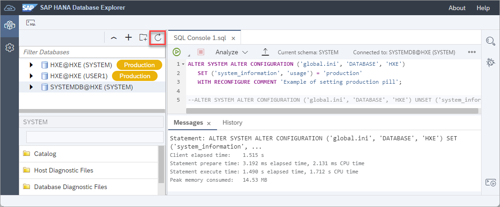

```SQL
ALTER SYSTEM ALTER CONFIGURATION ('global.ini', 'DATABASE', 'HXE')
   SET ('system_information', 'usage') = 'production'
   WITH RECONFIGURE COMMENT 'Example of setting production pill';

--ALTER SYSTEM ALTER CONFIGURATION ('global.ini', 'DATABASE', 'HXE') UNSET ('system_information', 'usage') WITH RECONFIGURE;
```

A recommended practice is to use the comment field to explain why a configuration change was made.

Configuration settings can also be viewed using monitoring views, as shown below.

```SQL
SELECT * FROM M_INIFILES;
SELECT * FROM M_INIFILE_CONTENTS WHERE LAYER_NAME != 'DEFAULT';
SELECT * FROM M_INIFILE_CONTENTS WHERE SECTION = 'system_information';
SELECT SECTION, KEY, DEFAULT_VALUE, INIFILE_NAMES, RESTART_REQUIRED, DESCRIPTION
    FROM CONFIGURATION_PARAMETER_PROPERTIES WHERE SECTION = 'system_information';
SELECT * FROM M_INIFILE_CONTENT_HISTORY;
--ALTER SYSTEM CLEAR INIFILE CONTENT HISTORY;
```


The [SAP Note: 1969700 - SQL Statement Collection for SAP HANA](https://launchpad.support.sap.com/#/notes/1969700) provides multiple queries that can be used to examine configuration settings.  One example is the HANA configuration parameters check shown below.

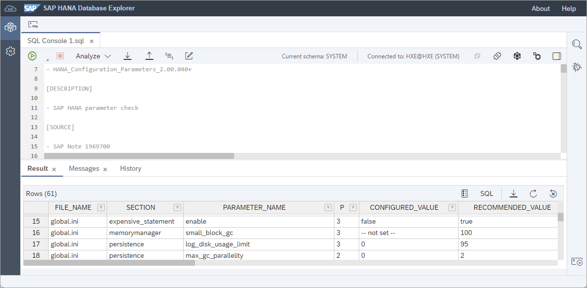

When migrating a database, it is important to review any non-default settings and consider if any of these changes should also be made to the SAP HANA Cloud database.  As SAP HANA Cloud is a managed cloud service, it has fewer available configuration parameters.

Additional details on configuration parameters can be found at the links below:

  * [Configuring SAP HANA System Properties (INI Files) (On-Prem)](https://help.sap.com/docs/SAP_HANA_PLATFORM/6b94445c94ae495c83a19646e7c3fd56/3f1a6a7dc31049409e1a9f9108d73d51.html)

  * [SAP HANA Configuration Parameter Reference (On-Prem)](https://help.sap.com/docs/SAP_HANA_PLATFORM/009e68bc5f3c440cb31823a3ec4bb95b/4b4d88980622427ab2d6ca8c05448166.html)

  * [Configuring SAP HANA System Properties (INI Files) (SAP HANA Cloud)](https://help.sap.com/docs/HANA_CLOUD_DATABASE/f9c5015e72e04fffa14d7d4f7267d897/3f1a6a7dc31049409e1a9f9108d73d51.html)

  * [SAP HANA Configuration Parameter Reference (SAP HANA Cloud)](https://help.sap.com/docs/HANA_CLOUD_DATABASE/138dcf7d779543608917a2307a6115f2/4b4d88980622427ab2d6ca8c05448166.html)

  * [SAP Note: 2186744 - FAQ: SAP HANA Parameters](https://launchpad.support.sap.com/#/notes/2186744)

### Exporting and importing users and roles

In the sample [HOTEL dataset](hana-dbx-create-schema) used in this tutorial, two users and two roles were created.

1. Identify the users that have been created in the source database.  Note that you can also view when a user last successfully connected.  You may wish to review users that have not connected to the database in a while to decide if you want to include them in the migration.

    ```SQL
    SELECT USER_NAME, LAST_SUCCESSFUL_CONNECT FROM USERS WHERE USER_NAME LIKE 'USER%';
    ```

    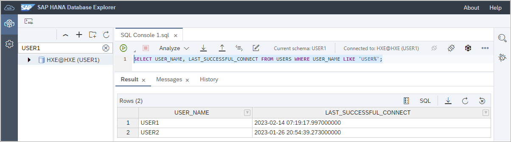

2. Review the existing roles, the privileges, and details about user groups.

    ```SQL
    --View the list of roles
    SELECT * FROM ROLES WHERE ROLE_NAME LIKE 'HOTEL%' ORDER BY ROLE_NAME;
    --View the roles assigned to a user
    SELECT * FROM GRANTED_ROLES WHERE GRANTEE LIKE 'USER1';
    -- View the users assigned to a role
    SELECT * FROM GRANTED_ROLES WHERE ROLE_NAME LIKE 'HOTEL_ADMIN';
    --View the list of privileges assigned directly to a user
    SELECT PRIVILEGE, OBJECT_TYPE, OBJECT_NAME, SCHEMA_NAME, IS_GRANTABLE FROM GRANTED_PRIVILEGES WHERE GRANTEE = 'USER1' ORDER BY OBJECT_TYPE, PRIVILEGE, OBJECT_NAME;
    --View the list of privileges assigned to a role
    SELECT PRIVILEGE, IS_GRANTABLE, OBJECT_TYPE, SCHEMA_NAME FROM GRANTED_PRIVILEGES WHERE GRANTEE = 'HOTEL_ADMIN' ORDER BY OBJECT_TYPE, PRIVILEGE;
    --View the list of user groups
    SELECT * FROM USERGROUPS;
    --View the details of a user group
    SELECT * FROM USERGROUP_PARAMETERS WHERE USERGROUP_NAME = 'HOTEL_USER_GROUP';
    --View the users in a user group
    SELECT * FROM USERS WHERE USERGROUP_NAME = 'HOTEL_USER_GROUP';
    ```

    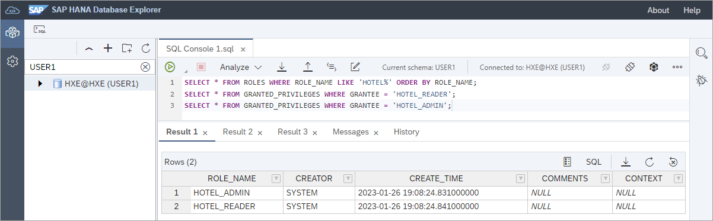

    The SAP HANA cockpit also provides an application that can be used to examine users and roles.

    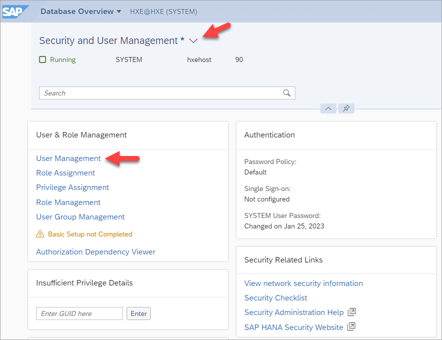

    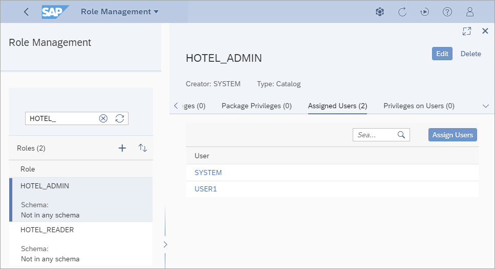

### Exporting and importing table data (optional)
The [EXPORT INTO](https://help.sap.com/viewer/4fe29514fd584807ac9f2a04f6754767/latest/en-US/6a6f59bbfbb64ade84d83d7f87789753.html) statement can be used to export the data from a table or view into a CSV file on the on-premise SAP HANA file system or to a cloud storage provider.  

The tutorial [Export and Import Data and Schema with SAP HANA Database Explorer](hana-dbx-export-import) details the required steps to configure the an SAP HANA database to be able to connect to SAP HANA Cloud, Data Lake Files, or a cloud storage provider.

>The next step in this tutorial, exporting and importing catalog objects, explains how to export and import multiple objects in one operation.  The catalog export/import statements support additional output types such as binary and parquet, in addition to CSV, and would be a better choice for most migrations.

1. The below SQL exports the data from the HOTEL table into a CSV file in a Microsoft Azure blob container.

    ```SQL
    EXPORT INTO 'azure://dansblobcont/hotel.csv' FROM HOTEL WITH CREDENTIAL 'Azure';
    ```

    

    The resulting file appears in the cloud storage provider.

    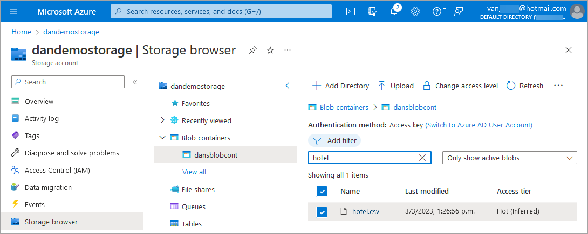

2. The SQL definition for any table or view can be obtained from the SAP HANA database explorer.

    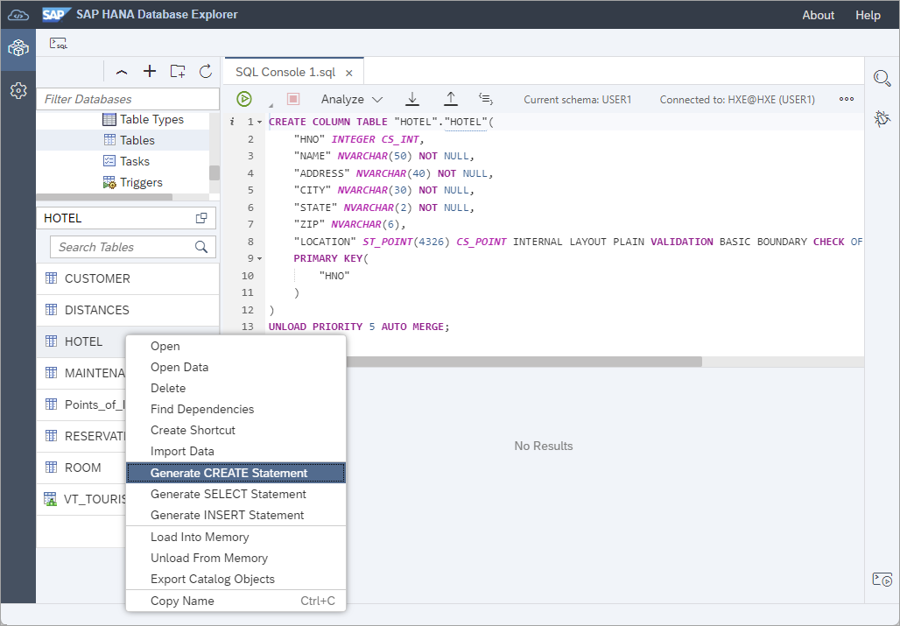

3. On the target SAP HANA Cloud system, the create table statement and [import from statement](https://help.sap.com/viewer/c1d3f60099654ecfb3fe36ac93c121bb/latest/en-US/20f712e175191014907393741fadcb97.html) can be run to recreate the schema and load the data.

    ```SQL
    CREATE COLUMN TABLE "HOTEL" (
        "HNO" INTEGER NOT NULL,
        "NAME" NVARCHAR(50) NOT NULL,
        "ADDRESS" NVARCHAR(40) NOT NULL,
        "CITY" NVARCHAR(30) NOT NULL,
        "STATE" NVARCHAR(2) NOT NULL,
        "ZIP" NVARCHAR(6),
        "LOCATION" ST_POINT(4326),
    	PRIMARY KEY(
	    	"HNO"
	    )
    );

    IMPORT FROM CSV FILE 'azure://dansblobcont/hotel.csv' INTO HOTEL WITH CREDENTIAL 'Azure';

    ```

    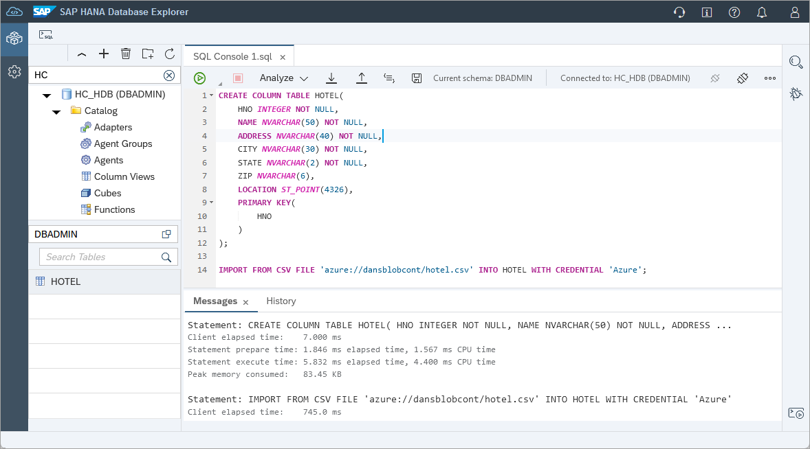

4. An alternative method is to create a remote source from the SAP HANA on-premise database to the SAP HANA Cloud database and use an INSERT INTO statement.  An example is given below.  For additional details on creating remote source connections, see [Access Remote Sources with SAP HANA Database Explorer](hana-dbx-remote-sources).

    ```SQL
    CREATE REMOTE SOURCE REMOTE_HC ADAPTER "hanaodbc" CONFIGURATION 'ServerNode=84b....hana.prod-ca10.hanacloud.ondemand.com:443;driver=libodbcHDB.so;dml_mode=readwrite;sslTrustStore="-----BEGIN CERTIFICATE-----MIIDrzCCApegAwIBAgIQCDvgVpBCRrGhdWrJWZHHSjANBgkqhkiG9w0BAQUFADBhMQswCQYDVQQGEwJVUzEVMBMGA1UEChMMRGlnaUNlcnQgSW5jMRkwFwYDVQQLExB3d3cuZGlnaWNlcnQuY29tMSAwHgYDVQQDExdEaWdpQ2VydCBHbG9iYWwgUm9vdCBDQTAeFw0wNjExMTAwMDAwMDBaFw0zMTExMTAwMDAwMDBaMGExCzAJBgNVBAYTAlVTMRUwEwYDVQQKEwxEaWdpQ2VydCBJbmMxGTAXBgNVBAsTEHd3dy5kaWdpY2VydC5jb20xIDAeBgNVBAMTF0RpZ2lDZXJ0IEdsb2JhbCBSb290IENBMIIBIjANBgkqhkiG9w0BAQEFAAOCAQ8AMIIBCgKCAQEA4jvhEXLeqKTTo1eqUKKPC3eQyaKl7hLOllsBCSDMAZOnTjC3U/dDxGkAV53ijSLdhwZAAIEJzs4bg7/fzTtxRuLWZscFs3YnFo97nh6Vfe63SKMI2tavegw5BmV/Sl0fvBf4q77uKNd0f3p4mVmFaG5cIzJLv07A6Fpt43C/dxC//AH2hdmoRBBYMql1GNXRor5H4idq9Joz+EkIYIvUX7Q6hL+hqkpMfT7PT19sdl6gSzeRntwi5m3OFBqOasv+zbMUZBfHWymeMr/y7vrTC0LUq7dBMtoM1O/4gdW7jVg/tRvoSSiicNoxBN33shbyTApOB6jtSj1etX+jkMOvJwIDAQABo2MwYTAOBgNVHQ8BAf8EBAMCAYYwDwYDVR0TAQH/BAUwAwEB/zAdBgNVHQ4EFgQUA95QNVbRTLtm8KPiGxvDl7I90VUwHwYDVR0jBBgwFoAUA95QNVbRTLtm8KPiGxvDl7I90VUwDQYJKoZIhvcNAQEFBQADggEBAMucN6pIExIK+t1EnE9SsPTfrgT1eXkIoyQY/EsrhMAtudXH/vTBH1jLuG2cenTnmCmrEbXjcKChzUyImZOMkXDiqw8cvpOp/2PV5Adg06O/nVsJ8dWO41P0jmP6P6fbtGbfYmbW0W5BjfIttep3Sp+dWOIrWcBAI+0tKIJFPnlUkiaY4IBIqDfv8NZ5YBberOgOzW6sRBc4L0na4UU+Krk2U886UAb3LujEV0lsYSEY1QSteDwsOoBrp+uvFRTp2InBuThs4pFsiv9kuXclVzDAGySj4dzp30d8tbQkCAUw7C29C79Fv1C5qfPrmAESrciIxpg0X40KPMbp1ZWVbd4=-----END CERTIFICATE-----"' WITH CREDENTIAL TYPE 'PASSWORD' USING 'user=USER1;password=Password1';

    CALL PUBLIC.CHECK_REMOTE_SOURCE('REMOTE_HC');

    CREATE VIRTUAL TABLE VT_CUSTOMER AT "REMOTE_HC"."HC_HDB".HOTEL."CUSTOMER";
    INSERT INTO VT_CUSTOMER SELECT * FROM HOTEL.CUSTOMER;"  
    ```

    There are other options to move data from one SAP HANA database to another, such as using Smart Data Integration, that may also be considered.

### Exporting and importing catalog objects
The [EXPORT](https://help.sap.com/docs/SAP_HANA_PLATFORM/4fe29514fd584807ac9f2a04f6754767/20da0bec751910148e69c9668ea3ccb8.html) statement can be used to export one or more catalog objects, including the SQL definition required to recreate the object, and optionally the data, in the objects being exported.  You can export the content to the on-premise SAP HANA file system, to SAP HANA Cloud data lake Files, or to a cloud storage provider.  The tutorial [Export and Import Data and Schema with SAP HANA Database Explorer](hana-dbx-export-import) provides additional details.

1. Export database objects: This example exports database objects from a source database (an SAP HANA, express edition database) to cloud storage (Microsoft Azure).

    ```SQL
    EXPORT ALL HAVING schema_name = 'HOTEL' AS BINARY DATA INTO 'azure://dansblobcont/export/' WITH CREDENTIAL 'Azure';
    ```

    Notice that the data is being exported in a BINARY DATA format, which is more efficient than CSV format.  It is also possible to export the schema only by adding CATALOG ONLY to the end of the above export statement.

    The results of the export can be viewed with the following SQL query.

    ```SQL
    SELECT * FROM #EXPORT_RESULT;
    ```

    Multiple object types are exported such as tables, views, functions, procedures, and graph workspaces.  

    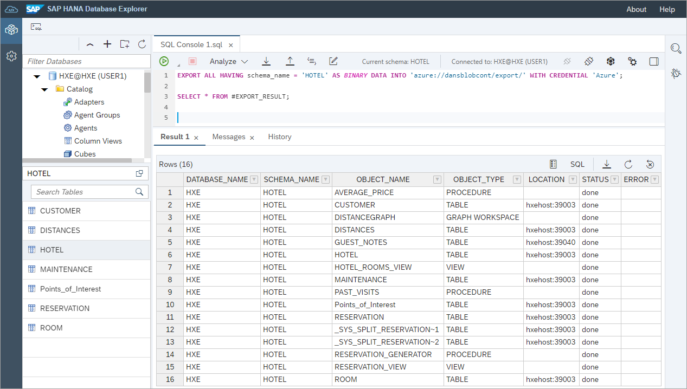

    In the SAP HANA release used in this tutorial, scheduled jobs are not included in the catalog export.


2. Import the database objects: This example imports the previously exported schema objects and data into the target database (an SAP HANA Cloud database).  `GUEST_NOTES` is exculded because the JSON document store is not supported in free tier or trial environments.

    ```SQL Free Tier or Trial
    IMPORT ALL HAVING OBJECT_NAME != 'GUEST_NOTES' FROM 'azure://dansblobcont/export/' WITH CREDENTIAL 'Azure';
    ```

    ```SQL Production Instance
    IMPORT ALL FROM 'azure://dansblobcont/export/' WITH CREDENTIAL 'Azure';
    ```

    The results of the import can be viewed with the following SQL query.

    ```SQL
    SELECT * FROM #IMPORT_RESULT;
    ```

    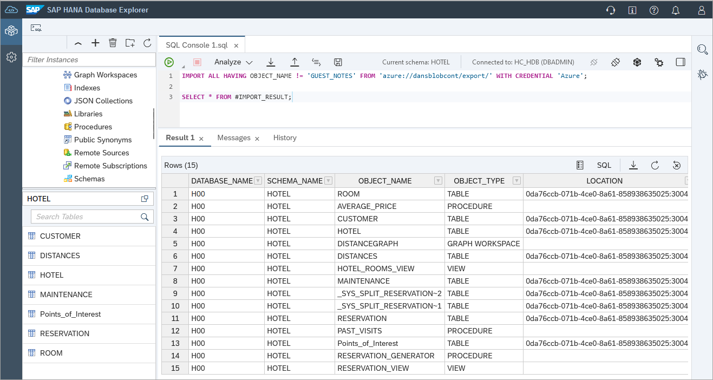

3. Examine the imported objects:  In this example, you will notice that all of the schema objects have been imported, including their data.

    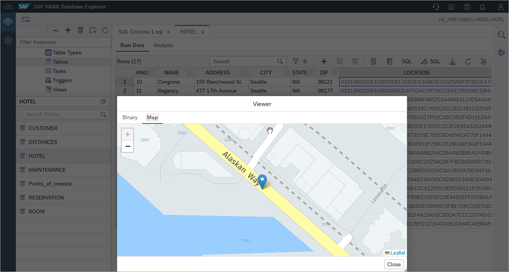

    It is also possible to use the Export and Import Catalog wizards in the SAP HANA database explorer with zip files that are downloaded and uploaded through the browser with smaller datasets.  For larger datasets it is recommended to use SAP HANA Cloud, data lake Files or a cloud storage provider such as Microsoft Azure, Amazon, or Google.


### Exporting and importing SAP HANA Deployment Infrastructure (HDI) projects
HDI containers contain both design time and runtime artifacts.  In addition to objects such as tables and views, they can contain additional advanced SAP HANA artifacts such as calculation views, flow graphs, and replication tasks.

The list of HDI container groups and containers can be seen by executing the below SQL statements.

```SQL
SELECT * FROM _SYS_DI.M_ALL_CONTAINER_GROUPS;   
SELECT * FROM _SYS_DI.M_ALL_CONTAINERS;  
```


Some additional links on granting permissions to view and manage the contents of HDI containers can be found at [SAP HANA Deployment Infrastructure (HDI) Administration](https://www.youtube.com/watch?v=njVZWRGTJAI&t=2130s) and [SAP HANA Deployment Infrastructure (HDI) SQL API](https://blogs.sap.com/2020/07/09/sap-hana-deployment-infrastructure-hdi-sql-api/).

The recommended tool for native application development with SAP HANA Cloud is the Business App Studio (BAS), which is available as a service in the SAP Business Technology Platform (BTP).  An existing SAP HANA Web IDE project can be exported and then imported into BAS or, if the project is in a git repository, the git project can be opened or cloned in the BAS.  Additional details can be found at [Multitarget Application Development Tools (SAP Business App Studio)](https://help.sap.com/docs/HANA_CLOUD_DATABASE/c2b99f19e9264c4d9ae9221b22f6f589/f7268f176e1943ad97edba3f1dfeda26.html?version=2022_4_QRC) and [Multitarget Application Development Tools (SAP Web IDE Full-Stack)](https://help.sap.com/docs/HANA_CLOUD_DATABASE/b9902c314aef4afb8f7a29bf8c5b37b3/f7268f176e1943ad97edba3f1dfeda26.html?version=2022_4_QRC).  The following steps demonstrate how to import an existing SAP HANA Web IDE project into the SAP Business App Studio, and how to import data into it using SQL.

1. Export the SAP HANA Web IDE project

    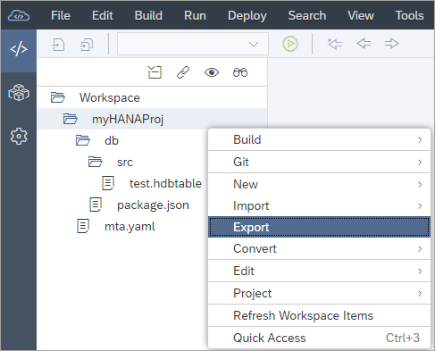

2. Open the SAP Business App Studio.

    

3. Create and open a new SAP HANA native application workspace.

    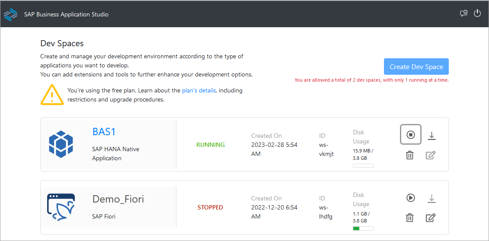

4. Once the workspace opens, use the hamburger icon to cause the file menu bar to appear.

    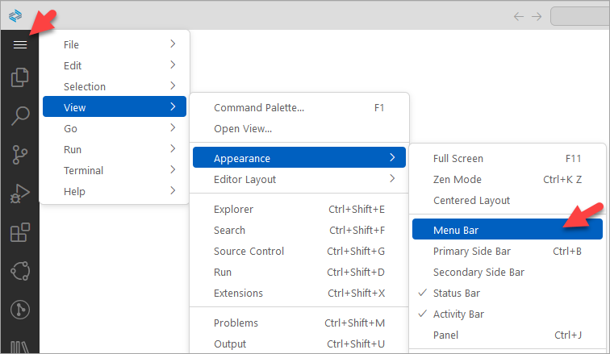

5. Open the projects folder by choosing **File > Open Folder**.

    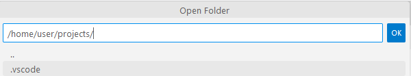

6. Select **File > Import Project** and browse to the previously exported SAP HANA Web IDE project.  

    Open the newly imported project by selecting **Open in New Workspace** in the popup dialog that appears.

    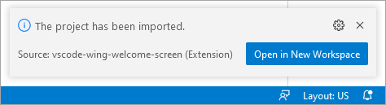

7. Login to Cloud Foundry by entering **>Login** in the command palette and selecting the option **Login to Cloud Foundry**.

    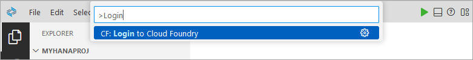

    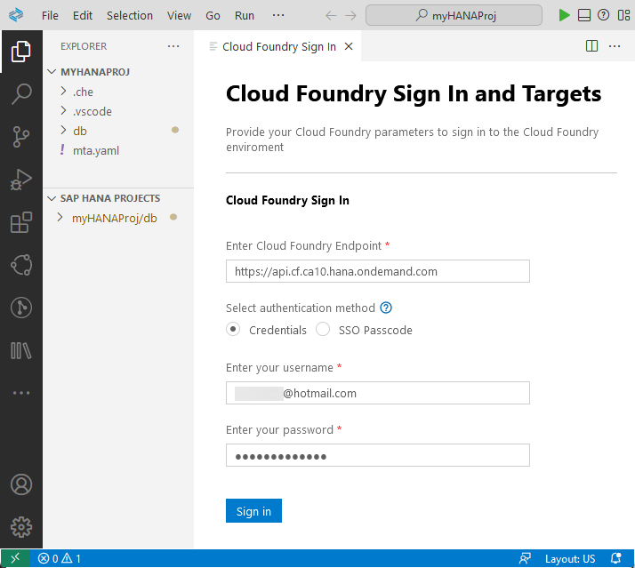

    The Cloud Foundry Endpoint value (e.g. [https://api.cf.ca10.hana.ondemand.com](https://api.cf.ca10.hana.ondemand.com)) can be obtained/confirmed by looking in the SAP BTP Cockpit under the subaccount overview.

8. Bind the project which specifies which Cloud Foundry space to associate the HDI container with and to optionally create an HDI container.

    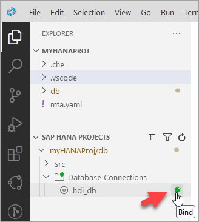

    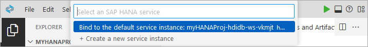

    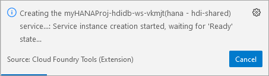

    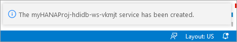

    The details of the binding are contained in `db/.env` file.  If the `.env` file does not appear, perform the bind operation a second time.  

    If the binding fails and you are using an SAP HANA Cloud instance bound to the other environment, ensure that an instance mapping has been created as described at [Exercise 1.2 Instance Mapping](https://github.com/SAP-samples/teched2022-DA261/tree/main/exercises/multi-environment/ex1).

9. The HDI container can be viewed in the SAP BTP Cockpit.

    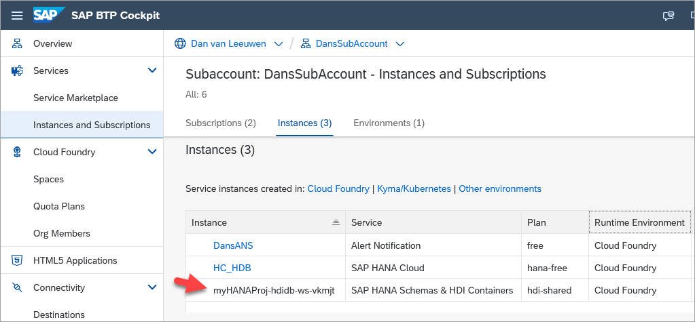

10. Deploy the project which will create the schema objects defined in the project such as the table test.  

    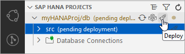

11. Open the SAP HANA database explorer and notice that the table has been deployed but it does not contain any data.

    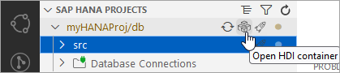

    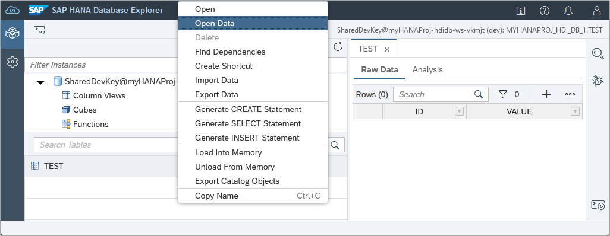

12. A similar set of steps to those followed in the exporting and importing catalog objects steps can be followed to move the data.

    In the source and destination HDI containers, the RT (runtime user) will need to be given sufficient privileges.  The RT user's name can be seen by executing the below SQL when connected to an HDI container.  This user name is needed for the subsequent steps.

    ```SQL
    SELECT CURRENT_USER FROM DUMMY;
    ```

    Execute the following SQL statement while connected to the SYSTEM database in the (on-premise) SAP HANA database.

    ```SQL
    GRANT EXPORT TO MYHANAPROJ_HDI_DB_1_DA7VCTZ9GMTJHJ47F1MI4Y08N_RT; --required to enable export of data
    ```

    Execute the following SQL statement while connected to the SAP HANA Cloud database.

    ```SQL
    GRANT IMPORT TO MYHANAPROJ_HDI_DB_1_DWYHG0Y9G8PLSYVE4IEG4DN76_RT; --required to enable import of data
    ```

    Execute the following SQL statement while connected to an HDI container being migrated.  When performing the import, ensure that the option DATA ONLY is used as the objects in an HDI container should only be created when the project is deployed.

    ```SQL
    EXPORT ALL HAVING SCHEMA_NAME = 'MYHANAPROJ_HDI_DB_1' AS BINARY DATA INTO 'azure://dansblobcont/export_hdi/' WITH NO STATISTICS CREDENTIAL 'Azure' ;
    ```

    Execute the following SQL statement while connected to an HDI container in SAP HANA Cloud.

    ```SQL
    IMPORT ALL FROM 'azure://dansblobcont/export_hdi/' WITH CREDENTIAL 'Azure' DATA ONLY;
    ```

    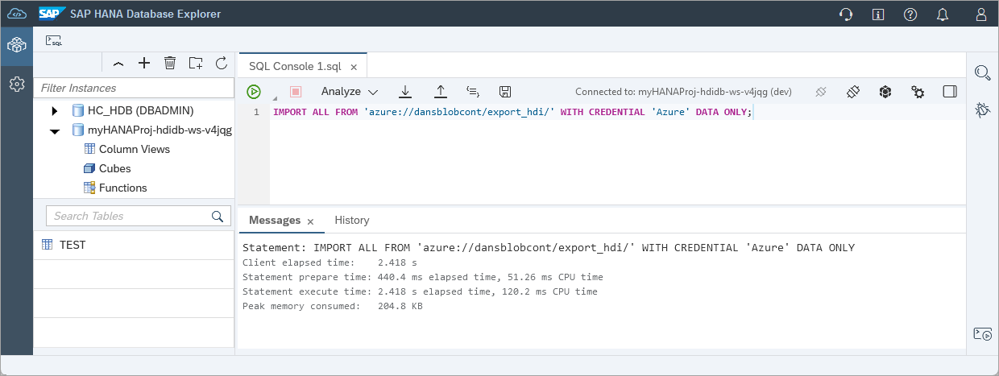

    The data for the tables in the HDI container should now be available in the SAP HANA Cloud HDI container.


### Connect from applications to SAP HANA Cloud
When connecting to an SAP HANA Cloud database, an encrypted connection must be used.  By default, the [SAP HANA Client](https://help.sap.com/docs/SAP_HANA_CLIENT) enables encrypted connections when the port is 443.  The port for SAP HANA Cloud SQL is always 443.  

The host name (and port) can be obtained from SAP HANA Cloud Central as shown below.

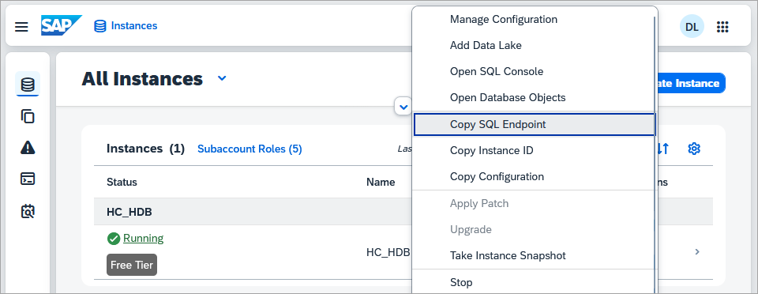

To connect to SAP HANA Cloud, the SAP HANA Client is used.  The same client is used to connect to either the on-premise SAP HANA database or an SAP HANA Cloud instance as noted in the [SAP Note: 2769719 - SAP HANA Client 2.0 Release and Maintenance Policy](https://launchpad.support.sap.com/#/notes/2769719).  New releases of the SAP HANA Client occur quarterly, and it is the current release that receives bug fixes.  It is recommended to use the latest available version of the SAP HANA Client.  Details on the releases of the SAP HANA Client can be found at [2941449 - SAP HANA Client 2.0 Releases](https://launchpad.support.sap.com/#/notes/2941449).

A few examples of connections to an SAP HANA Cloud database are shown below.  The essential parts of a connection are the host, port, user ID and password.

* SAP HANA database explorer

    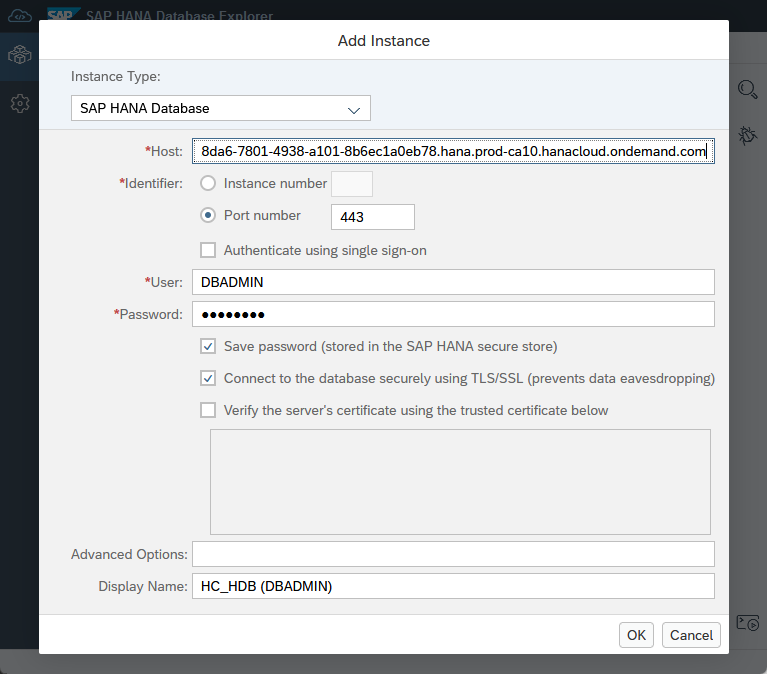

* HDBSQL

    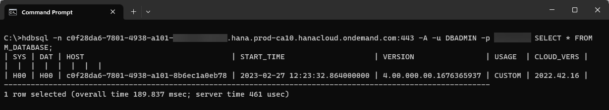

    For additional details see [Connect to SAP HANA using HDBSQL](hana-clients-hdbsql).

* ODBC

    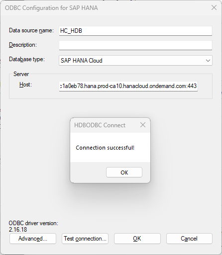

    For additional details, see [Connect Using the SAP HANA ODBC Driver](hana-clients-odbc).

* HDI

    The connection details to an HDI container can be found in the service binding.

    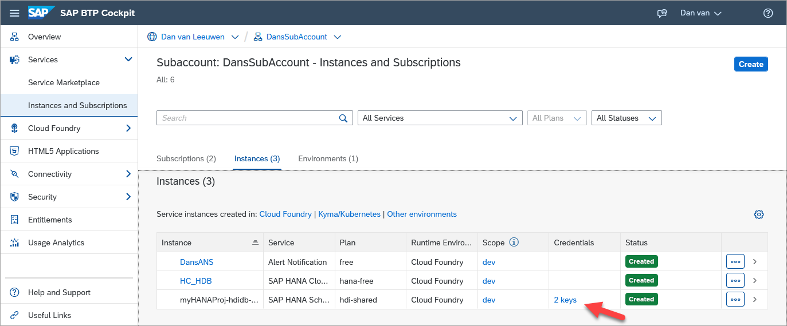

    A service binding contains the user id, password, host, and port that can be used to connect to the HDI container at runtime.

    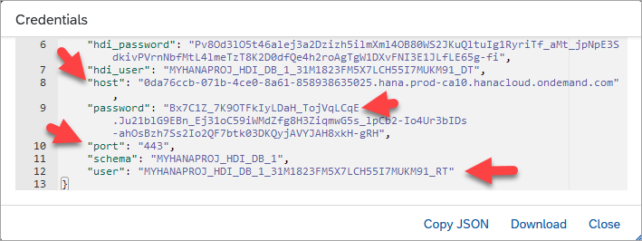

    An example of connecting to the HDI container is shown below.

    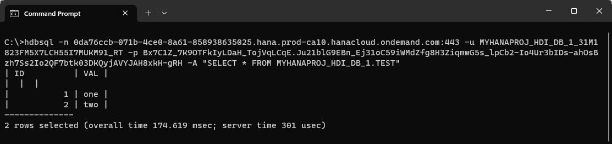

To see details of additional connections including JDBC, Node.js, Python, Go, and .NET, see [Use Clients to Query an SAP HANA Database](mission.hana-cloud-clients).


### Knowledge check

Congratulations! You now have an overview of some of the tasks involved with a migration from an on-premise SAP HANA database to an SAP HANA Cloud instance.


---
