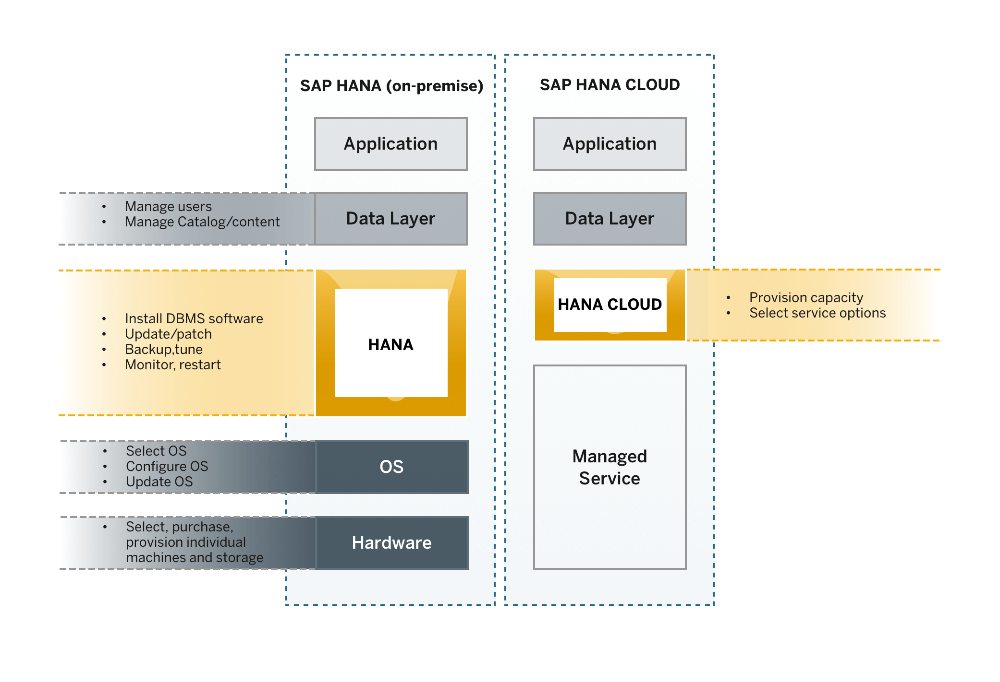
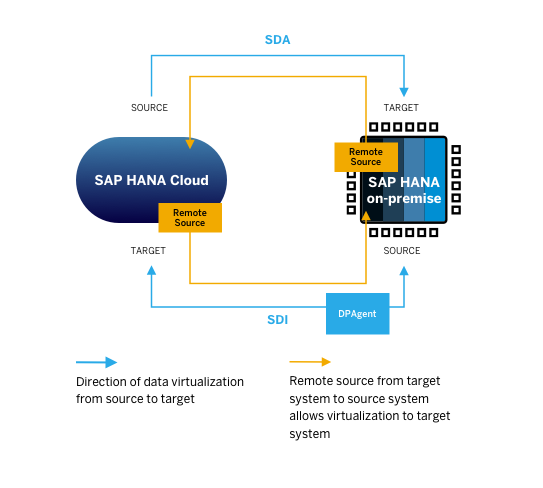

# Understand the Differences Between SAP HANA On-Premise and SAP HANA Cloud, SAP HANA Database
<!-- description --> Learn about the main differences between SAP HANA Cloud, SAP HANA database and SAP HANA on-premise.

## Prerequisites
## You will learn
- What SAP HANA on-premise and SAP HANA Cloud, SAP HANA database have in common
- What the differences between on-premise and cloud service are
- What tools to use with SAP HANA Cloud, SAP HANA database

## Intro
If you are already an SAP HANA customer, you are familiar with the power of SAP HANA and its benefits as an on-premise data management platform. But you might be asking yourself how SAP HANA Cloud, SAP HANA database fits into the picture. First and foremost, SAP HANA Cloud, SAP HANA database is not replacing SAP HANA on-premise. However, SAP HANA Cloud, SAP HANA database is the successor of SAP HANA Service.

> ### **About this mission**
>
> In this mission, you can find a series of tutorials that will help you get familiar with SAP HANA Cloud, SAP HANA database to extend your on-premise landscape to the cloud.
>
> In the **first tutorial group**, you will get to know the basic concepts and important differences between SAP HANA database on-premise and in SAP HANA Cloud and learn how to provision an instance.
>
> The **second group** focusses on different ways of replicating and virtualising data between SAP HANA databases on-premise and in SAP HANA Cloud.
>
> In the **third group**, you can learn how to set up a multi-source, hybrid environment using SAP HANA databases and other cloud databases.
This first tutorial will give you an overview of the main differences between SAP HANA on-premise and SAP HANA Cloud, SAP HANA database.

---

### Introduction

Existing SAP HANA customers can use SAP HANA Cloud, SAP HANA database to **extend their SAP HANA on-premise to the cloud**. This will provide existing SAP HANA customers with more flexibility without having to start from scratch. With SAP HANA Cloud, SAP HANA database you can get the benefits of SAP HANA core but optimized for the cloud. SAP HANA Cloud was also designed to integrate data via replication and data virtualization from multiple sources, one of those being SAP HANA on-premise.

SAP HANA Cloud, SAP HANA database allows customers with an existing SAP HANA on-premise to continue building applications and manage their databases, without having to manage hardware, the operating system, as well as without worrying about backup, updates, software installation, and patches. All of this management and maintenance is taken care of by SAP when you use SAP HANA Cloud, SAP HANA database. **Your SAP HANA on-premise stays as it is**, with the usual updates and support SAP has always offered.

> ### IMPORTANT
>
>Keep in mind that due to the nature of cloud solutions, the **update frequency** in SAP HANA Cloud is much higher than SAP HANA on-premise. This means that SAP HANA Cloud customers will get access to updates and new features faster – making the use of both your on-premise solution and SAP HANA Cloud together a great match.

Here you can see a detailed comparison between how both platforms are managed and SAP's involvement in it:

SAP HANA Cloud, SAP HANA database was developed to be as compatible as possible with its on-premise counterpart. They share a common code base and a very high degree of SQL compatibility. That also means that you will recognize the tools and procedures needed to manage and monitor an SAP HANA Cloud, SAP HANA database.

> **How does pricing work for SAP HANA Cloud, SAP HANA database?**
>
> One important difference is that all features included in your SAP HANA database in the cloud are part of the rate you pay for credits that can be used for SAP HANA Cloud. There are no additional costs for specific features. SAP customers with a Cloud Platform Enterprise Agreement (CPEA) can use SAP HANA Cloud services as well, including SAP HANA Cloud, SAP HANA database.

### Differences in provisioning

This is where you will see significant differences compared to on-premise. For your SAP HANA database in SAP HANA Cloud, you can use SAP HANA Cloud Central to provision your instances, stop and start them, as well as use the editor to scale them up and down. Provisioning and scaling are a matter of a few clicks and a few minutes, which makes a strong contrast with the process on-premise.

You can also upgrade the software of your instances here. In SAP HANA Cloud, you have full control of when your instances are upgraded, but you can only have your instances running a version that is up to two versions behind the latest.

> You will learn throughout this mission how to provision an instance of SAP HANA Cloud, SAP HANA database in the fourth tutorial of this group.
>
> If you would like to &#9755; [jump there](hana-cloud-mission-trial-2), please make sure to come back here to get the most of this mission.

### Difference in database users

SAP is now sharing the responsibilities related to system administration with customers for SAP HANA database on SAP HANA Cloud. As a managed database service, SAP provides 24 by 7 operations, and an extensive set of security, networking, monitoring, and storage services, while customers still have the ability to adjust their database performance and applications for peak performance. SAP accounts have no access to data in any SAP HANA databases within SAP HANA Cloud.

What this means exactly is that customers get additional predefined users and roles as follows:
The new customer login ID is **DBADMIN**, which has the rights make changes to database configuration (excluding the underlying hardware), and manage users, among other things. The DBADMIN login is used only by customers, SAP has no access to it.

As a security best-practice, it is recommended that you deactivate this user after creating database users with the required privileges for day-to-day tasks. The DBADMIN user can still be temporarily reactivated for emergencies, or for creating other DBA users according to your need. [Read more how to do that here](https://help.sap.com/viewer/c82f8d6a84c147f8b78bf6416dae7290/LATEST/en-US/c511ddf1767947f0adfc9636148718d9.html).

Besides the DBADMIN user that customers use, there are several other predefined database users that are required to operate the database. For example, if you are a customer of SAP HANA on-premise, you will recognize the SYSTEM user. This user is now exclusively controlled by SAP to create database users and other system activities. [Read more about predefined users in SAP HANA Cloud, SAP HANA database here](https://help.sap.com/viewer/c82f8d6a84c147f8b78bf6416dae7290/LATEST/en-US/de4ee8bbbb5710148a04f023da147c8d.html).

### Differences in tools and ways of working

Two of the most important tools you need to interact with your SAP HANA Cloud database and data lakes are the same you already use on your on-premise installation of SAP HANA: SAP HANA cockpit and SAP HANA database explorer.

Both tools work almost exactly like they do with your on-premise solution. In the case of SAP HANA cockpit, there are some differences. Because SAP HANA Cloud does not require activities like OS updates and manual backup configuration, you will not find these options on your cockpit.

One of the biggest differences is on the application development environment. For SAP HANA Cloud, you need to use the SAP Business Application Studio for your application development needs.

Get to know the tools in this video:

<iframe width="560" height="315" src="https://microlearning.opensap.com/embed/secure/iframe/entryId/1_i0xiioi5/uiConfId/43091531/pbc/213247923" frameborder="0" allowfullscreen></iframe>

You can learn more about each tool in the context of SAP HANA Cloud:

•	[SAP HANA Cloud Central](https://help.sap.com/viewer/9ae9104a46f74a6583ce5182e7fb20cb/LATEST/en-US/c8593a2ba7644465ba9c861e51697a78.html)

•	[SAP BTP cockpit](https://help.sap.com/viewer/65de2977205c403bbc107264b8eccf4b/LATEST/en-US/8061ecc529d74465b2b9566a634943ec.html)

•	[SAP HANA Cockpit](https://help.sap.com/viewer/9630e508caef4578b34db22014998dba/LATEST/en-US/6a42679ed8574fb79e94f3e03e6d57bf.html)

•	[SAP HANA Database Explorer](https://help.sap.com/viewer/a2cea64fa3ac4f90a52405d07600047b/LATEST/en-US/7fa981c8f1b44196b243faeb4afb5793.html)

•	[SAP Business Application Studio](https://help.sap.com/viewer/product/SAP%20Business%20Application%20Studio/Cloud/en-US)

### About remote connections

By creating connections to your SAP HANA on-premise databases, you can use data stored in them without leaving the SAP HANA Cloud environment and use SAP HANA Cloud, SAP HANA database as your single-access point to all your data. You can do so by creating remote sources and virtual objects or by replicating data to your SAP HANA Cloud, SAP HANA database instance.

If you want to virtualise or replicate data from one system to the other, there are two ways of doing so using two different technologies: Smart Data Access (SDA) and Smart Data Integration (SDI).

Smart Data Integration requires the use of the Data Provisioning Agent (DP Agent) and can be used for accessing data both ways, from SAP HANA on-premise to SAP HANA Cloud, SAP HANA database and vice-versa. As an SDA connection does not require the deployment of the DP Agent, SDA is the preferred way for virtualising data from the cloud to on-premise. For advanced replication capabilities, however, SDI is recommended. You will learn more about these connections in the next tutorials of this mission.

> **Well done!**
>
> You have completed the first tutorial of this mission! Now you know how some of the basic differences between SAP HANA on-premise and SAP HANA Cloud, SAP HANA database.
>
> Monitoring, Security and Backups are also different in SAP HANA Cloud, we will focus on those in the next tutorials.
>
> Learn in the next tutorial how security is handled in SAP HANA Cloud, SAP HANA database.

### Test yourself

---
