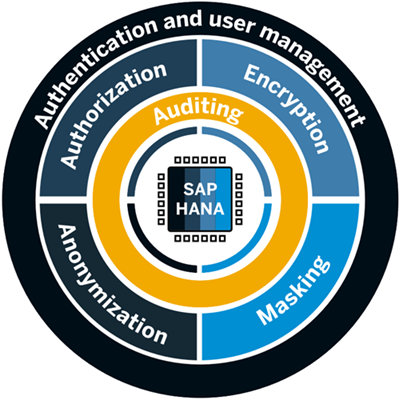
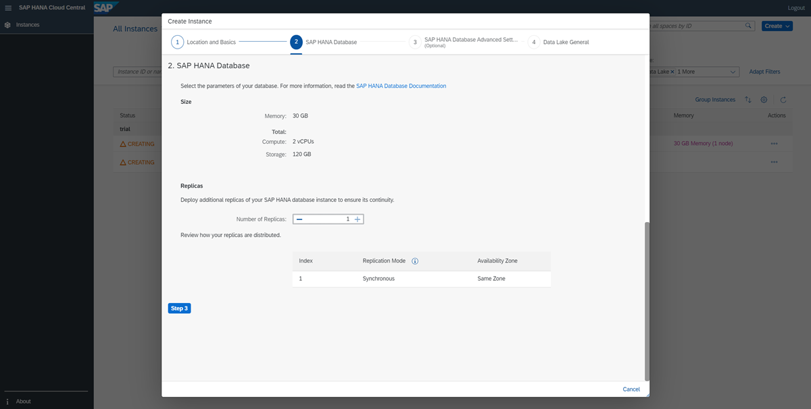
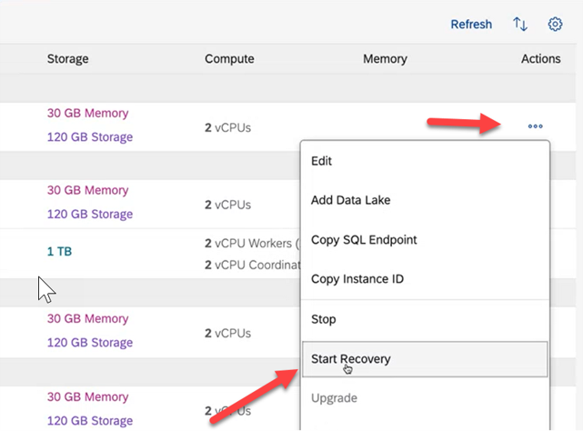
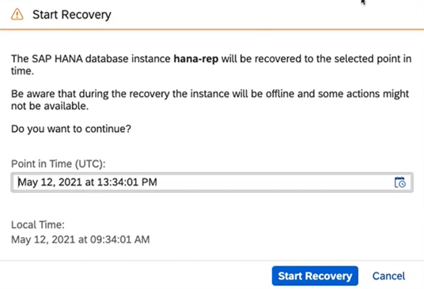

## Prerequisites

## Details
### You will learn
- What security features SAP HANA Cloud, SAP HANA database offers
- What solutions are available in terms of backups

The security of your organization's data is a big concern at SAP. This is why we pre-configure every SAP HANA Cloud, SAP HANA database instance to a secure standard. In this way, you can rely on the proven comprehensive **SAP HANA security framework**, now also in the cloud. You get complete control over who accesses your data and you can make full use of your data through advanced solutions like anonymization.

This tutorial serves as a broad introduction with links to all important documentation regarding security and backup topics. Feel free to add them all to your SAP HANA Cloud, SAP HANA database bookmark collection but do not forget to come back here and continue learning. Our first recommendation for your collection is the comprehensive technical documentation, the [SAP HANA Cloud Security Guide](https://help.sap.com/viewer/c82f8d6a84c147f8b78bf6416dae7290/LATEST/en-US/c3d9889e3c9843bdb834e9eb56f1b041.html).

---

[ACCORDION-BEGIN [Step 1: ](Access Security)]
Make use of the **user and role management capabilities** in SAP HANA Cloud, SAP HANA database. By giving you the ability to limit access and permissions at a granular level, you can make sure the right people have access to the right data and actions.

You can also take advantage of SAP HANA Cloud, SAP HANA database's authentication mechanisms to verify the identity of database users.

Find out more in the [Authentication overview of our technical documentation](https://help.sap.com/viewer/c82f8d6a84c147f8b78bf6416dae7290/LATEST/en-US/db60da90bb5710149e358d50a7361419.html).

[DONE]
[ACCORDION-END]

[ACCORDION-BEGIN [Step 2: ](Encryption, Data Masking and Auditing)]
In SAP HANA Cloud, SAP HANA database, we support a broad range of **encryption** capabilities, including data-at-rest encryption, which is configured by default, and communication encryption.
By using **data masking**, you can protect sensitive data and reduce the information exposed while still being able to do analytics on whole data sets.

Find out more about data masking in our [technical documentation](https://help.sap.com/viewer/c82f8d6a84c147f8b78bf6416dae7290/LATEST/en-US/aaa8d28740ea4cfd907d5a70017b1633.html).

Last but not least, you can define audit policies, tailored to the type of activities you wish to audit – up to and including firefighting audit policies to audit everything. This allows you not only to comply with your organization's auditing needs but also be able to retrace any actions if you run into issues.

Find out more about auditing in our [technical documentation](https://help.sap.com/viewer/c82f8d6a84c147f8b78bf6416dae7290/LATEST/en-US/ddcb6ed2bb5710148183db80e4aca49b.html).

[DONE]
[ACCORDION-END]

[ACCORDION-BEGIN [Step 3: ](Data Anonymization)]

There are different methods you can apply to truly anonymize data, but the goal is the same: to provide anonymized views of the data that fulfill these criteria:

•	Keep the original data intact

•	Prevent others from having direct access to sensitive data

•	Prevent others from deducing private and sensitive data

To get an idea how data anonymization works in SAP HANA Cloud, SAP HANA database, you can have a look at this video:

<iframe width="560" height="315" src="https://microlearning.opensap.com/embed/secure/iframe/entryId/1_6448scfq/uiConfId/43091531" frameborder="0" allowfullscreen></iframe>

We take security in SAP HANA Cloud, SAP HANA database seriously. Our mission is to make your journey on the cloud safe and productive.

[DONE]
[ACCORDION-END]

[ACCORDION-BEGIN [Step 4: ](Backups)]

To ensure maximum business continuity even in cases of emergency, SAP backs up your SAP HANA Cloud, SAP HANA database instances continually so you can recover data speedily if you need to. The recovery point objective (RPO) is no more than 15 minutes. Daily backups are only created while a database is online and up to 15 backups are stored.

Backups are replicated in zones of the same region and are encrypted.

You can display all available database backups in the SAP HANA cockpit:

1.	In SAP HANA cockpit, select the view **Administration** or **All**.

2.	Click on the card **Database Backups**.

3.	There, you can display information regarding time range of the backup catalog, space occupied by backups, information about the most recent backups within the time range.

4.	Clicking on the row of a particular backup will show you more details of that backup.

5.	Clicking on the **chart icon** allows you to visualize details of backups.

6.	To change display settings, select **Settings**.

There are plenty more display settings you can configure here, like Log Mode, Log Settings or Restrictions for Database Users.

You can read more about the [display options of backups in SAP HANA cockpit here](https://help.sap.com/viewer/9630e508caef4578b34db22014998dba/LATEST/en-US/a9ec27c9b42b44218948d645bdcec1da.html).

To recover a backup, you need to open a service request. [Read here how to do that](https://help.sap.com/viewer/db19c7071e5f4101837e23f06e576495/LATEST/en-US/918e714867e1409da47fa01ce03ba8f3.html).

In this video tutorial, you'll see the Database Backups card and the Backup Catalog and Backup Configuration app on the SAP HANA cockpit for SAP HANA Cloud. Learn more in the [companion blog post](https://blogs.sap.com/2020/04/21/sap-hana-cloud-whats-new-and-changed-database-backups/).

<iframe width="560" height="315" src="https://www.youtube.com/embed/xWBVnmqey0E" frameborder="0" allowfullscreen></iframe>

**Database Replicas**

Additionally, during provisioning an instance, you can select if you want to create **replicas** of your instance to increase your system availability. These replicas are exact duplicates of your instance that will be managed in the background and automatically synchronized. In case of issues, you can take over a replica of your instance to ensure minimal interruption.

!

To read more about increasing system availability, you can take a look at this technical documentation.

[DONE]
[ACCORDION-END]

[ACCORDION-BEGIN [Step 5: ](Recover a backup)]

**Recovering a backup**

To recover a backup, you can use the self-service recovery option in SAP HANA Cloud Central.

1.	Open SAP HANA Cloud Central.

2.	In the line of the instance you want to recover a backup from, click on the **three dots** in the column **Actions**.

3.	Select the option **Start Recovery**.

    !

4.	In the wizard that opens, select a Point in Time in the past via calendar. Note that the time will be displayed in UTC and Local Time.

    !

> **Well done!**
>
> You have completed the second tutorial of this mission! Now you know the basics about security and data recovery in SAP HANA Cloud, SAP HANA database.
>
> Learn in the next tutorial how to monitor your SAP HANA Cloud, SAP HANA database using SAP HANA cockpit - also very similarly to SAP HANA on-premise.

[DONE]
[ACCORDION-END]

[ACCORDION-BEGIN [Step 6: ](Test yourself)]

[VALIDATE_7]
[ACCORDION-END]

---
