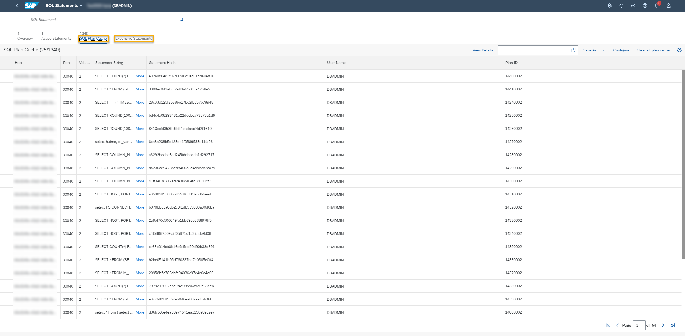

# Monitoring an SAP HANA Cloud, SAP HANA Database
<!-- description --> Learn what you can monitor in SAP HANA Cloud, SAP HANA database and how to do that in SAP HANA cockpit.

## You will learn
- What SAP HANA on-premise and SAP HANA Cloud, SAP HANA database have in common
- What the differences between on-premise and cloud service are
- What tools to use with SAP HANA Cloud, SAP HANA database

## Prerequisites

## Intro
With SAP HANA Cloud, you can manage your databases with the SAP HANA cockpit, just as you do with your SAP HANA on-premise databases. Of course, managing your cloud databases is a little different from your on-premise ones. For example, your system updates are managed for you in SAP HANA Cloud.

Important to know is that, even though you will manage your SAP HANA Cloud database with the SAP HANA cockpit, for the short term, you will need two different instances of the cockpit: one for your on-premises databases and another for the cloud databases.

This tutorial will give you an overview of the main differences between SAP HANA on-premise and SAP HANA Cloud, SAP HANA database in terms of monitoring.

### Introduction to SAP HANA Cockpit

> If you feel familiar with SAP HANA cockpit from using it with your SAP HANA on-premise database, you can skip this tutorial and <sub-style="font-size:30px">&#9755;[jump to the next one](hana-cloud-mission-trial-2) to learn about provisioning.

SAP HANA cockpit is your main tool to manage and monitor your SAP HANA Cloud, SAP HANA databases.

Using SAP HANA cockpit, you can monitor your database metrics to be able to analyze and improve performance. While SAP is responsible for monitoring both the hardware, virtual machines, and operating systems, as well as health, it is important that you monitor the operation of SAP HANA databases on a regular basis. You will learn how to access and use SAP HANA cockpit throughout the next sections of this module.

Although SAP HANA actively alerts you of critical situations, keeping an eye on resource usage and performance will help you identify patterns, forecast requirements, and recognize when something is wrong.

In SAP HANA cockpit, you can monitor…

-	overall database health
-	status and resource usage of individual database services
-	database performance across a range of key performance indicators related to memory, disk, and CPU usage
-	comparative memory utilization of column tables
-	memory statistics of the components of database services
-	alerts occurring in the database to analyze patterns of occurrence

**Performance Monitoring Tools**

SAP HANA cockpit allows you to monitor past and current information related to your database in fine-grained detail. Various tools exist to help you monitor performance in order to analyze and improve performance for your database.

In the Monitoring View, you can see several cards that help you access these tools.

<!-- border -->

-	The **Performance Monitor** helps you to visualize historical performance data related to memory, disk, and CPU usage. Here, you can compare performance of different KPI's and trigger the collection of diagnosis information if you identify issues. You can open it by clicking on **Monitor performance** on the **Monitoring card**. [Read more here](https://help.sap.com/viewer/9630e508caef4578b34db22014998dba/LATEST/en-US/910353c47c7c4239857c94d14896ea43.html).

-	The **Threads** card shows you the longest-running threads in your system and lets you filter by different parameters. [Read more about Thread Details here](https://help.sap.com/viewer/9630e508caef4578b34db22014998dba/LATEST/en-US/b03690228668407ea03ee7b11e03b530.html).

-	The **Sessions** card allows you to analyze sessions connected to your database and their SQL execution. [Read more here](https://help.sap.com/viewer/9630e508caef4578b34db22014998dba/LATEST/en-US/b7a340915f4e4e28bd33de99d710d529.html).

-	The **SQL Statements Monitor** gives you several insights about the SQL statements running in your database. On the SQL Statements card, click on View all to see the different Monitoring tools available there: **Active Statements**, **SQL Plan Cache** and **Expensive Statements**.

<!-- border -->

To read more about all available tools to monitor, analyze and improve performance, please refer to this [technical documentation on performance monitoring](https://help.sap.com/viewer/9630e508caef4578b34db22014998dba/LATEST/en-US/cdbda382eb9643cebc72ec3d60c816c7.html).

### System Information in SAP HANA Cockpit

To understand in detail the difference of monitoring and managing your database with the SAP HANA cockpit, you can take a look at the following videos, created by the SAP HANA Academy team.

In this video tutorial, you can check out the information provided by the **System Information** card on the SAP HANA cockpit for SAP HANA Cloud and compare this to what this card would show on an on-premise system (SAP HANA platform edition) and the previous SAP Business Technology Platform, SAP HANA Service (Cloud Foundry).  

<iframe width="560" height="315" src="https://www.youtube.com/embed/xjHfYNNqRtQ" frameborder="0" allowfullscreen></iframe>

For further information, have a look at the [companion blog post in the SAP Community](https://blogs.sap.com/2020/04/07/sap-hana-cloud-whats-new-and-changed-system-information/).

### Manage Services in SAP HANA Cockpit

In this video tutorial, you will see the information provided by the **Overall Database Status** card and the **Manage Services** view on the SAP HANA cockpit for SAP HANA Cloud and compare this to an on-premise system (SAP HANA platform edition) and the previous SAP Cloud Platform, SAP HANA Service (Cloud Foundry).  

<iframe width="560" height="315" src="https://www.youtube.com/embed/QNV8vgraN6Q" frameborder="0" allowfullscreen></iframe>

You can also check out the [companion blog post in the SAP Community](https://blogs.sap.com/2020/04/09/sap-hana-cloud-whats-new-and-changed-manage-services/).

### Alerts in SAP HANA Cockpit

In this video tutorial, you can get to know the **Alerts** card on the SAP HANA cockpit for SAP HANA Cloud.

<iframe width="560" height="315" src="https://www.youtube.com/embed/F3XHy9GzsbI" frameborder="0" allowfullscreen></iframe>

Read more in the [companion blog post in the SAP Community](https://blogs.sap.com/2020/04/10/sap-hana-cloud-whats-new-and-changed-alerts/).

### Monitoring in SAP HANA Cockpit

In this video tutorial, you can see how to work with the **CPU | Memory | Disk Usage** and **Monitoring** cards on the SAP HANA cockpit for SAP HANA Cloud with the associated apps:

* Performance Monitor
* Performance Comparison
* Workload Analysis
* Memory Analysis
* Buffer Cache Monitor
* and Memory Paging Monitor  

<iframe width="560" height="315" src="https://www.youtube.com/embed/KiGd2cxJFBQ" frameborder="0" allowfullscreen></iframe>

Read more in the [companion blog post in the SAP Community](https://blogs.sap.com/2020/04/16/sap-hana-cloud-whats-new-and-changed-monitoring/).

### Monitoring Replication Services in SAP HANA Cockpit

If you have used the HANA Cockpit Replication Service to set up replication of remote objects, e.g. from an SAP HANA on-premise database. You can monitor these replication objects on the **Replication Services** Card.

Read more about this in the [blog post in the SAP Community](https://blogs.sap.com/2020/11/10/replication-service-to-easily-setup-replication-from-sap-hana-on-premise-to-sap-hana-cloud./).

You can find the [technical documentation about Replication Service here](https://help.sap.com/viewer/9630e508caef4578b34db22014998dba/LATEST/en-US/d594bdf58b0445e3b09c49b076cde9c1.html).

### Monitoring Sessions, Thread, and Statements in SAP HANA Cockpit 

In this video tutorial, you can see how to work with **Sessions, Threads, Blocked Transactions** and related apps like **Monitor Statements** on the SAP HANA cockpit for SAP HANA Cloud.  

<iframe width="560" height="315" src="https://www.youtube.com/embed/SRneoqYkZjU" frameborder="0" allowfullscreen></iframe>

You can also check out the [companion blog post in the SAP Community](https://blogs.sap.com/2020/04/20/sap-hana-cloud-whats-new-and-changed-monitoring-session-threads-and-statements/).

> **Well done!**
>
> You have completed the third tutorial of this mission! Now you know the basics about monitoring your databases in SAP HANA Cloud, SAP HANA database.
>
> Learn in the next tutorial how to provision an instance of SAP HANA Cloud, SAP HANA database.

---
