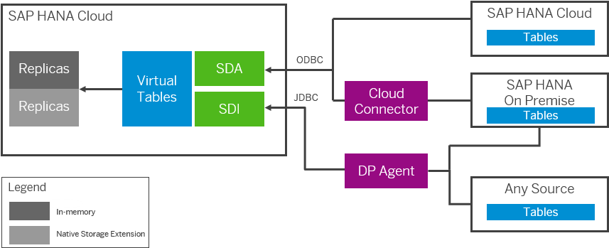
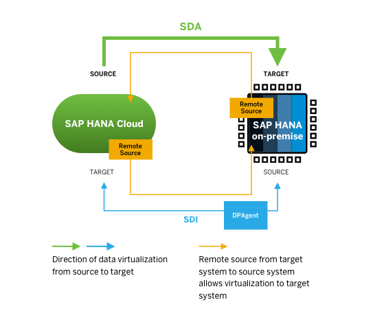
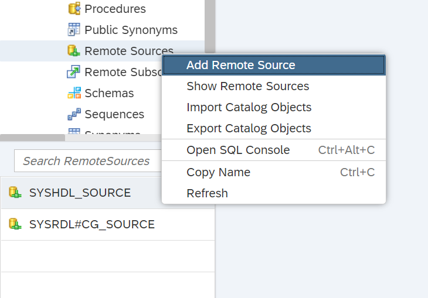
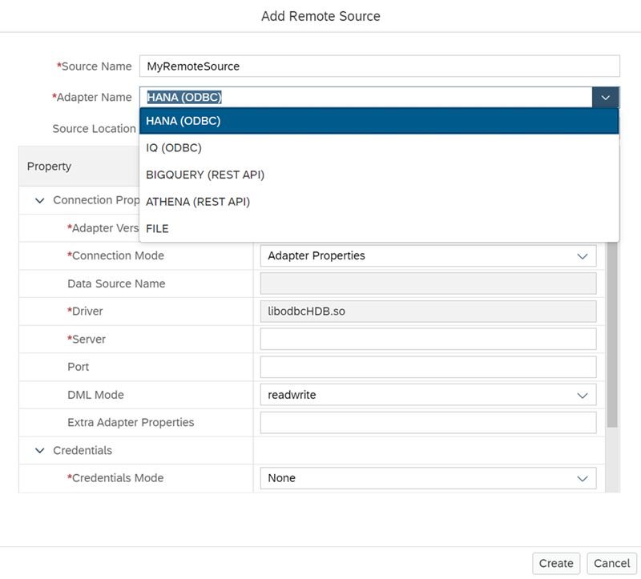
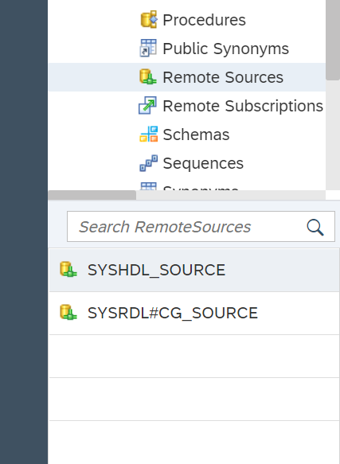
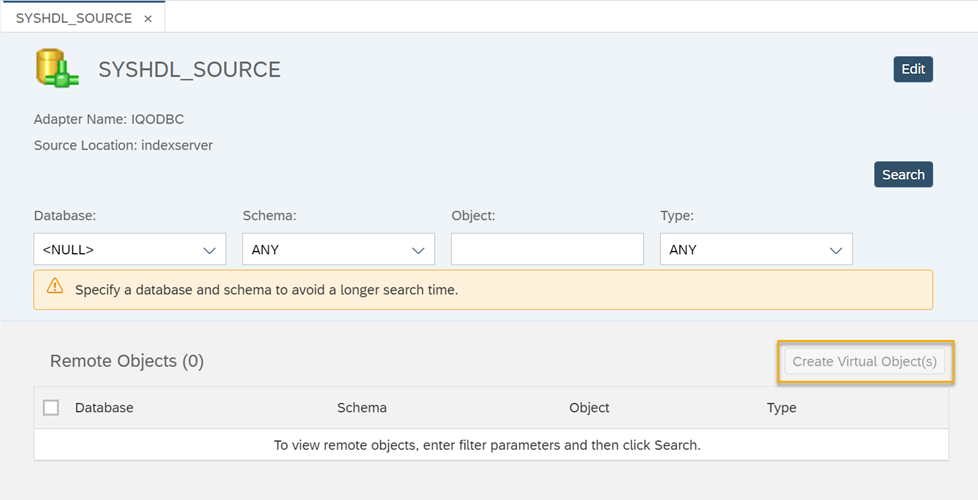

# Understand the Basics About Data Replication and Data Virtualization
<!-- description --> Get an overview about the different ways to replicate and virtualize data from different sources to SAP HANA Cloud, SAP HANA database and vice-versa.

## Prerequisites
## You will learn
- What data replication and data virtualization in SAP HANA Cloud, SAP HANA database are
- What different connection methods are available to you for replication and virtualization between SAP HANA Cloud, SAP HANA database and SAP HANA on-premise
- What Smart Data Access (SDA) and Smart Data Integration (SDI) mean
- How to create remote source connections and virtual tables in the SAP HANA Database Explorer

## Intro
This **tutorial group** will give you an overview of data replication and data virtualization via remote sources to and from SAP HANA Cloud, SAP HANA database.

This first **tutorial** serves as an introduction to this tutorial group. You will get to know the basic concepts and get an overview of the topics covered throughout the tutorials.

---

### Introduction

SAP HANA Cloud, SAP HANA database allows you to access remote data as if the data were stored in local tables. This can be achieved either by creating **virtual tables** or by using **data replication** between the systems.

A virtual table points to a table in another database. In a replication scenario, data is read from remote sources and values are translated into SAP HANA datatype values. Changes can be batch-loaded or replicated in real time from the remote source to the SAP HANA Cloud, SAP HANA database.

Virtualising data offers the advantage that data does not need to be copied to your SAP HANA Cloud, SAP HANA database, which results in lower storage costs.

However, accessing data remotely this way can sometimes take longer. When this is the case and you want to improve query performance, replicating data to your database can be advantageous. In SAP HANA Cloud, SAP HANA database, you can set up replications in a way that they will automatically contain the latest updates to your data, for example using **Remote Table Replication**.

These features are made possible through the use of different connection technologies.
Generally, there are different technologies that support different scenarios of replicating and virtualising data from and to an SAP HANA Cloud, SAP HANA database. The next two sections describe two different use cases. First, we will look at the technologies used to access data in SAP HANA Cloud, SAP HANA database as the target system. Secondly, we will focus on accessing data from SAP HANA Cloud, SAP HANA database in an SAP HANA on-premise target system.

### Access data in SAP HANA Cloud, SAP HANA Database

In this diagram provided by the [technical documentation on Replicating Tables from Remote Sources](https://help.sap.com/viewer/3a6f321771a74066b521198559165ce9/LATEST/en-US/2937dc0404e04f91be3aff16ebd7acaa.html), you can see different methods of replicating data to SAP HANA Cloud, SAP HANA database:

To virtualise and replicate data in SAP HANA Cloud, SAP HANA database as the **target system**, several ways and technologies are available depending on the source system:

If the **source system** is another **SAP HANA Cloud, SAP HANA database**, Smart Data Access (SDA) is the preferred and simplest way. This connection uses the ODBC adapter.

If the **source system** is an **SAP HANA on-premise database**, there are two options available. One uses the same SDA technology and ODBC adapter and the other uses the Smart Data Integration (SDI) technology and the JDBC adapter.

Both ways of accessing data from SAP HANA on-premise in SAP HANA Cloud, SAP HANA database require an additional component to be installed and configured. SDA connections require the use of the **cloud connector** and SDI connections rely on the **Data Provisioning Agent**.

If the source system is neither SAP HANA on-premise nor SAP HANA Cloud, SAP HANA database, an SDI connection with the DP Agent is the way to go.

### Access data from SAP HANA Cloud, SAP HANA database

Additionally, to virtualise and replicate data the other way around, if SAP HANA Cloud, SAP HANA database is the source system and an SAP HANA on-premise database is the target system, SDA is the preferred method. For this direction, a connection using SDI and the DP Agent is also possible and offers more advanced capabilities. In this tutorial group, we will focus on the recommended scenario of using SDA for this direction.

### Create a remote source in the SAP HANA Database Explorer

> In this step, you can see the general steps to create a remote source connection using the SAP HANA Database Explorer. Throughout the next tutorials, we will walk you through this process step-step-step for different scenarios.

By creating connections to data sources outside of your SAP HANA Cloud database, you can use data stored in these remote sources by creating various virtual tables. To create remote connections, you need to use the SAP Database Explorer, and have at least one instance of SAP HANA Cloud already provisioned.

<!-- border -->

In the SAP HANA Database Explorer, expand the **Catalog** in the panel on the left side of the screen. Then right click on **Remote Sources** and then click on **Add Remote Source**. In the prompt that opens, add the name of the source and then select the adapter to the source you are trying to connect to. The following connections are currently available:

<!-- border -->

Depending on the connection you choose, the form and mandatory information needed will change. To connect to an SAP HANA on-premise installation, for example, you would choose the connection **HANA (ODBC)**.

Once you are done filling out the necessary fields, click on **Create**. Your remote connection will be created. You will see it listed on the lower panel on the left side of the screen.

### Create a virtual table in the SAP HANA Database Explorer

> In this step, you can see the general steps to create virtual tables using the SAP HANA Database Explorer. Throughout the next tutorials, we will walk you through this process step-step-step for different scenarios.

In the SAP HANA Database Explorer, expand the **Catalog** in the panel on the left side of the screen. Then right click on **Remote Sources** and then click on **Show Remote Sources**. All available remote sources are listed in the lower left-hand corner.

<!-- border -->

When you click on one remote source, you will be able to search all the databases, schema, objects, or types within this source. You can then view the individual remote objects. These can be, for example, actual tables of data. To access individual tables, check the boxes next to each table you want to access. Then click on **Create Virtual Objects** on the right-hand side of the screen.

<!-- border -->

Your virtual tables will be created. You will see them listed on the lower panel on the left side of the screen.

### Get an overview of the tutorials ahead

In the [next tutorial of this group](hana-cloud-mission-extend-05), you will first learn how to set up the simplest connection method, using SDA. In our scenario, we will use it to virtualise data from SAP HANA Cloud, SAP HANA database to SAP HANA on-premise.

In the [tutorial after that](hana-cloud-mission-extend-06), you will learn how to use SDI and the DP Agent to access data the other way around.

After that, we will show you how to alternatively [use the cloud connector](hana-cloud-mission-extend-08) for the same direction of data access.

Once you have set up a connection, you can use Remote Table Replication, which allows you to benefit from transient log-based replication, optimized performance with the SDA ODBC connection and near real-time replication. Remote Table Replication is also the preferred way to replicate data between SAP HANA Cloud, SAP HANA database instances. You will learn how to use this feature in the [last tutorial of this group](hana-cloud-mission-extend-09).

Now that you have an overview of the roadmap of this learning track, let us get started!

> **Well done!**
>
> You have completed the first tutorial of this group! Now you know the basics about data replication and data virtualization in SAP HANA Cloud, SAP HANA database.
>
> Learn in the next tutorial how to virtualise data from SAP HANA Cloud, SAP HANA database to SAP HANA on-premise using Smart Data Access.

### Test yourself

---
