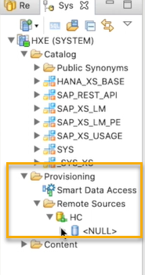

## Prerequisites
- A **running** SAP HANA Cloud, SAP HANA database instance with a table that contains data.
- An SAP HANA on-premise database running on SAP HANA platform edition SPS04 or higher. Alternatively, you can [download and install the latest SAP HANA express edition](https://www.sap.com/cmp/td/sap-hana-express-edition.html#20) either as binary in Linux or as VM locally or in any cloud provider like Amazon Web Services, Microsoft Azure or Google Cloud Platform.
- An instance of the SAP HANA Database Explorer or SAP HANA Studio connected to the SAP HANA on-premise database.


## Details
### You will learn
- How to create a remote source to an SAP HANA Cloud, SAP HANA database instance in your SAP HANA on-premise system using Smart Data Access
- How to then virtualise data from SAP HANA Cloud to an SAP HANA on-premise database


**Smart Data Access (SDA)** can be used to virtualise data from a source SAP HANA Cloud, SAP HANA database to an SAP HANA on-premise target database. Since this HANA-to-HANA federation does not require additional deployment of the Data Provisioning Agent, unlike SDI, SDA is the preferred and simplest way in this direction to virtualise data. SDI may also be used for this direction and offers more advanced replication capabilities. You will learn how to use SDI in the [next tutorial of this group](hana-cloud-mission-extend-06).


For simplicity, we will focus on the preferred and simpler option in this article, using SDA.

In this article, you will learn step by step how to create an SDA connection between SAP HANA Cloud, SAP HANA database and SAP HANA on-premise. This includes creating a **remote source** to an SAP HANA Cloud, SAP HANA database instance in your SAP HANA on-premise system to then **virtualise data** from SAP HANA Cloud in an SAP HANA on-premise database.


---

[ACCORDION-BEGIN [Step 1: ](Preparations)]

1.	**Start** the SAP HANA platform or express edition on-premise or on cloud hypervisor.

2.	**Login** to the tenant database of the on-premise system using the **SAP HANA Database Explorer** or SAP HANA Studio for the local instance.  

3.	To create a remote source to SAP HANA Cloud, you need to retrieve some information from the SAP HANA Cloud instance. Both can be found in the **SAP HANA Cloud Central**:

    -	The exact **name** of your SAP HANA Cloud, SAP HANA database instance
    -	The **Endpoint** of your SAP HANA Cloud, SAP HANA database instance

    !

4.	Copy the name of the instance and the endpoint and paste it to a text editor.

5.	Next, you need to get a certificate string for SAP HANA Cloud, SAP HANA database. In your **command line** (`iTerm` or [`Terminalon` iOS](https://support.apple.com/en-sg/guide/terminal/welcome/mac), or [Command Prompt](https://www.lifewire.com/how-to-open-command-prompt-2618089)  on WIN) enter this command to download the `pem` file:

    ```Shell/Bash
curl -O https://cacerts.digicert.com/DigiCertGlobalRootCA.crt.pem
```

After the file has been downloaded, use a text editor which can read a `pem` file, such as Notepad or Apple Text Editor, to access the certificate string.


[DONE]
[ACCORDION-END]

[ACCORDION-BEGIN [Step 2: ](Create a PSE and a certificate)]

1.	Create a certificate store, also called PSE (personal security environment). You can read more about [PSE and how to import certificates for SSL connections here](https://help.sap.com/viewer/f9c5015e72e04fffa14d7d4f7267d897/LATEST/en-US/86e96624e9a74e77994f7544db51061c.html).

    ```SQL
CREATE PSE [certificate store name]
```

2.	Create a certificate for SAP HANA Cloud, SAP HANA database and name it, for example 'HC'. Paste the certificate string you copied here (already included in this case).

    ```SQL
-- create certificate
CREATE CERTIFICATE FROM
'-----BEGIN CERTIFICATE-----MIIDrzCCApegAwIBAgIQCDvgVpBCRrGhdWrJWZHHSjANBgkqhkiG9w0BAQUFADBhMQswCQYDVQQGEwJVUzEVMBMGA1UEChMMRGlnaUNlcnQgSW5jMRkwFwYDVQQLExB3d3cuZGlnaWNlcnQuY29tMSAwHgYDVQQDExdEaWdpQ2VydCBHbG9iYWwgUm9vdCBDQTAeFw0wNjExMTAwMDAwMDBaFw0zMTExMTAwMDAwMDBaMGExCzAJBgNVBAYTAlVTMRUwEwYDVQQKEwxEaWdpQ2VydCBJbmMxGTAXBgNVBAsTEHd3dy5kaWdpY2VydC5jb20xIDAeBgNVBAMTF0RpZ2lDZXJ0IEdsb2JhbCBSb290IENBMIIBIjANBgkqhkiG
9w0BAQEFAAOCAQ8AMIIBCgKCAQEA4jvhEXLeqKTTo1eqUKKPC3eQyaKl7hLOllsBCSDMAZOnTjC3U/dDxGkAV53ijSLdhwZAAIEJzs4bg7/fzTtxRuLWZscFs3YnFo97nh6Vfe63SKMI2tavegw5BmV/Sl0fvBf4q77uKNd0f3p4mVmFaG5cIzJLv07A6Fpt43C/dxC//AH2hdmoRBBYMql1GNXRor5H4idq9Joz+EkIYIvUX7Q6hL+hqkpMfT7PT19sdl6gSzeRntwi5m3OFBqOasv+zbMUZBfHWymeMr/y7vrTC0LUq7dBMtoM1O/4gdW7jVg/tRvoSSiicNoxBN33shbyTApOB6jtSj1etX+jkMOvJwIDAQABo2MwYTAOBgNVHQ8BAf8EBAMCAYYwDwYDVR0TAQH/BAUwAwEB/zAdBgNVHQ4EFgQUA95QNVbRTLtm8KPiGxvDl7I90VUwHwYDVR0jBBgwFoAUA95QNVbRTLtm8KPiGxvDl7I90VUw
DQYJKoZIhvcNAQEFBQADggEBAMucN6pIExIK+t1EnE9SsPTfrgT1eXkIoyQY/EsrhMAtudXH/vTBH1jLuG2cenTnmCmrEbXjcKChzUyImZOMkXDiqw8cvpOp/2PV5Adg06O/nVsJ8dWO41P0jmP6P6fbtGbfYmbW0W5BjfIttep3Sp+dWOIrWcBAI+0tKIJFPnlUkiaY4IBIqDfv8NZ5YBberOgOzW6sRBc4L0na4UU+Krk2U886UAb3LujEV0lsYSEY1QSteDwsOoBrp+uvFRTp2InBuThs4pFsiv9kuXclVzDAGySj4dzp30d8tbQkCAUw7C29C79Fv1C5qfPrmAESrciIxpg0X40KPMbp1ZWVbd4=-----END CERTIFICATE-----'
COMMENT 'HC';
```

> **Why the comment ´HC´?**
>
> In the next step, we will need to obtain the ID of this certificate to add it to our PSE. Using a comment when creating this certificate will make it easier for us to find it and get its ID.


[DONE]
[ACCORDION-END]


[ACCORDION-BEGIN [Step 3: ](Add the certificate to the PSE)]

1.	Get the certificate ID of this certificate by running this SQL statement:

    ```SQL
SELECT CERTIFICATE_ID FROM CERTIFICATES WHERE COMMENT = 'HC';
```

2.	Add this certificate to the certificate store by inserting the certificate ID into the SQL statement:

    ```SQL
ALTER PSE SSL ADD CERTIFICATE <certificate_id>;
```

3.	Now set the PSE purpose as remote source. This way, all remote sources you create will use the certificates stored in the PSE. Please note, that only one PSE can be set as remote source purpose.

    ```SQL
SET PSE SSL PURPOSE REMOTE SOURCE;
```


[DONE]
[ACCORDION-END]

[ACCORDION-BEGIN [Step 4: ](Create the remote source)]

To now create a remote source, copy and paste the following statement into your console and replace the `<placeholders>` with your specific information (see instructions below the code).

```SQL
CREATE REMOTE SOURCE <remote_source_name> ADAPTER hanaodbc
CONFIGURATION 'Driver=libodbcHDB.so;ServerNode=<endpoint>;
encrypt=TRUE;'
WITH CREDENTIAL TYPE 'PASSWORD' USING 'user=<user_name>;password=<password>';
```

-	Enter a **name** for your remote source to replace `<remote_source_name>`, e.g. "HC".
-	Paste the **endpoint** information you copied in step 1 as `<endpoint>`.
-	Include the **credentials of the user** that has permission to access the SAP HANA Cloud, SAP HANA database instance. You could use the `DBADMIN` user for the purpose of testing, but for 'real-world' use cases this is not recommended. Read more on [user creation in SAP HANA Cloud, SAP HANA database here](hana-cloud-mission-trial-4).

Once all this information is included, run the statement. Then **refresh** and you will now see on the left in your catalog that the remote source has been successfully created.

!

#### **CAUTION**:

If you are using an SAP HANA on-premise version lower than `rev45`, the steps describing the PSE do not apply for you. Instead, you need to include the certificate string directly in the `CREATE REMOTE SOURCE` statement following the endpoint information:

```SQL
CREATE REMOTE SOURCE [remote_source_name] ADAPTER hanaodbc
CONFIGURATION 'Driver=libodbcHDB.so;ServerNode=<endpoint>;
sslTrustStore="-----BEGIN CERTIFICATE-----<certificate_string_as_a_single_line>-----END CERTIFICATE-----";encrypt=TRUE;'
WITH CREDENTIAL TYPE 'PASSWORD' USING 'user=<user_name>;password=<password>';
```

You can read more about how to [create remote sources in the technical documentation here](https://help.sap.com/viewer/477aa413a36c4a95878460696fcc8896/LATEST/en-US/275839492fef49318d92d0e31656ea0a.html).


[DONE]
[ACCORDION-END]

[ACCORDION-BEGIN [Step 5: ](Create a virtual table in your on-premise database)]

Now that the SDA connection between the SAP HANA on-premise database and the SAP HANA Cloud, SAP HANA database has been created, you can virtualise the data from the cloud to on-premise following these steps:

1.	You can check whether the remote connection is correctly configured by opening the SAP HANA Database Explorer and clicking on **Remote sources**. Then click on the newly created remote source ("HC" in this example). Another tab will open, where you can check whether the objects from your remote source can be retrieved. If you are using SAP HANA Studio for your local instance, expand the catalog items **HC**, then **Null**, then **SYS** to see all the system view tables.

    !

2.	Next, use the SQL Code below to create the virtual table. Make sure to enter the exact name of your SAP HANA Cloud, SAP HANA database instance (at the top of the tile) that you used in the previous step and to include the name of the remote source that you created in step 4. of the previous section ("HC" in our example):

    ```SQL
CREATE VIRTUAL TABLE WORKSHOP.VT_TABLES AT "HC"."<instance_name>"."SYS"."TABLES";
```

    > If you have chosen a different name for the remote source in the step 4, you need to change the name in this statement accordingly or go back to that step and change the name. We recommend prefixing the name to ´HC´ to avoid confusion later.

3.	Run the statement.


[DONE]
[ACCORDION-END]

[ACCORDION-BEGIN [Step 6: ](Check the content of the new virtual table)]


1.	To check if your virtual table has been created in your on-premise database, open your schema in the catalog of your SAP HANA on-premise.

2. Then, click on **Tables** and you can see the virtual table you have just created. Note, that if you are using the SAP HANA Database Explorer, you must first select TABLES and then filter by the name of your schema.

    !

2.	To check the content of your virtual table, you can run a `SELECT*FROM` statement.

3.	A table view will open. There you can see that the data is being pulled from the remote source to your local SAP HANA on-premise database.

    !

> **Well done!**
>
> You have completed the second tutorial of this group! Now, you know how to use Smart Data Access, or SDA, to virtualise data from an SAP HANA Cloud, SAP HANA database instance to an SAP HANA on-premise database.  
>
> Learn in the next tutorial how to access data the other way around: Setting up a connection between SAP HANA on-premise and SAP HANA Cloud, SAP HANA database with SDI and the DP Agent.


[DONE]
[ACCORDION-END]

[ACCORDION-BEGIN [Step 7: ](Test yourself)]


[VALIDATE_7]
[ACCORDION-END]

---
