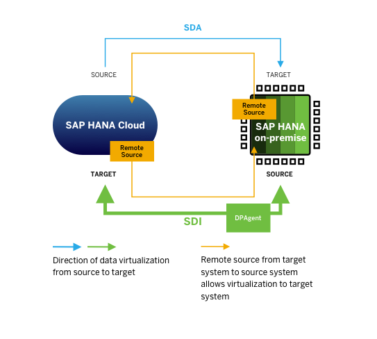

# Use Smart Data Integration to Virtualise Data from On-Premise to the Cloud
<!-- description --> Virtualize data from SAP HANA on-premise to SAP HANA Cloud, SAP HANA database using Smart Data Integration (SDI) and the Data Provisioning Agent.

## Prerequisites
-	A **running** instance of SAP HANA Cloud, SAP HANA database.
-	An SAP HANA on-premise database that contains data.
-	The SAP HANA on-premise database should be running on SAP HANA platform edition. Alternatively, you can [download and install the latest SAP HANA express edition](https://www.sap.com/products/technology-platform/hana/express-trial.html) either as binary in Linux or a Docker image.
-	An instance of the SAP HANA Database Explorer or SAP HANA Studio connected to the SAP HANA on-premise database.
-	Lastly, you need to install the Data Provisioning Agent, which you can [download here](https://tools.hana.ondemand.com/#cloudintegration).

## You will learn
- How to set up and configure the Data Provisioning Agent
- How to create a remote source to an SAP HANA Cloud, SAP HANA database instance in your SAP HANA on-premise system using Smart Data Integration
- How to then virtualise data from an SAP HANA on-premise database to SAP HANA Cloud, SAP HANA database

## Intro
If you want to virtualise and replicate data from an SAP HANA on-premise database to SAP HANA Cloud, SAP HANA database, Smart Data Integration (SDI) is the best method to use.

SDI may also be used to virtualise and replicate data in the other direction, from SAP HANA Cloud, SAP HANA database to SAP HANA on-premise, which offers more advanced replication capabilities but is more complicated to deploy. Therefore, for virtualising data from SAP HANA Cloud, SAP HANA database to SAP HANA on-premise, SDA is the preferred method. To learn more about using SDA you can check out the [previous tutorial in this group](hana-cloud-mission-extend-05) if you have not done so yet.

SDI is an ETL (Extract Transform and Load) tool and it comes as part of SAP HANA Cloud, SAP HANA database. This means that you can easily integrate various kinds of source systems into SAP HANA Cloud, SAP HANA database without installing an ETL application. You can also develop ETL jobs just like you develop tables and views.

In this tutorial, you will learn step by step how to virtualise and replicate data from SAP HANA on-premise to SAP HANA Cloud, SAP HANA database by creating an SDI connection and setting up the Data Provisioning Agent.  

---

### Set up the Data Provisioning Agent

Before you can virtualise data from SAP HANA on-premise to an SAP HANA Cloud, SAP HANA database, you need to set up the Data Provisioning Agent (DPA), which will allow data to be securely transmitted from the on-premise system.

You have two options to complete this step:

1.	Follow a video tutorial

2.	Follow the written instructions

> Select the option you prefer by clicking on "Video" or "Written instructions" below this step title.
>
> <!-- border -->

[OPTION BEGIN [Video]]

Watch this video to see all the steps needed to install and configure the Data Provisioning Agent using the Command Line Interface:

<iframe width="560" height="315" src="https://microlearning.opensap.com/embed/secure/iframe/entryId/1_ueoav5jl/uiConfId/43091531/pbc/213248013" frameborder="0" allowfullscreen></iframe>

[OPTION END]
[OPTION BEGIN [Written Instructions]]

### Install the client:

1.	Download the [DP Agent here](https://tools.hana.ondemand.com/#cloudintegration). Type in the directory where you installed the DP Agent and then the name of the installation file. You can select the default installation path by pressing `Enter`.

2.	For the **Agent Listener Port (5050)** and **Agent Administration Port (5051)**, you can also select the `default`. If you want to use the JRE directory that comes bundled, press `Enter`, and the installation will start.

### Start the client:

3.	Once the installation is finished, go to the directory `dataprovagent/bin`, and access the configuration tool using this command: `./agentcli.sh –configAgent`.

4.	Start the agent by entering option `2 (Start or Stop Agent)` in the top menu and then option `1 (Start Agent)` to start the agent. To check if the agent service is running correctly, you can ping the agent by entering option `3 (Ping Agent)`.

### Connect the client to the SAP HANA Cloud, SAP HANA database instance:

5.	In the top menu (go back with option `b`), choose option `6` to select **SAP HANA Connection**.

6.	To connect via **JDBC with SSL encryption**, enter option `1`. Next, select the default to enable encryption.

7.	In **SAP HANA Cloud Central**, copy the endpoint information of your SAP HANA Cloud, SAP HANA database instance.

8.	Remove `:443` from the endpoint information and paste it as host name. Enter `443`as the port number.

9.	Enter the credentials of an Agent Admin HANA User with the privileges `AGENT ADMIN` and `ADAPTER ADMIN`. You could use the super-user DBADMIN, but this may not always be recommended and depends on your security strategy.

10.	Depending on whether the DP Agent is behind a firewall, enter `true` to set up a proxy server that bypasses the firewall or `false` if no proxy server is needed.

11.	Enter the credentials of a user that will access the database during normal operations with the privileges for SDI/SDA management: `ADAPTER ADMIN`, `AGENT ADMIN `and `CREATE REMOTE SOURCE`.

> For more detailed information on how to connect the client to SAP HANA Cloud, SAP HANA database, you can read more in the [technical documentation here](https://help.sap.com/viewer/7952ef28a6914997abc01745fef1b607/LATEST/en-US/6634db61aa43435a977b608878e5313f.html).

### Register the agent:

12.	In the top menu (go back with option **`b`**), enter option `7 (Agent Registration)` and then option `1 (Register Agent)`. For the settings **Agent Name** and **Host Name**, you can select the default setting by pressing `Enter`, which will complete the agent registration.

13.	In the SAP HANA Database Explorer connected to your SAP HANA Cloud, SAP HANA database instance, click on **Agents** in your catalog and you should be able to see the agent you registered.

### Register the adapter:

14.	In the top menu of the DP Agent Configuration tool (go back with option **`b`**), enter option **`8`** to enter the **Adapter Registration** menu. Enter option `1 (Display Adapters) ` to see a list of all adapters available, one of them being the **`HanaAdapter`**. Note the name of this adapter and go back by pressing `Enter`.

15.	Select option `2 (Register Adapter)` and enter `HanaAdapter` as the adapter name and press `Enter`. In the SAP HANA Database Explorer connected to your SAP HANA Cloud, SAP HANA database instance, click on **Adapters** in your catalog and you should be able to see the adapter you registered.

**Check the status of the DP Agent**

-	Once the configuration of DP Agent is finished, you can check if it is running correctly by going back to the top menu (option **`b`**) and then selecting option `1 (Agent Status)`.
-	There, you can see all the settings you have just configured and if the agent is running correctly.
-	You can quit the configuration tool by entering **`q`**.

[OPTION END]

Now that the DP Agent is configured, you can virtualise and replicate data from the on-premise database to the SAP HANA Cloud, SAP HANA database instance. You can either virtualise or replicate data using this connection. The next steps will describe how to create virtual objects.

### Establish a remote source connection

1.	In the **SAP HANA Database Explorer** connected to your SAP HANA Cloud, SAP HANA database instance, right-click on **Remote Sources** in the Catalog of your database and select **Add Remote Source**.

2.	A new dialogue will open to create the remote source. Name the remote source, we recommend naming it **`LOCAL`**.  

3.	For the **Adapter Name**, select `HanaAdapter`, which is the adapter you have registered in the DP Agent of your SAP HANA on-premise previously.

4.	In the field **Host**, insert `hxehost`, which is the local host name of your on-premise system.

5.	Type in the **Port Number**. For the SAP HANA Express Edition, the default Port Number is `39015`.

    <!-- border -->

7.	Scroll down to the section **Connection Security** and `enable` the SSL connection.  

8.	Leave the other settings in this section as is. Normally, you would want to enable `Validate Server Certificate`, but for the purposes of this tutorial, you can disable it.

9.	In the section **Credentials**, change the credentials mode to `Technical User`, and enter the username and password for the user, which you have previously set up.  

10.	Click on **Create** to finish this step.

    <!-- border -->

11.	Now, when you click on **Remote Sources** in your catalog, the remote source should appear at the bottom left panel.

### Create a virtual table

1.	Double-click on the remote source to load it.

    <!-- border -->

2.	In the dialogue that opens, you can see all the metadata of the remote source based on the authorization of the user you specified.

3.	Expand the node on your schema object and do the same for **Tables**.

4.	There, check the box in the row of the table you want to virtualise data from and then click **Create Virtual Object(s)** in the top right corner.

    <!-- border -->

5.	A new dialogue will open asking for the **Object Name** and **Schema**. To indicate the virtual table, we recommend you prefix the object name with **`VT_`** (`VT_SOURCE_TABLE`).

6.	Select your schema to have the virtual table created in it.

7.	Click **Create**.

8.	In the Catalog of your SAP HANA Cloud, SAP HANA database, click on **Tables**. In the bottom left corner, you can see that the virtual table has been successfully created in your schema.

9.	Double-click on the table to show the columns in the table.

10.	Click on **Open Data** in the top right corner, and your data will be queried from the remote source you have connected to your SAP HANA Cloud, SAP HANA database instance. This data is now successfully virtualised in your SAP HANA Cloud, SAP HANA database instance without needing extra storage space.

    <!-- border -->

To continue to learn more about SDI connections, you can take a look at the documentation on what components to install, deploy and configure SDI [here](https://help.sap.com/viewer/7952ef28a6914997abc01745fef1b607/LATEST/en-US/3407f4bc6dc2457f92b5353545505ed5.html).

> **Well done!**
>
> You have completed the third tutorial of this group! Now, you know how to set up an SDI connection and create a virtual table using this connection.  
>
> In the next tutorial you can get to know a different way to set up a connection between SAP HANA on-premise and SAP HANA Cloud, SAP HANA database: Using the cloud connector.

### Test yourself

---
