# Use the Cloud Connector to Connect SAP HANA On-Premise to SAP HANA Cloud, SAP HANA Database
<!-- description --> Replicate data from SAP HANA on-premise to SAP HANA Cloud, SAP HANA database using the cloud connector.

## Prerequisites
-	An SAP HANA on-premise database with SPS05 or higher if you want to use Remote Table Replication. If you have [SAP HANA express edition](https://www.sap.com/products/technology-platform/hana/express-trial.html) SPS04 Rev45, however, you may still use the cloud connector for SDA virtual access.
-	A running instance of an SAP HANA Cloud, SAP HANA database (trial or production) in a Cloud Foundry environment. For more information how to use SAP BTP Connectivity in a Neo environment, please refer to [this documentation](https://help.sap.com/viewer/b865ed651e414196b39f8922db2122c7/LATEST/en-US/5ceb84290d5644638f73d40fde3af5d0.html).

## You will learn
- How to enable the cloud connector in an SAP HANA Cloud, SAP HANA database
- How to install the cloud connector
- How to configure the cloud connector and establish a connection to an SAP HANA on-premise database

## Intro
In this tutorial, you will learn how to use SAP BTP Connectivity to connect an SAP HANA on-premise database to an SAP HANA Cloud, SAP HANA database to replicate data from SAP HANA on-premise to the cloud database. This includes setting up the cloud connector in your on-premise database, which allows you to set up a connection to a remote source that does not require the installation and configuration of the Data Provisioning Agent.

This connection is a convenient choice if you want to quickly replicate data from an on-premise database to an SAP HANA Cloud, SAP HANA database.

Let us look at the steps you need to take to install and set up cloud connector, which you will learn how to do throughout this tutorial:

1.	Enable the cloud connector for SAP HANA Cloud, SAP HANA database.

2.	Install and configure the cloud connector.

3.	Establish a remote source to replicate data from SAP HANA on-premise to SAP HANA Cloud, SAP HANA database.

Instead of following the written instructions in this tutorial, you can watch this video to see step-by-step instructions how to establish a connection with the cloud connector.

<iframe width="560" height="315" src="https://microlearning.opensap.com/embed/secure/iframe/entryId/1_yu6dwti1/uiConfId/43091531" frameborder="0" allowfullscreen></iframe>

---

### Get to know the cloud connector

The cloud connector is a component for on-premise databases that serves as a link between SAP HANA Cloud, SAP HANA database and other SAP BTP applications. It lets you easily connect and expose specific parts of an on-premise database without having to expose the entire on-premise landscape. It gives you fine-grained control and helpful features for business-critical scenarios, like recovering broken connections automatically and running in a high-availability setup.

The cloud connector offers you several advantages. For example, installation and configuration are easy as, as you do not have to configure an on-premise firewall for allowing access to an on-premise system.

### Enable the cloud connector for SAP HANA Cloud, SAP HANA database

> In this step you have two options: You can enable the cloud connector either during provisioning or edit an existing instance. Click on "Provisioning" or "Edit instance" below the title of this step.
>
> <!-- border -->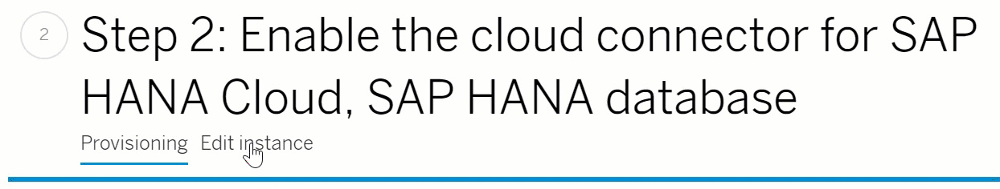

First, you need to enable SAP BTP Connectivity in the SAP HANA Cloud, SAP HANA database you want to connect to an on-premise database.

[OPTION BEGIN [Provisioning]]

1.	Open **SAP BTP cockpit** and enter your (trial) account.
2.	Enter your Global Account, Subaccount and then space.
3.	There, click on **SAP HANA Cloud** on the left side menu.
4.	Click on **Create** and then select **SAP HANA database**.
5.	The wizard will navigate you through the steps necessary to create your instance. If you are unsure how to provision the instance, you can follow [this tutorial](hana-cloud-mission-trial-2).
6.	In step 3 of the process (SAP HANA Advanced Settings), you can specify what IP addresses you allow or deny. Below, you can see the option to enable or disable the cloud connector.
7.	Click on **Enable** and select what IP addresses you would like to allow.
8.	Finish the rest of the settings and click on **Create Instance**.
9.	Your instance will be created, and it is ready to be connected with the cloud connector.

<!-- border -->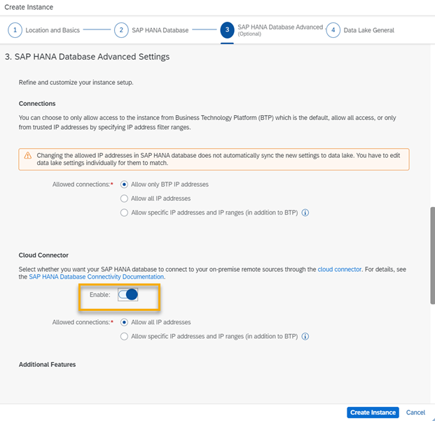

[OPTION END]
[OPTION BEGIN [Edit instance]]

1.	Open **SAP BTP cockpit** and enter your (trial) account.
2.	Enter your Global Account, Subaccount and then space.
3.	Navigate to the tile of the instance you want to connect to an SAP HANA on-premise database.
4.	Click on **Actions** on the bottom right corner of the tile.
5.	Select **Open in SAP HANA Cloud Central to monitor landscape**, which will then open in a new tab.
6.	There, click on the three dots in the Actions column on the right side of the screen
7.	Select **Edit**.

    <!-- border -->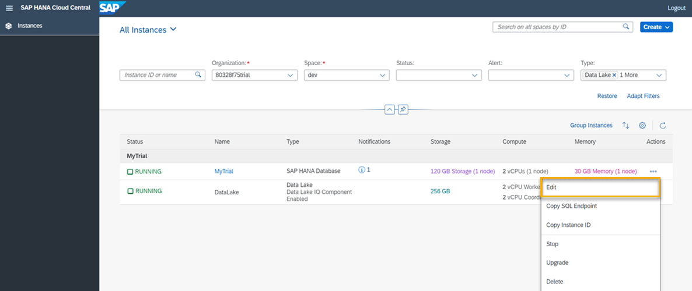

8.	In the wizard that opens, scroll down to the section Connections.
9.	Click on **Enable**.
10.	Click on **Save**.
11.	For this instance, the cloud connector is now enabled, and it is ready to be used.

    <!-- border -->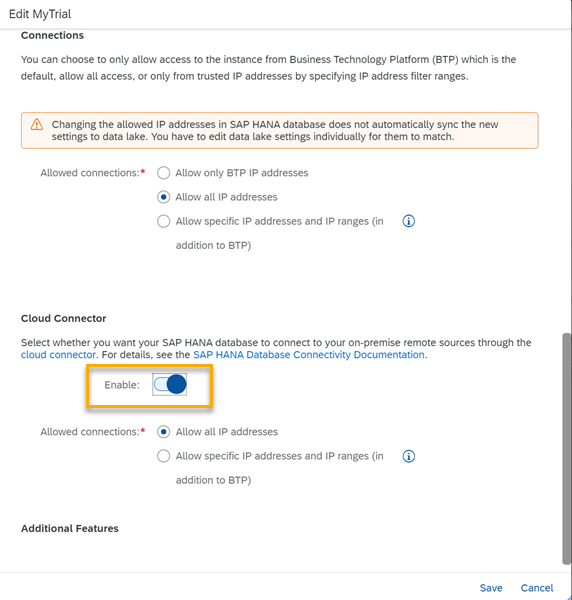

[OPTION END]

Now that you have enabled the cloud connector it is time to install the cloud connector and configure it.

### Install the cloud connector

1.	You can [download the cloud connector from here](https://tools.hana.ondemand.com/#cloud). Check the system requirements for different operating systems as well as additional setup recommendations in the [technical documentation here](https://help.sap.com/viewer/cca91383641e40ffbe03bdc78f00f681/LATEST/en-US/57ae3d62f63440f7952e57bfcef948d3.html).
2.	Once the download and installation are finished, open a web browser to administer the cloud connector. [You can find the supported browsers here](https://help.sap.com/viewer/65de2977205c403bbc107264b8eccf4b/LATEST/en-US/e6ddaefcbb571014b70fa01fc6a3f818.html).

3.	In a web browser, enter: `https://localhost:8443`

4.	`8443` is the default port specified during installation. If you have installed the cloud connector to a different machine than your local one, enter its hostname instead of the default port.
5.	On the logon screen that opens, enter this statement and enter your credentials:

    `Administrator / manage (case sensitive) for <User Name> / <Password>`

6.	When you first log in, you need to change the password.

    <!-- border -->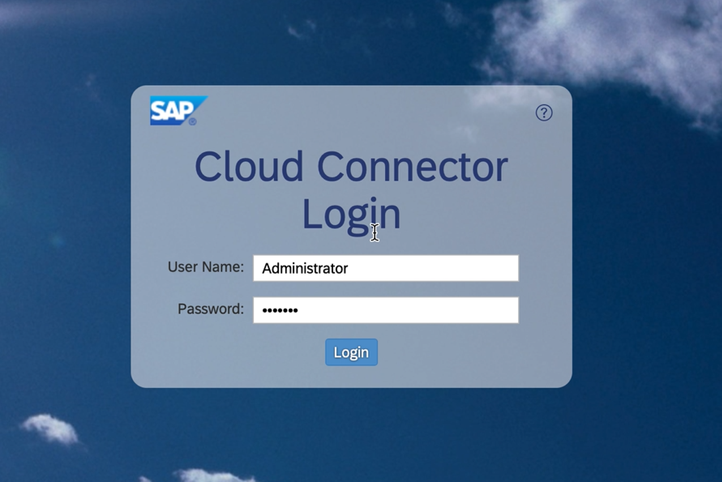

Now that you have installed the cloud connector, it is time to start configuring it to establish a connection.

### Define the subaccount

In the **Cloud Connector Administration**, you can see at the top of the screen that it will not work before you define a subaccount. You need to define the subaccount to map the cloud connector to the subaccount that your SAP HANA Cloud, SAP HANA database instance you want to connect is located in.

2.	First, select the **region** of the subaccount.

    <!-- border -->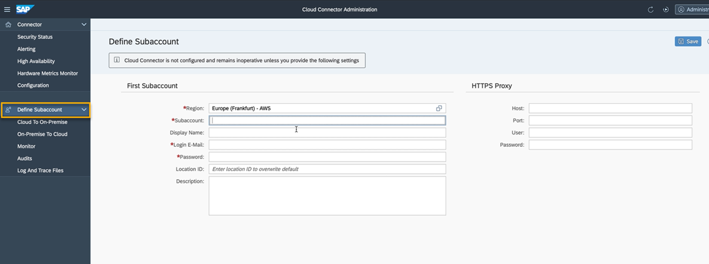

3.	In the field **Subaccount**, you need to enter the **subaccount ID**.
4.	To obtain it, go to **SAP BTP cockpit** and navigate to your subaccount. If you still have SAP BTP cockpit open from the previous steps, you can get there by clicking on the name of your subaccount in the top panel of the screen.

    <!-- border -->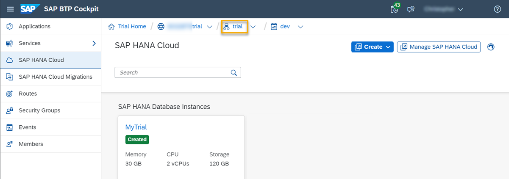

5.	Copy the subaccount ID from the center of the screen and enter it in the field **Subaccount** in the cloud connector.

    <!-- border -->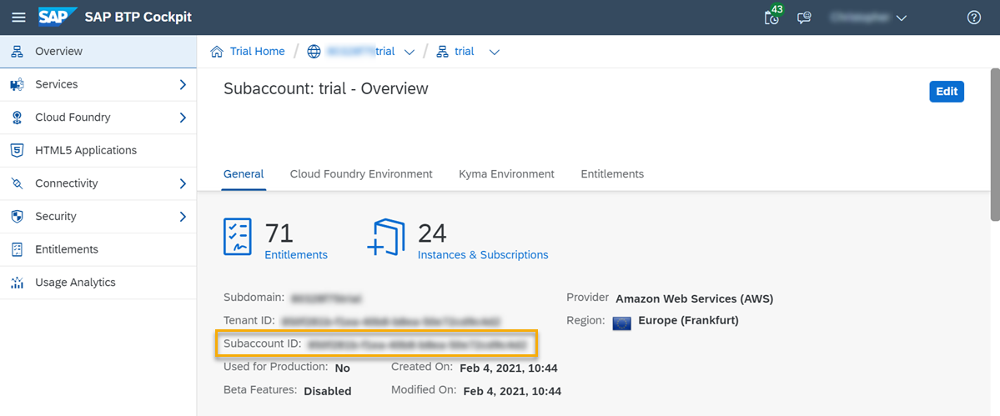

6.	Next, you can optionally enter a display name
7.	Log in in with the credentials of the subaccount on SAP BTP Cockpit.

    > **Important:** If your subaccount is **not on Cloud Foundry** these steps vary slightly: You need to fill in the technical Subaccount name, subaccount username and password.

9.	Optionally, you can enter a location ID.  You will need this location ID when setting up a remote source.
10.	Click on **Save** at the top right corner of the screen.

    <!-- border -->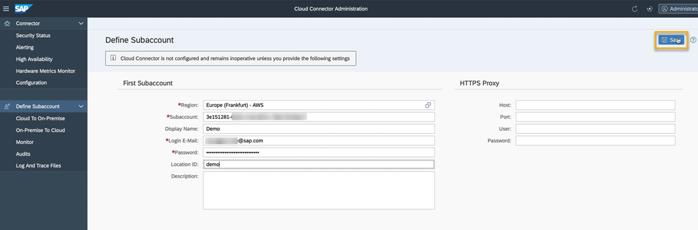

### Connect the cloud connector to your SAP HANA on-premise system

1.	After the configuration has finished, click on **Cloud To On-Premise** on the left panel.

    <!-- border -->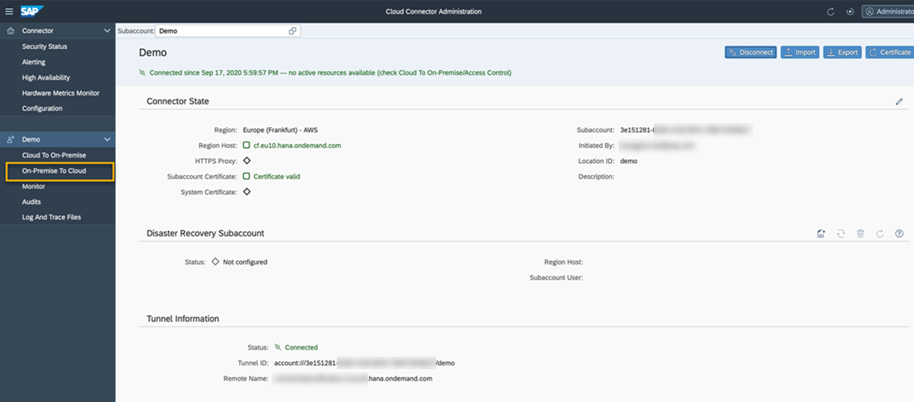

2.	There, click on the plus icon in the top right corner to add a new mapping that will map your SAP HANA on-premise system to the cloud connector.

    <!-- border -->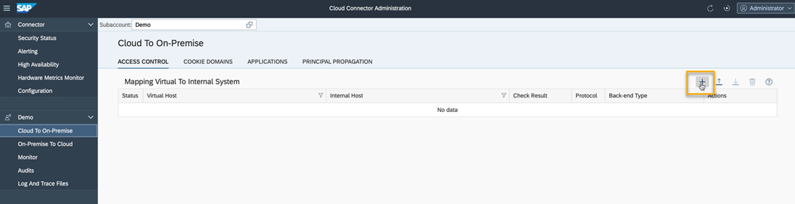

3.	A wizard opens. There, from the drop-down menu **Back-end Type**, select `SAP HANA`.
4.	Click on **Next**.
5.	For the **Protocol**, select `TCP` from the drop-down menu.
6.	In the next step, enter the **internal host** information and **internal port** of your on-premise system.
7.	To expose your internal host to the public network, you need to next specify the **virtual host** and **virtual port**. Here, it is recommended to use a host name that is different from your internal host name. The port can stay the same.
8.	Click on **Next**. You can optionally add a description to this mapping or skip that step.
9.	Check the summary shown and click on **Finish**.

    <!-- border -->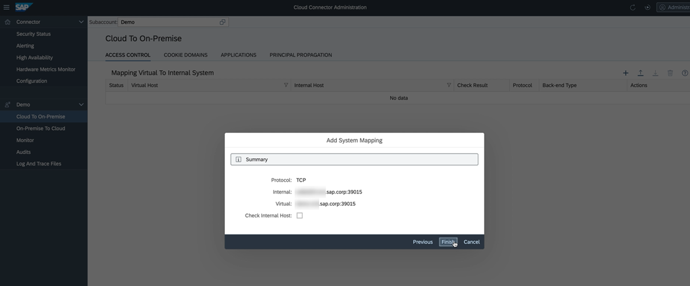

10.	Your internal system name is now mapped to your virtual host name.
11.	In the column **Check Result**, it still says `Unchecked`.
12.	To check it, click on the looking glass icon on the right.

    <!-- border -->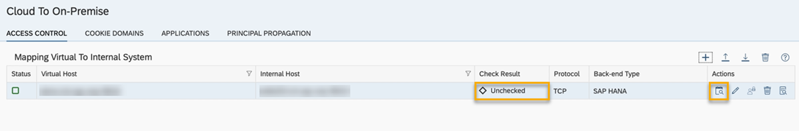

13.	The status will change to **Reachable**. Now the cloud connector can reach your SAP HANA on-premise system.
Now, you have successfully installed and configured the cloud connector.

For further details on configuring the cloud connector, [please refer to the technical documentation](https://help.sap.com/viewer/cca91383641e40ffbe03bdc78f00f681/LATEST/en-US/e6c7616abb5710148cfcf3e75d96d596.html).

To continue to learn more about the cloud connector, you can [take a look at this blog in the community](https://blogs.sap.com/2021/01/21/spotlight-sap-hana-cloud-and-the-sap-cloud-connector-scc/).

> **Well done!**
>
> You have completed the fourth tutorial of this group! Now you know how to install and configure the cloud connector to connect an SAP HANA on-premise database to SAP HANA Cloud, SAP HANA database.   
>
> You can now use Remote Table Replication to replicate data from an SAP HANA on-premise database to an SAP HANA Cloud, SAP HANA database. Learn in the next tutorial how to use it.

### Test yourself

---
