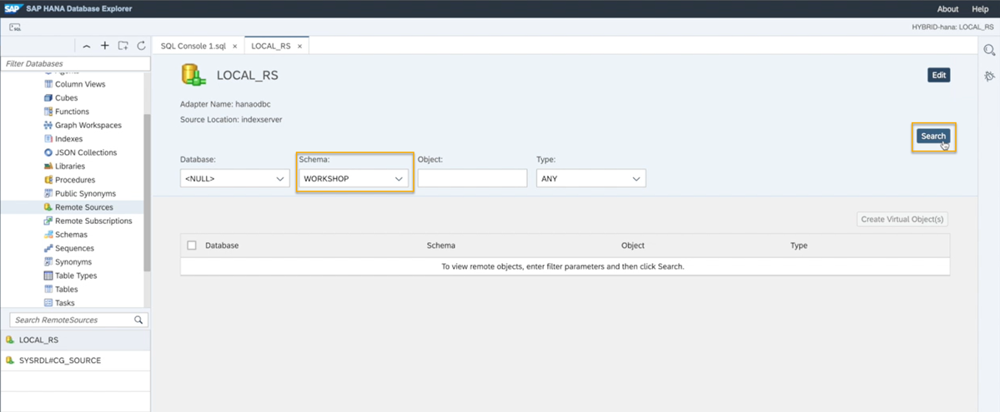
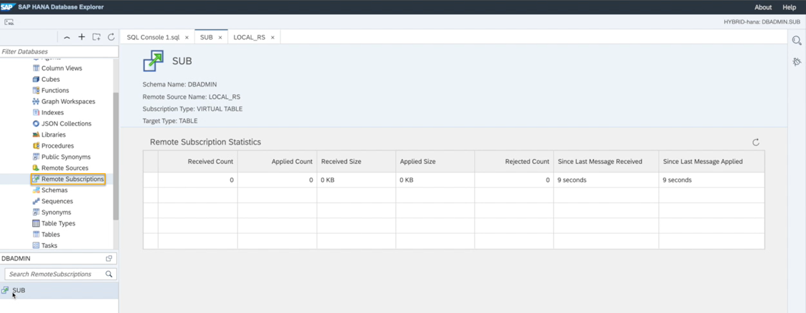
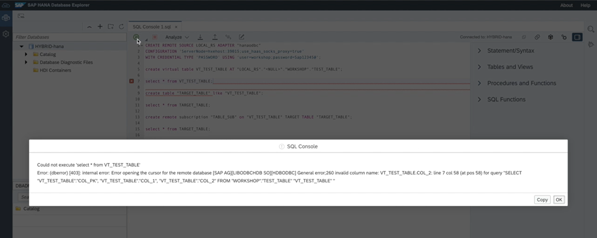

# Remote Table Replication
<!-- description --> Use remote table replication after you have established a connection from an SAP HANA on-premise database to SAP HANA Cloud, SAP HANA database with the cloud connector.

## Prerequisites
-	An SAP HANA on-premise database with SPS05 or higher if you want to use Remote Table Replication. If you have [SAP HANA express edition](https://www.sap.com/products/technology-platform/hana/express-trial.html) SPS04 Rev45, however, you may still use the cloud connector for SDA virtual access.
-	A **running** instance of an SAP HANA Cloud, SAP HANA database (trial or production) in a Cloud Foundry environment. For more information how to use SAP BTP Connectivity in a Neo environment, [please refer to this documentation](https://help.sap.com/viewer/b865ed651e414196b39f8922db2122c7/LATEST/en-US/5ceb84290d5644638f73d40fde3af5d0.html).
-	An established [remote source connection using the cloud connector](hana-cloud-mission-extend-08).


## You will learn
- How to establish a remote source
- How to create a virtual table
- How to add a replica table and add a remote subscription


## Intro
Once you established a connection between your SAP HANA Cloud, SAP HANA database and SAP HANA on-premise database using the cloud connector following the instructions from the previous tutorial, you can establish a remote source and use remote table replication.

Remote table replication allows you to benefit from transient log-based replication, optimized performance with the SDA ODBC connection and near real-time replication and is also the preferred way to replicate data between SAP HANA Cloud, SAP HANA databases. Learn in this tutorial how to use it.


---

### Establish a remote source to replicate data 


Once you have established the connection using the cloud connector, you can create a remote source in your SAP HANA Cloud, SAP HANA database instance pointing to the on-premise database.

1.	Open the **SAP HANA Database Explorer** connected to your SAP HANA Cloud, SAP HANA database instance.
2.	Open a **SQL console**.
3.	With the following statement, you can create a remote source from SAP HANA Cloud, SAP HANA database to SAP HANA on-premise to then replicate data from the on-premise system to the cloud. See instructions below the code to find out what to insert for the `<placeholders>`

    ```SQL
CREATE REMOTE SOURCE <NAME> ADAPTER "hanaodbc"
CONFIGURATION 'ServerNode=<virtual_host_name>:<portnumber>;use_haas_socks_proxy=true;scc_location_id=<locationid>'
WITH CREDENTIAL TYPE 'PASSWORD' USING 'user=<username>;password=<password>';
```
    -	In that statement, you need to add the host name and port number of the virtual host that you have manually created in the cloud connector. The reason for this is to not reveal the actual hostname and port which might be a breach in security.
    - For on-premise connections, the socks proxy needs to be specified, which is already included in this statement.
	  - Next, in that statement, add the cloud connector location id, which you specified in the beginning.

    > If you want to use remote table replication between two SAP HANA Cloud, SAP HANA database instances, you need to slightly modify this statement. For more technical details on creating the remote source, read more in the [technical documentation](https://help.sap.com/viewer/477aa413a36c4a95878460696fcc8896/LATEST/en-US/20d299d2f5224e8590982e8ad97362a2.html).

4.	Once all your information is included, run the statement. This will create a remote source from SAP HANA Cloud, SAP HANA database to your on-premise system.

5.	The remote source will be established, and you can create virtual tables and use remote table replication just like when connecting different SAP HANA Cloud, SAP HANA database instances. Please note that you are only able to use remote table replication if you are using SAP HANA on-premise SPS05 or higher. Otherwise, only SDA virtual access is available.


### Create a virtual table


1.	In your catalog, click on **Remote Sources**.
2.	Then, double-click on your remote source. A wizard will open.

    <!-- border -->

3.	In the drop-down menu to select a schema, you can now see the schema information from the remote source system.
4.	Select the schema you would like to replicate a table from and click on **Search**.
5.	You will now see the tables in the schema in your on-premise database.
6.	Next, select a table from the list and create a virtual object that can be included in federated queries.
7.	You can also adjust and execute this SQL statement to create a virtual table:

    ```SQL
CREATE VIRTUAL TABLE "<VT_TABLENAME>" AT "<REMOTESOURCENAME>"."<DATABASE>"."<SCHEMA>"."<TABLE>";
```

8.	Once you have executed this statement successfully, you can find the virtual table in the catalog in your tables.
9.	You can now query the data in this remote table.

In some cases, a virtual table may not be the best solution. For example, if you need to improve query performance. With Remote Table Replication, you can copy real-time data to your SAP HANA Cloud, SAP HANA database, which makes querying this data faster.

Additionally, if changes in the definitions of the source table of a virtual table occur, for example dropping or adding of columns, querying the virtual table pointing to the source table will result in an error. This can be avoided by setting up a remote subscription, which will not only replicate the data in real-time from the source system, but also the table definitions.

Learn in the next steps how to use remote table replication.


### Create a table replica


After the virtual table has been created, to set up Remote Table Replication, you need create a **Replica Table** to add a **Remote Source Subscription** to it.

1.	The replica table will be the target table, that resides in the SAP HANA Cloud, SAP HANA database. This target table should be just like the virtual table you have just created.
2.	So, first, create the replica table by executing this statement:

    ```SQL
CREATE COLUMN TABLE <TARGETTABLENAME> LIKE <VIRTUALTABLENAME>;
```
3.	Once this statement is executed, you can find the metadata information from the remote source in this target table.
4.	Double click on the new target table and you can see the same columns as in the virtual table. However, you will see no data because no replication has been set up for this table yet.


### Add a remote source subscription to the replica


To start real-time replication, you need to create a remote subscription and activate that subscription. This will start the replication to your target table.

1.	When creating a remote subscription, you need to specify a name for this remote subscription and specify from which virtual table to which target table the remote subscription should be established. You can adjust and execute this statement:

    ```SQL
CREATE REMOTE SUBSCRIPTION <REMOTESUBSCRIPTIONNAME> ON <VIRTUALTABLENAME> TARGET TABLE <TARGETTABLENAME>;
```

2.	Once this statement has been executed successfully, you can click on **Remote Subscriptions** in your catalog and you should see it in the list there.

    <!-- border -->

3.	Next, to activate this remote subscription and start replicating data from your source system, you need to `alter` it and set it to `distribute` using this statement:

    ```SQL
ALTER REMOTE SUBSCRIPTION <REMOTESUBSCRIPTIONNAME> DISTRIBUTE;
```

While this statement is being executed, in the background all data from the source table will be replicated to the target table.


### Refresh and alter the remote subscription


-	After the execution is complete, you can use a `SELECT * FROM` statement on your target table and you will see the data from your source table in it.
-	If you now add new rows to your source table in your on-premise database, you will instantly see the added data in your target table due to the remote subscription.
-	This applies for **adding columns** to the source table as well. Data definition changes like adding or dropping columns will also be instantly applied to your remote subscription.
-	The virtual table, however, will stay untouched by these changes and querying it would result in an error.

<!-- border -->

To refresh the virtual table to also include changes in data definitions, you need to execute this statement:

```SQL
alter virtual table <VIRTUALTABLENAME> refresh definition;
```
If you now query the virtual table, you will see the updated definitions in this virtual table as well.

If you want to disable a remote subscription, you can use this statement:

```SQL
alter remote subscription <REMOTESUBSCRIPTIONNAME> reset;
```
This will deactivate the `distribution` mode of the remote subscription. The definition of the target table will remain, but no data or definition changes will be updated from the source system anymore.


> **Well done!**
>
> You have completed the last tutorial of this group! Now you know how to set up Remote Table Replication in SAP HANA Cloud, SAP HANA database.  
>
> In the next group of this mission, you can learn how to set up a multi-source, hybrid data landscape and connect to other cloud databases, like AWS and Google BigQuery. This will allow you to use SAP HANA Cloud, SAP HANA database as your single gateway to all your data.


### Test yourself


---
