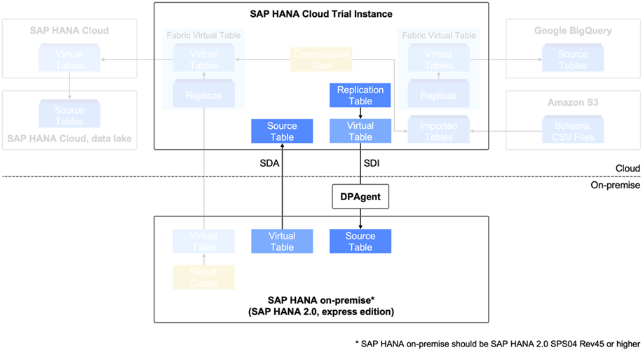
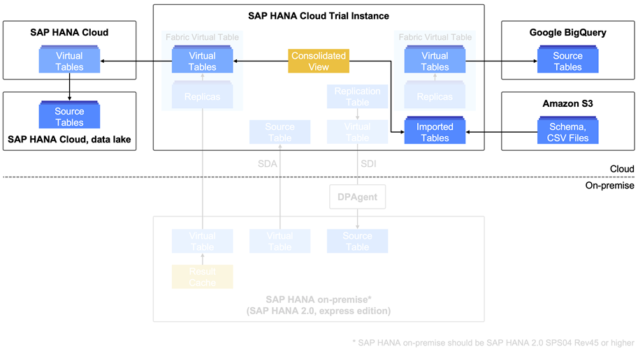
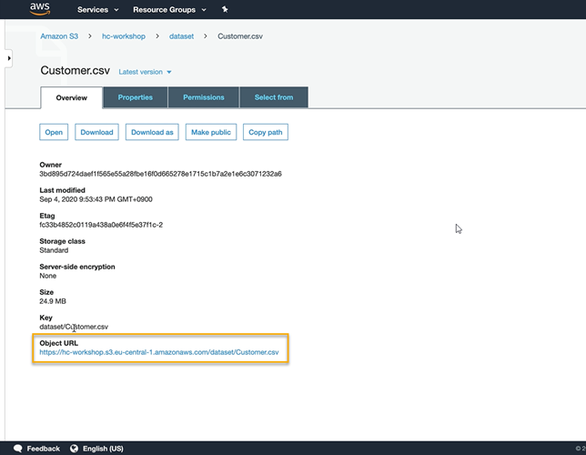
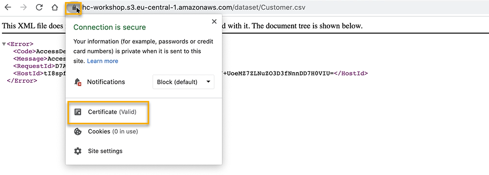
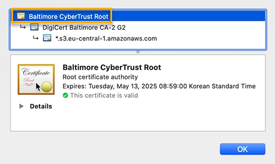

# Access Data from Amazon S3 in SAP HANA Cloud, SAP HANA Database
<!-- description --> Get an overview of the multi-source landscape that we have set up and learn how to import data from an Amazon S3 bucket to SAP HANA Cloud, SAP HANA database.

## Prerequisites
- You have completed the tutorials in the previous tutorial group and know how to connect SAP HANA Cloud, SAP HANA database to SAP HANA on-premise using [SDA](hana-cloud-mission-extend-05) and [SDI](hana-cloud-mission-extend-06).
- A **running** SAP HANA Cloud, SAP HANA database instance in a trial or production environment.
- An Amazon AWS S3 bucket that contains data.


## You will learn
- What connections will be covered in this tutorial group
- How SAP HANA Cloud, SAP HANA database can be your single gateway in a multi-source landscape
- How to import data from Amazon S3 to SAP HANA Cloud, SAP HANA database


## Intro
In this **tutorial group**, we will show you an example of a multi-source data landscape in SAP HANA Cloud, SAP HANA database that connects to different on-premise and cloud databases.
Throughout the tutorials of this group, you can learn how to set up the connections you need for your own landscape. After setting up connections, you can learn how to improve the performance of federated queries.

> ### On-premise connections
> In this group, we will focus on showing the connections to other cloud databases, Amazon S/3, Google BigQuery and SAP HANA Cloud, data lake. The scenario described here also includes connections to SAP HANA on-premise, which will not be covered in this group.
> If you are not sure about the details of how to connect an SAP HANA on-premise system to SAP HANA Cloud, please revisit the [previous tutorial group](hana-cloud-mission-extend-04) of this mission before continuing here.

In this first **tutorial**, you will get an overview of the multi-source landscape that we have set up and learn how to import data from an Amazon S3 bucket to SAP HANA Cloud, SAP HANA database.


---

### Get to know the multi-source data landscape


SAP HANA Cloud is designed to be the single gateway to all your data – no matter where data is stored, be it on a local on-premise database, on an SAP HANA Cloud instance or in non-SAP cloud databases. You can connect any data storages to SAP HANA Cloud and integrate all the data to then manage it in one place.

In this tutorial, we will show you an example of a hybrid data landscape where multiple data sources like an SAP HANA Cloud data lake, an SAP HANA on-premise database and other non-SAP cloud databases are being accessed in one SAP HANA Cloud, SAP HANA database instance.

**SAP HANA Cloud and SAP HANA on-premise**



First, we have connected an SAP HANA on-premise database to our SAP HANA Cloud instance using an SDI (Smart Data Integration) connection and the Data Provisioning Agent. This way, we can virtualise data from a source table in the SAP HANA on-premise database can to the SAP HANA Cloud instance.

To learn how to set up an SDI connection, you can [revisit this tutorial](hana-cloud-mission-extend-05).

We have also established a connection that goes the other way around and allows us to virtualise data from a source table in our SAP HANA Cloud instance to a target table in an SAP HANA on-premise database. To achieve this, we could in theory also use the SDI connection, but for this direction, a Smart Data Access (SDA) connection is the simpler and preferable way.

To learn how to set up an SDA connection, you can [revisit this tutorial](hana-cloud-mission-extend-06).

**SAP and non-SAP cloud databases**



In our scenario, we will create connections and use data stored in several different non-SAP cloud data sources. In the articles of this learning track we will cover how to set up each connection:

-	Importing and Exporting data from Amazon S3.
-	Connecting to a Google BigQuery database.
-	Connecting to another SAP HANA Cloud data lake

In a more complex data landscape like this, it is important to make sure queries of your data run efficiently and cost effectively. To ensure great performance in hybrid data landscapes, SAP HANA Cloud provides different options to improve the performance of queries, which we will have a look at in the last tutorial.

Now, that you have on overview of the steps ahead, let us start setting up our data landscape and import data from Amazon S3 to SAP HANA Cloud, SAP HANA database.


### Prepare in S3


> Please note, that if you are working with [Microsoft Azure](https://help.sap.com/viewer/f9c5015e72e04fffa14d7d4f7267d897/LATEST/en-US/fd45a3b7917349a1a8cbc81e202c5cdd.html), the steps for importing and exporting described here are similar.

1.	In your S3 bucket, you need a folder containing your data. You can import both individual `.csv` files or complete schemas that have been previously exported from an SAP HANA Cloud, SAP HANA database.
2.	From your S3 bucket, get the access keys and secret access keys associated with your S3 user.

3.	You also need the certificate information to access the data in S3. Get the object URL of any CSV file in your dataset folder and select the root certificate of the certificate chain and export as `pem` (X.506 base64 encoded) file, then open the file in a text editor to get the certificate string. Click on any csv-file in your dataset folder and then click on the object URL.

    <!-- border -->

4.	Then, click on the lock icon in the URL bar of your browser and then click on the certificate. A new window will open. Select the root certificate of the certificate chain and export as `pem` (X.506 base64 encoded) file, then open the file in a text editor to get the certificate string.

    <!-- border -->

    <!-- border -->

> ### Amazon root certificates
>
> Alternatively, you can find a list of Amazon root certificates that you can directly download as `.pem` files from [here](https://www.amazontrust.com/repository/).

For further information on how to create and configure Amazon Web Services S3 buckets, please refer to their [technical documentation here](https://docs.aws.amazon.com/AmazonS3/latest/user-guide/create-configure-bucket.html).


### Create a PSE and add an S3 certificate


1.	Open your **SAP HANA Database Explorer** and open a **SQL console**.

2.	First, create a certificate store and name it (e.g. "SSL"), using this statement:

    ```SQL
CREATE PSE <CERTIFICATE_STORE_NAME>;
```
3.	Then, register the root certificate in SAP HANA Cloud by inserting the certificate string you copied from the S3 file in the statement below and add a comment to name the certificate (e.g. "S3") for later access:

    ```SQL
CREATE CERTIFICATE FROM
'-----BEGIN CERTIFICATE-----
MIIDQTCCAimgAwIBAgITBmyfz5m/jAo54vB4ikPmljZbyjANBgkqhkiG9w0BAQsFADA5MQswCQYDVQQGEwJVUzEPMA0GA1UEChMGQW1hem9uMRkwFwYDVQQDExBBbWF6b24gUm9vdCBDQSAxMB4XDTE1MDUyNjAwMDAwMFoXDTM4MDExNzAwMDAwMFowOTELMAkGA1UEBhMCVVMxDzANBgNVBAoTBkFtYXpvbjEZMBcGA1UEAxMQQW1hem9uIFJvb3QgQ0EgMTCCASIwDQYJKoZIhvcNAQEBBQADggEPADCCAQoCggEBALJ4gHHKeNXjca9HgFB0fW7Y14h29Jlo91ghYPl0hAEvrAIthtOgQ3pOsqTQNroBvo3bSMgHFzZM9O6II8c+6zf1tRn4SWiw3te5djgdYZ6k/oI2peVKVuRF4fn9tBb6dNqcmzU5L/qwIFAGbHrQgLKm+a/sRxmPUDgH3KKHOVj4utWp+UhnMJbulHheb4mjUcAwhmahRWa6VOujw5H5SNz/0egwLX0tdHA114gk957EWW67c4cX8jJGKLhD+rcdqsq08p8kDi1L93FcXmn/6pUCyziKrlA4b9v7LWIbxcceVOF34GfID5yHI9Y/QCB/IIDEgEw+OyQmjgSubJrIqg0CAwEAAaNCMEAwDwYDVR0TAQH/BAUwAwEB/zAOBgNVHQ8BAf8EBAMCAYYwHQYDVR0OBBYEFIQYzIU07LwMlJQuCFmcx7IQTgoIMA0GCSqGSIb3DQEBCwUAA4IBAQCY8jdaQZChGsV2USggNiMOruYou6r4lK5IpDB/G/wkjUu0yKGX9rbxenDIU5PMCCjjmCXPI6T53iHTfIUJrU6adTrCC2qJeHZERxhlbI1Bjjt/msv0tadQ1wUsN+gDS63pYaACbvXy8MWy7Vu33PqUXHeeE6V/Uq2V8viTO96LXFvKWlJbYK8U90vvo/ufQJVtMVT8QtPHRh8jrdkPSHCa2XV4cdFyQzR1bldZwgJcJmApzyMZFo6IQ6XU5MsI+yMRQ+hDKXJioaldXgjUkK642M4UwtBV8ob2xJNDd2ZhwLnoQdeXeGADbkpyrqXRfboQnoZsG4q5WTP468SQvvG5-----END CERTIFICATE-----'
COMMENT 'S3';
```

4.	You now need to get the certificate ID of this newly registered certificate. Use this statement and make sure to adjust the comment of the certificate if you have chosen a different one in the previous step:
    ```SQL
Select * from certificates where comment = 'S3';
```

5.	Copy the certificate ID shown in the results at the bottom panel of your SAP HANA Database Explorer and insert it in the statement below to add the certificate to the certificate store:

    ```SQL
 ALTER PSE SSL ADD CERTIFICATE <INSERT_CERTIFICATE_ID>;
```

6.	Next, you need to set the certificate store purpose as remote source. This will make the usage of the certificate in the PSE store available to all remote sources. Now, whenever you connect using S3, GBQ or another SAP HANA Cloud instance, the adapter will use the certificates within the certificate store that are required to connect. Please note, that only one PSE's purpose can be set as remote source, so make sure that all SSL Root CA certificates are added to the same PSE. Read more about how to import certificates for SSL connections to remote sources [here](https://help.sap.com/viewer/477aa413a36c4a95878460696fcc8896/LATEST/en-US/86e96624e9a74e77994f7544db51061c.html). Now, to set the certificate store purpose as remote source, use this statement:

    ```SQL
SET PSE <INSERT_CERTIFICATE_STORE_NAME> PURPOSE REMOTE SOURCE;
```


### Import data from S3 to SAP HANA Cloud, SAP HANA database


1.	To import a whole schema from an S3 bucket, you can use the `IMPORT ALL` statement below. Make sure to include the correct S3 region name (e.g. s3-eu-central-1 for Frankfurt, Germany. You can find a list of all S3 region names [here](https://docs.aws.amazon.com/general/latest/gr/rande.html)), access key and secret access key of your S3 user, as well as name of S3 bucket and respective folder:

    ```SQL
IMPORT ALL FROM '<S3_REGION>://<ACCESS_KEY>:<SECRET_ACCESS_KEY>@<S3_BUCKET_NAME>/<S3_FOLDER_NAME>' WITH THREADS 4 REPLACE;
```
2.	If you want to import individual `.csv` files, you can also use a statement in which you have to again include all the information from the S3 side. Additionally, you have to specify an existing table to which the file's data should be imported and since it's an import from a CSV file, you also have to indicate delimiter information, delimiter option and threads (`,',`, `'"'` and `4` in this example).

    ```SQL
IMPORT FROM CSV FILE '<S3_REGION>s3-://<ACCESS_KEY>:<SECRET_ACCESS_KEY>@<S3_BUCKET_NAME>/<S3_FOLDER_NAME> /<source_filename.csv> ' INTO <TARGET_TABLE>
WITH FIELD DELIMITED BY ',' OPTIONALLY ENCLOSED BY '"' threads 4;
```

3.	Your S3 data is now imported!

> ### Technical documentation on import & export
> -	[Amazon S3](https://help.sap.com/viewer/f9c5015e72e04fffa14d7d4f7267d897/LATEST/en-US/41d9c51cc69a4178b01db4bda77fb94a.html)
> -	[Microsoft Azure](https://help.sap.com/viewer/f9c5015e72e04fffa14d7d4f7267d897/LATEST/en-US/fd45a3b7917349a1a8cbc81e202c5cdd.html)
>
> **Well done!**
>
> You have completed the first tutorial of this group! Now you know how to import data from an Amazon Web Services S3 bucket to SAP HANA Cloud, SAP HANA database so you can bring it together with other data sources and manage all your data in one place..
>
> Learn in the next tutorial how to virtualise data from a Google BigQuery.


### Test yourself


---
