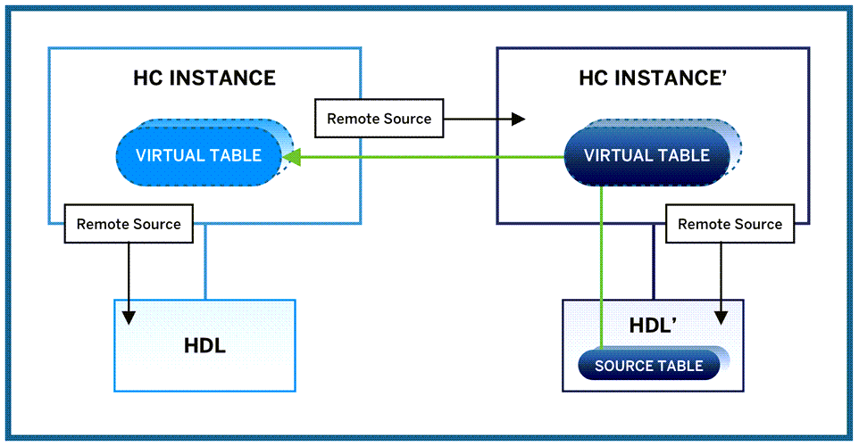

## Prerequisites
- Two **running** SAP HANA Cloud, SAP HANA database instances in a production environment, one having a managed data lake.
- Completion of the [previous tutorial in this group](hana-cloud-mission-extend-11) is recommended.
- Since this tutorial requires two SAP HANA Cloud, SAP HANA database instances, you need to have a productive environment of SAP HANA Cloud, SAP HANA database as trial only allows to have one instance.


## Details
### You will learn
- How to create a remote source in SAP HANA Cloud, SAP HANA database to a managed data lake
- How to virtualise data from a managed data lake to SAP HANA Cloud, SAP HANA database


In this tutorial, you will learn how you can connect an SAP HANA Cloud, SAP HANA database instance to multiple different data lakes. When you provision an SAP HANA Cloud, SAP HANA database instance, you can provision a managed data lake as well.

If you have multiple SAP HANA database and data lakes instances, you can easily virtualise data from one data lake to another or to another SAP HANA database instance. Let's say for example, you have two SAP HANA database instances each with a managed data lake in SAP HANA Cloud. If you now want to virtualise data from one data lake to an SAP HANA database instance that is not its managed data lake, you can connect to it via its associated SAP HANA database instance. Through that SAP HANA database instance, the data lake will then be connected.



> Besides the options described in this tutorial, you can also connect directly to a standalone SAP HANA Cloud, data lake. To learn more, we recommend [this mission](mission.hana-cloud-data-lake-get-started).

The following steps will show you how to connect an SAP HANA Cloud, SAP HANA database instance to an SAP HANA cloud, data lake that is managed via a second SAP HANA Cloud, SAP HANA database.


---

[ACCORDION-BEGIN [Step 1: ](Obtain the certificate string)]

As with other remote sources, connecting to an SAP HANA Cloud, data lake requires a certificate to be stored in your PSE. In this step, you will obtain the certificate you need.

1.	First, in SAP BTP Cockpit or SAP HANA Cloud Central, navigate to the SAP HANA database instance that is corresponding to the SAP HANA Cloud, data lake you want to connect to. Copy the **SQL endpoint** of the SAP HANA database instance corresponding to this data lake and paste the endpoint information in a text editor.

2.	In this SAP HANA database instance, make sure to have a user who has permissions to access the database and data lake instances. You can read here how to create users in SAP HANA Cloud, SAP HANA database. You will need the credentials of this user later in [this tutorial](hana-cloud-mission-trial-4).

3.	Next, you need to create a certificate and put it in a certificate store so it can be used for creating a remote source.

4.	First, to get the certificate string, download the `pem` file to your local device by accessing your **command line** (`iTerm` or [Terminal](https://support.apple.com/en-sg/guide/terminal/welcome/mac) on iOS, or [Command Prompt](https://www.lifewire.com/how-to-open-command-prompt-2618089) on WIN) and entering this command:

    ```Shell/Bash
curl -O https://cacerts.digicert.com/DigiCertGlobalRootCA.crt.pem
```

5.	After the file has been downloaded, you can access it with a text editor such as `Microsoft Notepad` or `Apple TextEdit`. Copy the certificate string to your clipboard.


[DONE]
[ACCORDION-END]

[ACCORDION-BEGIN [Step 2: ](Add the certificate to your PSE)]


1.	Now, in the **SAP HANA Database Explorer** that is connected to your SAP HANA database instance, open a **SQL console**.
2.	Create a certificate store, also called **PSE** (personal security environment), if you have not done so already.
    ```SQL
CREATE PSE <certificate store name>;
```
3.	Create a certificate for the SAP HANA Cloud, data lake you want to connect and name it (`HDL` in this example) using SQL statement below. You need to paste the certificate string you retrieved in Step 1 as a single line without any line-breaks (already included in this statement):

    ```SQL
-- create certificate
CREATE CERTIFICATE FROM
'-----BEGIN CERTIFICATE-----
MIIDrzCCApegAwIBAgIQCDvgVpBCRrGhdWrJWZHHSjANBgkqhkiG9w0BAQUFADBhMQswCQYDVQQGEwJVUzEVMBMGA1UEChMMRGlnaUNlcnQgSW5jMRkwFwYDVQQLExB3d3cuZGlnaWNlcnQuY29tMSAwHgYDVQQDExdEaWdpQ2VydCBHbG9iYWwgUm9vdCBDQTAeFw0wNjExMTAwMDAwMDBaFw0zMTExMTAwMDAwMDBaMGExCzAJBgNVBAYTAlVTMRUwEwYDVQQKEwxEaWdpQ2VydCBJbmMxGTAXBgNVBAsTEHd3dy5kaWdpY2VydC5jb20xIDAeBgNVBAMTF0RpZ2lDZXJ0IEdsb2JhbCBSb290IENBMIIBIjANBgkqhkiG9w0BAQEFAAOCAQ8AMIIBCgKCAQEA4jvhEXLeqKTTo1eqUKKPC3eQyaKl7hLOllsBCSDMAZOnTjC3U/dDxGkAV53ijSLdhwZAAIEJzs4bg7/fzTtxRuLWZscFs3YnFo97nh6Vfe63SKMI2tavegw5BmV/Sl0fvBf4q77uKNd0f3p4mVmFaG5cIzJLv07A6Fpt43C/dxC//AH2hdmoRBBYMql1GNXRor5H4idq9Joz+EkIYIvUX7Q6hL+hqkpMfT7PT19sdl6gSzeRntwi5m3OFBqOasv+zbMUZBfHWymeMr/y7vrTC0LUq7dBMtoM1O/4gdW7jVg/tRvoSSiicNoxBN33shbyTApOB6jtSj1etX+jkMOvJwIDAQABo2MwYTAOBgNVHQ8BAf8EBAMCAYYwDwYDVR0TAQH/BAUwAwEB/zAdBgNVHQ4EFgQUA95QNVbRTLtm8KPiGxvDl7I90VUwHwYDVR0jBBgwFoAUA95QNVbRTLtm8KPiGxvDl7I90VUwDQYJKoZIhvcNAQEFBQADggEBAMucN6pIExIK+t1EnE9SsPTfrgT1eXkIoyQY/EsrhMAtudXH/vTBH1jLuG2cenTnmCmrEbXjcKChzUyImZOMkXDiqw8cvpOp/2PV5Adg06O/nVsJ8dWO41P0jmP6P6fbtGbfYmbW0W5BjfIttep3Sp+dWOIrWcBAI+0tKIJFPnlUkiaY4IBIqDfv8NZ5YBberOgOzW6sRBc4L0na4UU+Krk2U886UAb3LujEV0lsYSEY1QSteDwsOoBrp+uvFRTp2InBuThs4pFsiv9kuXclVzDAGySj4dzp30d8tbQkCAUw7C29C79Fv1C5qfPrmAESrciIxpg0X40KPMbp1ZWVbd4=-----END CERTIFICATE-----'
COMMENT 'HDL';
```

4.	Next, get the certificate ID of this certificate by running this SQL statement:
```SQL
SELECT CERTIFICATE_ID FROM CERTIFICATES WHERE COMMENT = 'HDL';
```

5.	Add this certificate to the certificate store by inserting the certificate ID into the SQL statement:
    ```SQL
ALTER PSE SSL ADD CERTIFICATE <certificate_id>;
```

6.	Now set the PSE purpose as a remote source (unless you already have when following the instructions in the previous tutorial). This way, all remote sources you create will use the certificates stored in the PSE. Please note, that only one PSE can be set as a remote source purpose.

    ```SQL
SET PSE SSL PURPOSE REMOTE SOURCE;
```


[DONE]
[ACCORDION-END]


[ACCORDION-BEGIN [Step 3: ](Create a remote source)]


To now create a remote source, copy and paste the following statement into your console and replace the parts <in brackets> with your specific information (see instructions below the code).
```SQL
-- create a remote source
CREATE REMOTE SOURCE <REMOTE_SOURCE_NAME> ADAPTER hanaodbc
CONFIGURATION 'Driver=libodbcHDB.so;ServerNode=<INSERT_HC_INSTANCE_SERVER_NODE>;
encrypt=TRUE;'
WITH CREDENTIAL TYPE 'PASSWORD' USING 'user=<USERNAME>;password=<PASSWORD>';
```
a.	Specify a name for the remote source connection.

b.	Insert `hanaodbc` as **ADAPTER**.

c.	For **CONFIGURATION**, paste the endpoint information you copied in step 1.

d.	Enter the credentials of the user you obtained in step 2.

e.	For more detailed documentation on how to create a remote source to your SAP HANA Cloud, SAP HANA database [click here](https://help.sap.com/viewer/477aa413a36c4a95878460696fcc8896/LATEST/en-US/275839492fef49318d92d0e31656ea0a.html).

Now, when you click on **remote sources** in your catalog, you should see the other SAP HANA Cloud, data lake in your remote sources in the bottom left panel.


[DONE]
[ACCORDION-END]

[ACCORDION-BEGIN [Step 4: ](Create a virtual table)]


1.	Click on the new remote source you created in the bottom left panel.
2.	In the new panel that has opened, select the schema in the data lake where the virtual tables are located that you want to federate data from by selecting it from the dropdown menu at the top. Then click on **Search**.
3.	Here, you can now see the virtual tables in your SAP HANA Cloud instance that are pointing to the source tables in the SAP HANA data lake you connected to.
4.	To federate the data from those virtual tables to the SAP HANA database instance you are connecting it to, you need to create a virtual table over a virtual table. This is called federation on federation. It means that the virtual table will point to the virtual table in the SAP HANA Cloud, SAP HANA database instance which in turn points to the source table in the SAP HANA Cloud, data lake. To create the virtual table, run this statement:

    ```SQL
-- create a virtual table on a virtual table (federation over federation)
create virtual table <TARGET_TABLE_NAME> at "<REMOTE_SOURCE_NAME>"."<NULL>"."<SCHEMA>"."<VIRTUAL_SOURCE_TABLE> ";
--you can drop this table using this statement:
--drop table <TARGET_TABLE_NAME>;
```

5.	Once this step is finished, under **Tables** in your Catalog, you should see the new table that is a virtual table connecting to the virtual table in the other SAP HANA database instance, which is pulling data from the source table in its corresponding SAP HANA Cloud, data lake.

To learn more about SAP HANA Cloud, data lake, you can refer to [this mission](mission.hana-cloud-data-lake-get-started).

> **Well done!**
>
> You have completed the fourth tutorial of this group! Now you know how to virtualise data from data lakes to your SAP HANA Cloud, SAP HANA database instance.
>
> When you query this virtual table on a virtual table, the results will take a bit more time to load. That's why the next tutorial will focus on how to improve the performance of queries accessing multi-layered federation tables.


[DONE]
[ACCORDION-END]

[ACCORDION-BEGIN [Step 5: ](Test yourself)]


[VALIDATE_7]
[ACCORDION-END]

---
