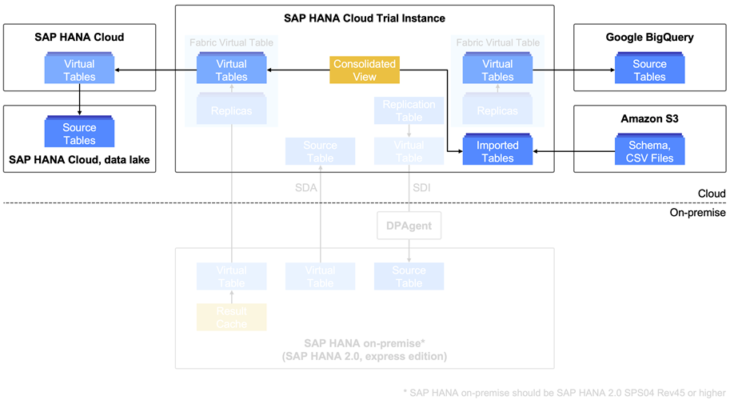
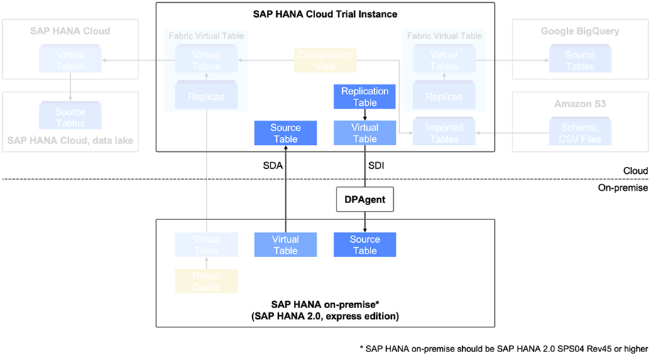
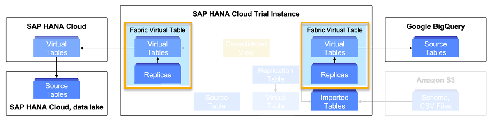
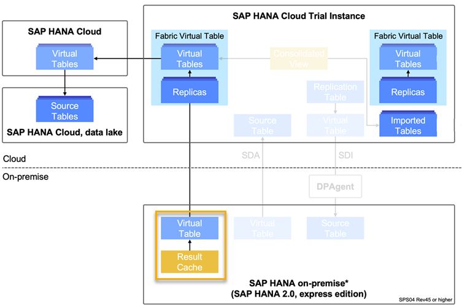

# Improve Query Performance in a Multi-Source Data Landscape
<!-- description --> Improve the performance of complex queries in a hybrid scenario using replicas and static result cache in SAP HANA Cloud, SAP HANA database.

## Prerequisites
- A **running** SAP HANA Cloud, SAP HANA database instance in trial or production.
- A multi-source data landscape like the one set up in this tutorial group.
- An SAP HANA on-premise system with SPS04 Rev45 or higher.
- Completion of the previous tutorials in this group is recommended.


## You will learn
- What options are available to you to improve the performance of queries in a complex set up.
- How to create snapshot replicas
- How to use static result cache


## Intro
In this tutorial, you will learn how to improve the performance of complex queries in the multi-source data-landscape that we have set up in our SAP HANA Cloud instance.
First, for a quick reminder of what was covered in this group so far, you can have a look at the hybrid landscape we have created:



-	We have [imported data from an Amazon S3 bucket](hana-cloud-mission-extend-10).
-	We have [virtualised data from a Google BigQuery database](hana-cloud-mission-extend-11).
-	We have [federated data from another SAP HANA Cloud data lake](hana-cloud-mission-extend-12), which is accessed via its corresponding SAP HANA Cloud instance.

Another element in our landscape is a connection to an SAP HANA on-premise database connected via SDA and SDI.



> This landscape serves as an example for a multi-source, hybrid data landscape. Of course, your landscape may look different. The steps described in this tutorial are meant to give you guidance how to apply the techniques to your own landscape.
>
> **Attention trial users**: Since in this specific data landscape, we have two SAP HANA Cloud, SAP HANA database instances, the exact landscape cannot be replicated in a trial environment due to the limitation to one instance. Nevertheless, you can still create a multi-source environment in trial and use the query performance methods mentioned in this tutorial.

---

### Query data from multiple sources


To query the data from various sources in a landscape, you can simply include the virtual objects in your queries. Keep in mind that for queries containing objects found in Google BigQuery, you need to put object names in `"quotes"` to handle the lower-case characters that are set as default in Google BigQuery.

**Creating a consolidated view**

For example, to conveniently access to data from different source tables in one action, you can create a consolidated view that joins the data from these tables using this statement in a SQL Console of your SAP HANA Database Explorer:

```SQL
create view <SCHEMA>.<VIEW_NAME> as ((select * from <SCHEMA>.<TARGET_TABLE1>) union (select * from <SCHEMA>.<TARGET_TABLE2>));
```

All you need to do is specify a name for this view and the source tables you want to join.
Once the view is created, you can easily access the data from both source tables in one query.


### Get to know query performance improvement methods


Sometimes when multiple systems are involved, multi-layered federations are necessary:

An example of a multi-layered federation would be if you want to access a source table in a managed SAP HANA Cloud, data lake via its corresponding SAP HANA Cloud, SAP HANA database instance (federation), which then gets virtualised to another SAP HANA Cloud, SAP HANA database instance (federation over federation), which in turn shall be accessed in a virtual table in an SAP HANA on-premise system (federation over federation over federation).

When queries contain many multiple data sources and multi-layered federations, they can have quite a slow performance. Luckily, there are many useful options to improve the performance of these queries. Learn in the next section of this tutorial how to make complex hybrid queries more efficient.

In this section, you will get to know two ways to improve the performance of your queries:

-	Shared and Snapshot Replicas
-	Static Result Cache

**Shared and Snapshot Replicas**

One way to improve the performance of hybrid queries in SAP HANA Cloud is to use replication tables instead of virtual tables. To do this, you need to alter the virtual table you want to access, by adding a **replica table** to it. This replica table is a system-generated, hidden table in your SAP HANA Cloud database that contains the data from your virtual table. Whenever you query the virtual table, this replica table will be accessed automatically, resulting in more efficient queries.

There are two types of replicas. Depending on your setup, you can use different types:

**Shared replica**: Shared replicas will be automatically updated in real time whenever the source table of its corresponding virtual table gets updated. However shared replicas have some requirements regarding the connection type they are used in:

-	SDI (Smart Data Integration)-supported remote sources – for example, an SAP HANA on-premise database
-	SAP HANA Cloud remote sources using SDA (Smart Data Access)
-	Remote sources that support real-time change data capture (CDC) – for example Amazon Athena and Google BigQuery do not support this feature

Fortunately, you can still use a different option, if your connection does not support shared replicas:

**Snapshot replica**: A snapshot replica is not automatically updated and needs to be manually refreshed but it can be used with all types of remote sources that are supported by SDA or SDI. We will show you how to use snapshot replicas in the next step of this tutorial.
You can also read more about the technical details of replicas [here](https://help.sap.com/viewer/477aa413a36c4a95878460696fcc8896/LATEST/en-US/f439a3c189674d82b9276c41b7a2e6ab.html).

**Static Result Cache**

If you want to virtualise data from SAP HANA Cloud into your SAP HANA on-premise database, shared and snapshot replicas are not supported. Instead, you can use static result cache, which will be explained in the last section of this tutorial.


### Create a snapshot replica


Let's say in our example, we want to query data federated from another SAP HANA Cloud data lake and from a Google BigQuery database. As we are using SAP HANA Cloud, we have the option of creating hidden replicas ("fabric virtual tables") in our SAP HANA Cloud instance and query those instead of virtual tables.



Since Google BigQuery does not support CDC and layered virtual tables, such as the one accessing the SAP HANA Cloud, data lake, are not compatible with shared replicas, we will go for a snapshot replica.

You can create a snapshot replica by going to the SAP HANA Database Explorer. There, open the SQL Console, and run this statement to alter your virtual tables:

```SQL
ALTER VIRTUAL TABLE <VIRTUAL_TABLE_NAME> ADD SHARED SNAPSHOT REPLICA COLUMN LOADABLE;
```

Note that by specifying `COLUMN LOADABLE`, the entire column will be loaded in-memory, which will significantly improve the performance of queries accessing this virtual table. The default of this command would be `PAGE LOADABLE`, which is done by in-buffer cache loading using the disk storage. To create a snapshot replica using `PAGE LOADABLE`, simply adjust the last clause to `ADD SHARED SNAPSHOT REPLICA PAGE LOADABLE;`. You can also change the `LOADABLE` option from `PAGE` to `COLUMN` after a replica was created using this statement:

```SQL
ALTER VIRTUAL TABLE <VIRTUAL_TABLE_NAME> ALTER REPLICA COLUMN LOADABLE;
```

For snapshot replicas, you will have to periodically **refresh**, so that updated data will be included in the replica. You can do so by using this statement:

```SQL
ALTER VIRTUAL TABLE <VIRTUAL_TABLE_NAME> REFRESH SNAPSHOT REPLICA;
```

If you now include this snapshot replica in complex hybrid queries, the performance will be significantly better. You can do so by simply querying the virtual table you have just added the replica to. This will be the case for queries accessing virtual tables in other cloud databases, SAP HANA data lakes as well as SAP HANA on-premise databases.

 


### Use static result cache


Let's say, we now want to virtualise data from SAP HANA Cloud to SAP HANA on-premise and perform a query in our SAP HANA on-premise database. Since replicas are not available in SAP HANA on-premise, we will go for the option of static result cache.



To create a static result cache, follow these steps:

1.	In this example, we want to create a static result cache when accessing data from an SAP HANA on-premise system. So, open the SAP HANA Database Explorer for your on-premise database or the SAP HANA Studio. Then, open the SQL Console of your database.

2.	First, you need to create a view on the virtual table you want to query:

    ```SQL
-- create a view on the virtual table
create view <schema>.<view_name> as
(select * from <source_table>);
```

3.	Once that is done, create a cache on this view, including a retention period (2 hours in our example). Enable the static result cache it by running this statement:

    ```SQL
-- create static result cache on the view
ALTER VIEW <schema>.<view_name> ADD CACHE RETENTION 120;  
```

4.	Now, to include the static result cache in a query include a `with hint(RESULT_CACHE)` clause in your query, for example:

    ```SQL
select * from <view_name>
with hint(RESULT_CACHE);
```

5.	The first time this statement is executed, it will take quite some time, maybe even longer than without the cache hint. This is because the cache can be accessed faster instead of accessing data in the remote source on-the-fly.
6.	When you execute the statement again, it will run much faster by accessing the data from the cache.

> ### Helpful technical documentation links
-	[Toggling Between Virtual Tables and Replication Tables](https://help.sap.com/viewer/477aa413a36c4a95878460696fcc8896/LATEST/en-US/f439a3c189674d82b9276c41b7a2e6ab.html)
-	[Monitoring Virtual Tables and Replicas](https://help.sap.com/viewer/477aa413a36c4a95878460696fcc8896/LATEST/en-US/a4474c3889854d768e478992130a6de1.html)

**Well done!**

You have completed the last tutorial of this group! Now you know about the different ways to improve queries in your hybrid data landscape, how to use shared and snapshot replicas as well as static result cache.

> **Congratulations**
>
> You have completed this mission! You learned the basics about extending from SAP HANA on-premise to SAP HANA Cloud, SAP HANA database, used replication and virtualization, and learned how to create a multi-source data landscape and improve query performance in it.
>
> Make sure to claim your badge once you completed all tutorials and share it on your profile in the SAP Community!
>
> Click here for more learning materials on [SAP HANA Cloud](https://community.sap.com/topics/hana-cloud). Follow our tag in the [SAP Community](https://blogs.sap.com/tags/73554900100800002881/) to stay up-to-date on the latest updates and newest content!


### Test yourself


---
