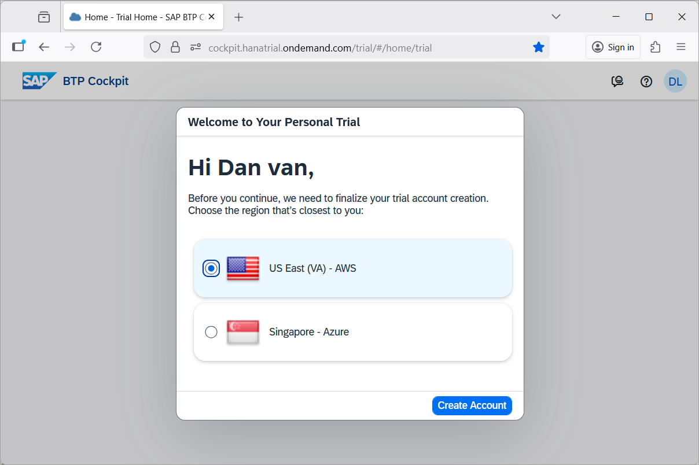

# Understand How the SAP HANA Cloud Free Tier Service can be Used in a SAP BTP Trial or Productive Account

<!-- description --> Learn about the process to sign up for a SAP Business Technology Platform (SAP BTP) trial or productive account and the details of the SAP HANA Cloud free tier service plan.

## Prerequisites

- You have access to a SAP BTP trial account or a productive account that has SAP HANA Cloud entitlements

## You will learn

- Differences between a SAP BTP trial and productive subaccount
- How to sign up for a SAP BTP account
- Differences between running a free tier SAP HANA Cloud instance in a SAP BTP trial or productive subaccount

## Intro

This tutorial is part of a mission, in which you will learn in a hands-on, end-to-end setting how to use SAP HANA Cloud, SAP HANA database.  SAP offers a free version of the SAP HANA Cloud service.  This free service is offered in both a SAP BTP trial account and in a SAP BTP productive subaccount.  The SAP HANA Cloud free tier service when running in a productive subaccount can be easily upgraded to a paid version.

>
>
> **Help Alex gain business insights using SAP HANA Cloud, SAP HANA database.**
>
> In this mission, we will help Alex, the CEO of a fictitious company called *Best Run Travel* to answer a concrete business question with SAP HANA Cloud, SAP HANA database:
>
> - As a global travel agency, Best Run Travel has data from many different affiliates.
> - Alex needs to know the **top 5 partners** of their agency and wants to find out the **days with maximum booking of each partner**.
> - Best Run Travel uses SAP HANA Cloud, SAP HANA database to store and manage all its data. Now, your mission is to help Alex find a subset of the data related to the partner sales and create a way for Alex to share this subset with other departments in Best Run Travel.

---

### Get to know the SAP BTP account types

- SAP BTP trial allows you to build full applications in a test environment to learn and explore the capabilities of SAP BTP.  However, once you are ready to move to productive use a new productive BTP account is required.

- Customers with a productive SAP BTP account can use free service plans for SAP BTP to explore, learn, and try SAP BTP services (such as SAP HANA Cloud) with a path to productive use.

- Free service plans provide a means to try out selected services up to a specified capacity limit.  In the case of SAP HANA Cloud free tier service, when running in a productive account, it can be switched easily to the paid tier service, enabling additional functionality without losing any work.  

### Sign up for an SAP BTP account

In this step, you can learn how to sign up for the SAP BTP trial or a productive account.  

To sign up for an SAP BTP trial account follow the below steps.

1. Click on [this link](https://www.sap.com/products/technology-platform/pricing.html) to get to the try and buy page. 

    

    Select the Advanced trial option.  

2. You will then receive a popup and an email with a link to access the [SAP BTP Trial](https://cockpit.hanatrial.ondemand.com/trial/#/home/trial).

    

    Select the region that is closest to you.

    

    >It is important to note that the first time you access your trial, you will need to choose your identity provider (you can choose the default). Additionally, if you have two-factor authentication enabled, you will have to enter the security token that is sent to you based on the method of authentication you have chosen.

Congratulations, you have successfully signed up for the SAP BTP trial account.

Alternatively, if you wish to instead work in a productive account, select the free tier option on the previously shown try and buy page.  Additional details can be found [get an account on SAP BTP to try out free tier service plans](btp-free-tier-account).

### Get to know the SAP HANA Cloud free tier service

- You can use your SAP BTP trial or productive account to test the following components: **SAP HANA Cloud, SAP HANA database** and **SAP HANA Cloud, data lake**.

- If your SAP BTP trial account remains inactive, you will be asked to extend your trial every 30 days. If you regularly log in to your trial account, your trial account will be automatically extended up to 90 days.

- The SAP HANA Cloud free tier service when running in a SAP BTP productive account can be upgraded to a paid instance.

- If you already use other services in SAP Business Technology Platform, those will not be affected or limited in any way by your use of the SAP HANA Cloud free tier service.

- SAP HANA Cloud free tier instances are stopped on a nightly basis. Each day you start working with your free tier instance, you need to restart it first.

- If you do not restart your instance within 30 days, it will be deleted. You can easily provision a new instance again, if you wish to do so.

- The configuration of your free tier instance of SAP HANA Cloud, SAP HANA database is 16 GB of memory, 1 vCPU, and 80 GB of storage.

- Features such as JSON document store, triple store, and script server require larger SAP HANA Cloud configurations (3 vCPUs, 45 GB of memory) and are therefore *not supported* in the free tier service.  Additional details are available at [SAP HANA Database License](https://help.sap.com/docs/hana-cloud/sap-hana-cloud-administration-guide/sap-hana-database-license).  An [alert](https://help.sap.com/docs/alert-notification/sap-alert-notification-for-sap-btp/hdb-free-tier-instance-expiration) is sent if the instance is not started for 15 days.  Further details on how to view and receive alerts can be found at [Alerts in SAP HANA Database and Data Lake](https://developers.sap.com/tutorials/hana-cloud-alerts.html).

### Knowledge Check
