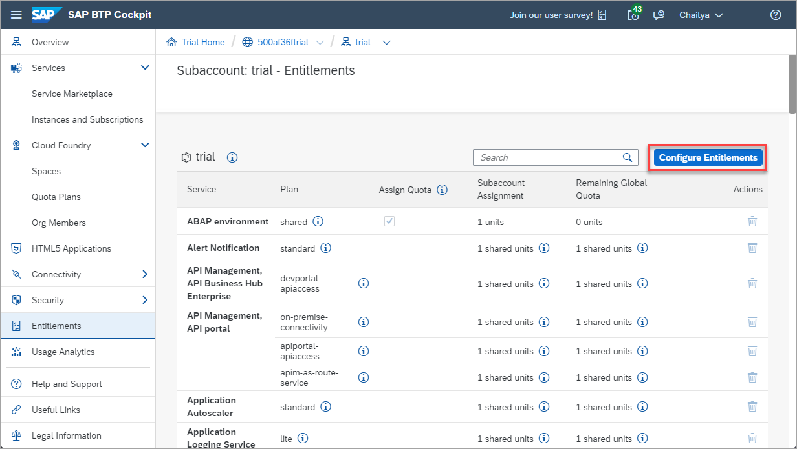
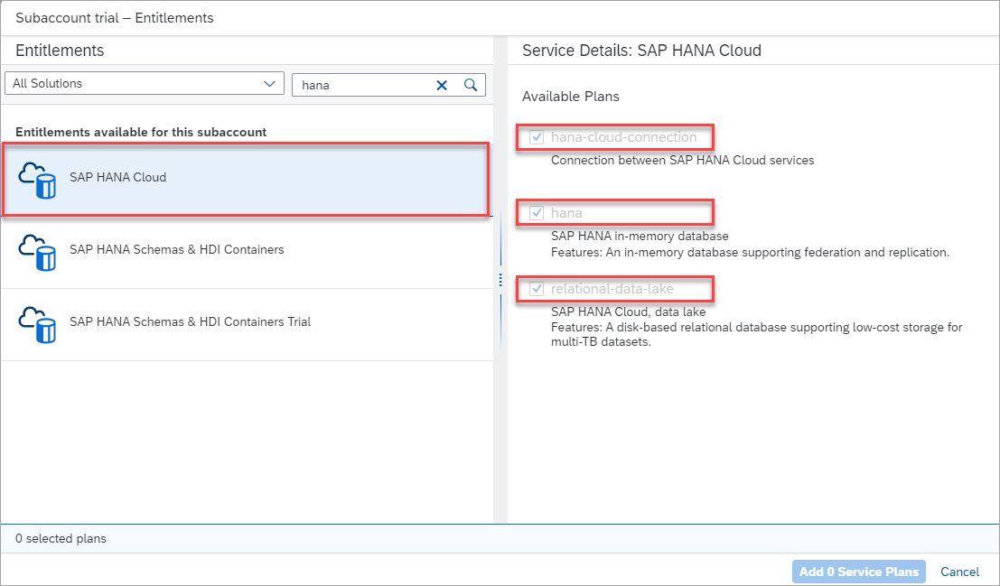
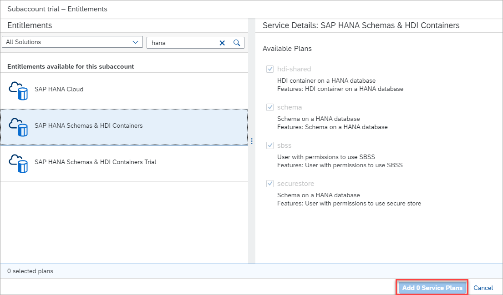
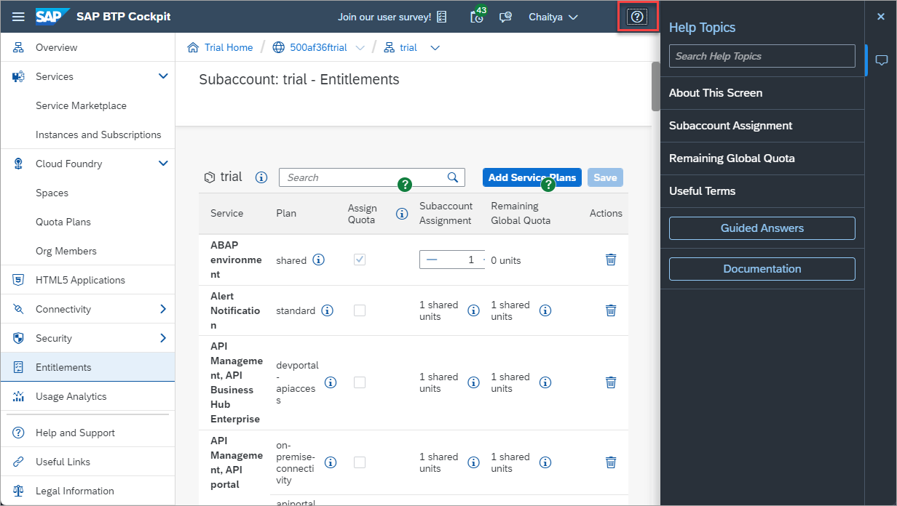
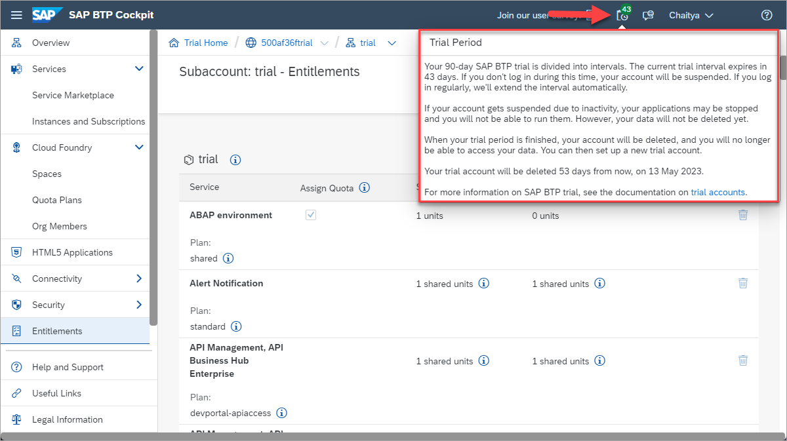

# Start Using the SAP HANA Cloud Trial in SAP BTP Cockpit
<!-- description --> Learn how to get started with the trial of SAP HANA Cloud or how to add it to an existing account on SAP Business Technology Platform.

## Prerequisites
## You will learn
- How to sign up for the SAP HANA Cloud trial
- How to add SAP HANA Cloud to an existing SAP BTP trial account
- How the SAP BTP cockpit is structured and where to find SAP HANA Cloud in it

## Intro
This tutorial is part of a mission, in which you will learn in a hands-on, end-to-end setting how to use SAP HANA Cloud, SAP HANA database. SAP offers two free options to use SAP HANA Cloud. This tutorial covers the first option, which is using the SAP HANA Cloud trial. The trial allows you to use SAP HANA Cloud in a test environment and does not require payment details to sign up, whereas the free tier option can be easily upgraded to a paid version but does require payment details. If you would like to learn more about the second option of using SAP HANA Cloud free tier, proceed to the [next tutorial](hana-cloud-mission-trial-1-ft). 

>
>
> **Help Alex gain business insights using SAP HANA Cloud, SAP HANA database.**
>
> In this mission, we will help Alex, the CEO of a fictitious company called *Best Run Travel* to answer a concrete business question with SAP HANA Cloud, SAP HANA database:
>
> * As a global travel agency, Best Run Travel has data from many different affiliates.
> * Alex needs to know the **top 5 partners** of their agency and wants to find out the **days with maximum booking of each partner**.
> * Best Run Travel uses SAP HANA Cloud, SAP HANA database to store and manage all its data. Now, your mission is to help Alex find a subset of the data related to the partner sales and create a way for Alex to share this subset with other departments in Best Run Travel.

In this tutorial, you will first learn how to sign up for the trial version of SAP HANA Cloud, SAP HANA database or add it to an existing trial account of SAP BTP if you have one. Having access to SAP HANA Cloud is a prerequisite for all other tutorials in this mission.

> If you have a **production environment** of SAP HANA Cloud, SAP HANA database, you may also follow the steps described in this mission.

---

  ### Get to know the SAP HANA Cloud trial

-	You can use your trial account to test the following components: **SAP HANA Cloud, SAP HANA database** and **SAP HANA Cloud, data lake**.

-	If your trial account remains inactive, you will be asked to extend your trial every 30 days. If you regularly log in to your trial account, your trial account will be automatically extended up to 90 days.

-	If you already use other services in SAP Business Technology Platform, those will not be affected or limited in any way by your participation in the SAP HANA Cloud trial.

-	Trial database instances are stopped on a nightly basis. Each time you start working with your trial instance, you need to restart it first.

-	If you do not restart your instance within **30 days**, it will be **deleted**. Your trial account, however, will continue to exist and you can easily provision an instance again, if you wish to do so.

-	The configuration of your trial instance of SAP HANA Cloud, SAP HANA database is **30GB of memory, 2vCPUs, and 120GB of storage**.

-   Features such as JSON document store, Script Server, PAL/APL etc require larger HANA Cloud configurations (3 vCPUS, 45G memory) and are therefore *not supported* in a trial account.

### Sign up for the SAP HANA Cloud trial

In this step, you can learn how to sign up for the trial of SAP HANA Cloud. If you already have an SAP BTP trial account, proceed to the next step to add the appropriate entitlements to your account. 

1.	Click on [this link](https://www.sap.com/cmp/td/sap-hana-cloud-trial.html) to get to the sign-up page. Don't forget to come back here after you signed up. Once you received your confirmation email, you can continue with this mission.

    

2.	Click on **Start your free trial now** and enter your sign-up information.

    

3.	Once you click submit, you will be asked to verify your email address. Check your email inbox and click on the link provided.

4.	You will then receive a confirmation email with a link to access your trial. Click on the button that says **Access your trial** and make sure to bookmark this page for easy access later.
 
    >It is important to note that the first time you access your trial, you will need to choose your identity provider (you can choose the default). Additionally, if you have two-factor authentication enabled, you will have to enter the security token that is sent to you based on the method of authentication you have chosen. 
    
    

Congratulations, you have successfully signed up for the SAP HANA Cloud trial. Your trial is immediately ready to be used.

### Add SAP HANA Cloud to an existing SAP BTP trial account

>If you have an existing SAP BTP trial account, this section will walk you through adding entitlements to your SAP BTP account so you can start using the appropriate services. You can skip this step if you have signed up for the SAP HANA Cloud trial as your account will already have the required entitlements. 

1.	In the SAP BTP cockpit, click on your **subaccount**.

2.	Then click on **Entitlements** on the left-hand side menu. Here you can see all the services associated with your account.

    

3.	Make sure you have entitlements for the services (and service plans) listed here:

    - SAP HANA Cloud: `hana`, `hana-cloud-connection`, and `relational-data-lake`

    -	SAP HANA Schemas & HDI Containers: `hdi-shared`, `schema`, and `securestore`

    If you do not have any of the entitlements above, you need to add them to your account. To do that, click on **Configure Entitlements** on the top right-hand corner of the screen. 

    

4.	Click on **Add Service Plans** in the same area of the screen.

    

5.	In the pop-up that opens, type `HANA` in the search box to see all relevant entitlements.

    

6.	Select the missing entitlements by checking the boxes.

    - SAP HANA Cloud: `hana`, `hana-cloud-connection`, and `relational-data-lake`

    -	SAP HANA Schemas & HDI Containers: `hdi-shared`, `schema`, and `securestore`

        You will see two options in the list related to Schemas and HDI containers. Please make sure to select the one that **does not** say **`(trial)`**, as you can see on the screenshot below.

        > The reason not to select the **SAP HANA Schemas & HDI Containers (trial)** entitlement is that it is made for a trial of *SAP HANA Service*, not SAP HANA Cloud.

    

    

7.	Click on **Add X service Plans**, where X is the amount of services you want to add.

    

8.	On the top right-hand side of the screen, make sure to click on **Save**.

    

Congratulations, you have added the SAP HANA Cloud entitlements to your existing trial account on SAP BTP! You now have the ability to [provision your trial instance of SAP HANA Cloud](hana-cloud-mission-trial-2) and start your journey.

### Get to know SAP BTP cockpit

SAP BTP cockpit is a web-based interface used to manage SAP cloud applications, such as SAP HANA Cloud. This is where you can manage your SAP Business Technology Platform account and users as well as create new instances whenever necessary.  

When you first access your trial account, you will see the **Trial Home Page**.

> In a production environment, you do not see the Trial Home Page.

This is where you can enter your account but also find helpful resources to get to know the SAP BTP cockpit in detail:

-	Take the virtual tour once you start your trial for the first time.

    

There is also some built-in functionality that can help you with using SAP BTP Cockpit and provide you with more information:

-	Use the **Help** button at the top right-hand corner of the screen once you are logged in. This will open a **Help Topics** pane where areas that you can get help custom to the page will appear, as well as embedded links to guided answers and documentation.

    

-   Use **Trial Period** to get more information about your SAP BTP Trial.

    

-	Consult our [documentation material here](https://help.sap.com/viewer/product/BTP/LATEST/en-US)

### Understand Accounts, Directories, Subaccounts, and Spaces

Your account on SAP Business Technology Platform is called a **global account**. As the administrator, you will have full control of your global account and be able to create directories, subaccounts, spaces, and instances. Subaccounts are a smaller part of your global account. Directories group subaccounts under the global account. Under subaccounts are spaces, in which your instances are located.

Below you can see a simplified diagram of a global account in SAP BTP cockpit with different subaccounts and spaces that each contain SAP HANA database and data lake instances. Of course, once you use SAP HANA Cloud, you will most likely have many more databases, spaces, subaccounts and maybe even global accounts. These levels will then help you keep everything neat and organized.

> **Global Account**: Your account on the SAP BTP Platform is called a global account. As the administrator, you will have full control of your global account and be able to create subaccounts, spaces, and instances.
>
> **Directories**: Directories group subaccounts into a folder and are useful to organize them. For example, if your subaccounts are geographical regions such as countries, your directories could be continents.
>
> **Subaccounts**: Subaccounts are a smaller part of your global account. For example, if your global account is your whole organization, your subaccounts could be either your geographical regions or specific departments, depending on what your internal structure requires.
>
> **Spaces**: Under subaccounts are spaces. These can be, for example, lines of business, such as product management, development, or operations.
>
> In the context of SAP HANA Cloud, this means that each space within each subaccount will have their own SAP HANA Cloud area. Spaces are separate from one another, and so are all the databases and data lakes existing under the subaccount. This is important to keep in mind with regards to security, members and data management.
>
> **Instances**: Within your space, you can create and access instances of SAP HANA Cloud, SAP HANA database, and SAP HANA Cloud, data lake.

*Well done!*

You have completed the first tutorial of this mission! Proceed to the [third tutorial](hana-cloud-mission-trial-2) in this mission to learn how to provision an instance of SAP HANA Cloud, SAP HANA database.

### Knowledge Check

---
