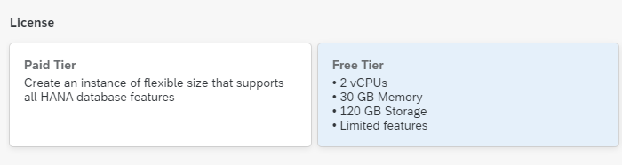

# Start Using SAP HANA Cloud Free Tier Model or Trial in SAP BTP Cockpit
<!-- description --> Learn how to get started with the free tier model or trial of SAP HANA Cloud or how to add it to an existing account on SAP Business Technology Platform.

## Prerequisites
## You will learn
- How to sign up for SAP HANA Cloud free tier model or trial
- How to add SAP HANA Cloud to an existing SAP BTP trial account
- How the SAP BTP cockpit is structured and where to find SAP HANA Cloud in it

## Intro
This tutorial is part of a mission, in which you will learn in a hands-on, end-to-end setting how to use SAP HANA Cloud, SAP HANA database.

>
>
> **Help Alex gain business insights using SAP HANA Cloud, SAP HANA database.**
>
> In this mission, we will help Alex, the CEO of a fictitious company called *Best Run Travel* to answer a concrete business question with SAP HANA Cloud, SAP HANA database:
>
> * As a global travel agency, Best Run Travel has data from many different affiliates.
> * Alex needs to know the **top 5 partners** of their agency and wants to find out the **days with maximum booking of each partner**.
> * Best Run Travel uses SAP HANA Cloud, SAP HANA database to store and manage all its data. Now, your mission is to help Alex find a subset of the data related to the partner sales and create a way for Alex to share this subset with other departments in Best Run Travel.

This mission consists of 9 modules that contain the necessary steps you need to follow in your mission to help Alex:

1.	You are here <sub-style="font-size:30px">&#9755; **Start using SAP HANA Cloud free tier model or trial in SAP BTP Cockpit**.

2.	Provision an instance of SAP HANA Cloud, SAP HANA database

3.	Tools to manage and access the SAP HANA Cloud, SAP HANA Database

4.	Create users and manage roles and privileges

5.	Import data into SAP HANA Cloud, SAP HANA Database

6.	Query the database using SQL statements

7.	Create a development project in SAP Business Application Studio

8.	Create a calculation view

9.	Grant access to Calculation Views

In this tutorial, you will first learn how to sign up for the free tier model or trial of SAP HANA Cloud, SAP HANA database or add it to an existing trial account of SAP BTP if you have one. This is the prerequisite for all other modules in this mission.

> If you have a **production environment** of SAP HANA Cloud, SAP HANA database, you may also follow the steps described in this mission.
>
> You can also watch this video to kick off the mission.
>
<iframe width="560" height="315" src="https://microlearning.opensap.com/embed/secure/iframe/entryId/1_7y0hucq6/uiConfId/43091531" frameborder="0" allowfullscreen></iframe>
>
> ### About this video
>
> This video is meant as additional support material to complete the tutorial. However, we recommend that you only use it for visual guidance but primarily focus on the written steps in this tutorial.

---

### Get to know the SAP HANA Cloud free tier model

-	Customers and partners with an existing CPEA or Pay-As-You-Go contract can start using the free tier model for SAP BTP to explore, learn, and try SAP BTP services (such as SAP HANA Cloud) with a path to productive use.

-	With the free tier model for SAP BTP you start with a productive account right away. The free tier means you can try out selected services up to a specified capacity limit and switch easily to the paid tier, without losing any work.  In order to use the HANA Cloud free tier model, you will need to have the SAP HANA Cloud service entitlement available in your subaccount.  To provision a free tier instance, the free tier service plans must be enabled in your subaccount entitlement.  If you plan to upgrade your instance to a paid tier, the paid tier service plans must also be enabled.  No charges will occur if you are only making use of the free tier service plans.  However, if you decide to upgrade to a paid tier service plan, applicable charges will occur once the instance has been upgraded.   

-	For the SAP HANA Cloud free tier model, simply choose the Free Tier license type when provisioning your instances as shown below.  

    

-	In comparison, SAP BTP trial allows you to build full applications in a test environment to learn and explore of the capabilities of SAP BTP. However, once customers and partners are ready to move to the next phase and deploy to production, they will need to get a new productive account and start over.

-	SAP HANA Cloud services are available for both free tier model and trial – customers and partners can choose the option based on their preferences.  Note that this learning journey contains details for both options.     

### Get to know the SAP HANA Cloud trial

-	You can use your free trial account to test the components **SAP HANA Cloud, SAP HANA database** and **SAP HANA Cloud, data lake**.

-	If your trial account remains inactive, you will be asked to extend your trial every 30 days. If you regularly log in to your trial account, it will be automatically extended.

-	If you already use other services in SAP Business Technology Platform, those will not be affected or limited in any way by your participation in the SAP HANA Cloud Trial.

-	Trial database instances will be **stopped every day** at midnight in the time zone of the server location you selected. Each time you start working with your trial instance, you need to restart it first.

-	If you do not restart your instances within **30 days**, they will be **deleted**. Your trial account, however, will continue to exist and you can easily provision an instance again, if you wish to do so.

-	The configuration of your trial instance of SAP HANA Cloud, SAP HANA database is **30GB of memory, 2vCPUs, and 120GB of storage**.

-	The *`ScriptServer`* that enables machine learning capabilities is *not available* on a trial account as it requires larger instances that cannot be configured in a trial account.

### Sign up for the free trial

In this step, you can learn how to sign up for the free trial of SAP HANA Cloud. There are two options indicated by the two tabs in this step.

> If you do not have an SAP BTP trial account yet, follow the steps in the tab "Sign up for the SAP HANA Cloud trial".
>
> If you already have an SAP BTP trial account, follow the steps in the tab " Add SAP HANA Cloud to existing BTP trial".

Click on the option that applies to you.

<!-- border -->

[OPTION BEGIN [Sign up for the SAP HANA Cloud trial]]

1.	Click on [this link](https://www.sap.com/cmp/td/sap-hana-cloud-trial.html) to get to the sign-up page. Don't forget to come back here after you signed up. Once you received your confirmation email, you can continue with this mission.

    <!-- border -->

2.	Click on **Start your free trial now** and enter your sign-up information.

    <!-- border -->

3.	Once you click submit, you will be asked to verify your email address. Check your email inbox and click on the link provided.

4.	You will then receive a confirmation email with a link to access your trial. Click on the button that says **Access your trial** and make sure to bookmark this page for easy access later.

    <!-- border -->

Congratulations, you have successfully signed up for the SAP HANA Cloud trial. Your trial is immediately ready to be used.

[OPTION END]
[OPTION BEGIN [Add SAP HANA Cloud to existing BTP trial]]

1.	In the SAP BTP cockpit, click on your **subaccount**.

2.	Then click on **Entitlements** on the left-hand side menu.

    <!-- border -->

3.	Make sure you have entitlements for the services (and service plans) listed here:

    - SAP HANA Cloud: `hana`, `hana-cloud-connection`, and `relational-data-lake`

    -	SAP HANA Schemas & HDI Containers: `hdi-shared`, `schema`, and `securestore`

    You will see two options in the list related to Schemas and HDI containers. Please make sure to select the one that **does not** say **`(trial)`**, as you can see on the screenshot below.

    > The reason not to select the **SAP HANA Schemas & HDI Containers (trial)** entitlement is that it is made for a trial of *SAP HANA Service*, not SAP HANA Cloud.

4.	If you do not have any of the entitlements above, you need to add them to your account. To do that, click on **Configure Entitlements** on the top right-hand corner of the screen. Here you can see all the services associated to your trial account.

    <!-- border -->

5.	Click on **Add Service Plans** in the same area of the screen.

    <!-- border -->

6.	In the pop-up that opens, type `HANA` in the search box to see all relevant entitlements.

    <!-- border -->

7.	Select the missing entitlements by checking the boxes.

8.	Click on **Add the X services**, where X is the amount of services you want to add.

9.	On the top right-hand side of the screen, make sure to click on **Save**.

    <!-- border -->

Congratulations, you have added the SAP HANA Cloud entitlement to your existing trial account on SAP BTP! You can immediately create your trial instance of SAP HANA Cloud and start your journey.

[OPTION END]

### Get to know SAP BTP cockpit

SAP BTP cockpit is a web-based interface used to manage SAP cloud applications, such as SAP HANA Cloud. This is where you can manage your SAP Business Technology Platform account and users as well as create new instances whenever necessary.  

<!-- border -->

When you first access your trial account, you will see the **Trial Home Page**.

> In a production environment, you do not see the Trial Home Page.

This is where you can enter your account but also find helpful resources to get to know the SAP BTP cockpit in detail:

-	Take the virtual tour once you start your trial for the first time.

    <!-- border -->

-	Use the **Help** button at the top right-hand corner of the screen once you are logged in.

-	Consult our [documentation material here](https://help.sap.com/viewer/product/BTP/LATEST/en-US)

### Understand Accounts, Subaccounts, and Spaces

Your account on SAP Business Technology Platform is called a **global account**. As the administrator, you will have full control of your global account and be able to create subaccounts, spaces, and instances. Subaccounts are a smaller part of your global account. Under subaccounts are spaces, in which your instances are located.

<!-- border -->

Below you can see a simplified diagram of a global account in SAP BTP cockpit with different subaccounts and spaces that each contain SAP HANA database and data lake instances. Of course, once you use SAP HANA Cloud, you will most likely have many more databases, spaces, subaccounts and maybe even global accounts. These levels will then help you keep everything neat and organized.

<!-- border -->

> **Global Account**: Your account on BTP Platform is called a global account. As the administrator, you will have full control of your global account and be able to create subaccounts, spaces, and instances.
>
> **Subaccounts**: Subaccounts are a smaller part of your global account. For example, if your global account is your whole organization, your subaccounts could be either your geographical regions or specific departments, depending on what your internal structure requires.
>
> **Spaces**: Under subaccounts are spaces. These can be, for example, lines of business, such as product management, development, or operations.
>
> In the context of SAP HANA Cloud, this means that each space within each subaccount will have their own SAP HANA Cloud area.
> Spaces are separate from one another, and so are all the databases and data lakes existing under the subaccount. This is important to keep in mind with regards to security, members and data management.
>
> **Instances**: Within your space, you can create and access instances of SAP HANA Cloud, SAP HANA database, SAP ASE, SAP ASE Replication and data lake.

*Well done!*

You have completed the first tutorial of this mission! Learn in the next tutorial how to provision an instance of SAP HANA Cloud, SAP HANA database.

### Test yourself

---
