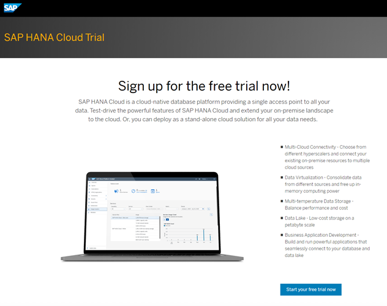
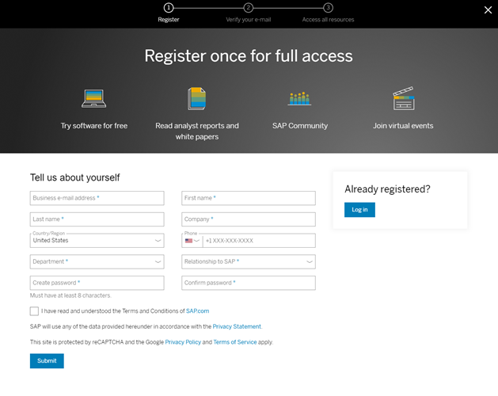

# Sign up for an SAP HANA Cloud Trial account
<!-- description --> Learn about the SAP HANA Cloud trial and the process to sign up for it.

## Intro
This tutorial is part of a mission, in which you will learn in a hands-on, end-to-end setting how to use SAP HANA Cloud, SAP HANA database. SAP offers two free options to use SAP HANA Cloud. This tutorial covers the first option, which is signing up for the SAP HANA Cloud trial. The trial allows you to use SAP HANA Cloud in a test environment and does not require payment details to sign up, whereas the free tier option can be easily upgraded to a paid version but does require payment details. If you would like to learn more about the second option of using SAP HANA Cloud free tier, proceed to [this tutorial](hana-cloud-mission-trial-2-ft).

>
>
> **Help Alex gain business insights using SAP HANA Cloud, SAP HANA database.**
>
> In this mission, we will help Alex, the CEO of a fictitious company called *Best Run Travel* to answer a concrete business question with SAP HANA Cloud, SAP HANA database:
>
> * As a global travel agency, Best Run Travel has data from many different affiliates.
> * Alex needs to know the **top 5 partners** of their agency and wants to find out the **days with maximum booking of each partner**.
> * Best Run Travel uses SAP HANA Cloud, SAP HANA database to store and manage all its data. Now, your mission is to help Alex find a subset of the data related to the partner sales and create a way for Alex to share this subset with other departments in Best Run Travel.

---

  ### Get to know the SAP HANA Cloud trial
-	You can use your trial account to test the following components: **SAP HANA Cloud, SAP HANA database** and **SAP HANA Cloud, data lake**.

-	If your trial account remains inactive, you will be asked to extend your trial every 30 days. If you regularly log in to your trial account, your trial account will be automatically extended up to 90 days.

-	If you already use other services in SAP Business Technology Platform, those will not be affected or limited in any way by your participation in the SAP HANA Cloud trial.

-	Trial database instances are stopped on a nightly basis. Each time you start working with your trial instance, you need to restart it first.

-	If you do not restart your instance within **30 days**, it will be **deleted**. Your trial account, however, will continue to exist and you can easily provision an instance again, if you wish to do so.

-	The configuration of your trial instance of SAP HANA Cloud, SAP HANA database is **30GB of memory, 2vCPUs, and 120GB of storage**.

-   Features such as JSON document store, Script Server, PAL/APL etc. require larger HANA Cloud configurations (3 `vCPUs`, 45G memory) and are therefore *not supported* in a trial account.

### Sign up for the SAP HANA Cloud trial
In this step, you can learn how to sign up for the trial of SAP HANA Cloud. If you already have an SAP BTP trial account, proceed to the next step to add the appropriate entitlements to your account.

1.	Click on [this link](https://www.sap.com/cmp/td/sap-hana-cloud-trial.html) to get to the sign-up page. Don't forget to come back here after you signed up. Once you received your confirmation email, you can continue with this mission.

    

2.	Click on **Start your free trial today** and enter your sign-up information.

    

3.	Once you click submit, you will be asked to verify your email address. Check your email inbox and click on the link provided.

4.	You will then receive a confirmation email with a link to access your trial. Click on the button that says **Access Your Trial** and make sure to bookmark this page for easy access later.

    >It is important to note that the first time you access your trial, you will need to choose your identity provider (you can choose the default). Additionally, if you have two-factor authentication enabled, you will have to enter the security token that is sent to you based on the method of authentication you have chosen.

    

Congratulations, you have successfully signed up for the SAP HANA Cloud trial! Learn how you can start using SAP HANA Cloud in the [next tutorial](hana-cloud-mission-trial-2).

### Knowledge Check
