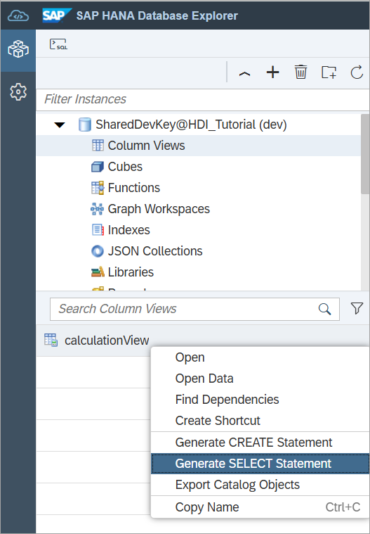
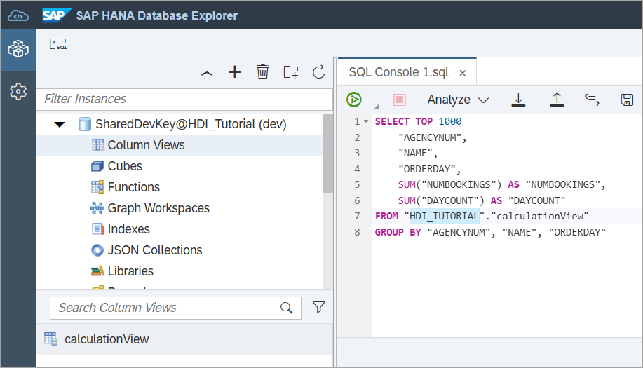
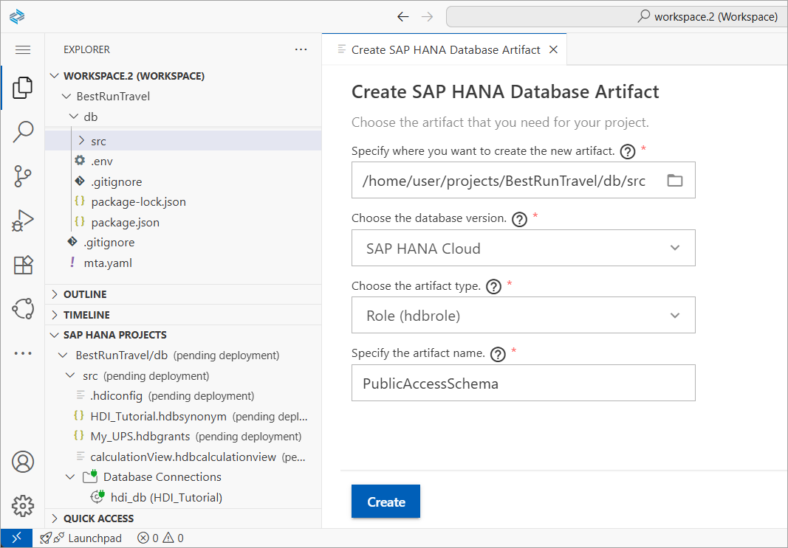
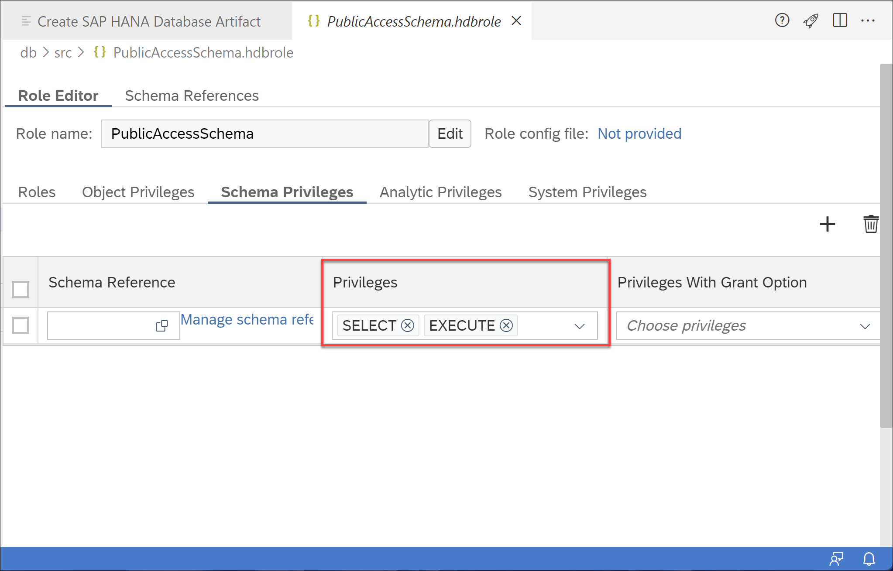
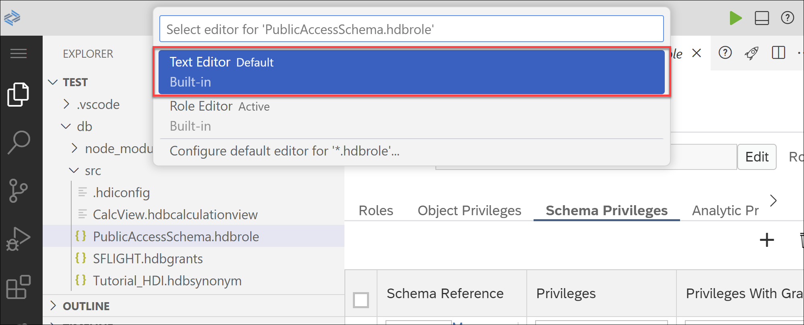
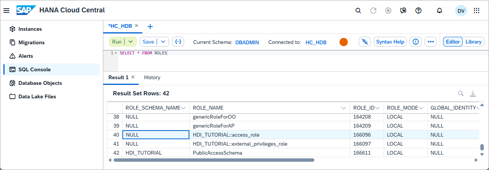
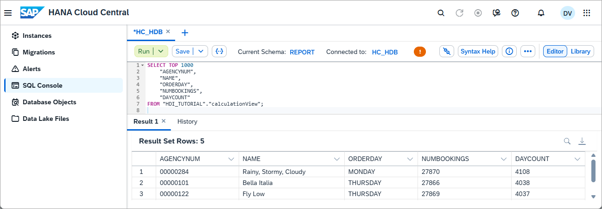

# Grant Access to Calculation Views
<!-- description --> Learn how to create a user and grant others access to your calculation views within the SAP HANA database in SAP HANA Cloud.

## Prerequisites
- You have access to [SAP HANA Cloud trial](hana-cloud-mission-trial-2) or [SAP HANA Cloud free tier](hana-cloud-mission-trial-2-ft), or a production environment of SAP HANA Cloud, SAP HANA database
- You have completed the tutorial to [provision an instance of SAP HANA Cloud, SAP HANA database](hana-cloud-mission-trial-3)
- You have completed the tutorial to [import the sample data needed for this mission](hana-cloud-mission-trial-5)
- You have [set up a development project in SAP Business Application Studio and connected it to your database](hana-cloud-mission-trial-8).
- You have completed the tutorial to [create a calculation view](hana-cloud-mission-trial-9)


## You will learn
- What privileges are needed for others to access your calculation view
- How to create a role in SAP Business Application Studio
- How to create a user in the SAP HANA database explorer and connect as this user


## Intro
>
> 
>
> Reminder: This tutorial is part of a mission, in which you will help Alex, the CEO of Best Run Travel, to answer a concrete business question with SAP HANA Cloud, SAP HANA database.
>
> *Alex needs to know the top 5 partners of their agency and wants to find out the days with maximum booking of each partner.*


In this tutorial, you will learn how to make the calculation view you created previously available to others in the organization by creating a new role and granting this role access to the view.

---

### Generate a SELECT statement on the column view


To allow others to see the results of your calculation view, you need to grant them the privilege to run `SELECT` statements on this calculation view.

To run `SELECT` statements on calculation views in the new environment, first make sure that the you have the correct schema name. This schema is not the `SFLIGHT` schema we previously created, but rather the schema automatically created for the calculation view.

1. To find out the schema name, open the **SAP HANA database explorer**.

2. Find your HDI container in the catalog.

    > ### Not sure how to find the HDI container of your project in the catalog?
    >
    > Unless you specified a name for your container manually upon creation of your project, the default name will look something like this:
    >
    > `SharedDevKey@[name of your dev project]-hdidb-[sequence of characters] ([name of your space])`
    >
    > In our example, it is listed as follows:
    >
    > `SharedDevKey@BestRunTravel-hdidb-ws-g6mq2 (dev)`
    >
    > Alternatively, you can go to SAP Business Application Studio and click on the HDI container icon , which will directly open the right container in the catalog.

3.	Click on **Column Views**.

4.	Right-click on the column view name on the bottom panel and choose to **Generate a SELECT Statement**.

    

5.	This will open the SQL Console on the main area of the screen with the `SELECT` statement. On `line 7` you can see a `FROM` clause with two arguments separated by a `.`. The first part is the schema name, the second part is the calculation view name.

6.	Copy the name of the schema and save it for later, for example, using a text editor.

7.	Keep this SQL console open.

    


### Create a role


Great, now that you have the right schema name, next you will have to grant the authorization to `SELECT` on the Calculation View. This is done by creating an `.hdbrole` file in your development project that grants the `SELECT` privilege.

1.	Go to your project in SAP Business Application Studio and start your development space if needed.

2.	You need the command **SAP HANA: Create HANA database artifact** that you got to know in the previous tutorial. Access it by clicking on **View** on the top menu and selecting **Find command** or pressing `Ctrl+Shift+P`. Unless you see it in your recently used commands, type `SAP HANA` and select it from the list.

3.	In the wizard, make sure the path to save the role file is in the `src` folder of your project.

4.	Choose the database version **HANA Cloud**.

5.	Select the artifact type as ``**Role (hdbrole)**``.

6.	Name your role `PublicAccessSchema`.

7.	Finally, click on Create.

    

Your role will appear in the file explorer of your project and you can add privileges to it.


### Add privileges to the role


In this step, you have two options to add privileges to your role: You can use the **Role Editor** wizard or the **Text Editor**. Click on the option you prefer under the title of this step.

The goal in this step is to add the schema privileges `SELECT` and `EXECUTE` to the role ` PublicAccessSchema`

[OPTION BEGIN [Role Editor]]

1.	Click on the `.hdbrole` file. This will open the role editor.

2.	Click on **Schema Privileges** and check the boxes in the column **Privileges** for `SELECT` and `EXECUTE`.

3.	No other options need to be checked, so you can close the role editor.

    

[OPTION END]
[OPTION BEGIN [Text Editor]]

1.	Right-click on the `.hdbrole` file, select **Open with**, then choose **Text Editor** when prompted at the top of the screen.

    

2.	Paste the following statements there. Alternatively, you can download this code from our [public GitHub repository](https://github.com/SAP-samples/hana-cloud-learning/blob/181320ae18082d03715c8ea03a61ce2617c9a840/Mission:%20SAP%20HANA%20Database%20in%20SAP%20HANA%20Cloud/Tutorial%209/Tutorial%209%20Queries.txt).

    ```JSON
    {
        "role": {
            "name": "PublicAccessSchema",
            "schema_privileges": [
                {
                    "privileges": [
                        "SELECT",
                        "EXECUTE"
                    ]
                }
            ]
        }
    }
    ```

3.	Note that, if you have added a namespace to your `db` folder, you will have to edit the syntax to include that. Before `PublicAccessSchema`, add your namespace and `::`.

[OPTION END]

Deploy the `.hdbrole` file by clicking on the deploy icon () next to it on the SAP HANA Projects panel or on the top right corner of the main panel.

After you are done, deploy the whole project again. When that is completed successfully, you may continue.


### Create a new user in the SAP HANA database explorer


Now that you have the role created and granted privileges to this role, it's time to grant this role to a user. We will create the public user `report` that shall have read-only access to the calculation view.

1.	Go back to your tab with the **SAP HANA database explorer** and open a SQL Console by clicking on the SQL icon () at the top left corner. Make sure that the connection is opened for an user that has system privileges `ROLE ADMIN` and `USER ADMIN`, e.g., database user `DBADMIN`.

2.	Paste the following statement in the SQL Console. Change the password in the statement and then run.

    ```SQL
    CREATE USER report PASSWORD <your_password> NO FORCE_FIRST_PASSWORD_CHANGE set usergroup default;
    ```

    > Using the clause `NO FORCE_FIRST_PASSWORD_CHANGE` is not considered a security best practice! We will only use this option for the purpose of this tutorial, in our example to make a user available to multiple individuals. If you create users in your productive environment, please consider forcing a password change for the first log in and giving individuals different users.

3.	Now that our new user `report` is created, we need to grant the user access to the role `PublicAccessSchema`.

4.	Use the following statement.

    ```SQL
    GRANT <SCHEMA_NAME>."PublicAccessSchema" to report;
    ```

5. Replace the `<schema name>` with the calculation view schema you copied in the beginning of this tutorial.

6. Make sure to remove the `<>` characters and then run the statement.

> ### Custom vs. default roles
>
> You can also use the default role that has the `container name.default` access. As soon as an HDI container is created, the default access role is created. You can find the name of the role by using the statement `SELECT * FROM ROLES`
>
> The role you are looking for should consist of the schema name and the role name `access_role`.
>
> 
>
> If you don't need a customized role, you can use this one. In a productive system, we recommend creating your own roles with just the privileges needed.


### Connect as the new user


You have successfully created the new user `report` and assigned it a role to access your calculation view. With the new user credentials, anyone who has the credentials for this user can run `SELECT` statements on your calculation view.

1.	To test this, first log in with your new user by typing the following statement:

    ```SQL
    CONNECT report PASSWORD <Your_Password>
    ```

2.	You should now see at the top of the screen, over the SQL console the user you connected with.

3.	Since you granted this user `SELECT` privileges, you should be able to run `SELECT` statements on the column view.

4.	Go back to the SQL console you opened in STEP 1, when you generated a `SELECT` statement of the column view. If you have closed it in the meantime, simply right-click on the column view and click on **Generate a SELECT Statement**.

5.	Copy the whole statement from this SQL console and paste it to the console that you used to connect with the user `report`.

6.	Execute the statement using the `report`-user console. When you see the results of this query you know that your test was successful, and the user can now access your view.

    

    And with that last step, you have completed the last tutorial of this mission! You learned how to create a new user role and how to grant access to your calculation view using SAP Business Application Studio and SAP HANA Database Explorer.


> **Congratulations! You successfully completed this mission!**
>
> You achieved your goal of helping Alex find the business insights they were looking for and share these insights with others!
>
> 
>
> Throughout the tutorials of this mission, you have learned how to provision your first SAP HANA Cloud, SAP HANA database instance, how to use the different SAP HANA Cloud tools, how to import and query data, how set up a development project, create and calculation view and how to make it available to others within your organization.

Make sure to get the badge for this mission and share it on your profile in the SAP Community. [Click here for more learning materials on SAP HANA Cloud](https://community.sap.com/topics/hana-cloud).

Follow our tag in the [SAP Community](https://blogs.sap.com/tags/73554900100800002881/) to stay up-to-date on the latest updates and newest content!


### Knowledge Check


---
