# Start Using SAP HANA Cloud Free Tier in SAP BTP Cockpit
<!-- description --> Learn how to get started with SAP HANA Cloud free tier or how to add it to an existing account on SAP Business Technology Platform.

## Prerequisites
## You will learn
- How to sign up for SAP HANA Cloud free tier
- How to add SAP HANA Cloud to an existing SAP BTP account
- How the SAP BTP Cockpit is structured and where to find SAP HANA Cloud in it

## Intro
This tutorial is part of a mission, in which you will learn in a hands-on, end-to-end setting how to use SAP HANA Cloud, SAP HANA database. SAP offers two free options to use SAP HANA Cloud. This tutorial covers the second option, which is using SAP HANA Cloud free tier. The free tier option can be easily upgraded to a paid version but does require payment details, while the trial allows you to use SAP HANA Cloud in a test environment and does not require payment details to sign up. If you would like to learn more about the first option (SAP HANA Cloud trial), navigate to the [previous tutorial](hana-cloud-mission-trial-2).

>
>
> **Help Alex gain business insights using SAP HANA Cloud, SAP HANA database.**
>
> In this mission, we will help Alex, the CEO of a fictitious company called *Best Run Travel* to answer a concrete business question with SAP HANA Cloud, SAP HANA database:
>
> * As a global travel agency, Best Run Travel has data from many different affiliates.
> * Alex needs to know the **top 5 partners** of their agency and wants to find out the **days with maximum booking of each partner**.
> * Best Run Travel uses SAP HANA Cloud, SAP HANA database to store and manage all its data. Now, your mission is to help Alex find a subset of the data related to the partner sales and create a way for Alex to share this subset with other departments in Best Run Travel.

In this tutorial, you will learn how to create an SAP Business Technology Platform (BTP) account and then add SAP HANA Cloud free tier services to your SAP BTP account. Having access to SAP HANA Cloud is a prerequisite for all other tutorials in this mission.

> If you have a **production environment** of SAP HANA Cloud, SAP HANA database, you may also follow the steps described in this mission.

---

### Get to know the SAP HANA Cloud free tier model
- Customers with an enterprise account can use the free service plans for SAP BTP to explore, learn, and try SAP BTP services (such as SAP HANA Cloud) with a path to productive use.

- The free tier means you can try out selected services up to a specified capacity limit and switch easily to the paid tier, without losing any work.  

- The configuration of your free tier instance of SAP HANA Cloud, SAP HANA database is **30 GB of memory, 2 vCPUs, and 120 GB of storage**.

- If you do not restart your instance within **30 days**, it will be **deleted**. Additional details are available at [SAP HANA Database License](https://help.sap.com/docs/hana-cloud/sap-hana-cloud-administration-guide/sap-hana-database-license).

- In comparison, SAP BTP trial (introduced in the first tutorial) allows you to build full applications in a test environment to learn and explore the capabilities of SAP BTP. However, once customers and partners are ready to move to the next phase and deploy to production, they will need to get a new productive account and start over.

- SAP HANA Cloud services are available as both a trial or free tier model – customers and partners can choose the option based on their preferences.  Note that this tutorial contains details for the second option: SAP HANA Cloud free tier.   

- Features such as JSON document store and Script Server require larger HANA Cloud configurations (3 `vCPUs`, 45G memory) and are therefore *not supported* when using free tier.

### Create an SAP BTP account to use the free tier model
If you would like to use the free tier model to get started with SAP HANA Cloud, [get an account on SAP BTP to try out free tier service plans](btp-free-tier-account) by following steps 1 to 8 of the linked tutorial.

In order to use the SAP HANA Cloud free tier model, you will need to have the SAP HANA Cloud service entitlement available in your subaccount.  To provision a free tier instance, the free tier service plans must be enabled in your subaccount entitlement (the next step will walk you through this). If you plan to upgrade your instance to a paid tier, the paid tier service plans must also be enabled.  No charges will occur if you are only making use of the free tier service plans.  However, if you decide to upgrade to a paid tier service plan, applicable charges will occur once the instance has been upgraded.   

Once you have your SAP BTP account setup, proceed to the next step to learn how to add the appropriate entitlements to your account.

### Add SAP HANA Cloud to an existing SAP BTP account
>If you have an existing SAP BTP account, this section will walk you through adding entitlements to your  SAP BTP account so you can start using the appropriate services.

1.	In the SAP BTP cockpit, click on your **subaccount**.

    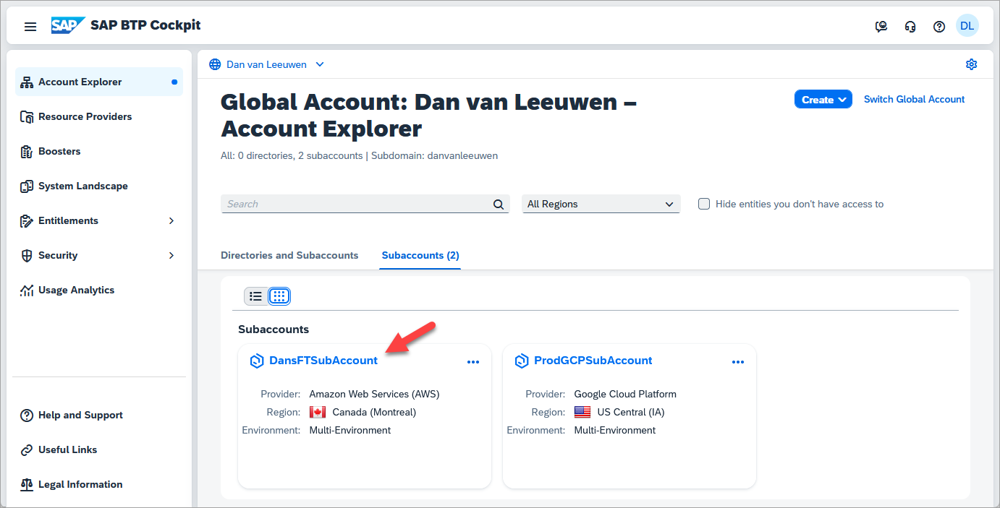

2.	Then click on **Entitlements** on the left-hand side menu and search for entitlements for SAP HANA.

    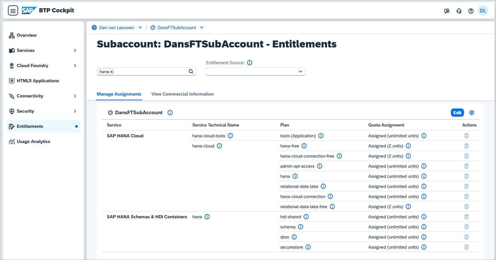

3.	Confirm that you have entitlements for the services (and service plans) listed here:

    - SAP HANA Cloud:          
      * `tools (Application)`
      * `hana-free`
      * `hana-cloud-connection-free`
      * `relational-data-lake-free`
    
    - SAP HANA Schemas & HDI Containers: 
      * `hdi-shared`
      * `schema`
      * `securestore`

4. If you do not have any of the entitlements above, you need to add them to your account. To do that, click on **Edit** on the top right-hand corner of the screen, then click on **Add Service Plans** in the same area of the screen.

    In the pop-up that opens, type `SAP HANA` in the search box to see all relevant entitlements.

    

    After clicking on **Add X Service Plans**, where X is the number of services you want to add,  make sure to click on the **Save** button.
    
    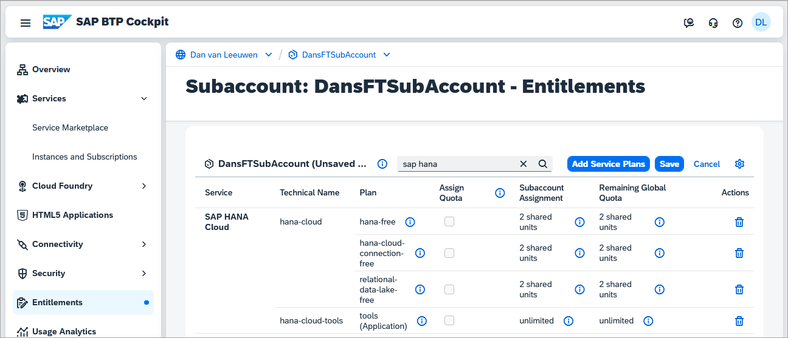

### Add a subscription to SAP HANA Cloud tools

1. From SAP BTP Cockpit, click on **Services** and then **Service Marketplace**.  Search for **SAP HANA Cloud** and click **Create** in the top-right corner. 

    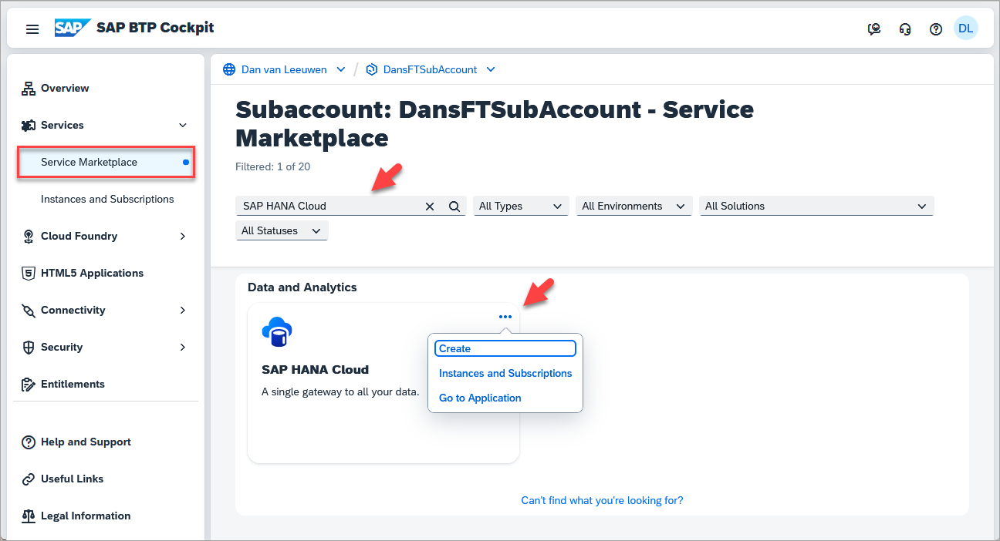
  
2. Select **SAP HANA Cloud** under Service and **tools** under Plan.  

    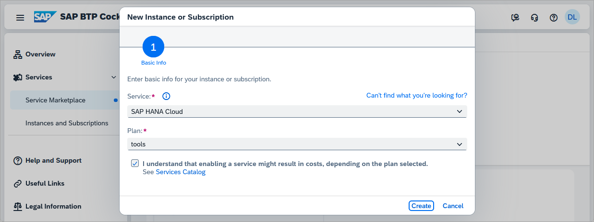

3. To ensure that your desired user has the necessary permissions to manage instances in HANA Cloud Central, navigate to **Security** > **Users** in the left hand side menu. Then click on your user.  

    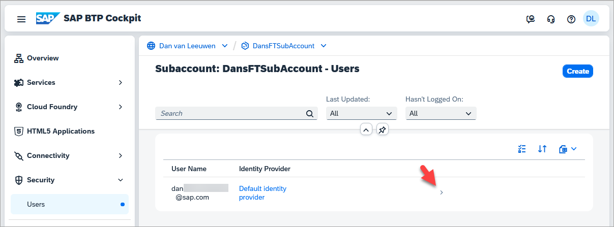

    Click on the **Assign Role Collection** button.

    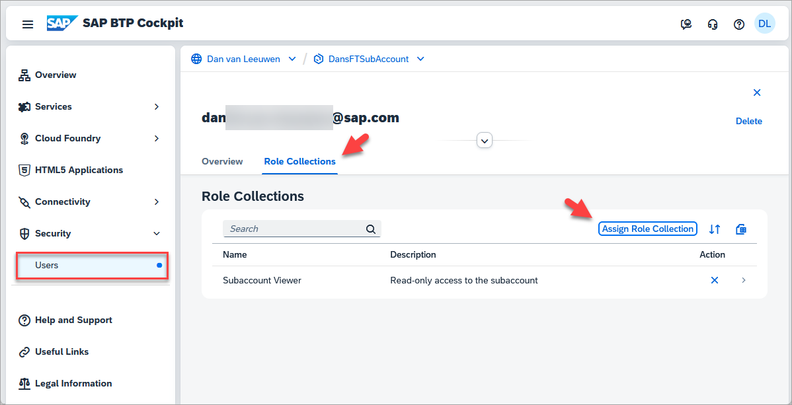  

    Select **SAP HANA Cloud Administrator** then click Assign Role Collection.

    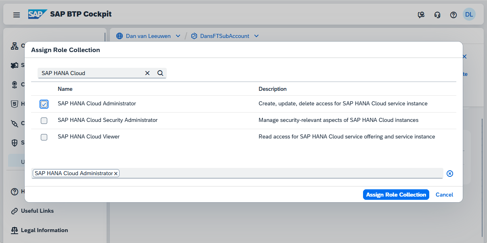

4. Navigate to **Services**, **Instances and Subscriptions** and click on **SAP HANA Cloud** to open SAP HANA Cloud Central.   

    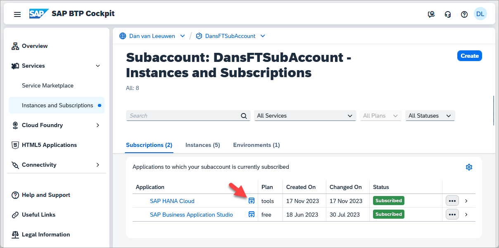

Congratulations, you have added free tier services to your account on SAP BTP! You now have the ability to [provision your free tier instance of SAP HANA Cloud](hana-cloud-mission-trial-3) and start your journey.

### Get to know SAP BTP cockpit
SAP BTP cockpit is a web-based interface used to manage SAP cloud applications, such as SAP HANA Cloud. This is where you can manage your SAP Business Technology Platform account and users as well as create new instances whenever necessary.  

Use the **Help** button at the top right-hand corner of the screen once you are logged in. This will open a **Help Topics** pane where areas that you can get help custom to the page will appear, as well as embedded links to guided answers and documentation.

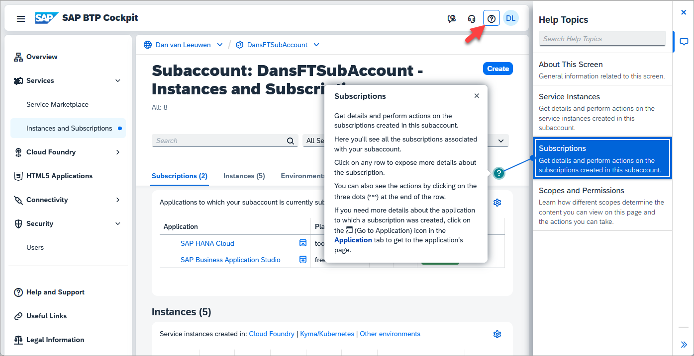

For further details, consult our documentation material [here](https://help.sap.com/docs/btp).

### Understand Accounts, Directories, and Subaccounts
Your account on SAP Business Technology Platform is called a **global account**. As the administrator, you will have full control of your global account and be able to create directories, subaccounts, and instances. Subaccounts are a smaller part of your global account. Directories group subaccounts under the global account.

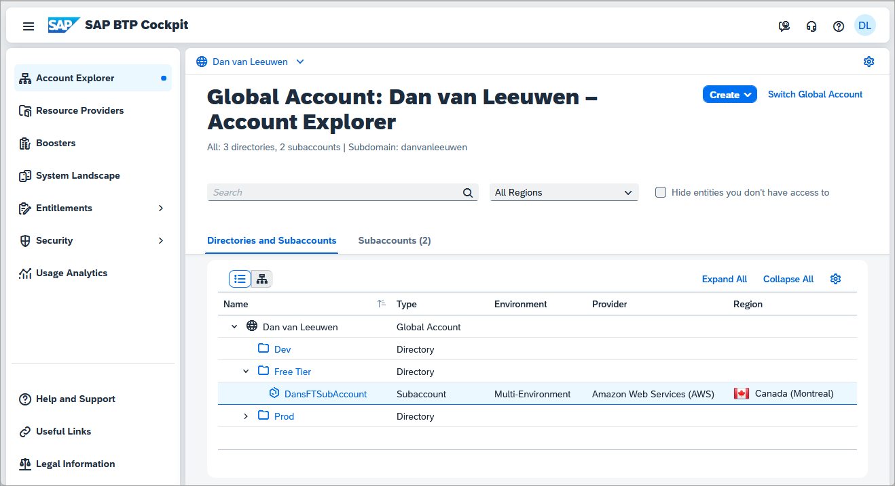

Below you can see a simplified diagram of a global account in SAP BTP Cockpit with different ways in which directories, subaccounts, are used to organize SAP HANA database and data lake instances.  Of course, once you use SAP HANA Cloud, you will most likely have many more databases, subaccounts, and perhaps even global accounts. These levels will then help you keep everything well-organized.

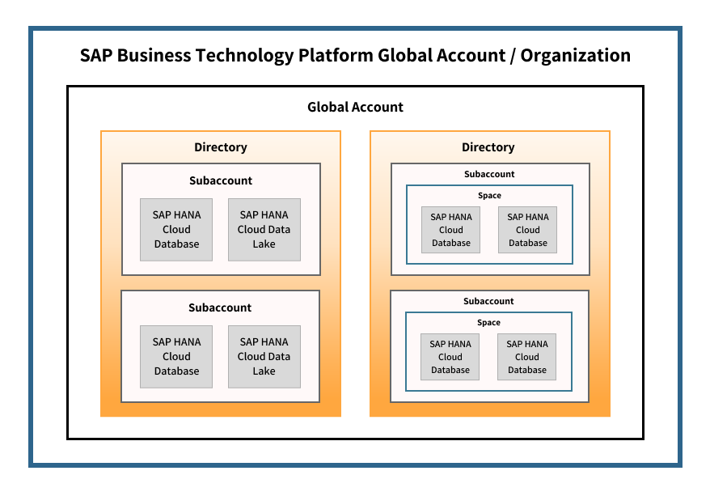

> **Global Account**: Your account on the SAP BTP Platform is called a global account. As the administrator, you will have full control of your global account and be able to create subaccounts, spaces, and instances.
>
> **Directories**: Directories group subaccounts into a folder and are useful to organize them. For example, if your subaccounts are geographical regions such as countries, your directories could be continents.
>
> **Subaccounts**: Subaccounts are a smaller part of your global account. For example, if your global account is your whole organization, your subaccounts could be either your geographical regions or specific departments, depending on what your internal structure requires.
>
> **Instances**: You can create and access instances of SAP HANA Cloud, SAP HANA database and SAP HANA Cloud, data lake.
>
> **Spaces**: You can choose to optionally provision an SAP HANA Cloud instance into the Cloud Foundry runtime.  If you do, multiple Cloud Foundry spaces can be used to further organize instances.

*Well done!*

You have completed the second tutorial of this mission! Learn in the [next tutorial](hana-cloud-mission-trial-3) how to provision an instance of SAP HANA Cloud, SAP HANA database.  

### Knowledge Check

---
