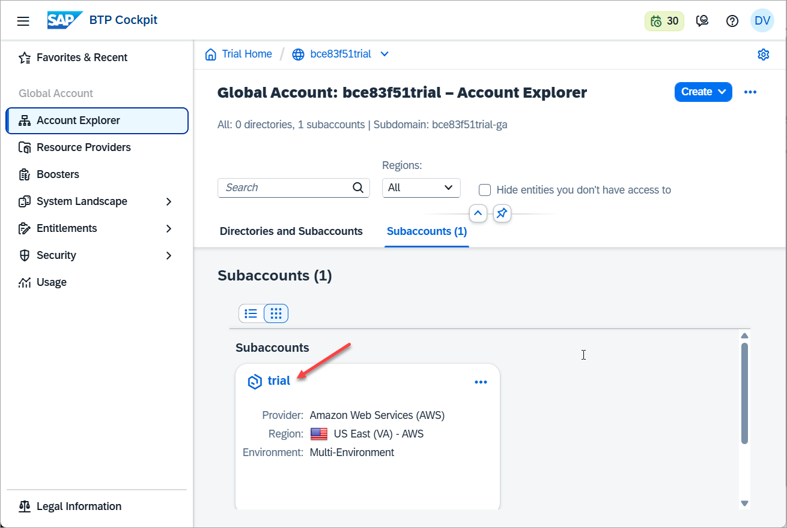
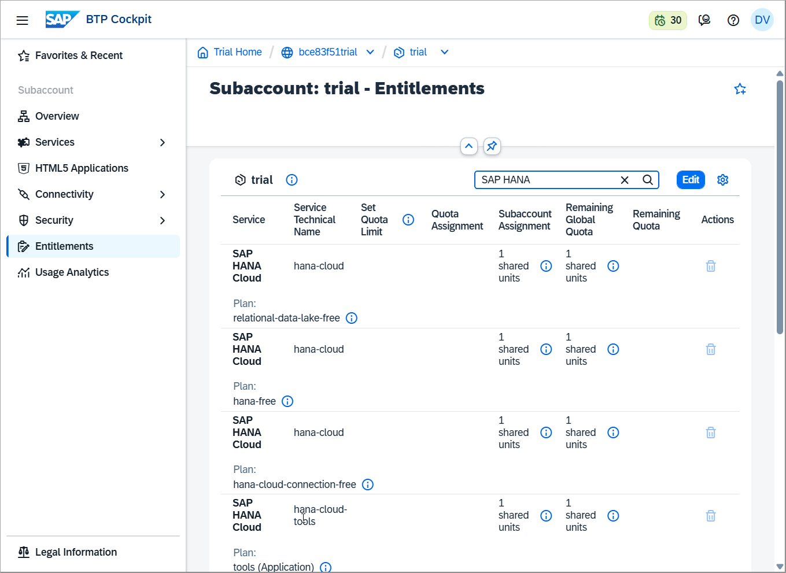
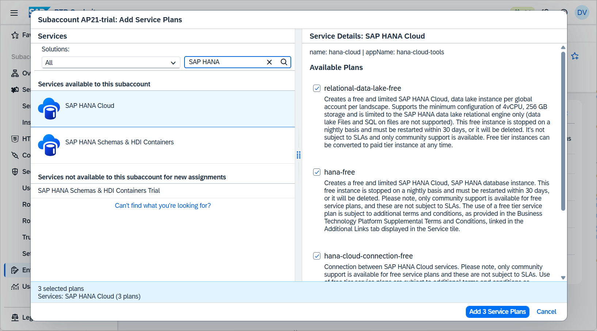
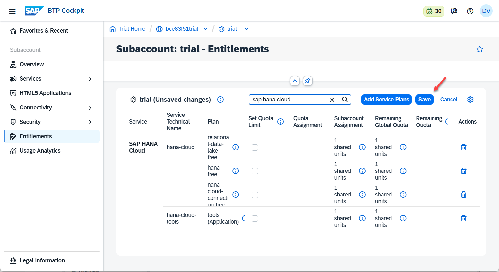
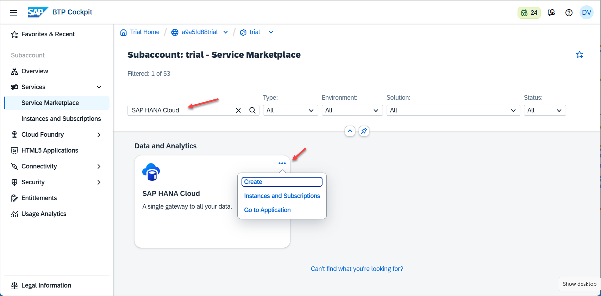
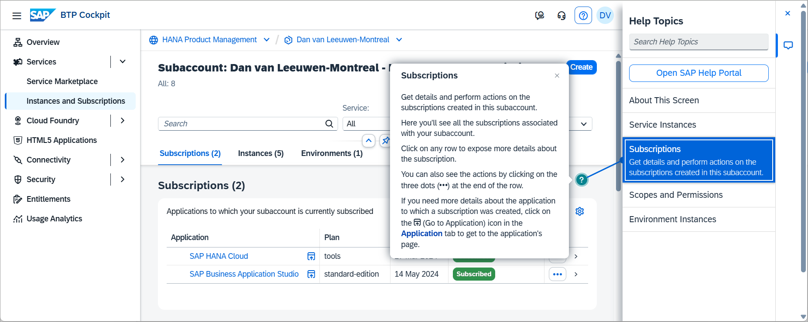
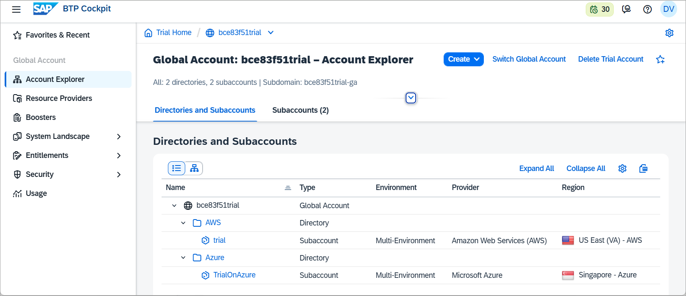

# Start Using SAP HANA Cloud Free Tier Service in SAP BTP Cockpit

<!-- description --> Learn how to get started with SAP HANA Cloud free tier service in the SAP Business Technology Platform (SAP BTP).

## Prerequisites

- You have access to a SAP BTP trial account or a productive account that has SAP HANA Cloud entitlements

## You will learn

- How to subscribe to the SAP HANA Tools
- About the SAP BTP Cockpit and SAP BTP subaccount

## Intro

This tutorial is part of a mission, in which you will learn in a hands-on, end-to-end setting how to use SAP HANA Cloud, SAP HANA database. In this tutorial you will learn how to work with the entitlements and role collections required for the SAP HANA Cloud tooling as well as get an overview of the SAP BTP Cockpit and subaccount.

>
>
> **Help Alex gain business insights using SAP HANA Cloud, SAP HANA database.**
>
> In this mission, we will help Alex, the CEO of a fictitious company called *Best Run Travel* to answer a concrete business question with SAP HANA Cloud, SAP HANA database:
>
> - As a global travel agency, Best Run Travel has data from many different affiliates.
> - Alex needs to know the **top 5 partners** of their agency and wants to find out the **days with maximum booking of each partner**.
> - Best Run Travel uses SAP HANA Cloud, SAP HANA database to store and manage all its data. Now, your mission is to help Alex find a subset of the data related to the partner sales and create a way for Alex to share this subset with other departments in Best Run Travel.

---

### Examine the SAP HANA Cloud entitlements

Before a service can be used in the SAP BTP Cockpit, it must have its entitlements enabled.

1. In the SAP BTP cockpit, click on your **subaccount**.

    

2. Then click on **Entitlements** on the left-hand side menu and search for entitlements for SAP HANA Cloud.

    

3. Confirm that you have entitlements for the services and plans listed here:

    - SAP HANA Cloud:
      - `tools (Application)`
      - `hana-free`
      - `hana-cloud-connection-free`
      - `relational-data-lake-free`

    - SAP HANA Schemas & HDI Containers: 
      - `hdi-shared`
      - `schema`
      - `securestore`

4. If you do not have any of the entitlements above, you need to add them to your account. To do that, click on **Edit** on the top right-hand corner of the screen, then click on **Add Service Plans** in the same area of the screen.

    In the pop-up that opens, type `SAP HANA` in the search box to see all relevant entitlements.

    

    After clicking on **Add X Service Plans**, where X is the number of services you want to add,  make sure to click on the **Save** button.

    

### Add a subscription to SAP HANA Cloud tools

1. From SAP BTP Cockpit, click on **Services** and then **Service Marketplace**.  Search for **SAP HANA Cloud** and click **Create** in the top-right corner. 

    
  
2. Select **SAP HANA Cloud** under Service and **tools** under Plan.  

    

3. To ensure that your desired user has the necessary permissions to manage instances in HANA Cloud Central, navigate to **Security** > **Users** in the left hand side menu. Then click on your user.  

    

    Click on the **Assign Role Collection** button.

      

    Select **SAP HANA Cloud Administrator** then click Assign Role Collection.

    

4. Navigate to **Services**, **Instances and Subscriptions** and click on **SAP HANA Cloud** to open SAP HANA Cloud Central.

    

Congratulations, you have added free tier services to your account on SAP BTP! You now have the ability to [provision your free tier instance of SAP HANA Cloud](hana-cloud-mission-trial-3) and start your journey.

### Get to know SAP BTP cockpit

SAP BTP cockpit is a web-based interface used to manage SAP cloud applications, such as SAP HANA Cloud. This is where you can manage your SAP Business Technology Platform account and users as well as create new instances whenever necessary.  

Use the **Help** button at the top right-hand corner of the screen once you are logged in. This will open a **Help Topics** pane where areas that you can get help custom to the page will appear, as well as embedded links to guided answers and documentation.

For further details, consult our documentation material [here](https://help.sap.com/docs/btp).

### Understand Accounts, Directories, and Subaccounts

Your account on SAP Business Technology Platform is called a **global account**. As the administrator, you will have full control of your global account and be able to create directories, subaccounts, and instances. Subaccounts are a smaller part of your global account. Directories group subaccounts under the global account.

Below you can see a simplified diagram of a global account in SAP BTP Cockpit with different ways in which directories, subaccounts, are used to organize SAP HANA database and data lake instances.  Of course, once you use SAP HANA Cloud, you will most likely have many more databases, subaccounts, and perhaps even global accounts. These levels will then help you keep everything well-organized.

> **Global Account**: Your account on the SAP BTP Platform is called a global account. As the administrator, you will have full control of your global account and be able to create subaccounts, spaces, and instances.
>
> **Directories**: Directories group subaccounts into a folder and are useful to organize them. For example, if your subaccounts are geographical regions such as countries, your directories could be continents.
>
> **Subaccounts**: Subaccounts are a smaller part of your global account. For example, if your global account is your whole organization, your subaccounts could be either your geographical regions or specific departments, depending on what your internal structure requires.
>
> **Instances**: You can create and access instances of SAP HANA Cloud, SAP HANA database and SAP HANA Cloud, data lake.
>
> **Spaces**: You can choose to optionally provision an SAP HANA Cloud instance into the Cloud Foundry runtime.  If you do, multiple Cloud Foundry spaces can be used to further organize instances.

*Well done!*

You have completed the second tutorial of this mission! Learn in the [next tutorial](hana-cloud-mission-trial-3) how to provision an instance of SAP HANA Cloud, SAP HANA database.  

### Knowledge Check

---
