# Start Using SAP HANA Cloud Trial in SAP BTP Cockpit
<!-- description --> Learn how to configure entitlements and create a subscription for SAP HANA Cloud.

## Prerequisites
- You have signed up for an [SAP HANA Cloud trial account](hana-cloud-mission-trial-1)

## You will learn
- How to add SAP HANA Cloud to an existing SAP BTP trial account
- How the SAP BTP cockpit is structured and where to find SAP HANA Cloud in it

## Intro
This tutorial is part of a mission, in which you will learn in a hands-on, end-to-end setting how to use SAP HANA Cloud, SAP HANA database. SAP offers two free options to use SAP HANA Cloud. This tutorial covers the second option, which is using SAP HANA Cloud free tier. The free tier option can be easily upgraded to a paid version but does require payment details, while the trial allows you to use SAP HANA Cloud in a test environment and does not require payment details to sign up. If you would like to learn more about the free tier option (SAP HANA Cloud trial), navigate to the [next tutorial](hana-cloud-mission-trial-2-ft).

>
>
> **Help Alex gain business insights using SAP HANA Cloud, SAP HANA database.**
>
> In this mission, we will help Alex, the CEO of a fictitious company called *Best Run Travel* to answer a concrete business question with SAP HANA Cloud, SAP HANA database:
>
> * As a global travel agency, Best Run Travel has data from many different affiliates.
> * Alex needs to know the **top 5 partners** of their agency and wants to find out the **days with maximum booking of each partner**.
> * Best Run Travel uses SAP HANA Cloud, SAP HANA database to store and manage all its data. Now, your mission is to help Alex find a subset of the data related to the partner sales and create a way for Alex to share this subset with other departments in Best Run Travel.

 In this tutorial, you will learn how to add the new multi-environment tooling SAP HANA Cloud to new or existing trial accounts of SAP Business Technology Platform. Having access to SAP HANA Cloud is a prerequisite for all other tutorials in this mission.

> If you have a **production environment** of SAP HANA Cloud, SAP HANA database, you may also follow the steps described in this mission.

### Configure entitlements for SAP HANA Cloud on an existing SAP BTP trial account (optional)
>If you have an existing SAP BTP trial account, this section will walk you through adding entitlements to your SAP BTP account so you can start using the appropriate services.

1.	In the SAP BTP Cockpit, click on your **subaccount**.

2.	Then click on **Entitlements** on the left-hand side menu. Here you can see all the services associated with your account.

    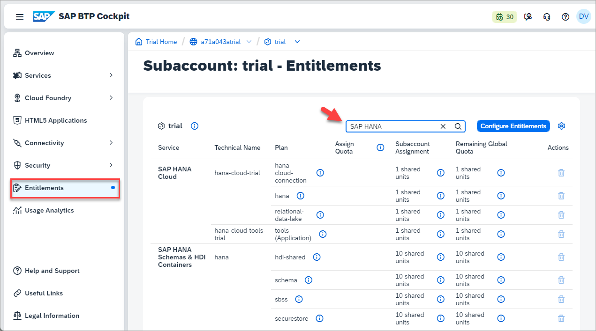

3.	Enter `HANA` in the search field and make sure you have entitlements for the services (and service plans) listed here:

    - SAP HANA Cloud: `tools (Application)`, `hana`, `hana-cloud-connection`, and `relational-data-lake`

    -	SAP HANA Schemas & HDI Containers: `hdi-shared`, `schema`, and `securestore`

    If you do not have any of the entitlements above, you need to add them to your account. To do that, click on **Configure Entitlements** on the top right-hand corner of the screen.

    

4.	Click on **Add Service Plans** in the same area of the screen.

    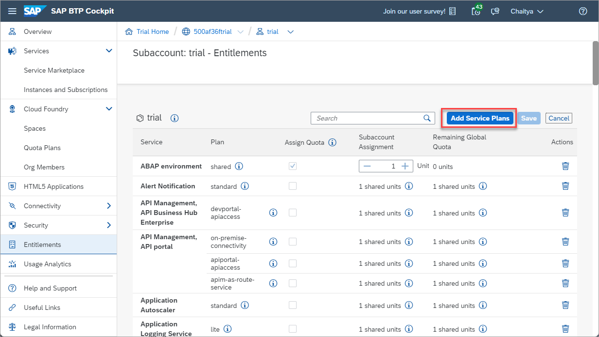

5.	In the pop-up that opens, type `HANA` in the search box to see all relevant entitlements. Notice that there is a tools (Application) plan as part of the new multi-environment tooling.

    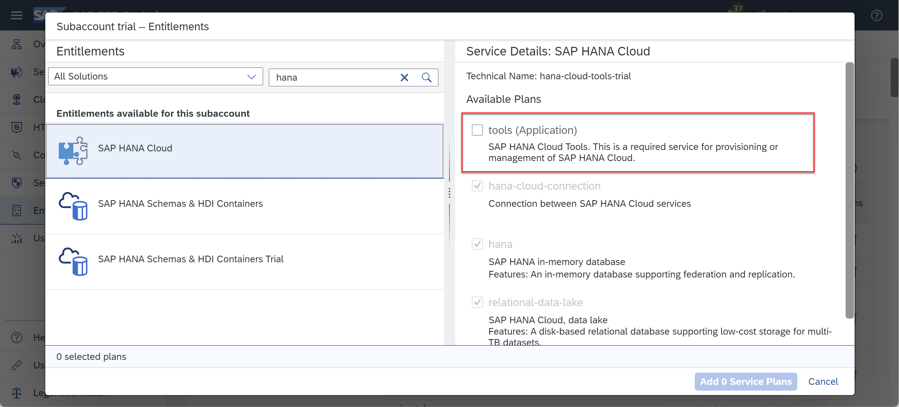

6.	Select the missing entitlements by checking the boxes.

    - SAP HANA Cloud: `tools (Application)`, `hana`, `hana-cloud-connection`, and `relational-data-lake`

        > Existing trial accounts must add the `tools (Application)` plan to subscribe to multi-environment SAP HANA Cloud tools. Those with new trial or free tier accounts will have this entitlement automatically enabled by default.

         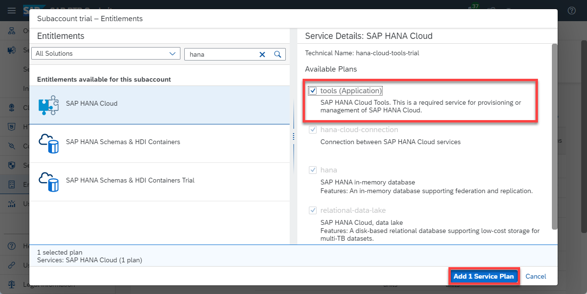

    -	SAP HANA Schemas & HDI Containers: `hdi-shared`, `schema`, and `securestore`

        You will see two options in the list related to Schemas and HDI containers. Please make sure to select the one that **does not** say **Trial**, as you can see on the screenshot below.

        > The reason not to select the **SAP HANA Schemas & HDI Containers Trial** entitlement is that it is made for a trial of *SAP HANA Service*, not SAP HANA Cloud.

        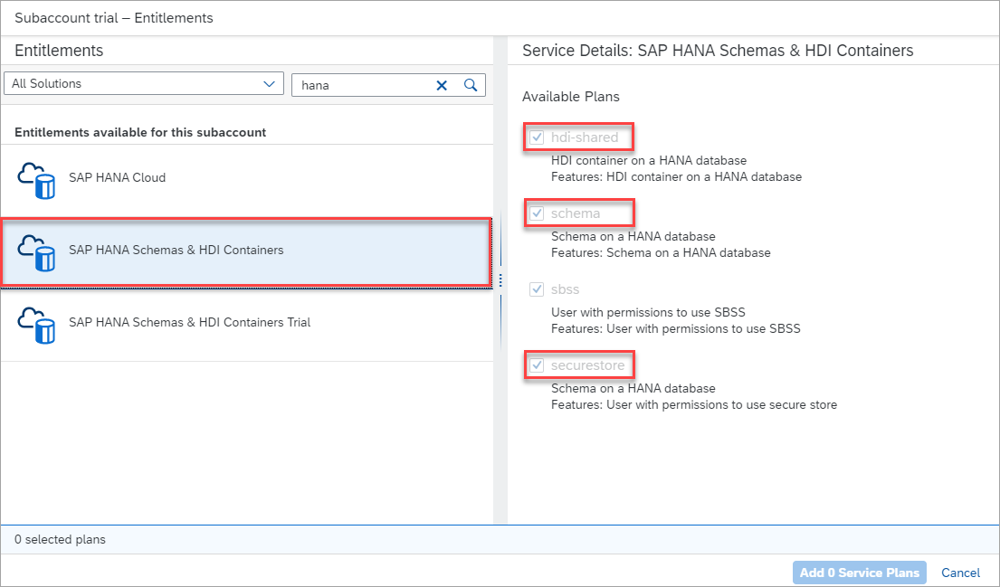

7.	Click on **Add X Service Plans**, where X is the amount of services you want to add.

    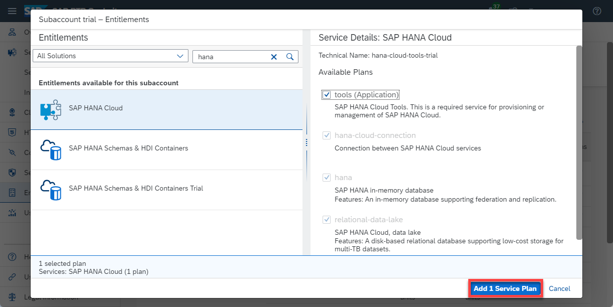

8.	On the top right-hand side of the screen, make sure to click on **Save**.

    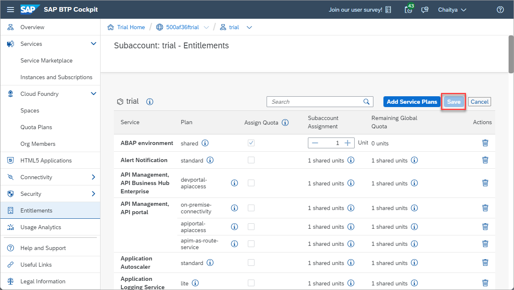

### Add a subscription to SAP HANA Cloud

>This step is necessary regardless of whether you have an existing or new SAP HANA trial account.

1. From SAP BTP Cockpit, click on **Instances and Subscriptions** on the left-hand side menu.

    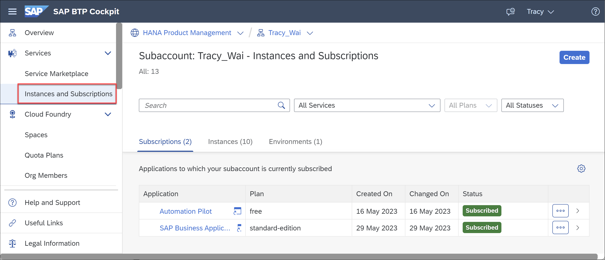

    Select **Create** in the top-right corner. Select **SAP HANA Cloud** under Service and **tools** under Plan.  

    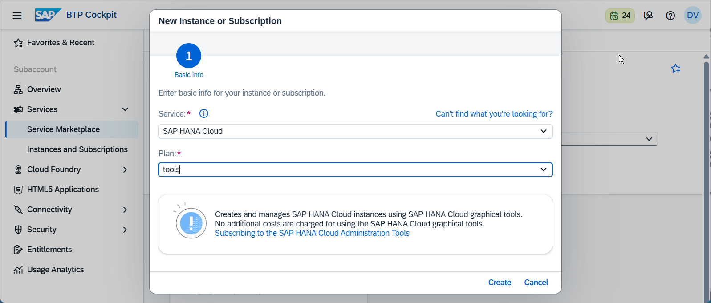

2. To ensure that your desired user has the necessary permissions to manage instances in HANA Cloud Central, navigate to **Security** > **Users** in the left hand side menu. Then click on your user.  

    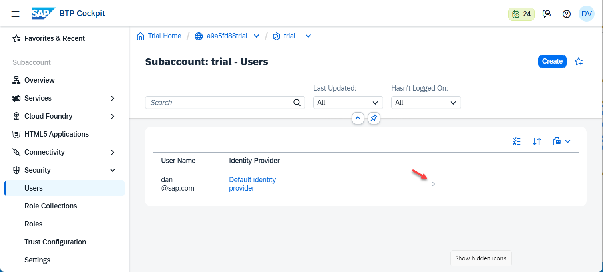

    Click on the **three dots** in the right-hand panel to find the **Assign Role Collection** button.

      

    Select **SAP HANA Cloud Administrator** then click Assign Role Collection.

    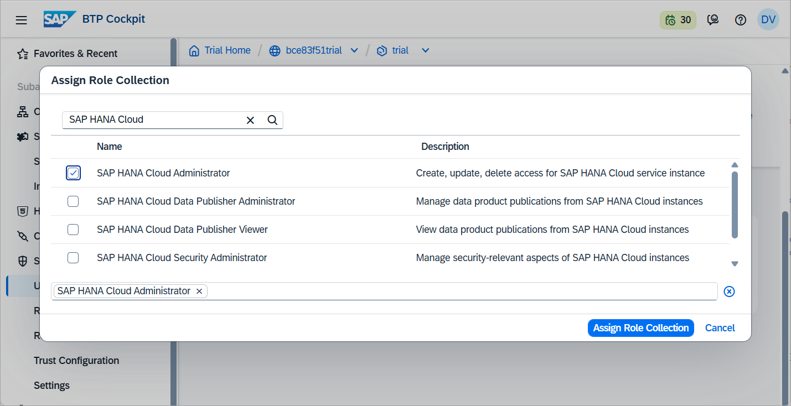

3. Navigate back to the **Instances and Subscriptions** page. Then click on **SAP HANA Cloud** under Applications to open SAP HANA Cloud Central.   

    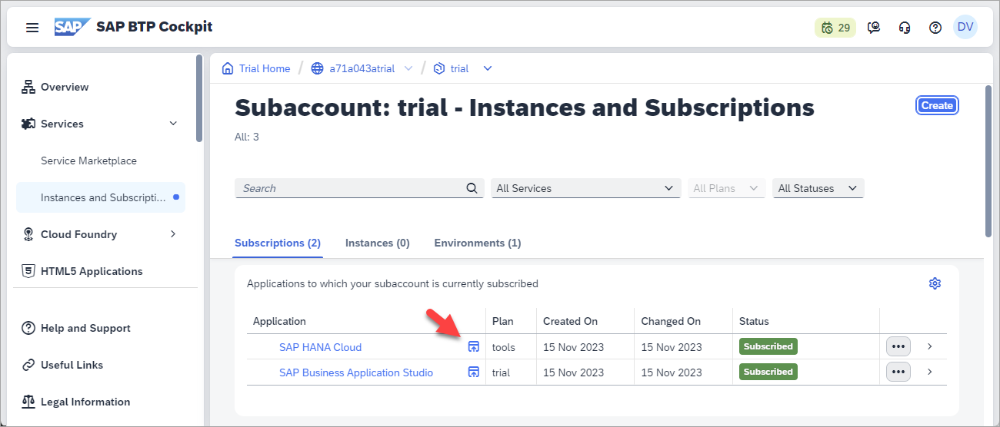

Congratulations, you have added the SAP HANA Cloud entitlements and subscribed to the multi-environment tools.  You now have the ability to [provision your trial instance of SAP HANA Cloud](hana-cloud-mission-trial-2) and start your journey.

### Get to know SAP BTP Cockpit
SAP BTP Cockpit is a web-based interface used to manage SAP cloud applications, such as SAP HANA Cloud. This is where you can manage your SAP Business Technology Platform account and users as well as create new instances whenever necessary.  

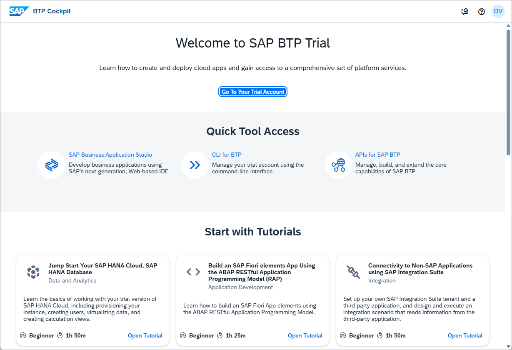

When you first access your trial account, you will see the [**Trial Home Page**](https://account.hanatrial.ondemand.com/trial/#/home/trial).

> In a production environment, you do not see the Trial Home Page.

This is where you can enter your account but also find helpful resources to get to know the SAP BTP Cockpit in detail:

-	Take the virtual tour once you start your trial for the first time.

    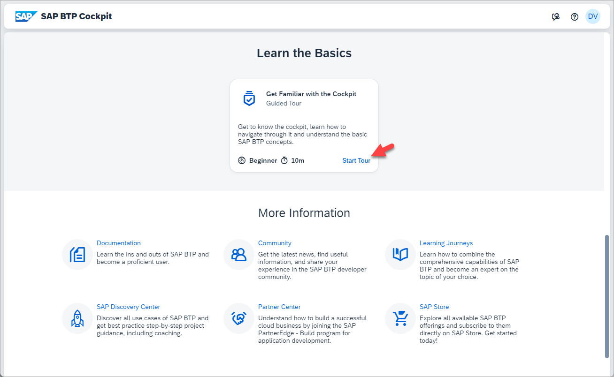

There is also some built-in functionality that can help you with using SAP BTP Cockpit and provide you with more information:

-	Use the **Help** button at the top right-hand corner of the screen once you are logged in. This will open a **Help Topics** pane where areas that you can get help custom to the page will appear, as well as embedded links to guided answers and documentation.

    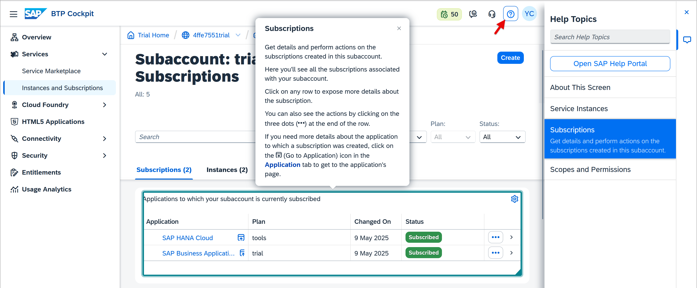

-   Use **Trial Period** to get more information about your SAP BTP Trial.

    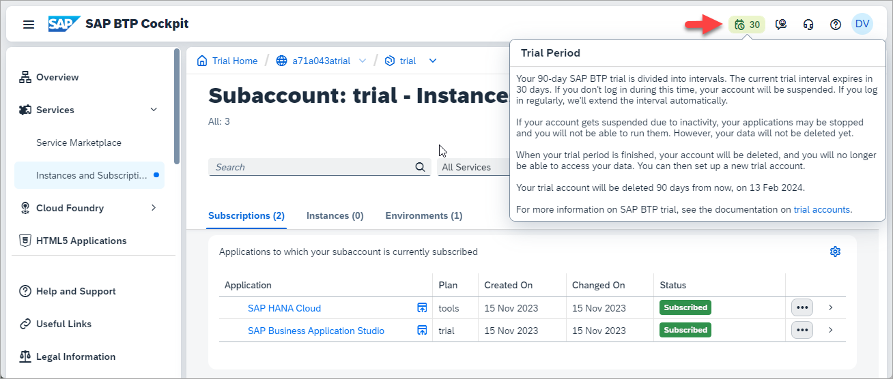

-	For further details, consult our documentation material [here](https://help.sap.com/viewer/product/BTP/LATEST/en-US).

### Understand Accounts, Directories, Subaccounts, and Spaces
Your account on SAP Business Technology Platform is called a **global account**. As the administrator, you will have full control of your global account and be able to create directories, subaccounts, and instances. Subaccounts are a smaller part of your global account. Directories are groups of subaccounts under the global account.

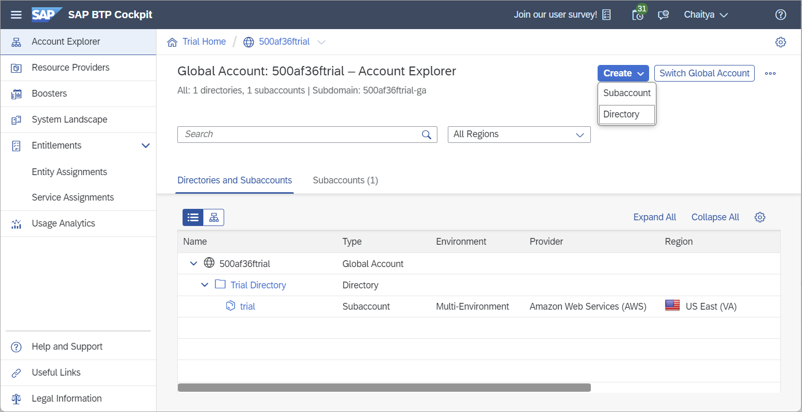

Below you can see a simplified diagram of a global account in SAP BTP cockpit with different ways in which directories and  subaccounts are used to organize SAP HANA database and data lake instances.  Of course, once you use SAP HANA Cloud, you will most likely have many more databases, subaccounts and perhaps even global accounts. These levels will then help you keep everything well-organized.

> **Global Account**: Your account on the SAP BTP Platform is called a global account. As the administrator, you will have full control of your global account and be able to create subaccounts, spaces, and instances.
>
> **Directories**: Directories group subaccounts into a folder and are useful to organize them. For example, if your subaccounts are geographical regions such as countries, your directories could be continents.
>
> **Subaccounts**: Subaccounts are a smaller part of your global account. For example, if your global account is your whole organization, your subaccounts could be either your geographical regions or specific departments, depending on what your internal structure requires.
>
> **Instances**: You can create and access instances of SAP HANA Cloud, SAP HANA database, and SAP HANA Cloud, data lake.
>
> **Spaces**: You can choose to optionally provision an SAP HANA Cloud instance into the Cloud Foundry runtime.  If you do, multiple Cloud Foundry spaces can be used to further organize instances.

*Well done!*

You have completed the first tutorial of this mission! Proceed to the [fourth tutorial](hana-cloud-mission-trial-3) in this mission to learn how to provision an instance of SAP HANA Cloud, SAP HANA database.

### Knowledge Check

---
