## Prerequisites
- [Sign up](https://www.sap.com/cmp/td/sap-hana-cloud-trial.html) for the SAP HANA Cloud trial.
- If you have a production environment of SAP HANA Cloud, SAP HANA database, you may also follow the steps described in this tutorial.

## Details
### You will learn
- How to provision an instance of SAP HANA Cloud, SAP HANA database.

---

[ACCORDION-BEGIN [Step 1: ](Introduction)]
> Throughout this tutorial, different instructions are available to you depending on whether you are using a trial account or production environment. Please make sure to select the one that applies to your situation to get the most of this tutorial by clicking on the option tabs under the step titles.

[OPTION BEGIN [Trial]]

A few notes to remember about trial accounts:

-	If you are using a trial account, you will only be able to create one instance with a predefined size (30GB of memory, 2vCPUs, and 120GB of storage). However, the process to create the instance is very similar to what you will in a production environment.

-	Trial instances will be **stopped every day** at midnight in the time zone of the server location you selected. Each time you start working with your trial instance, you need to restart it.

-	If you do not restart your instances within **60 days**, they will be **deleted**. Your trial account, however, will continue to exist and you can easily provision an instance again, if you wish to do so.

>The steps described in this tutorial can also be followed watching this video:
>
<iframe width="560" height="315" src="https://microlearning.opensap.com/embed/secure/iframe/entryId/1_mxvf5900/uiConfId/43091531" frameborder="0" allowfullscreen></iframe>
>
> ### About this video
>
> This video is meant as additional support material to complete the tutorial. However, we recommend that you only use it for visual guidance but primarily focus on the written steps in this tutorial.

[OPTION END]
[OPTION BEGIN [Production]]

The steps described in this tutorial can also be followed watching this video:

<iframe width="560" height="315" src="https://microlearning.opensap.com/embed/secure/iframe/entryId/1_dtnims89/uiConfId/43091531/pbc/213248013" frameborder="0" allowfullscreen></iframe>

[OPTION END]

[DONE]
[ACCORDION-END]

[ACCORDION-BEGIN [Step 2: ](Start the provisioning wizard)]

To create your first instance of SAP HANA Cloud, SAP HANA database, you need to follow these steps:

1.	In SAP BTP cockpit, enter your global account, subaccount and space.

2.	On the menu on the left-side of the screen, click on **SAP HANA Cloud**.

3.	Click on **Create**.

4.	Then, click on **SAP HANA database**.

    !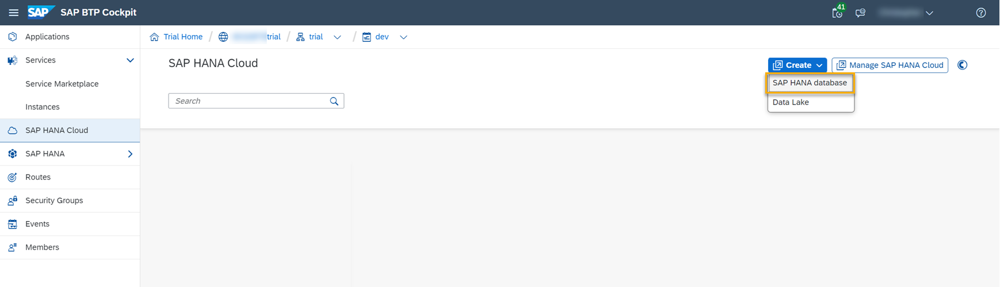

5.	A new tab will open in **SAP HANA Cloud Central**, and you will see the database provisioning wizard.

[DONE]
[ACCORDION-END]

[ACCORDION-BEGIN [Step 3: ](Enter location and basics about your instance)]

1.	You can see that your **Organization** and **Space** have been preselected. If you are part of multiple organizations or spaces, you can select others in the drop-down menu.

2.	In the section **Basics**, enter a name for your instance in the field **Instance Name**.

    > This field does not allow any spaces in the name.

3.	You can optionally insert a description of this instance on the **Description** field.

4.	Then insert a password in the **Administrator Password** field.

5.	Confirm it by typing it again on the **Confirm Administrator Password** field.

    > Once the instance is created, this super-user password cannot be recovered in a trial account. So, make sure to remember it.

6.	Now the **Step 2** button will appear on the left-hand side of the wizard. Click on it to continue.

    !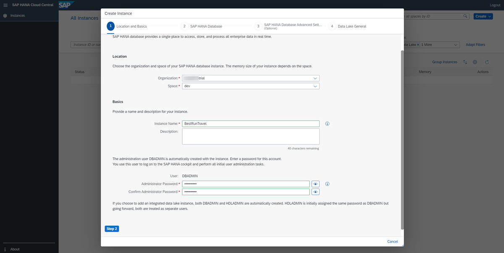

[DONE]
[ACCORDION-END]

[ACCORDION-BEGIN [Step 4: ](Check the parameters of your database)]

> Please select one of the tabs in this step depending on whether you use a trial account or production environment. Click on "Trial" or "Production" under this step title to select the option that applies to you.

In **Step 2** of the provisioning wizard, you can determine the parameters of your SAP HANA database in SAP HANA Cloud.

[OPTION BEGIN [Trial]]

This is where, in a production environment, you would be able to scale your instance up or down. Because you are using a trial instance, you can't change your configuration.

In a production environment you could also choose here if you want to create replicas of your instance that can help ensure maximum availability.

!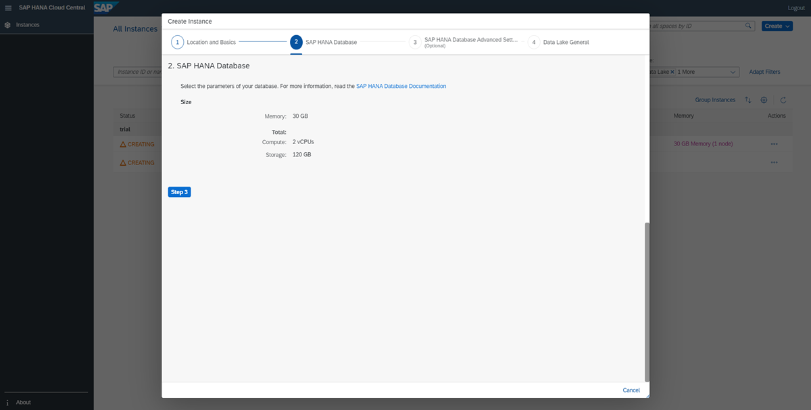

[OPTION END]
[OPTION BEGIN [Production]]

Select here how much **Memory** you wish to allocate to this instance.
The minimum amount of memory is 30 GB. The maximum amount of memory is 6 TB.
As you increase your memory requirements, the **Compute** and **Storage** values will be automatically adjusted as well.

!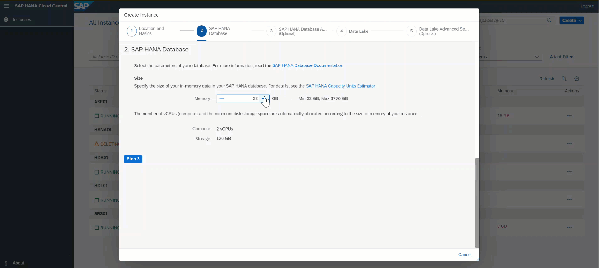

Additionally, you can select in this step if you want to create **replicas** of your instance to increase your system availability. These replicas are exact duplicates of your instance that will be managed in the background and automatically synchronized. In case of issues, you can take over a replica of your instance to ensure minimal interruption.

!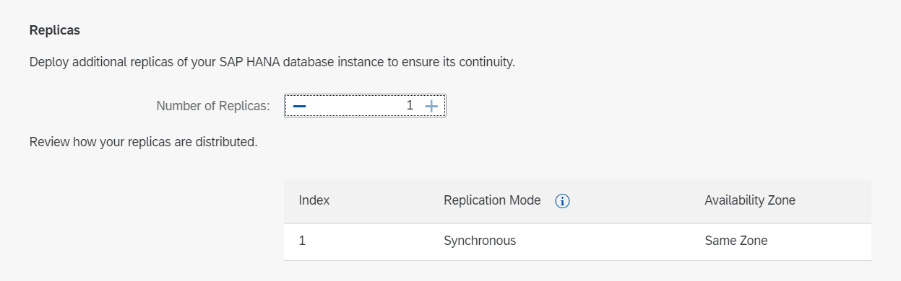

To read more about increasing system availability, you can take a look at this [technical documentation](https://help.sap.com/viewer/f9c5015e72e04fffa14d7d4f7267d897/LATEST/en-US/2c325f7b30ba43ac93ca514eba505a33.html).

[OPTION END]

Click on **Step 3** to continue.

[DONE]
[ACCORDION-END]

[ACCORDION-BEGIN [Step 5: ](Specify advanced settings)]

> Please select one of the tabs in this step depending on whether you use a trial account or production environment.

Now you can configure the **Advanced Settings** by managing the allowed connections for your SAP HANA Cloud, SAP HANA database instance. That means, choosing if you want to allow access to your database instance from outside of SAP BTP. You can either limit it to SAP BTP by denying all IP addresses, or allow specific applications to access it by inserting one or more specific IP addresses. Finally, you can allow all connections from all IP addresses.

> If you have added a managed data lake to your instance, changing the allowed IP addresses in SAP HANA database does not automatically sync the new settings to data lake. You have to edit data lake settings individually for them to match.

[OPTION BEGIN [Trial]]

1.	For this mission, choose to **allow all connections**, as we will need this configuration later.

2.	Here, you can also choose to enable the **SAP Cloud Connector**, which makes it easier to connect this SAP HANA database instance to an SAP HANA on-premise database.

3.	Next is where you would be able to choose to enable the **Script Server** and the **JSON Document Store** in a production environment. The trial instance standard size does not allow the `ScriptServer` to run.

     !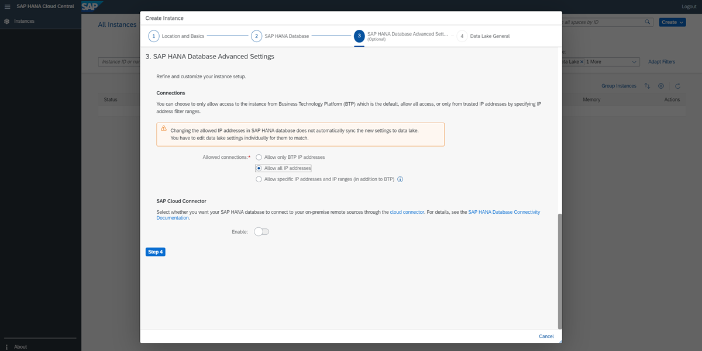

4.	Keep in mind that you can still change your configurations here at a later point, if you decide to do so.

5.	Click on **Step 4** in the bottom left corner to continue.

[OPTION END]
[OPTION BEGIN [Production]]

1.	Now you can manage the allowed connections for your SAP HANA database instance. That means choosing if you allow access to your SAP HANA database instance from outside of the SAP Business Technology Platform. You can either limit it to SAP Business Technology Platform by denying all IP addresses, or allow specific applications to access it by inserting one or more specific IP addresses. Finally, you can allow all connections from all IP addresses.

2.	Next, you can also choose to enable the SAP Cloud Connector, which makes it easier to connect this SAP HANA database instance to an SAP HANA on-premise database.

3.	Next is where you can choose to enable the Script Server and the JSON Document Store in a production environment. If your database does not have the required `vCPUs` for one or both of these services, you can click on the link on the error message, which will change your original setup and add more `vCPUs` automatically.

    !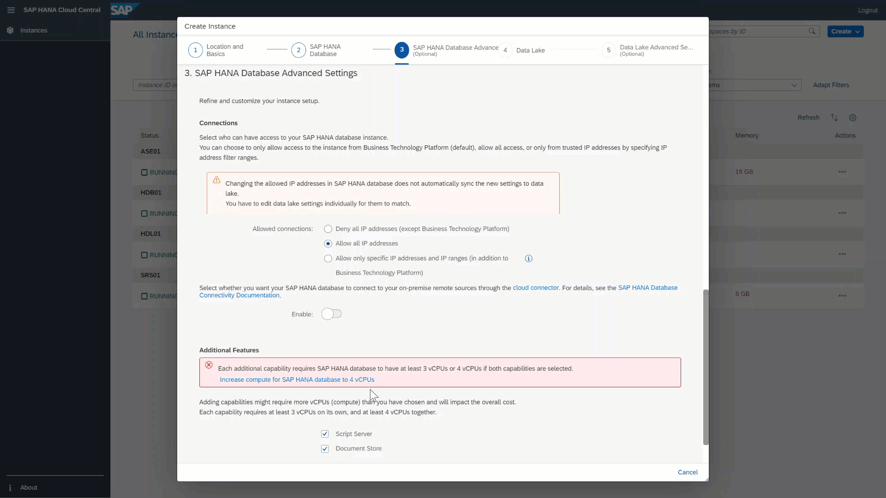

4.	Keep in mind that you can still change your configurations here at a later point, if you decide to do so.

5.	Click on **Step 4** in the bottom left corner to continue.

[OPTION END]

[DONE]
[ACCORDION-END]

[ACCORDION-BEGIN [Step 6: ](Enable the SAP HANA Cloud, data lake (optional))]

In the last step of the provisioning wizard, you have the option of also provisioning a managed data lake. If you enable the data lake in this step, this data lake will have maximum compatibility with SAP HANA and a remote connection between your SAP HANA database and the data lake will be created automatically during provisioning.

> For the purposes of this mission, you do not need to enable a data lake and can skip this step by clicking on **Create Instance**.

[OPTION BEGIN [Don't add a data lake]]

!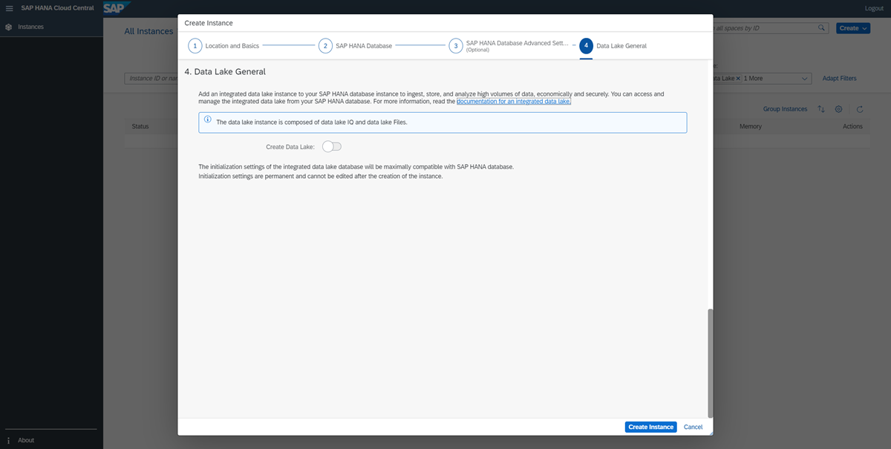

[OPTION END]
[OPTION BEGIN [Add a data lake]]

1.	If you click on **Create data lake**, a managed SAP HANA Cloud, data lake will be provisioned alongside your SAP HANA database in SAP HANA Cloud.

2.	Once you select this option, more menu options will appear in the wizard as well as two additional steps.

    !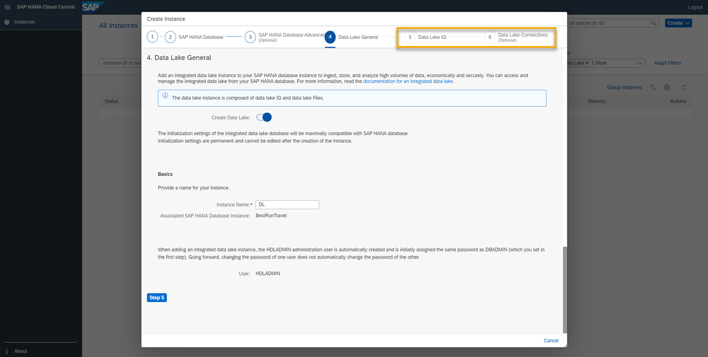

3.	First, give your data lake instance a name.

    > When you add a managed data lake, the HDLADMIN user is automatically created and is given the same password as DBADMIN, which you set in the first step. If later you decide to change the password of one user, the password of the other user will **not** be automatically changed.

4.	Click on **Step 5** to continue.

5.	In a production environment, this is where you are able to adjust how many **coordinators** and **workers** you want for your data lake, as well the amount of **storage** you wish to allocate to this instance. If you are using a trial account, you can't change these settings. Please remember that you can enable or disable the data lake later as well if you prefer.

    !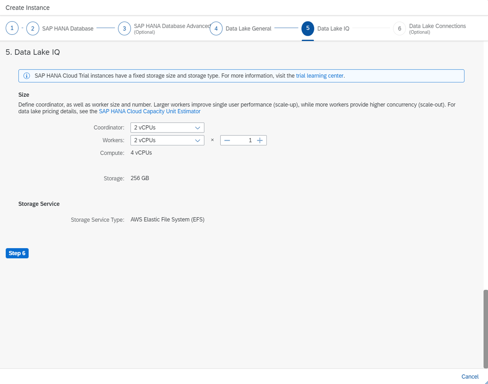

6.	Click on **Step 6** to continue.

7.	Now you can set up the **Advanced Settings** for the data lake instance. Here you can manage the allowed connections and chose - just like for your SAP HANA database in SAP HANA Cloud - if you want to allow only BTP IP addresses, all IP addresses or specific IP addresses. The last option also gives you the option to **Copy IP addresses from the SAP HANA database**.

8.	Lastly, click on **Create Instance** to finish the provisioning process.

    !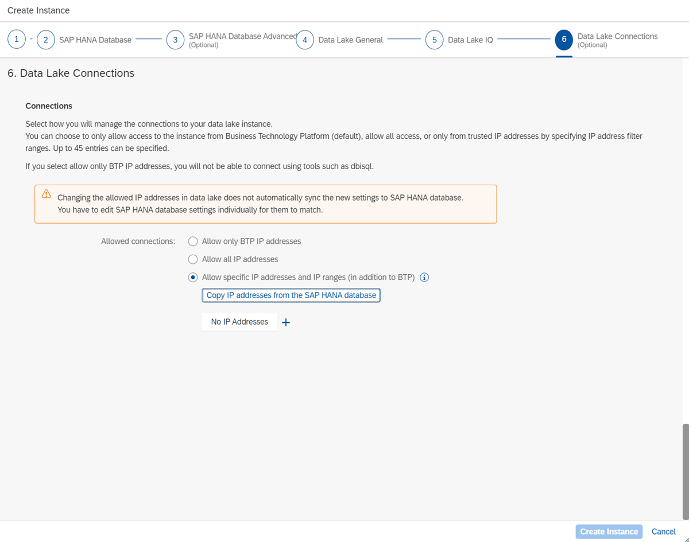

[OPTION END]

You are done! Your first SAP HANA Cloud, SAP HANA database and data lake instances will be created, and you can monitor their status to see when they will be ready to be used. This process usually takes a few minutes.

!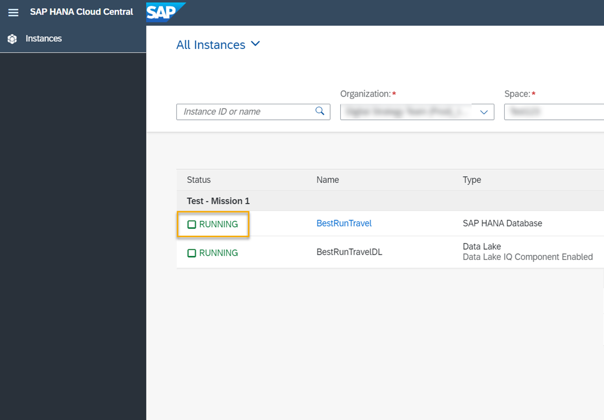

[DONE]
[ACCORDION-END]

[ACCORDION-BEGIN [Step 7: ](Start and stop your instance)]

The final step is learning how to stop and start your instance.

[OPTION BEGIN [Trial]]

Note that during your trial, your instance will be automatically stopped overnight, according to the server region time zone. That means you need to restart your instance before you start working with your trial every day.

[OPTION END]
[OPTION BEGIN [Production]]

[OPTION END]

1.	To stop an instance, just click on **Stop** in the three dots menu next to the SAP HANA Cloud instance line in SAP HANA Cloud Central. It takes a few minutes.

    !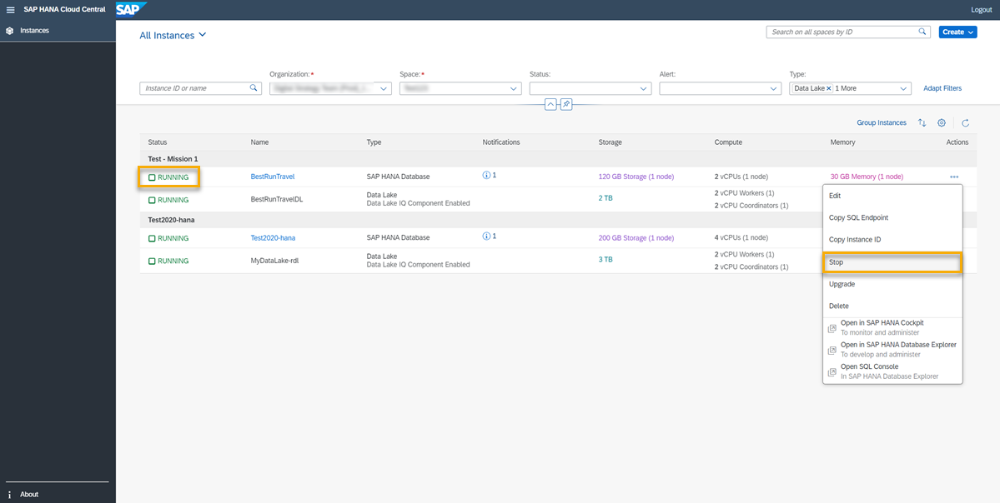

2.	Once your instance is stopped, the status will be updated. The option in the menu will change to **Start**.

3.	To restart the instance, simply click on the **Start** button. It takes a few minutes, but you can see the status of your instance to know more.

4.	Once it's ready to be used, it will show a green **Created** status on SAP BTP cockpit, and a **Running** status on the SAP HANA Cloud Central.

Now you know how to provision an instance of SAP HANA Cloud using SAP BTP cockpit and SAP HANA Cloud Central. In the next tutorial, learn about the tools that help to manage and access your database instance.

[DONE]
[ACCORDION-END]

[ACCORDION-BEGIN [Step 8: ](Test yourself)]

[VALIDATE_1]
[ACCORDION-END]

---
