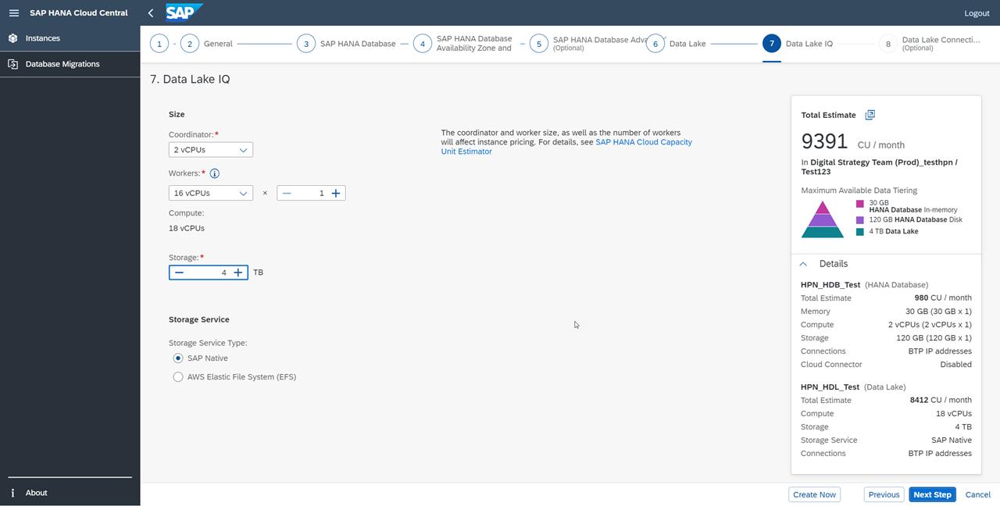

# Provision an Instance of SAP HANA Cloud, SAP HANA Database
<!-- description --> Learn how to provision an instance of SAP HANA Cloud, SAP HANA database.

## Prerequisites
- [Sign up](https://www.sap.com/cmp/td/sap-hana-cloud-trial.html) for the SAP HANA Cloud trial.
- If you have a free tier or production environment of SAP HANA Cloud, SAP HANA database, you may also follow the steps described in this tutorial.

## You will learn
- How to provision an instance of SAP HANA Cloud, SAP HANA database.

## Intro
A few notes to remember about free tier model and trial accounts:

-	If you are using a free tier model or trial account, you will only be able to create one instance with a predefined size (30GB of memory, 2vCPUs, and 120GB of storage). However, the process to create the instance is very similar to what you will in a production environment.

-	Free tier model and trial instances will be **stopped every day** around midnight in the time zone of the server location you selected. Each time you start working with your free tier model or trial instance, you need to restart it.

-	If you do not restart your instances within **60 days**, they will be **deleted**. Your BTP account, however, will continue to exist and you can easily provision an instance again, if you wish to do so.

---

### Start the Provisioning Wizard

To create your first instance of SAP HANA Cloud, SAP HANA database, you need to follow these steps:

1.	In SAP BTP cockpit, enter your global account, subaccount, and space.
2.	On the menu on left-side of the screen, click on **SAP HANA Cloud**.
3.	Click on **Create**.
4.	Then, click on **SAP HANA database**. </li>

    <!-- border -->

5.	A new tab will open in **SAP HANA Cloud Central**, and you will see the SAP HANA database provisioning wizard.

6.	Here you must choose the **Type** of instance again to create **SAP HANA Cloud, SAP HANA Database** instance.

    <!-- border -->

7.	Now click on **Next Step** to continue.

### Choose your instance name and password

1.	Here you can see that your **Organization** and **Space** have been preselected. If you are part of multiple organizations or spaces, you can select others in the drop-down menu.

2.	If you have multiple types of service plans enabled in your SAP HANA Cloud entitlement, a License section will appear just before the Basics section.  To use the free tier model, click on the Free Tier option so that it is highlighted as shown below.  Also note – if you have enabled only one type of service plan in your SAP HANA Cloud entitlement (e.g. free tier only), the License section does not appear and that service plan type will be used automatically.

    

3.	In the **Basics** section, enter a name for your instance in the field **Instance Name**.

    > This field does not allow any spaces in the name. Keep in mind that you will not be able to change the name after the instance has been created.

4.	You can optionally insert a description of this instance in the **Description** field.

5.	Then insert a password in the **Administrator Password** field.

6.	Confirm it by typing it again on the **Confirm Administrator Password** field.

    > This password is the admin password for this instance, so make sure to use a strong password. You will be able to recover it only by opening a support ticket, so make sure you keep it safe as well.
    >
    > For free tier model or trial users: Once the instance is created, this super-user password cannot be recovered in a trial account.

7.	Now click on **Next Step** to continue.  

    <!-- border -->

### Set up the size of your database

> There are different instructions available to you depending on whether you are using a free tier model or trial account versus a production environment. Please make sure to select the one that applies to your situation to get the most out of this tutorial.

In this step of the provisioning wizard, you can set up the size of your SAP HANA database in SAP HANA Cloud.

[OPTION BEGIN [Production]]

This is where, in a production environment, you would be able to set the initial size of your instance.

1.	Here, you can select how much **Memory** you wish to allocate to this instance.

    <!-- border -->

    >The size of your in-memory data in your SAP HANA database:
    >
    >On Microsoft Azure, you can select from 32 GB to 5600 GB of memory. In some regions, only 3776 GB may be available.
    >
    >On Amazon Web Services, you can select from 30 GB to 5970 GB of memory. In some regions, only 3600 GB may be available.
    >
    > Follow this [link](https://help.sap.com/viewer/9ae9104a46f74a6583ce5182e7fb20cb/LATEST/en-US/f7febb16072b41f7ac90abf5ea1d4b86.html) to learn more about the memory allocation.

2.	As you increase your memory requirements, the **Compute** and **Storage** values will be automatically adjusted as well.

    <!-- border -->

3.	Click on **Next Step** to continue.

[OPTION END]

[OPTION BEGIN [Free Tier/Trial]]

In a free tier model or trial environment the **Memory** allocation is predefined to the instance, which is as follows: 30GB for memory, 120GB for storage and 2vCPUs for computation.

Click on **Next Step** to continue.

[OPTION END]

### Specify database availability zone and replicas

> There are different instructions are available to you depending on whether you are using a free tier model or trial account versus a production environment. Please make sure to select the one that applies to your situation to get the most of this tutorial.

Here, you can select in this step if you want to create **replicas** of your instance to increase your system availability. These replicas are exact duplicates of your instance that will be managed in the background and automatically synchronized. In case of issues, you can take over a replica of your instance to ensure minimal interruption.

[OPTION BEGIN [Production]]

1.	There are two types of availability zone list: **SAP HANA Cloud** and **Microsoft Azure**.

2.	Once you choose one of them, the list of availability zones for your list will become available under **Availability Zone**.

    <!-- border -->

    To read more about increasing system availability, you can check this [technical documentation](https://help.sap.com/viewer/f9c5015e72e04fffa14d7d4f7267d897/LATEST/en-US/2c325f7b30ba43ac93ca514eba505a33.html).

3.	Next, select the number of replicas you wish to have for this instance under **Number of Replicas:**.

4.	Click on **Next Step** to continue.

> One thing to keep in mind that, you cannot change the **availability zone of the instance** after it has been created. To update replicas, you need to delete and re-create them.

[OPTION END]
[OPTION BEGIN [Free Tier/Trial]]

In a free tier model or trial environment, availability zone and replicas are not supported.

To read more about increasing system availability, you can check this [technical documentation](https://help.sap.com/viewer/f9c5015e72e04fffa14d7d4f7267d897/LATEST/en-US/2c325f7b30ba43ac93ca514eba505a33.html).

Click on **Next Step** to continue.

> One thing to keep in mind that, you cannot change the availability zone of the instance after it has been created. To update replicas, you need to delete and re-create them.

[OPTION END]

### Check the advanced settings

> There are different instructions are available to you depending on whether you are using a free tier model or trial account versus a production environment. Please make sure to select the one that applies to your situation to get the most of this tutorial.

[OPTION BEGIN [Production]]

1.	Under **Additional Features** you can choose to enable the **Script Server** and the **JSON Document Store**. If your database does not have the required `vCPUs` for one or both services, you can click on the link on the error message, which will change your original setup and add more `vCPUs` automatically.

    <!-- border -->

2.	Now, you can manage the allowed connections for your SAP HANA database instance, i.e., you can choose to allow access to your SAP HANA database instance from outside of the SAP Business Technology Platform. You can either limit it to SAP Business Technology Platform by denying all IP addresses, or allow specific applications to access it by inserting one or more specific IP addresses. Finally, you can also allow all connections from all IP addresses.

3.	Next, you can also choose to enable the **SAP Cloud Connector**, which makes it easier to connect this SAP HANA database instance to an SAP HANA on-premises database.

4.	If you want to enable **SAP Cloud Connector**, you have another **Allowed connections** section to configure.

    <!-- border -->

    > To get familiar with the **Cloud Connector**, you can check the [technical documentation](https://help.sap.com/viewer/cca91383641e40ffbe03bdc78f00f681/LATEST/en-US/e6c7616abb5710148cfcf3e75d96d596.html).
    >
    >Select whether you want your SAP HANA database to connect to your on-premises remote sources through the cloud connector. For details, see the [SAP HANA Database Connectivity Documentation](https://help.sap.com/viewer/477aa413a36c4a95878460696fcc8896/LATEST/en-US/7791e61775f949d9989eafc443158cdb.html).
    >
    > Keep in mind that you can still change your configurations here at a later point, if you decide to do so.  

5.	Click on **Next Step** in the bottom left corner to continue.

[OPTION END]
[OPTION BEGIN [Free Tier/Trial]]

Now you can configure the **Advanced Settings** by managing the allowed connections for your SAP HANA Cloud, SAP HANA database instance.

1.	Now, you can manage the allowed connections for your SAP HANA database instance, i.e., you can choose to allow access to your SAP HANA database instance from outside of the SAP Business Technology Platform. You can either limit it to SAP Business Technology Platform by denying all IP addresses, or allow specific applications to access it by inserting one or more specific IP addresses. Finally, you can allow all connections from all IP addresses.

2.	Next, you can also choose to enable the SAP Cloud Connector, which makes it easier to connect this SAP HANA database instance to an SAP HANA on-premises database. You can also set the connection preferences for your cloud connector under **Allowed connections**.

    > Keep in mind that you can still change your configurations here at a later point, if you decide to do so.  

3.	Click on **Next Step** in the bottom left corner to continue.

[OPTION END]

### Enable the SAP HANA Cloud, data lake (optional)

In the last step of the provisioning wizard, you have the option of also provisioning a managed data lake. If you enable the data lake in this step, this data lake will have maximum compatibility with SAP HANA and a remote connection between your SAP HANA database and the data lake will be created automatically during provisioning.

> If you do not wish to enable a data lake and can skip this step by clicking on **Review and Create**.

<!-- border -->

[OPTION BEGIN [Production]]
1.	If you click on **Create data lake**, a managed SAP HANA Cloud, data lake will be provisioned alongside your SAP HANA database in SAP HANA Cloud.

    <!-- border -->

2.	Next, give your data lake instance a name under **Instance Name**.

    > When you add a managed data lake, the HDLADMIN user is automatically created and is given the same password as DBADMIN, which you set in the first step. If later you decide to change the password of one user, the password of the other user will **not** be automatically changed.   

3.	Click on **Next Step** to continue.

4.	This is where you can adjust how many **coordinators** and **workers** you want for your data lake, as well the amount of **storage** you wish to allocate to this instance.

    <!-- border -->

    > The coordinator and worker size, as well as the number of workers will affect instance pricing. For details, see SAP HANA Cloud Capacity Unit Estimator.

5.	Click on **Next Step** to continue.

6.	Now you can set up the **Advanced Settings** for the data lake. Here you can manage the allowed connections and choose - just like you did for your SAP HANA database in SAP HANA Cloud - if you want to allow only BTP IP addresses, all IP addresses or specific IP addresses. The last option also gives you the option to **Copy IP addresses from the SAP HANA database** choosing again, who can have access to your data lake instance.

7.	Lastly, click on **Review and Create** to finish the provisioning process.

    <!-- border -->

[OPTION END]
[OPTION BEGIN [Free Tier/Trial]]

1.  Once you select **Create Data Lake** option, two more menu options will appear in the wizard with additional steps.

2. Next, give your data lake instance a name under **Instance Name**.

    >When you add a managed data lake, the HDLADMIN user is automatically created and is given the same password as DBADMIN, which you set in the first step. If later you decide to change the password of one user, the password of the other user will **not** be automatically changed.   

3.	In production environment this is where you can adjust how many **coordinators** and **workers** you want for your data lake, as well the amount of **storage** you wish to allocate to this instance. But in a free tier model or trial account, you can't change these as they are predefined settings.

    > Please remember that you can enable or disable the data lake later as well if you prefer.
    >
    > The coordinator and worker size, as well as the number of workers will affect instance pricing. For details, see [SAP HANA Cloud Capacity Unit Estimator](https://hcsizingestimator.cfapps.eu10.hana.ondemand.com/).

4.	Click on **Next Step** to continue.

5.	Now you can set up the **Advanced Settings** for the data lake instance. Here you can manage the allowed connections and chose - just like for your SAP HANA database in SAP HANA Cloud - if you want to allow only BTP IP addresses, all IP addresses or specific IP addresses. The last option also gives you the option to **Copy IP addresses from the SAP HANA database** choosing again, who can have access to your data lake instance.

6.	Lastly, click on **Review and Create** to finish the provisioning process.

[OPTION END]

You are done! Your first SAP HANA Cloud, SAP HANA database and data lake instances will be created, and you can monitor their status to see when they will be ready to be used. This process usually takes a few minutes.

### Start and stop your instance

The final step is learning how to stop and start your instance.

> In a free tier or trial account, your instance will be automatically stopped overnight, according to the server region time zone. That means you need to restart your instance before you start working with your free tier model or trial every day.

1.	To stop an instance, just click on **Stop** in the three dots menu next to the SAP HANA Cloud instance line in SAP HANA Cloud Central. Once your instance is stopped, the status will be updated to **Start**.

2.	To restart the instance, simply click on the **Start** button. Once it's ready to be used, it will show a green **Created** status on SAP BTP cockpit, and a **Running** status on the SAP HANA Cloud Central.

>Note that all these processes take a few minutes to be completed and to show an updated status.

Now you know how to provision an instance of SAP HANA Cloud using SAP BTP cockpit and SAP HANA Cloud Central. In the next tutorial, learn about the tools that help to manage and access your database instance.

### (Free Tier Only): Upgrade to Paid Tier

When you are ready to upgrade your free tier instance to Paid Tier, you can also choose the three dots menu (under Actions) next to the SAP HANA Cloud instance line in SAP HANA Cloud Central.  From here, click on **Upgrade to Paid Tier**.  Note that paid tier plans must be enabled in your SAP HANA Cloud entitlement in order for the **Upgrade to Paid Tier** menu item to appear.

A dialog box will appear indicating that there will be costs associated with the Paid Tier instance – an estimate is also included.  Click on **Upgrade to Paid Tier** to complete the process.

>Note: For SAP partners who have SAP HANA Cloud "test and development" service plans enabled in their entitlements (e.g. hana-td, relational-data-lake-td), an **Upgrade to Test and Development** option is also available for free tier instances. Choose this option if you wish to upgrade your **free tier** instance to a **test and development** production instance.  

Now you know how to provision an instance of SAP HANA Cloud using SAP BTP cockpit and SAP HANA Cloud Central. In the next tutorial, learn about the tools that help to manage and access your database instance  

### Test yourself

---
