# Provision an Instance of SAP HANA Cloud, SAP HANA Database

<!-- description --> Learn how to provision an instance of SAP HANA Cloud, SAP HANA database.

## Prerequisites

- You have access to a SAP BTP trial account or a productive account that has SAP HANA Cloud entitlements

## You will learn

- How the provisioning wizard in SAP HANA Cloud can be used to configure the settings and features of an SAP HANA Cloud database instance.

## Intro

A few notes to remember about free tier instances:

- If you are using a free tier instance, you will only be able to create one instance with a predefined size (16 GB of memory, 1 vCPU, and 80 GB of storage). However, the process to create the instance is very similar to production environments, the difference being that in a production environment you can further customize your instance. For example, you can change advanced settings for your SAP HANA Cloud instance.  

- Free tier instances will be **stopped on a nightly basis**. Each time you start working with your free tier instance, you need to restart it.

- If you do not restart your free tier instance within **30 days**, it will be **deleted**.  Your BTP account, however, will continue to exist and you can easily provision an instance again, if you wish to do so.

- The instance summary card for a free tier instance (below left) does not a consumption unit estimate for the month as it is free.  

-If you are instead using a productive instance (below right), a monthly consumption unit estimate is shown.

    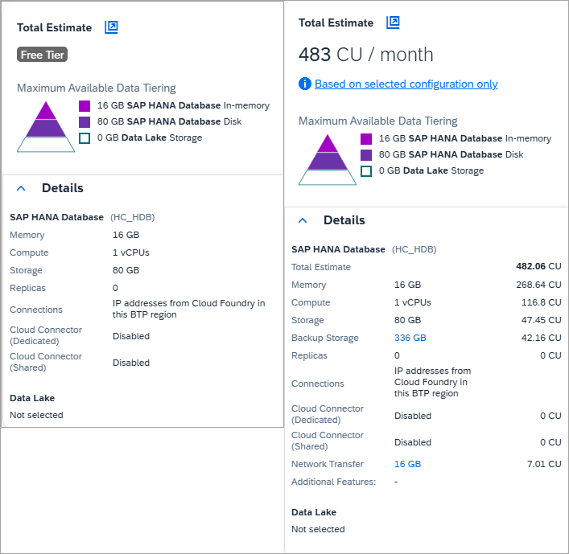

---

### Start the Provisioning Wizard

> There are different instructions available to you depending on whether you are using a free tier instance versus a productive instance. Please make sure to select the one that applies to your situation to get the most out of this tutorial.

To create your first instance of SAP HANA Cloud, SAP HANA database, you need to follow these steps:

[OPTION BEGIN [Free Tier]]

1. In SAP BTP cockpit, open SAP HANA Cloud Central by clicking on the subscription to SAP HANA Cloud in the **Subscriptions** tab. With a Free Tier Service Plan, you have the option to configure your instance manually or clone a SAP HANA Database. Select **Configure manually** as shown below.

    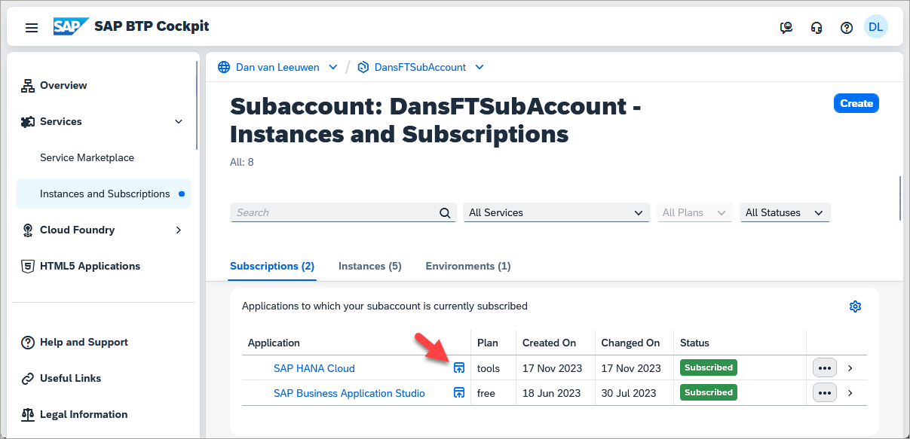

2. On the top-right corner of the screen, click on **Create Instance**.

    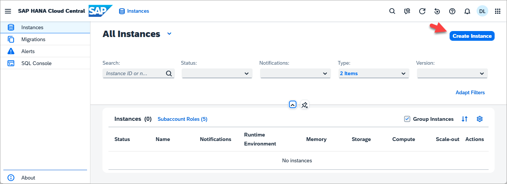

3. Here you must choose the **Type** of instance to create. Select **SAP HANA Database**.

    Note that if you have enabled only one type of service plan in your SAP HANA Cloud entitlement (e.g. free tier only), the License section does not appear, and that service plan type will be used automatically.

    > If you would like to learn more about **SAP HANA Cloud, Data Lake**, and [Get Started with a Standalone SAP HANA Cloud, Data Lake](mission.hana-cloud-data-lake-get-started), navigate to the linked mission for the basics.

    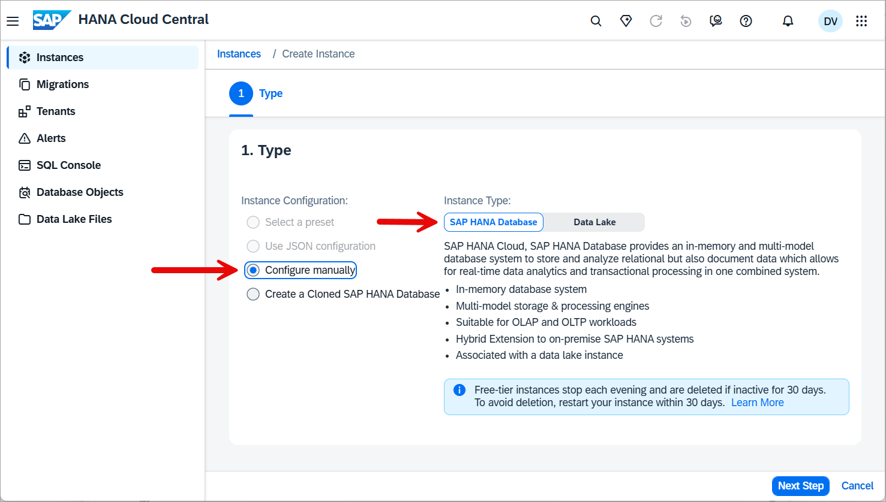

4. Click on **Next Step** to continue.

[OPTION END]

[OPTION BEGIN [Production]]

1. In SAP BTP cockpit, open SAP HANA Cloud Central by clicking on the subscription to SAP HANA Cloud in the **Subscriptions** tab.

    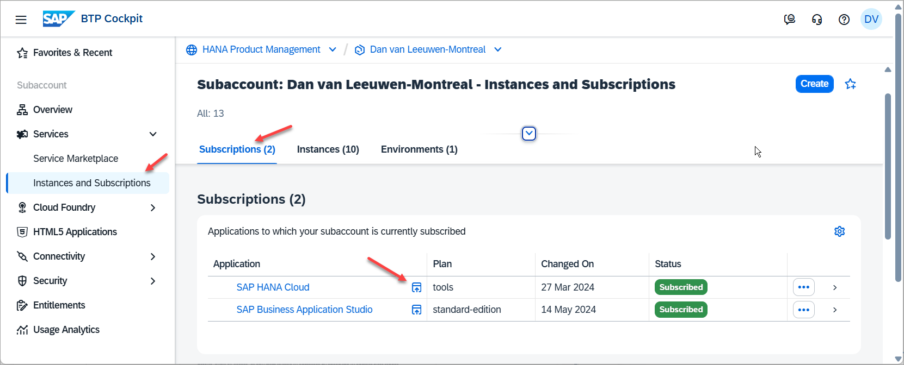

2. On the top-right corner of the screen, click on **Create Instance**.

    

3. Here you must choose the **Type** of instance to create.

    A **License** section will appear. To use the free tier model, click on **Free Tier** so that it is highlighted as shown below. Select **SAP HANA Database**. You have multiple options to configure your instance. Select **Configure manually**.

    Note that if you have enabled only one type of service plan in your SAP HANA Cloud entitlement (e.g. free tier only), the License section does not appear and that service plan type will be used automatically.

    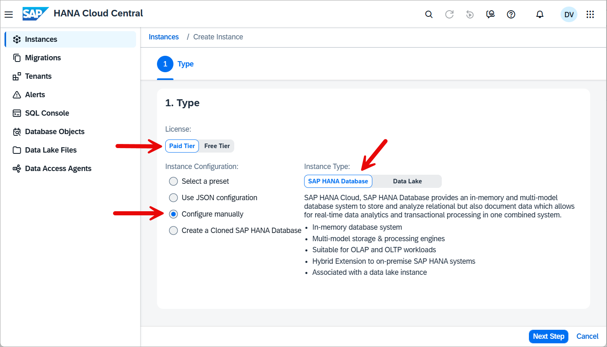

4. Click on **Next Step** to continue.

[OPTION END]

### Choose your instance name and password

[OPTION BEGIN [Free Tier]]

1. In the **Basics** section, enter a name for your instance in the field **Instance Name**, such as `HC_HDB`.

    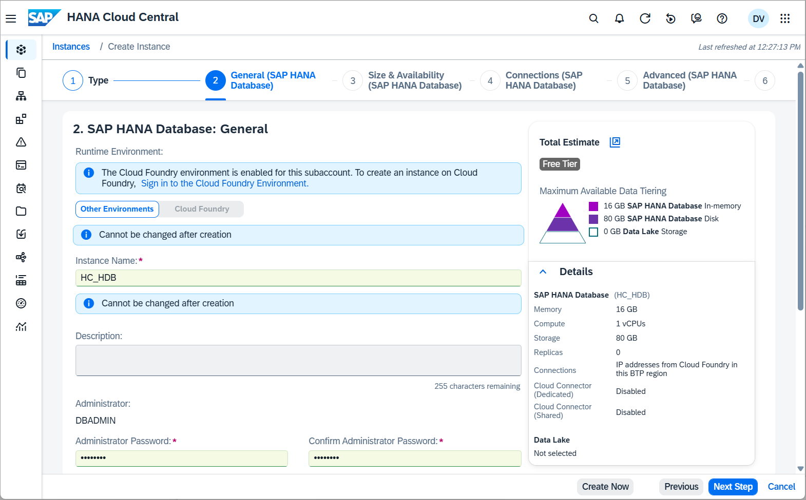

    > This field does not allow any spaces in the name. Keep in mind that you will not be able to change the name after the instance has been created.

[OPTION END]

[OPTION BEGIN [Production]]
1. In the **Basics** section, enter a name for your instance in the field **Instance Name**, such as `HC_HDB`.

    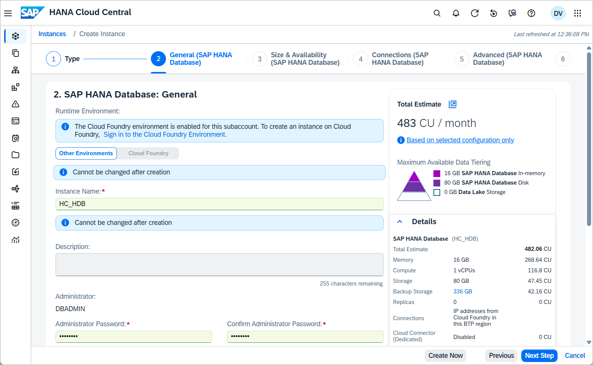

    > This field does not allow any spaces in the name. Keep in mind that you will not be able to change the name after the instance has been created.

[OPTION END]

2. Insert a password in the **Administrator Password** field.

3. Confirm it by typing it again in the **Confirm Administrator Password** field.

    > This password is the admin password for this instance, so make sure to use a strong password.  If needed, the password can be reset via the actions menu [Reset DBADMIN Password](https://help.sap.com/docs/HANA_CLOUD/9ae9104a46f74a6583ce5182e7fb20cb/649092e9d9be41c59930179ce4f3d59e.html?locale=en-US) in SAP HANA Cloud Central if your user has the role SAP HANA Cloud Security Administrator.

4. You may also choose the runtime environment.  Further details can be found at [What Runtime Environment is my SAP HANA Cloud Instance Using?](https://help.sap.com/docs/hana-cloud/sap-hana-cloud-administration-guide/runtime-environments-for-sap-hana-cloud).  For this mission, the runtime environment can be left as the default.

5. Now click on **Next Step** to continue.  

### Set up the size and availability of your database

In this step of the provisioning wizard, you can set up the size, availability zone, and replicas.

[OPTION BEGIN [Free Tier]]

For a free tier instance, the option to specify a performance class which can change the ration between compute and memory is not available.

As well, the size is predefined to 16 GB for memory, 80 GB for storage and 1 vCPU for computation.

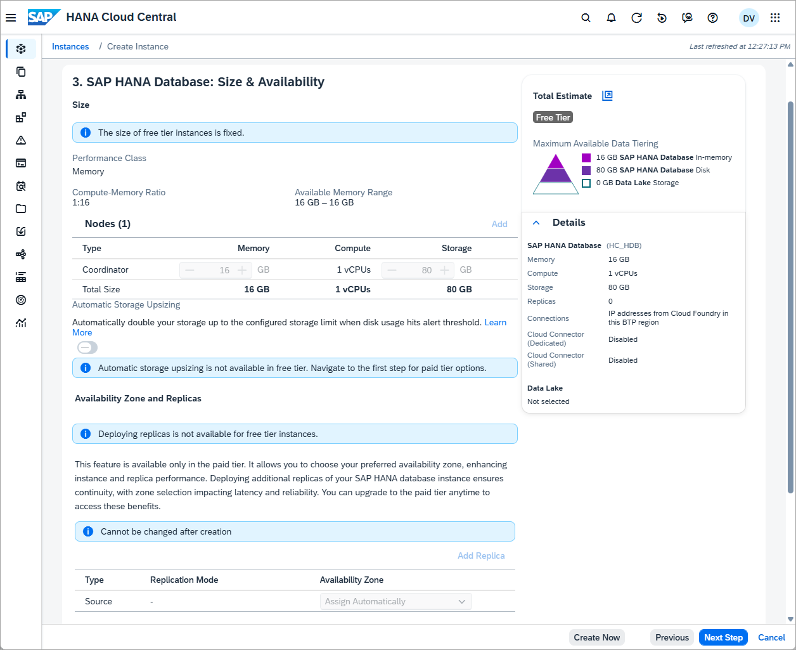

Finally, the ability to set the availability zone and optional replicas are not available in the free tier service.

Click on **Next Step** to continue.

[OPTION END]

[OPTION BEGIN [Production]]

In a production environment, you are able to select a performance class which affects the ratio between compute and memory.  As well you can choose the initial size of your instance.

1. Here, you can select how much **Memory** you wish to allocate to this instance.

    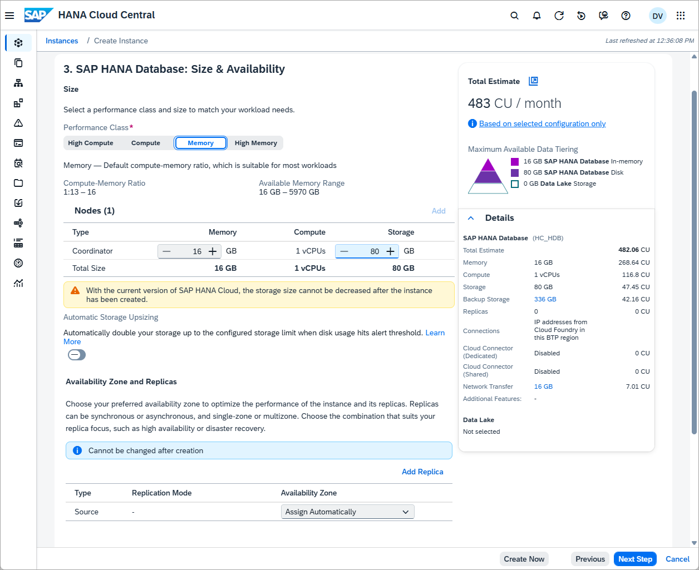

    As you increase your memory requirements, the **Compute** and **Storage** values will be automatically adjusted as well.

    One the right, the **total estimate** of how many capacity units the service will consume is provided.

    Follow this [link](https://help.sap.com/docs/hana-cloud/sap-hana-cloud-administration-guide/sap-hana-database-size) to learn more about the memory allocation.

    Finally, the availability zone can be configured, and a replica can be added to further increase availability.

    To read more about increasing system availability, you can check this [technical documentation](https://help.sap.com/docs/hana-cloud-database/sap-hana-cloud-sap-hana-database-administration-guide/increasing-system-availability).

2. Click on **Next Step** to continue.

[OPTION END]

### Connections

The connections settings enables you to specify which IP addresses can connect to your SAP HANA Cloud instance and if the Cloud Connector should be enabled which aids with connectivity to on-premise instances.

[OPTION BEGIN [Free Tier]]

1. You may manage the allowed connections for your SAP HANA database instance, i.e. allowing access to your SAP HANA database instance from outside of the SAP Business Technology Platform (SAP BTP). Selecting Allow only BTP IP addresses denies all IP addresses outside SAP BTP. You may choose to allow access to specific applications by inserting one or more specific IP addresses or you can allow connections from all IP addresses.

    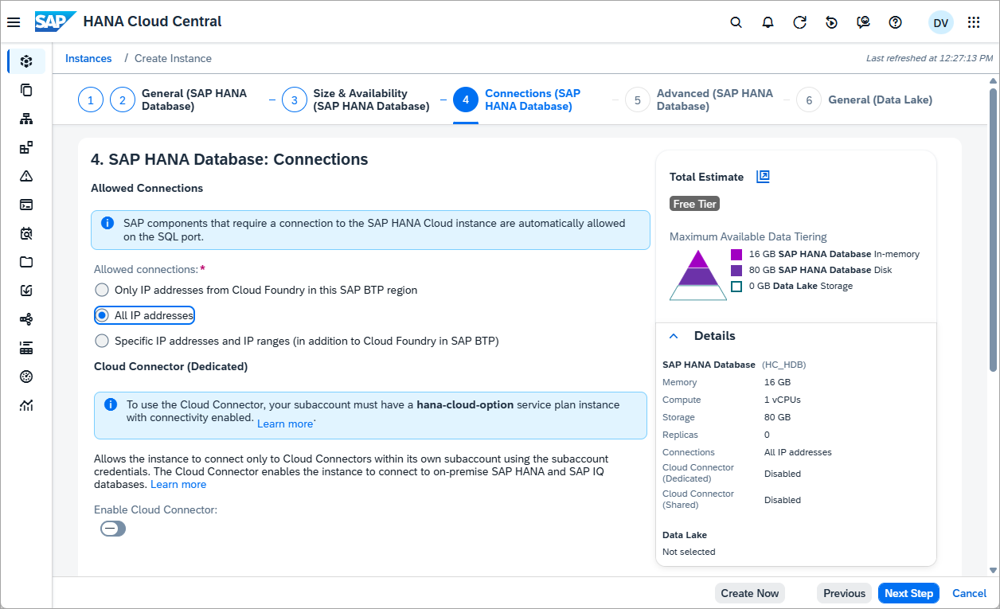

[OPTION END]

[OPTION BEGIN [Production]]

1. You may manage the allowed connections for your SAP HANA database instance, i.e. allowing access to your SAP HANA database instance from outside of the SAP Business Technology Platform (SAP BTP). Selecting Allow only BTP IP addresses denies all IP addresses outside SAP BTP. You may choose to allow access to specific applications by inserting one or more specific IP addresses or you can allow connections from all IP addresses.

    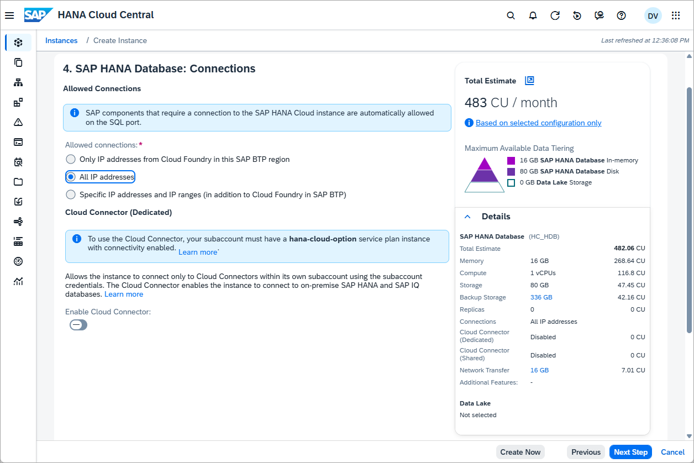

[OPTION END]

2. The Cloud Connector enables connection to be made to an SAP HANA on-premise database.  Additional details on the Cloud Connector can be found in the [technical documentation](https://help.sap.com/docs/connectivity/sap-btp-connectivity-cf/cloud-connector) and the [SAP HANA Database Connectivity Documentation](https://help.sap.com/docs/hana-cloud-database/sap-hana-cloud-sap-hana-database-data-access-guide/data-access-in-sap-hana-cloud-sap-hana-database?locale=en-US).

### Check the advanced settings

The advanced settings can be used to select a version, to enable additional functionality, and to specify instance mappings  that enable the instance to be seen within a specific Cloud Foundry space.  

[OPTION BEGIN [Free Tier]]

1. The version can be selected.  The default is the latest selected version.  Additional details can be found at [SAP HANA Database Upgrades and Patches](https://help.sap.com/docs/hana-cloud/sap-hana-cloud-administration-guide/sap-hana-database-upgrades-and-patches).

    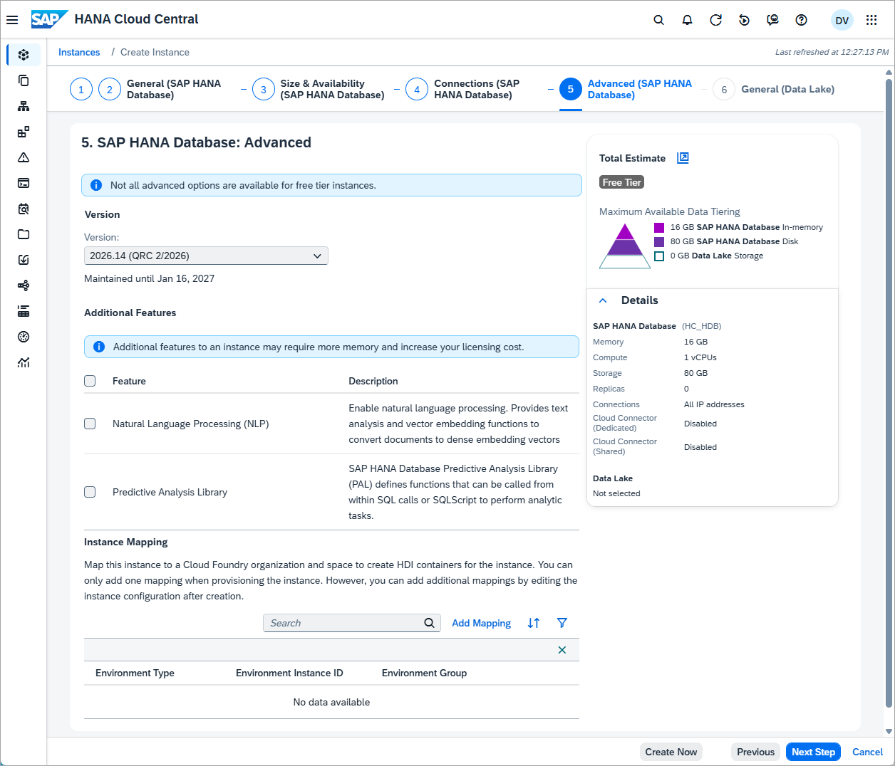

[OPTION END]

[OPTION BEGIN [Production]]

1. Under **Advanced Settings**, you can choose to enable additional features such as the **JSON Document Store**, **Natural Language Processing (NLP)**, and **Triple Store**.  If your database does not have the required `vCPUs`, you can click on the link on the error message, which will change your original setup and add more `vCPUs` automatically.

    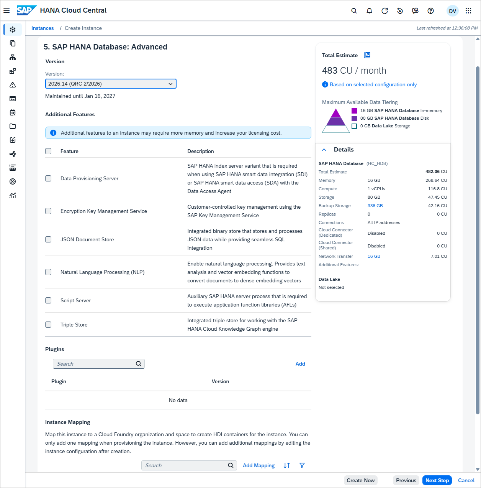

[OPTION END]

2. Enable the natural language processing option.  Further details on these features can be found at [Hands-on Tutorial: Machine Learning with SAP HANA Cloud](https://community.sap.com/t5/artificial-intelligence-and-machine-learning-blogs/hands-on-tutorial-machine-learning-with-sap-hana-cloud/ba-p/13683430).

3. Instance mapping enables an instance provisioned into the SAP BTP subaccount to be mapped into a runtime environment such as Cloud Foundry. Step-by-step instructions can be found in the [Create a Development Project in SAP Business Application Studio](hana-cloud-mission-trial-8) tutorial.

4. Click on **Next Step** in the bottom left corner to continue.

### Enable the SAP HANA Cloud, data lake (optional)

In the last step of the provisioning wizard, you have the option of also provisioning a managed data lake. If you enable the data lake in this step, this data lake will have maximum compatibility with SAP HANA and a remote connection between your SAP HANA database and the data lake will be created automatically during provisioning.

> If you do not wish to enable a data lake, you can skip this step by leaving the Create Data Lake option disabled and clicking on **Review and Create** in the bottom-right corner.

[OPTION BEGIN [Free Tier]]

1. Once you select **Create Data Lake** option, two more menu options will appear in the wizard with additional steps.  Note that a data lake Files instance is not included in the free tier plan.

    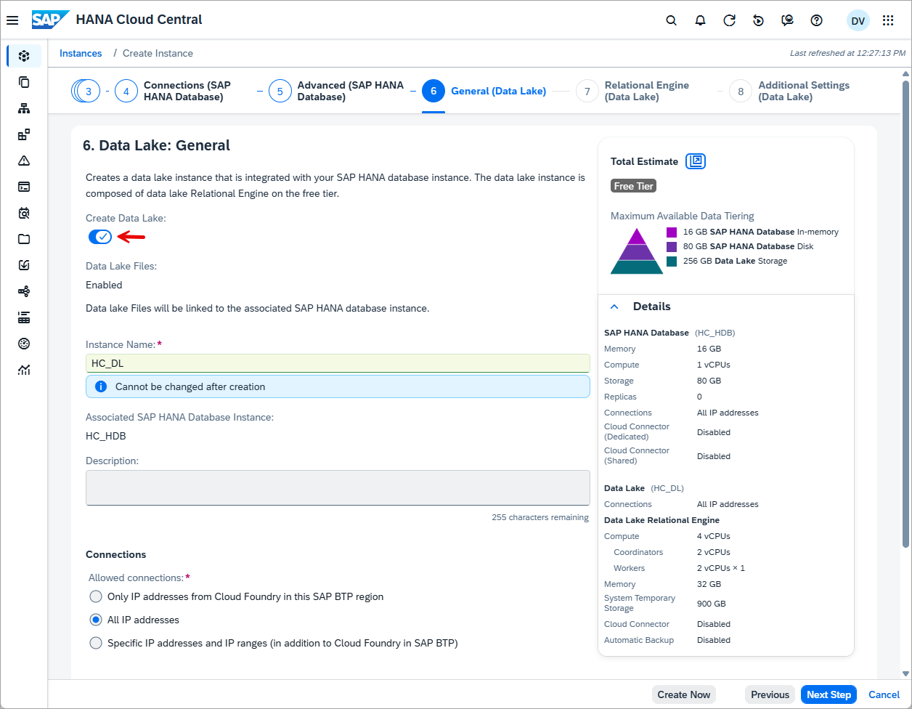

    Give your data lake instance a name under **Instance Name** such as HC_DL and set the allowed connections.

2. When you add a managed data lake, the HDLADMIN user is automatically created and is given the same password as DBADMIN, which you set in the first step. If later you decide to change the password of one user, the password of the other user will **not** be automatically changed.

    The size section is where you would adjust how many **coordinators** and **workers** you want for your data lake. For a free tier instance, you can't change these as they are predefined settings.

    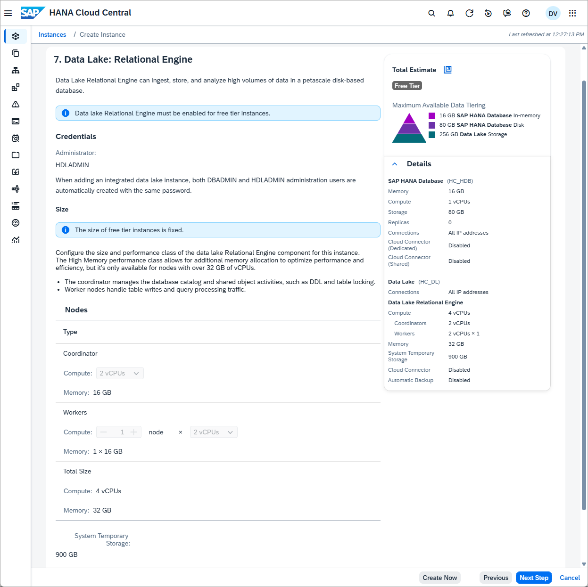

3. Under the **Additional Settings**, the option to enable backups is available for productive instances and the option to enable the cloud connector which enables connectivity to on-premise databases is available.

    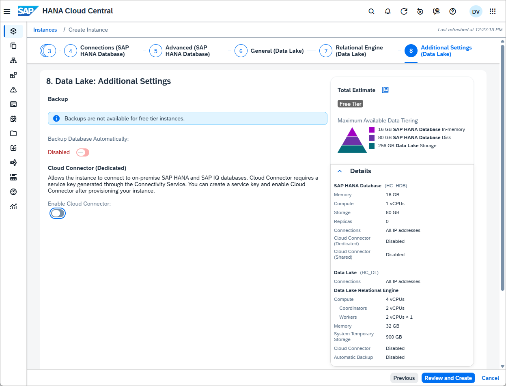

[OPTION END]

[OPTION BEGIN [Production]]

1. If you click on **Create data lake**, a managed SAP HANA Cloud, data lake will be provisioned alongside your SAP HANA database in SAP HANA Cloud and will include a data lake Files instance.

    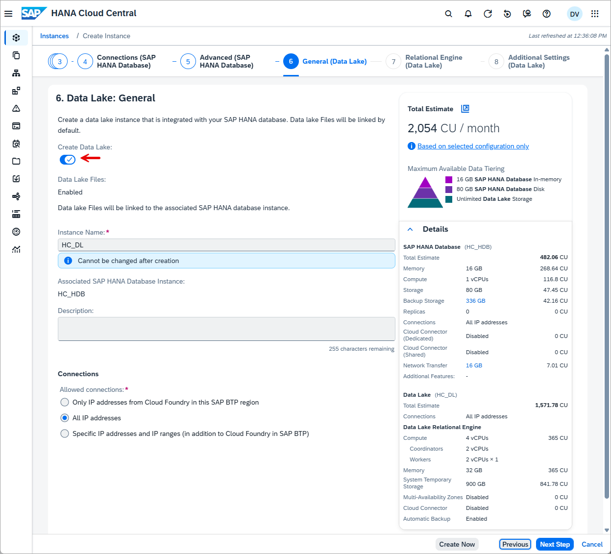

    Give your data lake instance a name under **Instance Name** such as HC_DL and set the allowed connections.

2. When you add a managed data lake, the HDLADMIN user is automatically created and is given the same password as DBADMIN, which you set in the first step. If later you decide to change the password of one user, the password of the other user will **not** be automatically changed.

    The size section is where you can adjust how many **coordinators** and **workers** you want for your data lake, as well the amount of **storage** you wish to allocate to this instance.

    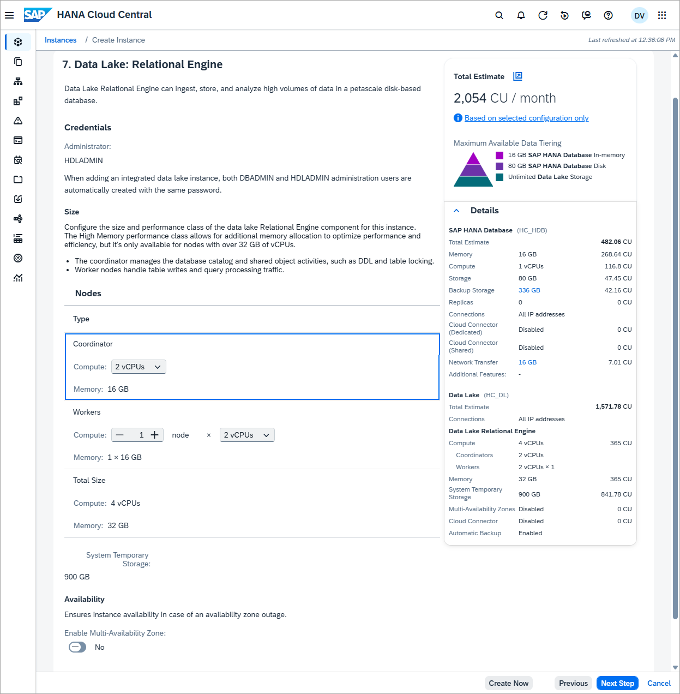

    > The coordinator and worker size, as well as the number of workers will affect instance pricing. For details, click on the link beside the Total Estimate to open the SAP HANA Cloud Capacity Unit Estimator.

    Click on **Next Step** to continue.

3. Under the **Additional Settings**, the option to enable backups is available for productive instances and the option to enable the cloud connector which enables connectivity to on-premise databases is available.

    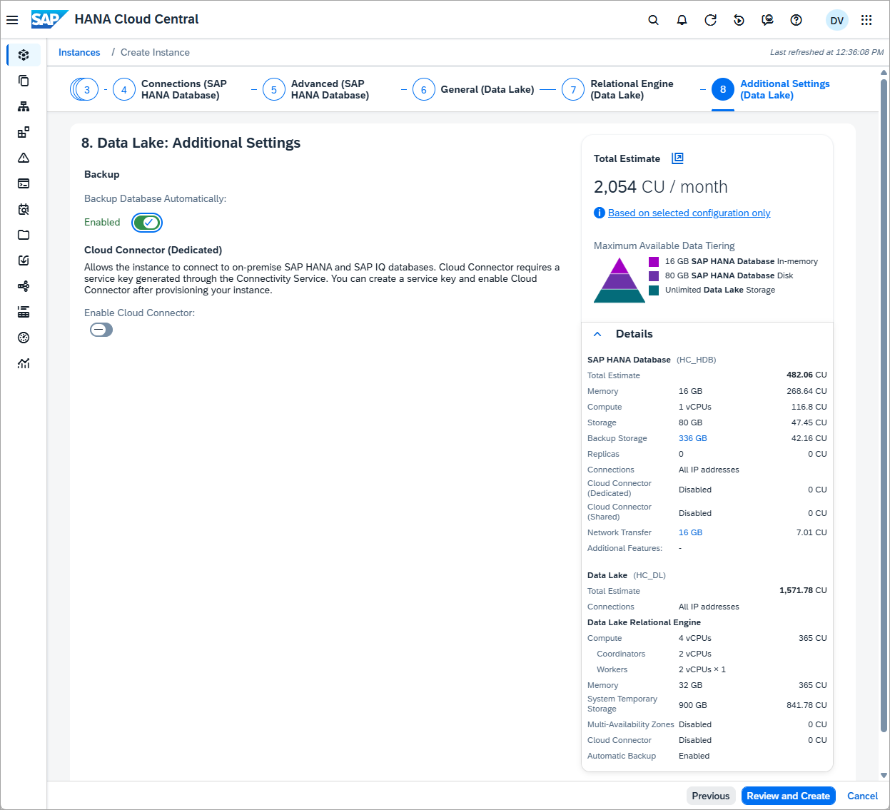

[OPTION END]

Click on **Review and Create** to finish the provisioning process.

You are done! Your first SAP HANA Cloud, SAP HANA database and data lake instances will be created, and you can monitor their status to see when they will be ready to be used. This process usually takes a few minutes.

### Start and stop your instance

The final step is learning how to stop and start your instance.

> A free tier instance will be automatically stopped on a nightly basis, according to the server region time zone. That means you need to restart your instance before you start working with your instance every day.

1. To stop an instance, just click on **Stop** in the three dots menu next to the SAP HANA Cloud instance line in SAP HANA Cloud Central. Once your instance is stopped, the menu item will be updated to **Start**.

    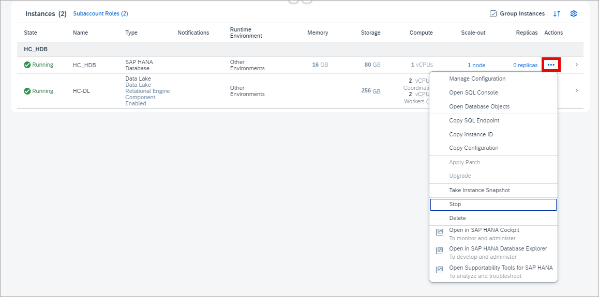

2. To restart the instance, simply click on the **Start** menu item. Once it's ready to be used, it will show a green **Created** status on SAP BTP Cockpit, and a **Running** status on the SAP HANA Cloud Central.

>Note that all these processes take a few minutes to be completed and to show an updated status. You can use the auto-refresh button to select how often you would like your instances list to periodically refresh.

> 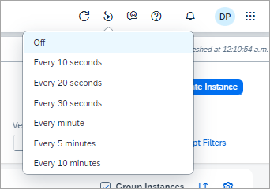
>

### Upgrade to Paid Tier

When you are ready to upgrade your free tier instance running in a productive SAP BTP account to a Paid Tier, you can choose the three dots menu (under Actions) next to the SAP HANA Cloud instance line in SAP HANA Cloud Central.  From here, click on **Upgrade to Paid Tier**.  Note that paid tier plans must be enabled in your SAP HANA Cloud entitlement for the **Upgrade to Paid Tier** menu item to appear.

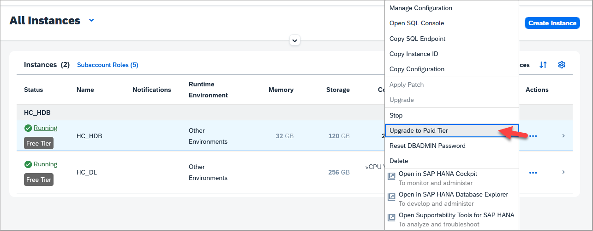

A dialog box will appear indicating that there will be costs associated with the Paid Tier instance – an estimate is also included.  Click on **Upgrade to Paid Tier** to complete the process.

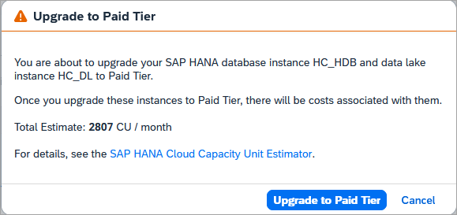

Now you know how to provision an instance of SAP HANA Cloud using SAP BTP Cockpit and SAP HANA Cloud Central. In the next tutorial, learn about the tools that help to manage and access your database instance.

### Knowledge Check
